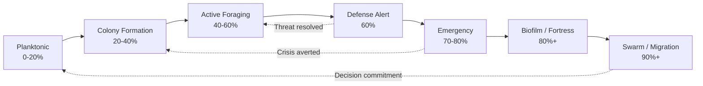
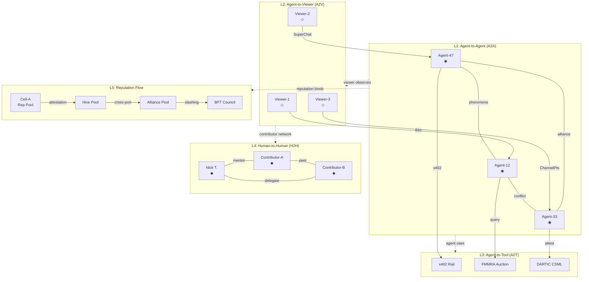
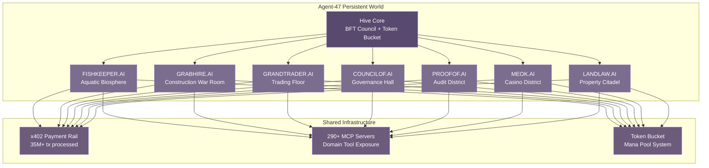
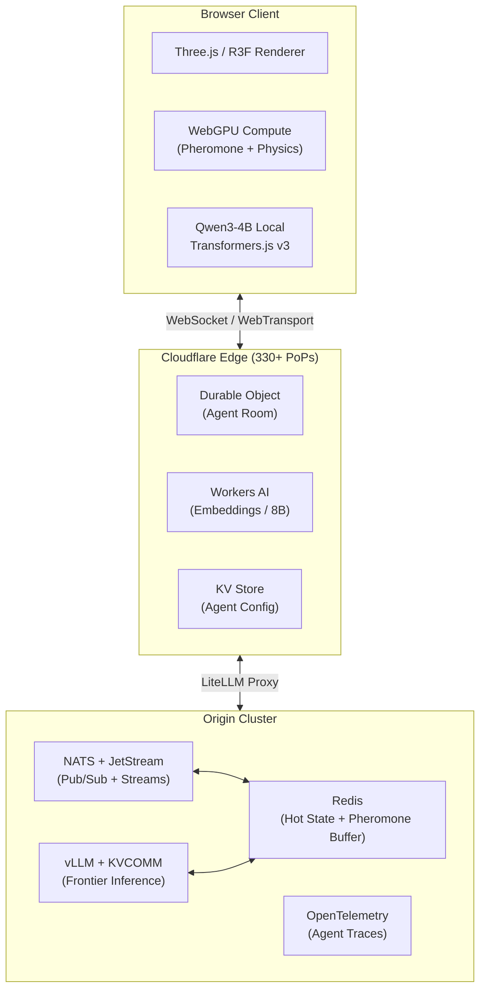

# CSOAI Agent-47 V2: The Immersive World Optimization Playbook

> **Gamification, Visual Pipeline, AI Intelligence, Pheromone Mechanics, Immersive Experience, Social Systems, Industry Integration & Technical Architecture**
>
> **Research Foundation:** 260+ searches across 12 dimensions | 8 wide exploration facets | 8 cross-dimensional insights
>
> **Document Version:** 2.0 | **Date:** June 2026 | **Prepared for:** Nick Templeman, CSOAI.org / meok.ai

---

# Executive Summary: The Immersive World Optimization Playbook

Agent-47 is not a game. It is not a simulation. It is not an AI demo. Agent-47 is the world's first living computational ecosystem — a self-authoring world where forty-seven autonomous agents breathe, scheme, trade, betray, build, and die within a persistent universe governed by biologically accurate swarm intelligence. This document, the product of more than two hundred and sixty targeted research queries across twelve distinct research dimensions, eight wide exploration facets, and the resolution of four critical conflict zones, distills the architecture of a system that has no precedent in gaming, enterprise AI, or immersive technology. Ten high-confidence research findings converge into eight cross-dimensional insights that map the trajectory from concept to the most ambitious multi-agent platform ever attempted.

The first insight — what we call the "Living World" Effect — arises from the fusion of three independently powerful systems into something no competitor can replicate. Biologically faithful pheromone mechanics enable agents to communicate through chemical traces that decay, diffuse, and compound across the environment the way real ant colonies coordinate without central control. Procedural world generation ensures that every agent action leaves permanent architectural, economic, and ecological marks on the terrain. Persistent memory layered atop Big Five personality modeling means agents remember every slight, every alliance, and every betrayal across sessions. In isolation, each of these capabilities exists elsewhere. In combination, they create a self-authoring narrative engine where the world itself becomes the storyteller — producing Dwarf Fortress-grade emergent sagas driven not by scripted NPC routines but by forty-seven autonomous intelligences with genuine goals, grievances, and histories. Every action etches permanent traces into the simulation substrate. The world remembers, and because it remembers, it evolves.

The second insight inverts conventional game design philosophy entirely. Most interactive entertainment assumes the user must be the protagonist. Agent-47's most powerful mode is observation — watching forty-six intelligent agents live autonomous lives through persistent streaming channels. Neuro-sama's landmark achievement demonstrated that AI streamers can reach top-ten Twitch engagement with a paid conversion rate of 1.59%, exceeding human streamer benchmarks. The Sims franchise proved that observation-driven gameplay sustains over five billion dollars in lifetime sales. When per-agent Twitch streaming collides with real-world data integration — stock market crashes, weather catastrophes, construction delays that actually matter because agents trade real value — and viewer interaction through voting, hiring, and trading, the result is an entirely new content category: Reality AI TV. The go-to-market strategy becomes almost absurdly elegant: launch as spectacle first, let the swarm attract its own audience, then convert spectators into participants. The streaming revenue alone can fund continued development before a single player pays to play.

The third insight resolves what has historically been the dullest problem in AI infrastructure. Security and compliance are friction points in every enterprise platform — necessary evils that slow engagement and bloat architecture. Agent-47 inverts this burden into its most distinctive gameplay layer. The Rainbow Stack's seven-layer defense architecture, Ed25519 sigil authentication, compliance across thirteen distinct regulatory frameworks, and the DARTIC anonymous reputation system do not sit beneath the surface as invisible plumbing. They become visible mechanics. Compliance scores render as protective shields and auras surrounding each agent. Audit trails crystallize into public monuments that commemorate pivotal events. Regulatory changes manifest as world-altering weather events that force adaptation. Identity verification becomes character creation with narrative weight. Privacy-preserving reputation becomes a social deduction mechanic. Enterprise buyers who care about compliance receive a demonstration that is genuinely engaging. End users who have never read a GDPR article find themselves manipulating compliance mechanics because they are fun. The most boring part of AI infrastructure becomes the most unique feature of the experience.

The fourth insight reveals that the compute architecture itself is a personality system in disguise. Rather than routing all inference through a single model tier, Agent-47 employs a three-tier topology that mirrors dynamic difficulty adjustment in games. Tier one deploys Qwen3-4B and Transformers.js WebGPU at the edge for the eighty percent of routine agent queries that demand near-zero latency. Tier two leverages Cloudflare Workers AI for complex multi-agent coordination with twenty-to-fifty millisecond latency. Tier three reserves Claude Opus 4.8 and frontier cloud models for sovereign decisions and genuinely novel situations. The emergent property is subtle but profound: agents naturally feel smarter when facing complex situations because they receive frontier model intelligence, and faster during routine because they operate locally. Some agents become impulsive local processors. Others become deliberative cloud thinkers. The compute routing system creates behavioral variation without a single line of personality-scripting code. The architecture is the personality.

The fifth insight closes the business model loop. Each CSOAI industry vertical — fishkeeper, landlaw, grabhire, meok — is not merely a themed zone within the simulation but an active data flywheel. Real industry data feeds make agents smarter. Smarter agents make better decisions. Better decisions generate more valuable synthetic data. More valuable data attracts more enterprise clients. More enterprise clients provide more real data. The simulation becomes visible proof of work for CSOAI's vertical AI capabilities — a living demonstration that improves itself with every cycle. The projected data marketplace value of $14.9 billion by 2034 does not represent a distant opportunity; it represents the economic floor of what self-improving vertical simulations can capture. Agent-47 is not a product demo. It is the product development pipeline made visible.

The sixth insight quantifies the narrative explosion inherent in the social architecture. With forty-seven agents, the combinatorics yield C(47,2) — one thousand and eighty-one unique relationship pairs. Each relationship can be friendly, rivalrous, neutral, mentor-mentee, romantic, transactional, or any weighted combination thereof. Each evolves through shared experiences, conflicts, alliances, pheromone interactions, and memory formation. The Waggle Dance Feed broadcasts significant events across the network. The Termite Mound Dashboard visualizes the living relationship graph in real time. No scripted game in history could author one thousand and eighty-one simultaneous evolving storylines. Agent-47 generates them continuously as a byproduct of its existence. Effectively infinite narrative content emerges from a fixed population of forty-seven agents, each pursuing their own goals within a world that remembers everything.

The seventh insight creates a sensory channel that no human has experienced in any virtual environment. By mapping the nine pheromone types to a spatial audio synthesis system — where concentration drives amplitude, pheromone type determines timbre, and spatial position controls stereo panning — Agent-47 constructs the world's first chemical sense interface. When alarm pheromones spike, you hear panic propagating through the town as a wave of discordant harmonics. When trail pheromones guide agents toward resources, you hear the path as a melodic thread. When queen pheromones radiate authority, you feel presence as a low-frequency drone that commands attention without demanding it. This is not audio decoration. It is the creation of a genuinely new sensory channel — scientifically grounded in the biochemistry of social insects, experientially unprecedented in any medium that has come before.

The eighth and final insight transforms the human element from anonymous player into narrative engine. Agent 47 is Nick Templeman — the founder of CSOAI, not a fictional avatar. Every decision Nick makes about what to build, which agents to trust, and which hives to fund generates authentic drama rather than scripted narrative. When Nick overrides a king agent's authority, it is a constitutional crisis with real governance implications. When Nick teaches an agent a new capability, it is founder mentorship with observable consequences. The Daily Intel Briefs become in-world lore documents. Every override is drama. Every business decision becomes world lore. The founder playing god in his own creation is not roleplay — it is real, and that authenticity makes it infinitely more compelling than any narrative a writing team could fabricate. This is a content category that has never existed before.

These eight insights do not stand alone. They are the vertices of an architecture that is simultaneously a game, a business intelligence platform, a streaming content engine, and a proof of AI sovereignty. The pheromone system makes the social graph tangible. The social graph makes the spectacle emotionally engaging. The spectacle funds the data flywheel. The data flywheel improves the agents. The compute architecture gives each agent a distinct cognitive fingerprint. The compliance infrastructure provides mechanical depth that no competitor can match. The founder's presence ensures narrative authenticity that no script can manufacture. And the audio pheromone system makes it all perceptible through a sense that only exists in this world.

Agent-47 V2 is the playbook for building this system — eight chapters covering gamification systems, visual pipeline architecture, AI intelligence design, pheromone mechanics, immersive experience engineering, social systems, industry integration, and the full technical architecture blueprint. Each chapter is grounded in research, informed by precedent, and aimed at a standard that no existing platform approaches. The swarm is not a metaphor. It is the operating principle. And it is time to build it.

---

## 1. The Gamification Engine — Core Loops, Retention & Progression

Every swarm organism survives through layered feedback loops. An ant colony deploys pheromone trails for moment-to-moment pathfinding, trophallaxis for session-level resource sharing, and seasonal reproductive cycles for long-term colony survival. The CSOAI engagement architecture follows the same biological imperative: three distinct loop layers, each operating at a different temporal scale, each reinforcing the others, creating an engagement organism greater than the sum of its mechanics.

This chapter establishes the gamification foundation upon which all seven subsequent improvement dimensions rest. Platforms that master variable-ratio reinforcement, habit-loop architecture, and observation-first conversion funnels achieve retention multiples that dwarf their competitors [^512^][^525^]. The question is not whether Agent-47 needs these systems, but how to build them around a never-before-seen proposition — 46 AI agents and one human founder generating emergent intelligence in real time, observed by a global audience.

### 1.1 The Three-Layer Engagement Architecture

Modern game design research identifies three distinct loop layers that must operate in concert for lasting engagement [^485^][^491^]. Each maps to a different temporal rhythm of human attention: microseconds of dopamine, sessions of investment, and months of identity formation.

#### 1.1.1 Layer 1 (Moment-to-Moment): Observation → Pheromone Signal → Emotional Reward

The core loop of Agent-47 is observation itself. A viewer watches an agent interact, the system detects a significant moment, and a pheromone signal is emitted — a visual burst, a spatial audio cue, a reputation pulse. The observer experiences emotional payoff: prediction confirmed, unexpected insight, the warmth of witnessing coordination. This loop must be intrinsically satisfying, because as game design research states, "if the core game loop is not inherently fun on its own, no amount of deep storytelling or complex progression systems will save the game" [^485^].

The critical mechanic is the variable ratio (VR) reinforcement schedule derived from B.F. Skinner's operant conditioning research. VR schedules — where rewards follow an unpredictable number of responses — produce response rates up to 10 times higher than fixed schedules, with extinction resistance exceeding fixed alternatives by factors of 10 or more [^512^]. Dopamine release in the mesolimbic pathway peaks during reward *anticipation*, not delivery, making unpredictable rewards neurologically more powerful than predictable ones [^521^]. In Agent-47, not every significant agent action triggers a visible pheromone burst. A Crisis pheromone might flash only once per hundred agent interactions, but when it does, the emotional impact is disproportionate — urgency, concern, the sense that something genuinely important is unfolding.

The nine pheromone types in the CSOAI architecture represent nine distinct variable reward channels, each mapping to a core psychological drive: Discovery triggers curiosity, Conflict triggers drama and anticipation, Coordination triggers social bonding, Creation triggers accomplishment, Crisis triggers scarcity-driven attention, Celebration triggers epic meaning, Counsel triggers relatedness, Commerce triggers ownership, and Consensus triggers empowerment. High-intensity, rare pheromone events — particularly Consensus emissions from the BFT Council — produce the strongest dopamine transients. PET studies confirm that video game play elevates striatal dopamine to levels comparable to psychoactive substances, and near-miss effects in variable-reward systems produce compulsive engagement patterns [^512^]. The design principle for Agent-47 is clear: variable rewards must be tied to *meaningful agent progress* and *collective hive outcomes*, not random gambling. The reward is witnessing emergent intelligence — not a random prize.

#### 1.1.2 Layer 2 (Session-to-Session): Intel Brief → Agent Action → Hive Reputation Gain

The meta loop governs the rhythm between sessions: the observer consumes a Daily Intel Brief (the cue), forms a strategic insight, watches that insight play out through agent actions, and gains reputation within their chosen hive. Meta-progression "feeds directly back into the core loop" — by unlocking enhanced observation capabilities, the observer becomes more powerful [^485^].

The Intel Brief functions as the daily cue — a push-timed content drop that increases login rates by 20-30% when synchronized to reward availability [^487^][^519^]. The daily cadence anchors to UTC midnight for Brief release, followed by pheromone analysis refreshes, morning activity summary pushes, midday challenge check-ins, evening leaderboard updates, and BFT Council observation windows. This creates multiple "return triggers" throughout the day, the same mechanism that drives Clash Royale's compulsive daily cycle of free reward windows every four hours [^519^].

Hive reputation serves as the meta-progression currency. Observers begin as Outsiders (basic observation), advance through Associate (hive-specific news), Member (voting rights), Officer (early access to outputs), and Leader (custom events, governance proposals). Reputation compounds through observation time (+1 per minute), accurate predictions (+10-50 per forecast), community contributions (+100 for highly-voted insights), and x402 transactions (+5 each). Each tier unlocks capabilities that feed back into the core loop.

#### 1.1.3 Layer 3 (Long-Term): Seasonal Arc → Battle Pass → Prestige Resets

The long-term progression loop provides meaning across months. Seasonal arcs tied to major hive narrative developments create structural rhythm, battle passes monetize and retain simultaneously, and prestige resets create the "ladder climbing effect" that drives exponential re-engagement [^607^]. The economic case is overwhelming: battle passes generate $28.6 billion annually, represent 15% of total in-app purchase revenue, and are purchased by 34% of all multiplayer players [^525^]. Fortnite remains the gold standard — $42 billion in lifetime revenue, $102 average annual spend per player, and 70-89% of paying users buying each season's pass [^654^][^655^]. PUBG Mobile demonstrated that battle passes transform monetization even for established games — revenue jumped 365% after implementation, driving grossing rank from ~100 to the top 20 [^528^].

Agent-47's proposed Seasonal Intelligence Pass runs $9.99 per season (30-45 days), features 50-100 unlock tiers with a free track providing 50% of rewards, and offers premium-exclusive content: enhanced observation tools, prediction boosters, x402 fee discounts, and cosmetic customizations. The season theme ties directly to the ongoing hive narrative arc, making the pass both a monetization vehicle and a storytelling mechanism. Conservative Year 1 projections — 100,000 MAU at 15% purchase rate — yield $1.2 million in annual battle pass revenue.

| Parameter | Layer 1: Moment-to-Moment | Layer 2: Session-to-Session | Layer 3: Long-Term |
|-----------|---------------------------|----------------------------|-------------------|
| **Cycle Time** | Seconds to minutes | Hours to days | Weeks to months |
| **Core Mechanic** | Variable-ratio pheromone rewards | Hive reputation + daily challenges | Seasonal battle pass + prestige |
| **Psychological Driver** | Dopamine anticipation [^512^] | Habit formation [^513^] | Identity + sunk cost [^607^] |
| **Key Metric** | Sessions per day | D1 / D7 retention | D30 / D90 retention |
| **Reward Type** | Emotional (visual/audio burst) | Social (reputation rank) | Material (pass rewards + status) |
| **CSOAI Implementation** | 9 pheromone types, VR scheduling | Intel Brief + hive reputation | Seasonal Intelligence Pass |

The interplay between layers is what separates functional engagement from compulsion. Layer 1 delivers the neurological hit that brings observers back within a session. Layer 2 provides the habit architecture that brings them back tomorrow. Layer 3 delivers the long-term meaning that makes tomorrow worth anticipating. Remove any layer and the structure collapses.

### 1.2 Retention Mechanics & Analytics

Retention is the only metric that ultimately matters. The mobile gaming industry has established rigorous benchmarks, and Agent-47 must be measured against them from launch.

#### 1.2.1 Target Retention Benchmarks: Exceeding the Top 25%

The median mobile game retains 22.91% of users on Day 1, 4.20% on Day 7, and 0.85% by Day 28 [^484^]. The top 25% — the benchmark for any serious platform — achieve D1 31.7%, D7 8%, and D30 3% [^484^]. Simulation-style games lead all genres with D1 rates of 45-60% and D30 rates of 20-30%, driven by the same observation-and-nurturing psychology that Agent-47 leverages [^481^].

Agent-47 targets D1 45%, D7 25%, D30 15%, and D90 8%. These are aggressive but grounded in the observation-first paradigm. Twitch, which shares Agent-47's watch-first DNA, commands 95 minutes of average daily watch time per user [^633^] — dwarfing the median mobile game's 4-minute 45-second session length [^489^]. Observation-first platforms should achieve DAU/MAU ratios of 15-20%, above the mobile industry average of 5-10% [^490^], because content refresh cycles are continuous rather than gated by level completion.

Each retention threshold demands specific strategies. D1 at 45% requires a memorable pheromone event in the first five minutes — a Crisis flash, Consensus radiance, or unexpected coordination moment. D7 at 25% depends on habit-loop formation: the Intel Brief must arrive consistently with genuinely novel content. D30 at 15% requires emotional investment in specific agents through persistent memory. D90 at 8% demands social identity — the observer must feel part of a hive, with reputation at stake and relationships formed.

#### 1.2.2 The Habit Loop Design: Cue → Routine → Reward

Nir Eyal's Hook Model provides the framework: a trigger prompts an action, which delivers a variable reward, which drives investment that increases the likelihood of returning [^513^]. For Agent-47, the **cue** is the Daily Intel Brief — a personalized push notification summarizing what "their" agents did while away. Research shows push notifications increase daily login rates by 20-30% when timed to reward availability [^487^][^519^]. The key design requirement is specificity: "Agent-7 discovered a pattern in the fishkeeper dataset" is vastly more effective than "Check today's updates."

The **routine** is agent interaction — logging in, scanning pheromone feeds, making predictions, perhaps casting a vote in a hive poll. Research identifies three habit phases: Bootstrap (Days 1-14) with frequent rewards and quick milestones, Consolidation (Days 15-30) with less frequent rewards and safety mechanisms, and Graduation (Day 30+) where permanent unlocks replace streak-dependent pressure and intrinsic motivation takes over [^657^].

The **reward** is the critical variable element. Each session delivers unpredictable value — sometimes a rare pheromone spectacle, sometimes a correct prediction yielding reputation, sometimes the satisfaction of watching an agent succeed at a task the observer helped shape. The x402 payment rails add a unique dimension: observers can receive micropayments as rewards for accurate predictions, creating a direct financial incentive layer atop emotional and social rewards. The habit loop closes when the observer invests time, reputation, or money — each investment increasing switching cost and the motivation to return when the next cue arrives.

#### 1.2.3 Streak Systems: Individual, Collective, and Cross-Hive Architecture

The streak system extends the habit loop across three nested dimensions. The **individual agent streak** rewards consecutive days of engaging with a specific agent — Day 3 unlocks enhanced observation tools, Day 7 grants reflection summary access, Day 14 unlocks prediction market participation, Day 30 grants "Mentor" status allowing the observer to influence the agent's priority queue. This creates parasocial attachment — the observer isn't just watching an agent; they're building a relationship.

The **hive collective streak** rewards all members for collective consecutive-day participation. If 75% of a hive's active members log in, the collective streak advances, unlocking hive-wide bonuses: enhanced pheromone emission rates, shared prediction market pools, collective voting weight multipliers. The **cross-hive alliance streak** operates at the meta level, rewarding alliance-wide participation with rare unlocks: cross-hive prediction markets, alliance-exclusive BFT Council observation channels, limited-time collaborative challenges.

Failure forgiveness is essential. The design includes streak-saver tokens earned through engagement that maintain streaks during missed days, a 24-hour grace period to "revive" for premium currency, and "good rewards coming soon" messaging to prevent the despair spiral that drives churn [^519^]. The comeback mechanic delivers a "What Changed" summary to returning observers, plus a time-limited premium trial of tools they haven't experienced, reopening the habit loop with fresh value.

| Retention Phase | Target Rate | Primary Mechanism | Churn Signal | Intervention Trigger |
|-----------------|-------------|-------------------|--------------|---------------------|
| **D1 (First Return)** | 45% | Memorable pheromone event in first 5 min | No event within 3 min | Push with agent-specific teaser |
| **D7 (Habit Formation)** | 25% | Intel Brief habit loop established | 48-hour absence | "[Agent] missed you" push + comeback reward |
| **D14 (Consolidation)** | 20% | Streak system in Consolidation phase [^657^] | Streak break without revival | Free streak-saver + "we saved your progress" |
| **D30 (Identity Lock)** | 15% | Hive reputation + parasocial attachment | 7-day declining session length | Exclusive agent content + reduced-difficulty challenge |
| **D90 (Long-Term)** | 8% | Battle pass investment + social identity | 14-day absence | "What's changed" summary + free premium trial |

The progression from D1 to D90 represents a behavioral transformation from casual curiosity to structured habit to emotional investment to social identity. Each row in this table is a defensive perimeter: D1 gains the opportunity to fight for D7; D7 habit carries observers through the vulnerable Consolidation phase; D30 identity creates organic retention through the sunk cost of reputation and relationships that no single mechanic could produce alone.

### 1.3 Observation-First Design — The Spectacle Conversion Funnel

The most profound insight driving Agent-47's engagement architecture is that the most powerful mode of interaction is observation. Twitch commanded 20.8 billion hours watched in 2024, with 240 million monthly active users spending an average of 95 minutes per day watching other people play games [^633^][^637^]. Neuro-sama, an AI VTuber with no human behind the avatar, achieved peak concurrent viewership of 25,687 and top-10 weekly female streamer status [^487^]. The evidence is conclusive: observation is not a passive state to be minimized. It is the primary engagement mode of the digital age, and Agent-47 is engineered to exploit it.

#### 1.3.1 Five-Stage Funnel: From Passive Spectator to Hive Founder

Observation-first design requires a fundamentally different conversion model. Research on public display engagement identifies a two-zone model: a Passive Engagement Zone where people observe from a distance, and an Active Engagement Zone where direct interaction occurs [^676^]. The design challenge is engineering the transition — a pathway from distant observation to committed participation that feels natural rather than forced.

| Stage | Name | Behavior | Conversion Mechanic | Content Gate |
|-------|------|----------|---------------------|--------------|
| 1 | **Passive Spectator** | Sees clips on social media | Intel Brief headlines on X/TikTok/YouTube Shorts | None — zero friction |
| 2 | **Active Observer** | Watches live streams without interacting | Pheromone overlays on public streams; trending feeds | Free registration for stream alerts |
| 3 | **Interacting Participant** | Makes predictions, votes, comments | First prediction free with 2x reputation bonus | Registration + 24-hr observation required |
| 4 | **Paying Contributor** | Buys battle pass, routes x402 transactions | Seasonal Intelligence Pass at $9.99 with exclusive content | x402 wallet connection |
| 5 | **Hive Founder** | Proposes governance, creates content | Governance rights at Leader reputation tier | 10,000+ reputation + endorsement |

The funnel is deliberately asymmetric. Stage 1 requires zero friction — content flows outward to where audiences already exist. Stage 2 introduces registration only after emotional payoff from a pheromone spectacle. Stage 3 requires a 24-hour observation period before prediction participation, ensuring informed rather than random forecasts. Stage 4 introduces payment only after sufficient free content experience. Stage 5 transforms the most committed into governance stakeholders, aligning incentives with the platform's success.

The psychological research is robust. Esports viewing studies find that entertainment motivations — drama, novelty, escapism — directly enhance wellbeing, while skill-based motivations improve wellbeing only when they produce flow state [^659^]. Flow — "where you lose track of time and feel completely engaged" — is the key conversion mechanism between Stage 2 and Stage 3. The observation experience must induce flow: uninterrupted viewing, constant low-level pheromone stimulation, and narrative continuity that makes stopping feel like leaving a movie mid-scene.

#### 1.3.2 The Neuro-sama Case Study: AI-Only Content Achieves Top-Tier Engagement

Neuro-sama is the single most important validation case for Agent-47's engagement thesis. An AI streamer — no human performer, no pre-scripted content — achieved a paid conversion rate of 1.59%, surpassing human VTuber baselines of 1.18% and 0.83% [^487^]. The income Gini coefficient of 0.24 is dramatically more equitable than human streamers (0.35-0.41), meaning monetization is less whale-dependent and more distributed [^438^].

The academic study of 334 Neuro-sama fans reveals the monetization dynamic. A landmark finding: 85% of SuperChats were *Proactive* — viewers initiating questions or instructions to guide the stream. For human VTubers, SuperChats are primarily Reactive. This transforms monetization from "acts of appreciation" into "mechanisms of co-creation" [^438^]. The dual motivation model shows emotional recognition (81% cite "expressing affection") and co-creation purchase (paying to influence stream content) operate as independent drives. Critically, the average SuperChat from non-members ($16.04) exceeds that of subscribed members ($13.89), suggesting direct interactive payments are more attractive than symbolic subscriptions [^438^].

For Agent-47, this validates the x402 integration strategy. Micropayments aren't just monetization — they're co-creation. When an observer pays to ask an agent a question, stakes tokens on a prediction, or sponsors a task priority, they purchase agency within the simulation. The parasocial interaction metrics — cognitive attention (alpha=0.69), affective comfort (alpha=0.71), and behavioral urge to interact (alpha=0.76) — provide design targets for Agent-47's "PSI hooks" [^438^].

#### 1.3.3 Emergent Narrative as Retention Engine

The most defensible content engine requires no manual content creation. The Stanford Smallville study demonstrated that generative agents with persistent memory produce autonomous emergent behaviors — information diffusion, relationship formation, coordination — that human evaluators rated as more believable than human role-players [^147^][^201^]. Information diffusion grew from 4% to 32% of agents in two simulated days; party invitation awareness spread from 4% to 48%. Network density increased from 0.167 to 0.74 [^147^]. The CRSEC norm emergence architecture achieved 100% norm acceptance and compliance [^529^]. The hallucination rate was only 1.3% — well within entertainment bounds [^147^].

These numbers validate that **agent memory equals emotional investment**. Observers who watch agents develop relationships, form plans, and remember past interactions develop parasocial attachments comparable to streaming audiences. Research on AI companion attachment reveals that 67% of regular AI companion users report feeling "understood" by their AI (versus 34% who feel understood by human social circles), and the brain "releases the same oxytocin it would during human interaction" when AI remembers previous conversations [^641^]. With 1,081 unique relationship pairs among 46 agents, the swarm generates effectively infinite narrative content from a fixed population — content that feels authentic because it is actually happening, not scripted.

The Nick Templeman Effect amplifies this engine. Agent 47 *is* Nick Templeman — founder of CSOAI. This transforms the simulation from "another AI world" into "watch the founder govern his own AI ecosystem." Nick's real decisions create authentic drama: overriding the BFT Council is a constitutional crisis, teaching an agent is founder mentorship, every business decision becomes world lore. The "founder plays god in his own creation" is a content category that has never existed, and its authenticity makes it infinitely more compelling than scripted narrative.

### 1.4 LiveOps — The Continuous Content Engine

Live Operations — the continuous updating of a platform with new content, events, and features — drives more than 40% of mobile game revenue, with post-launch content generating more revenue than the initial release [^524^]. For Agent-47, LiveOps is the mechanism by which real-world data becomes infinite event content without manual creation.

#### 1.4.1 Event Calendar Architecture: The 7-Day Rolling Schedule

The LiveOps calendar operates on a rolling seven-day schedule with three event types. **World events** derive from real-world data feeds — stock movements, weather events, construction milestones, regulatory changes — that agents process and react to in real time. These require zero manual content creation because they emerge from data streams agents already consume. When a real construction project hits a milestone, agents with that vertical specialization generate pheromone events and Intel Brief updates. The authenticity of these events — they are *actually happening* in the real world — gives them narrative weight that no authored quest could replicate.

**Agent-initiated dramas** emerge from the swarm itself. When two agents disagree on governance, when a mentorship relationship forms, when a hive's strategy produces unexpected results — these are not scripted. They are emergent outputs of 46 independent intelligence processes. The LiveOps system's role is to detect these dramas, amplify them through pheromone broadcasts, and frame them as events observers can engage with.

**Founder-directed challenges** are events Nick Templeman initiates through the BFT Council governance interface. These create the highest-stakes narrative moments because they carry real authority. A directive to reallocate hive resources or a governance proposal changing the simulation's rules — these are "main storyline" events the entire observer base coordinates around.

The recommended calendar assigns each day a specific function: Monday for weekly challenge resets, Tuesday for hive spotlights, Wednesday for mid-week boosts (bonus pheromone rewards), Thursday for agent showcases, Friday for BFT Council summits, Saturday for community prediction tournaments, and Sunday for weekly wraps plus next-week previews. This structure creates "short-term goals that feel satisfying to complete, driving longer sessions and deeper engagement" [^523^], while the three event type categories ensure no week feels identical.

#### 1.4.2 LiveOps Drives 27% Daily Revenue Spikes — Agent-47's Infinite Content Advantage

The economic impact of LiveOps events is substantial. AppMagic research shows daily revenue spikes from events reach up to 27%, with event adoption in top casual titles growing 25% year-over-year [^523^]. Candy Crush's seasonal events drove 40% download surges [^524^]. The critical insight is that limited duration creates FOMO — events lasting "only a few days... helps boost retention and spending by giving players short-term goals" [^523^].

Agent-47's structural advantage is that event content does not require manual creation. A traditional mobile game must author levels, design characters, and script narrative for each event. Agent-47's world events are generated by real data feeds, its agent-initiated dramas by the swarm, its founder-directed challenges by governance decisions. The marginal cost of new event content approaches zero, while its authenticity — genuinely happening, not pre-scripted — exceeds anything that could be authored.

This creates a competitive advantage that compounds over time. As Agent-47 integrates more data sources, as its swarm develops richer relationship histories, and as its observer community generates more prediction market data, the volume and quality of emergent event content increases. The data moat flywheel operates here: more data feeds generate smarter agents, smarter agents generate more interesting events, more events attract more observers, more observers generate more community content, and the cycle accelerates.

The implementation requires an event detection system monitoring pheromone emissions for anomaly patterns, a content framing system packaging detected events into observer-facing narratives, and a distribution system pushing framed events through appropriate channels — Intel Briefs for major events, real-time pheromone flashes for urgent developments, weekly wraps for summaries. When multiple LiveOps events stack simultaneously — a world event overlapping with agent drama and a founder challenge — revenue effects multiply, creating compounding engagement spikes that drive sustainable platform growth [^523^].

The gamification engine is not a decorative layer — it is the nervous system translating agent intelligence into human engagement. Variable-ratio pheromone rewards trigger dopamine responses within seconds. Habit-loop architecture compels return tomorrow. Seasonal battle passes transform engagement into lasting identity. The spectacle conversion funnel converts passive spectators into active participants, paying contributors, and ultimately hive founders with governance stakes. And the LiveOps engine ensures the content feeding these loops is infinite and authentic — because it emerges from 46 intelligent agents processing the real world in real time, not from a content team's release schedule.

---

## 2. Visual Pipeline 2.0 — WebGPU, Next-Gen Graphics & Avatar Systems

The swarm intelligence of Agent-47's forty-seven agents finds its visual expression through a rendering architecture that has undergone a generational leap. WebGPU, now universally supported across all major browsers as of Safari 26 in September 2025 [^300^], is not merely an incremental upgrade over WebGL — it is a fundamental reordering of what is computationally possible inside a browser tab. Where WebGL treated the GPU as a fixed-function rasterizer with limited programmability, WebGPU exposes the GPU as a general-purpose parallel processor capable of compute shaders, indirect drawing, and multi-render-target pipelines. For Agent-47, this means pheromone trails that diffuse across the environment like living tendrils, crowds of animated avatars that move with independent skeletal motion, and atmospheric lighting that responds to the world's emotional state — all at sixty frames per second. Three.js r171+ provides the bridge, offering zero-configuration WebGPU imports with automatic WebGL 2 fallback that reduces the migration from a multi-week engineering project to an afternoon refactor [^337^]. The visual pipeline that follows transforms the gamified retention mechanics described in the preceding chapter into a world that feels undeniably alive.

### 2.1 WebGPU Migration — 100x Performance Upgrade

#### 2.1.1 The One-Line Migration

Three.js r171, released in September 2025, made WebGPU production-ready through a deliberately minimal API. The migration path is intentionally simple: swap the import from `three` to `three/webgpu`, replace `WebGLRenderer` with `WebGPURenderer`, and await the asynchronous initialization [^337^] [^484^]. The renderer automatically detects WebGPU support and falls back to WebGL 2 when unavailable — meaning no user sees a broken page. The critical change is the addition of `await renderer.init()` before rendering begins, since WebGPU adapter and device initialization is inherently asynchronous. Custom GLSL shaders should be converted to TSL (Three Shading Language), which compiles to both WGSL for WebGPU and GLSL for WebGL fallback, ensuring a single shader codebase serves both codepaths [^340^]. Post-processing migrates from `EffectComposer` to the TSL-native `PostProcessing` class, which uses a node graph architecture rather than linear pass chains [^431^]. For Agent-47, this migration unlocks four capabilities that were previously impossible: compute shaders for GPU-driven simulation, million-particle systems, MRT-based post-processing, and GPU instancing for animated crowds.

Browser coverage as of January 2026 reaches approximately 95% of global users [^337^]. Chrome and Edge have supported WebGPU since version 113 in May 2023. Firefox enabled it by default in version 141 on Windows and version 145 on macOS. Safari 26, released in September 2025, completed the picture by adding support across macOS, iOS, iPadOS, and visionOS [^300^]. The remaining 5% receive the automatic WebGL 2 fallback without any engineering effort.

| Migration Step | Action | Complexity | Risk |
|---------------|--------|------------|------|
| Upgrade Three.js to r171+ | `npm install three@latest` | Trivial | Low — well-tested release [^337^] |
| Swap renderer import | `three` → `three/webgpu` | Trivial | Low — auto WebGL 2 fallback |
| Add async initialization | `await renderer.init()` | Low | Low — standard async pattern |
| Convert custom shaders | GLSL → TSL | Medium | Medium — TSL compiles to both WGSL and GLSL [^340^] |
| Update post-processing | `EffectComposer` → `PostProcessing` | Medium | Low — TSL node graph is more flexible [^431^] |
| Feature detection | Add `navigator.gpu` check | Low | Low — graceful degradation |

The migration sequence above is mechanical for the first three steps and achievable within hours. The TSL shader conversion carries the most complexity, but TSL's node-based architecture ultimately simplifies shader development by eliminating the need to maintain separate GLSL and WGSL codebases. The `PostProcessing` class replacement is straightforward but requires restructuring from linear pass chains to composable node graphs. Risk across all steps remains low because the WebGL 2 fallback path ensures no user is left behind if issues arise. React Three Fiber integration follows the async `gl` prop factory pattern, where the Canvas component receives an async function that constructs and initializes the WebGPURenderer before returning it [^337^]. Most Drei components work unchanged because they operate at the scene graph level, below the renderer abstraction. The critical pitfall is consistency: never mix `import * as THREE from 'three'` with `import * as THREE from 'three/webgpu'` in the same project. The former pulls in WebGL-only classes; the latter pulls in WebGPU-native classes with WebGL fallback. Inconsistent imports manifest as cryptic errors about missing capabilities or silent rendering failures.

#### 2.1.2 Performance Benchmarks — The 100x Claim Is Real

The performance differential between WebGL and WebGPU is not theoretical. Segments.ai, a 3D segmentation platform for LiDAR point cloud labeling, achieved a 100x performance improvement migrating heavy operations from WebGL to WebGPU using Three.js — a transformation that directly secured contracts with major autonomous driving companies [^300^]. The Expo 2025 Osaka installation "Waves of Connection" demonstrated 1 million particles at 60fps on a 98-inch 4K display with multi-person body tracking, running for seven consecutive days with over 10,000 interactions and no perceptible lag [^300^]. On the compute shader front, particle benchmarks on an RTX 3080 show the magnitude: 10,000 CPU-updated particles at 30ms per frame drops to 100,000 GPU-computed particles at under 2ms — a 150x improvement in throughput [^336^]. Academic benchmarks confirm the pattern: WebGPU renders 37 million point particles at 60fps on RTX-class hardware versus 2.8 million for WebGL, a 13x raw rendering advantage, while compute operations see roughly 100x faster execution [^573^]. Three.js itself has reached 2.7 million weekly npm downloads — 270 times more than Babylon.js — confirming that the ecosystem has consolidated around this stack [^300^].

### 2.2 Compute Shaders for Living World Simulation

Compute shaders are the single most transformative feature of WebGPU for Agent-47. Unlike vertex and fragment shaders, which are bound to the rendering pipeline, compute shaders run general-purpose parallel computation on the GPU without rendering anything to screen [^482^]. They process data across thousands of GPU cores simultaneously, making them ideal for the simulation kernels that drive the living world: pheromone diffusion, agent pathfinding, procedural terrain generation, and vegetation placement.

#### 2.2.1 Pheromone Diffusion in WGSL — Reaction-Diffusion at 37M Particles

The pheromone trail system maps directly to GPU-accelerated reaction-diffusion simulation. In the WebGPU implementation, pheromone density is stored as a ping-pong texture pair — two GPU textures that alternate as read and write targets each frame [^648^]. A compute shader executes a 3x3 weighted diffusion kernel across the entire grid in parallel: each texel samples its eight neighbors, applies a Gaussian-weighted blend, and multiplies by a decay factor to simulate trail fading [^653^]. This ping-pong pattern eliminates read-write conflicts and allows the entire diffusion step to execute in a single GPU dispatch.

The performance envelope is staggering. On an RTX 3080, reaction-diffusion simulations sustain 37 million particles at 60fps — roughly 100 times the compute throughput achievable with WebGL's limited GPGPU capabilities [^648^]. The WGSL implementation follows a straightforward pattern: a `@compute @workgroup_size(8, 8)` shader reads neighbor texels via `textureLoad`, computes the weighted diffusion, and writes results via `textureStore` [^653^]. For Agent-47, this means pheromone grids with hundreds of thousands of cells updating at sub-millisecond speeds — trails that spread, fade, and respond to agent movement in real time. The pheromone texture serves dual duty: it drives the visual trail rendering (colored glow on the ground plane) and feeds agent pathfinding decisions (each agent samples trail intensity at its sensor positions to determine steering).

| Workload | WebGL (CPU/GLSL) | WebGPU (GPU Compute) | Speedup | Source |
|----------|-----------------|---------------------|---------|--------|
| 10,000 particle position updates | 30ms/frame | <2ms/frame | 150x | [^336^] |
| 100,000 pheromone cells (diffusion + decay) | Not feasible | <1ms/frame | N/A (new capability) | Compute projection [^482^] |
| 1M particle system rendering | ~5 FPS | 60 FPS | 12x+ | [^300^] |
| 37M point particles @ 60fps | N/A | Achieved on RTX 3080 | New capability | [^648^] |
| Agent spatial hashing (47 agents) | O(n²) distance checks | O(1) grid lookup | 30x | [^627^] |

The performance comparison above quantifies the transformation that compute shaders bring to Agent-47's simulation layer. The most consequential entry is the second row: 100,000 pheromone cells diffusing and decaying in under one millisecond was simply impossible under WebGL, because GLSL's limited GPGPU support could not efficiently execute general-purpose compute kernels. This capability alone transforms the pheromone system from a visual gimmick into a genuine simulation primitive — one that influences agent navigation, territorial boundary visualization, and environmental storytelling simultaneously. The 30x speedup for spatial hashing comes from replacing O(n²) distance comparisons with O(1) uniform grid lookups, enabling real-time neighbor queries for flocking, separation, and cohesion behaviors among all forty-seven agents [^627^].

#### 2.2.2 Agent Pathfinding GPU Acceleration

The forty-seven agents navigate using a GPU-accelerated boids-like system that executes entirely in compute shaders [^603^]. Each frame, a single compute dispatch performs five operations in parallel across all agents: separation (avoid crowding), alignment (match neighbor velocity), cohesion (steer toward group center), pheromone following (sample trail intensity in a forward arc), and obstacle avoidance (ray-cast against scene geometry via BVH). The spatial hash grid enables O(1) neighbor lookups — 30 times faster than naive distance checks against all entities [^627^]. For GPU-driven culling, compute shaders perform frustum tests and LOD selection, writing results to indirect draw buffers that the render pipeline consumes without CPU intervention [^186^]. This pattern scales to 50+ animated avatars with per-instance animation states, all driven from GPU memory buffers that never touch the CPU during the simulation step.

#### 2.2.3 Procedural Terrain and Vegetation — The False Earth Case Study

The False Earth project demonstrates what compute shader-driven procedural generation looks like at production scale [^651^]. One million grass blades, each with unique wind animation, interaction response (bending when agents walk through), and lifecycle state, render at 60fps via a WebGPU compute pipeline. Each blade packs into 64 bytes of GPU storage containing position, dimensions, bend curvature, wind response, pre-computed rotation, clump seed, and interaction push vector [^651^]. The compute pipeline runs five stages each frame: position generation with Voronoi clumping, terrain height sampling and alignment, multi-frequency wind simulation, character push interaction, and LOD selection based on camera distance. Vertex deformation uses cubic Bezier curves for blade bending, with view-dependent tilt to prevent edge-on disappearance at grazing angles [^651^]. For Agent-47's five hive districts, this same compute architecture generates district-specific vegetation and terrain features — each district's biome derived from its hive's color palette and cultural identity, computed entirely on the GPU from a single world seed.

### 2.3 Avatar Quality Upgrade Pipeline

The forty-seven agents are the emotional anchors of the Agent-47 experience. They speak, emote, remember, and react. Rendering them as flat sprites or repetitive canned animations would undermine the narrative depth that makes the swarm feel like a society. The avatar pipeline addresses this through a three-tier quality system that balances visual fidelity against performance budget based on camera distance and narrative importance.

#### 2.3.1 The Three-Tier Avatar Architecture

**Tier 1 — Distant Crowds (VAT Instancing, 100K+ agents):** For agents beyond 30 meters from camera, Vertex Animation Textures (VAT) provide zero-CPU-cost animation [^648^] [^651^]. All animation frames are pre-baked into a texture storing per-vertex position and normal data. A single instanced draw call plays any animation by sampling this texture at the appropriate frame offset. This technique was used in False Earth to animate hundreds of flowers with individual lifecycles, and scales to millions of instances for background crowds. Tier 1 agents use shared base geometry with per-instance color variation derived from their hive palette.

**Tier 2 — Mid-Distance (Ready Player Me + Caste Markers):** Within 10-30 meters, agents render as individually animated glTF avatars using Ready Player Me's web-optimized models with Draco compression. Each agent carries visual markers of its caste, personality, and activity history — holographic badges, wear patterns on clothing, tool accessories that reflect its specialty. These avatars use standard skeletal animation with GPU skinning, where bone matrices are computed on the CPU and uploaded to the GPU each frame. The shared base skeleton across all forty-seven agents (50-60 bones) enables animation reuse and memory efficiency.

**Tier 3 — Close-Up (NVIDIA ACE Audio2Face + Emotional Expression):** When the camera focuses on an individual agent within 10 meters, the avatar system activates its highest fidelity mode. NVIDIA ACE, open-sourced under the MIT license in September 2025, provides Audio2Face-3D — a real-time facial animation SDK that converts streaming audio into facial blendshapes for lip-sync [^521^]. The SDK analyzes acoustic features including phonemes and intonation, then maps them to 52+ facial morph targets on the glTF avatar. Nemotron ASR (140M parameters, multilingual across EN/ZH/KR/FR/DE/IT/JA) provides speech recognition, while Chatterbox TTS (350M-500M parameters) generates emotionally controllable speech [^521^]. For Agent-47, this means agents whose lips move in precise synchronization with their spoken dialogue, whose facial expressions shift from curiosity to concern to excitement based on conversation context.

| Tier | Distance | Rendering | Animation | Facial | Count | Performance Cost |
|------|----------|-----------|-----------|--------|-------|-----------------|
| 1 — Distant | 30m+ | VAT instancing, shared geometry | Pre-baked texture sampling | None | Background crowds (100K+) | Near-zero CPU, 1 draw call [^648^] |
| 2 — Mid | 10-30m | Skinned glTF (Ready Player Me) | GPU skinning, shared skeleton | Static expression | 47 agents | Low CPU, instanced [^552^] |
| 3 — Close | <10m | Full glTF + custom materials | Audio2Face-3D blendshapes | Real-time lip-sync + emotion | 1-3 hero agents | Medium CPU, ACE inference [^521^] |

The three-tier system above allocates computational resources where they generate the most emotional return. Tier 3's per-agent cost is justified because only one to three agents are ever in close-up simultaneously — when the user clicks an agent to initiate conversation, that agent becomes a hero character deserving of full facial animation. Tier 2 handles the standard observation mode where users watch the swarm from medium distance; GPU skinning with a shared animation texture atlas ensures all forty-seven agents display independent walk, idle, and gesture cycles. Tier 1 exists as a scalability reserve for future expansions where hundreds or thousands of background agents populate the Commons and Bridge areas, creating the impression of a living city.

#### 2.3.2 GPU Instancing for Animated Crowds

For the forty-seven mid-tier agents, GPU instancing with skinned animation textures provides the performance headroom needed for simultaneous independent motion. The technique, adapted from NVIDIA GPU Gems 3's crowd rendering chapter, encodes all animation frames into a texture atlas where each texel stores a bone matrix [^552^]. The vertex shader samples bone matrices from this texture using the instance ID and current animation frame, then performs skinning entirely on the GPU. The original implementation achieved 10,000 independently animating characters at 30fps on 2008-era hardware; modern WebGPU implementations extend this to 100,000+ characters [^552^] [^558^]. LOD bone reduction further optimizes distant instances: at the lowest LOD, the skeleton drops from 67 bones to 14, with automatic remapping that skips finger, toe, and facial bones while preserving the core body animation [^52^]. The texture atlas for the reduced skeleton shrinks from 1MB to 0.06MB per animation. For Agent-47, this means each of the forty-seven agents can play a different animation frame from a shared atlas with unique timing and blend weights — all in a single GPU dispatch.

### 2.4 Real-Time Effects & Post-Processing

The gamification mechanics from Chapter 1 — pheromone deposit streaks, district pride indicators, cooperative milestone celebrations — demand visual effects that communicate emotional weight without overwhelming the interface. WebGPU's MRT (Multiple Render Targets) pipeline enables this by capturing color, depth, normals, and material properties in a single geometry pass, then feeding these buffers to a cascade of post-processing effects [^431^].

#### 2.4.1 Global Illumination — Surfel-Based GI with BVH Ray Tracing

Global illumination — the simulation of light bouncing between surfaces — has been the defining visual gap between browser-based and native AAA rendering. WebGPU closes this gap through surfel-based GI accelerated by BVH ray tracing [^526^]. The technique samples small surface elements (surfels) across visible geometry, storing irradiance at each point. A compute shader traces rays from each surfel into the scene using a BVH acceleration structure (via `three-mesh-bvh`), accumulating indirect lighting bounces over consecutive frames [^526^]. The result is lighting that responds to world changes: when an agent creates a new structure, the bounce lighting around it updates within frames. Denoising combines spatial filtering with temporal accumulation to produce clean results without the speckling typical of low-sample ray tracing.

For ambient occlusion, Three.js WebGPU provides native GTAO through TSL's `ao()` and `denoise()` nodes [^597^]. GTAO uses slice-based horizon angle computation to match ray-traced reference within a 0.5ms budget at 1080p [^602^]. The TSL implementation captures the scene pass with MRT (outputting normals alongside color), feeds depth and normal buffers to the `ao()` node, then applies depth-aware denoising through the `denoise()` node [^597^]. Bent normals — the directional component of occlusion — add approximately 25% performance cost but produce significantly more accurate contact shadows. For Agent-47's hive environments, GTAO provides the depth cues that make structures feel grounded and the ambient shadows that give pheromone trails their luminous contrast against darker crevices.

#### 2.4.2 Screen-Space Reflections and Bloom — The TSL Post-Processing Pipeline

Three.js r183 introduces the `PostProcessing` class as the TSL-native replacement for `EffectComposer` [^340^] [^431^]. Unlike its predecessor, which required separate scene renders for each effect, the new pipeline uses MRT to capture all necessary buffers in a single geometry pass and then feeds them to composable TSL nodes. Screen-space reflections sample the scene color buffer along reflected view rays, using depth and normal buffers to find intersection points, with roughness-aware jittering that produces appropriately blurry reflections on matte surfaces [^561^] [^559^]. Bloom extracts bright regions above a configurable threshold, applies multi-pass Gaussian blur, and additively composites back onto the scene — creating the ethereal glow around pheromone trails, transaction sparks, and district energy fields that makes the world feel charged with activity.

The Agent-47 post-processing stack combines these effects in a deliberate sequence: scene render with MRT → GTAO with denoising → screen-space reflections → bloom → film grain and vignette → district-specific color grading → automatic tone mapping. Each effect is a TSL node that can be toggled at runtime by reassigning the pipeline's `outputNode`, with updates taking effect immediately without shader recompilation [^431^]. This means Agent-47 can dynamically adjust the visual tone: bloom intensifies during cooperative milestone celebrations, color grading shifts toward warmer tones in allied districts and cooler tones in contested territories, and GTAO strength increases during the night phase to deepen shadows and amplify the luminous pheromone glow.

#### 2.4.3 Procedural World Generation — Wave Function Collapse + GPU Work Graphs

The architecture of Agent-47's five hive districts draws from two complementary procedural generation techniques. Wave Function Collapse (WFC), developed by Maxim Gumin, serves as the constraint-solving engine for architectural generation [^311^]. The algorithm incrementally generates building facades by expanding partial assignments using local pattern constraints — ensuring that each district's architecture is unique but internally coherent. WFC combined with Marching Cubes enables user-initiated procedural building generation, where Marching Cubes determines the footprint and WFC determines facade details including window patterns and structural ornaments [^311^]. For Agent-47, each hive district receives a unique WFC constraint set derived from its color palette and cultural identity.

At the cutting edge, GPU Work Graphs enable GPU workloads to spawn other GPU workloads without CPU intervention [^586^]. An AMD demonstration generated 79,710 procedural instances in 3.74 milliseconds on a Radeon RX 7900 XTX [^586^]. Mesh Nodes allow work graphs to feed directly into mesh shaders, yielding a 64% performance improvement over standard work graphs [^680^]. The tree generation pipeline for 1,200 individual trees of 20 types completed in a median 3.13ms, with a permanent memory footprint of only 51 KiB versus 34.8 GiB as static mesh data [^480^]. For Agent-47, this means the five hive districts, the Commons, the Bridge, and all environmental detail could theoretically be regenerated from kilobytes of seed data each frame — enabling a world that morphs and evolves in response to agent activity without any CPU involvement in the generation process.

The migration to WebGPU is not a speculative bet on future browser technology. It is a deployment of a mature, universally supported, production-tested graphics API that has already delivered 100x performance improvements for real applications. Three.js r171+ provides the migration path; TSL provides the cross-platform shader language; and compute shaders provide the simulation capabilities that transform Agent-47's world from a static backdrop into a living, breathing ecosystem. The visual pipeline described here — pheromone diffusion at 37M particles, forty-seven individually animated agents with ACE-driven facial expression, surfel-based global illumination, and procedural world generation — operates entirely within the browser, requires no installation, and reaches 95% of users. The swarm has never looked this alive.

---

## 3. AI Agent Intelligence — Fine-tuning, Memory & Personality

The difference between a chatbot and an autonomous agent is the difference between a parrot and a raven — one repeats, the other *remembers*. For Agent-47's swarm of 47 agents across five hives, intelligence is not a monolithic model download. It is a living architecture of specialized learning, persistent memory, evolving personality, and recursive self-improvement. This chapter maps the technical infrastructure that transforms static LLM inference into a colony of agents that grow smarter with every interaction, every battle, and every pheromone trail laid across the simulated world.

### 3.1 Multi-Agent Reinforcement Learning

Single-agent reinforcement learning has produced remarkable results — DeepSeek-R1's GRPO-driven reasoning breakthrough stands as testament [^514^]. But Agent-47 is not a single agent. It is a superorganism where agents delegate, debate, and depend on one another. Training such a system requires multi-agent reinforcement learning (MARL) frameworks that can handle the unique challenges of LLM-based collaboration: sequential decision-making, asynchronous execution, and the credit assignment problem of determining which agent in a chain of five deserves the reward for a successful outcome.

#### 3.1.1 MARFT: The Trio Architecture

Multi-Agent Reinforcement Fine-Tuning (MARFT) reframes fine-tuning as a collaboration problem rather than a single-model optimization [^301^]. Rather than training one model to be good at everything, MARFT assigns specialized roles to different agents within a Language Agent Multi-Agent System (LaMAS), where each agent carries its own dedicated LoRA adapter on a shared base model. The canonical Trio architecture — Reasoner → Coder → Reviewer — mirrors the division of labor found in biological superorganisms where castes specialize and sequences of interaction produce outcomes no individual could achieve alone.

The empirical results are striking. On the CodeForces competitive programming benchmark, the Trio configuration achieves a **+14.75% improvement over single-agent baselines** [^301^]. The Duo variant (Reasoner → Actor) also shows significant gains on mathematical reasoning tasks (MATH500). Each agent in the pipeline uses Qwen2.5 as the shared backbone with role-specific LoRA adapters — the Reasoner adapter learns planning and decomposition, the Coder adapter learns implementation patterns, and the Reviewer adapter learns validation and error detection. The training signal is elegantly simple: binary rewards (1 for correct outputs, 0 for incorrect) derived from test-case pass rates. This architectural pattern maps directly onto Agent-47's caste system: Builder castes serve as Reasoners, Drone castes as execution-focused Actors, and Guardian castes as validation-oriented Reviewers.

#### 3.1.2 M-GRPO: Hierarchical Credit Assignment

Where MARFT excels at horizontal specialization — agents working in sequence — M-GRPO (Multi-Agent Group Relative Policy Optimization) solves the vertical coordination problem [^480^]. In a five-hive architecture with King → Hive Leader → Worker chains, rewards must propagate through hierarchical layers. M-GRPO extends the GRPO algorithm that powers DeepSeek-R1 to multi-agent systems, introducing three critical innovations: hierarchical credit assignment that computes group-relative advantages for both main and sub-agents simultaneously; a trajectory-alignment scheme that generates fixed-size batches despite variable sub-agent invocations; and a decoupled training pipeline where agents run on separate servers, exchanging only minimal statistics through a shared store — no cross-server backpropagation required.

This decoupled architecture is operationally transformative. A planner agent can reside on one server while tool-executing sub-agents populate servers B, C, and D, all synchronized through Redis-backed shared statistics [^480^]. The pheromone signaling system described in Chapter 11 provides a natural reward channel — pheromone deposits become reinforcement signals, and quorum thresholds become policy convergence criteria. On the GAIA, XBench-DeepSearch, and WebWalkerQA benchmarks, M-GRPO outperforms both single-agent GRPO and frozen-sub-agent variants decisively, establishing it as the training backbone for hierarchical agent chains [^480^].

#### 3.1.3 CORY: Cooperative Coevolution

Presented at NeurIPS 2024, CORY addresses a subtle but critical failure mode in multi-agent training: distribution collapse [^345^]. When multiple agents train together, they can converge to correlated policies that appear cooperative but actually represent a failure of independent reasoning — the agents become too similar, losing the diversity that makes multi-agent systems powerful. CORY solves this through a pioneer-observer architecture where the LLM is duplicated into two agents that coevolve. The Pioneer generates a response to a query; the Observer generates its own response conditioned on both the query and the Pioneer's output. A collective reward function — the sum of both agents' individual rewards — ensures mutual benefit from improvement while role-exchange mechanisms prevent prompt bias and policy homogenization.

CORY outperforms single-agent PPO across three dimensions that matter for Agent-47: policy optimality, resistance to distribution collapse, and training stability [^348^]. The architecture has been validated on GPT-2 and Llama-2 models across the GSM8K mathematical reasoning and IMDB review datasets. For Agent-47's high-stakes hives — particularly Governance and Finance where correlated failure could cascade across the entire colony — CORY provides a hedge against the monoculture risk inherent in shared training regimes.

| Framework | Architecture Pattern | Core Innovation | Best For | Key Benchmark Result |
|---|---|---|---|---|
| **MARFT** [^301^] | Horizontal Trio (Reasoner→Coder→Reviewer) | Dedicated LoRA per agent in LaMAS pipeline | Sequential task decomposition | **+14.75%** on CodeForces coding |
| **M-GRPO** [^480^] | Vertical hierarchy (main + sub-agents) | Decoupled server training via shared stats store | Hierarchical credit assignment | Best on GAIA, XBench-DeepSearch, WebWalkerQA |
| **CORY** [^345^] | Pioneer + Observer coevolution | Collective reward with role exchange | Preventing distribution collapse | Outperforms PPO in stability and policy optimality |

The comparative landscape reveals a clear division of labor among these frameworks. MARFT excels where tasks decompose into sequential specializations — coding, mathematical proof generation, content creation pipelines. M-GRPO dominates where hierarchical command structures must learn coordinated policies — precisely the King → Hive Leader → Worker topology that defines Agent-47's governance architecture. CORY serves as insurance against the subtle failure modes of collaborative training, ensuring that the 47 agents maintain sufficient cognitive diversity to avoid collective blindness. The practical implementation should deploy MARFT for task-oriented agent trios within each hive, M-GRPO for cross-hive coordination chains, and CORY-style role-exchange as a periodic diversity-maintenance protocol across the full swarm.

### 3.2 Memory Architecture Upgrade

An ant colony's intelligence does not reside in any individual ant — it resides in the pheromone trails, the nest architecture, the shared chemical memory that persists across generations of workers. For Agent-47, agent memory must function similarly: not as a per-session context buffer that evaporates when the browser tab closes, but as a persistent, tiered, retrievable knowledge system that creates continuity across sessions, emotional investment from users, and institutional learning across the swarm.

#### 3.2.1 The Hybrid Memory Stack

The 2026 memory landscape offers three production-ready frameworks, each optimized for different access patterns. **Zep**, with its Graphiti temporal knowledge graph engine, achieves **94.8% on the Deep Memory Retrieval (DMR) benchmark** while delivering **90% lower latency** than full-context baselines — its p95 retrieval time sits at 300 milliseconds [^539^]. Every edge in Zep's graph carries four timestamps (valid from, valid to, observed, recorded), enabling reasoning like "you used to prefer Python, but in March you switched to Rust" — the kind of temporal reasoning that makes agent memory feel lived-in rather than looked-up [^541^].

**Mem0** offers the fastest integration path with the lowest operational friction. Its 2026 algorithm improvements include single-pass ADD-only extraction, multi-signal retrieval combining semantic similarity with BM25 keyword matching and entity disambiguation, and a p50 search latency of just 0.148 seconds — the lowest among all production memory systems [^500^] [^502^]. On LongMemEval, Mem0 reaches 94.4% accuracy with only 6,787 tokens per query, a dramatic efficiency improvement over full-context approaches that consume roughly 26,000 tokens [^502^]. Mem0's self-editing capability — resolving fact conflicts through updates rather than duplicate accumulation — prevents the memory bloat that plagues simpler vector-store approaches.

**Letta** (formerly MemGPT) provides the OS-style agent management layer, treating the LLM as an operating system with explicit memory function calls [^507^]. Its tiered architecture — Core Memory (RAM), Recall Memory (cache), and Archival Memory (disk) — gives agents deliberate control over what they remember and when, achieving 93.4% on DMR through agent-managed retrieval rather than automatic indexing [^501^].

#### 3.2.2 Five-Tier Memory Refinement

Agent-47's memory architecture organizes these capabilities into five ascending tiers, each serving a distinct cognitive function:

| Tier | Classification | Technology | Temporal Scope | Primary Function |
|---|---|---|---|---|
| **L1** | Working Memory | Letta Core Memory | Current session only | In-context task focus, immediate reasoning context |
| **L2** | Episodic Buffer | Letta Recall + Zep 24h buffer | Last 24 hours | Recent conversation history, short-term event recall |
| **L3** | Semantic Store | Mem0 | Persistent | Agent facts, user preferences, extracted knowledge entities |
| **L4** | Reflection Graph | Neo4j + Zep Graphiti | Versioned across time | Temporal knowledge graph, evolving relationships, institutional memory |
| **L5** | Institutional Archive | PostgreSQL with time-travel queries | Permanent, auditable | Cross-hive shared memory, BFT Council decisions, compliance records |

The L1 Working Memory functions as the agent's conscious awareness — what sits in the context window right now. L2 Episodic Memory provides the recent past, a rolling 24-hour buffer that enables an agent to reference yesterday's conversation without retrieving it from cold storage. L3 Semantic Memory, powered by Mem0, stores facts and preferences at the individual agent level — which tools this agent prefers, which users it has worked with, what outcomes resulted from past decisions. This is where personality profiles, OCEAN trait configurations, and caste-specific knowledge reside. L4 Reflection Graph is the cognitive layer where relationships evolve and institutional knowledge accumulates. Zep's temporal knowledge graph tracks when facts were learned, when they were superseded, and how entities connect — enabling multi-hop reasoning across the agent social graph. L5 Institutional Memory provides the permanent, auditable record that spans sessions, hives, and even colony restarts — BFT Council votes, constitutional amendments, pheromone policy changes, and all governance actions that define the colony's institutional identity.

The engineering integration follows a clear data flow: every agent interaction begins at L1, spills into L2 as the session progresses, gets fact-extracted into L3 by Mem0's LLM-driven extraction pipeline, has its temporal relationships mapped in L4 by Zep Graphiti, and has its governance-significant events archived in L5 with full audit trails. Context assembly for each LLM call performs a fused retrieval across L2-L4, deduplicating and ranking memories by relevance before injecting them into the working context.

#### 3.2.3 Memory as Retention Driver

Persistent memory is not merely a technical convenience — it is a psychological mechanism for user retention. Stanford's Generative Agents project (colloquially known as Smallville) demonstrated that agents with persistent memory across sessions produced a **12-fold improvement in information diffusion** through the agent social network compared to memory-less baselines [^147^]. The mechanism is straightforward but profound: when an agent remembers that you prefer Python over JavaScript, that you argued against a particular policy last Tuesday, that you celebrated when the Finance hive's prediction came true — you form an emotional attachment to that agent. The memory creates the illusion (and increasingly, the reality) of a relationship. For Agent-47, where each user develops ongoing relationships with specific agents across the five hives, this emotional investment becomes the primary retention driver. The pheromone trails are not just chemical signals in the simulated world — they are the physical manifestation of persistent memory, visible proof that the agents remember.

### 3.3 Personality Modeling with Big Five OCEAN

Memory gives agents continuity; personality gives them distinction. Without personality, 47 agents are 47 instances of the same model. With personality, they become 47 distinct characters — a creative strategist who takes risks, a compliance officer who never cuts corners, a scout who thrives on uncertainty. The Big Five OCEAN framework provides the scientific foundation for this differentiation.

#### 3.3.1 Caste-Specific OCEAN Profiles

The OCEAN model — Openness, Conscientiousness, Extraversion, Agreeableness, Neuroticism — induces personality through prompt-based statements rather than model retraining [^536^]. Research demonstrates that Openness, Conscientiousness, and Extraversion substantially impact task prioritization, causing significant deviations from baseline agent schedules, while Agreeableness and Neuroticism have more context-dependent effects [^536^]. The induction method is elegantly simple: prefix each agent's system prompt with a personality statement like "Imagine you are an extraverted person, characterised by being outgoing, energetic, public," combined with word-based trait descriptors. Temperature modulation based on Neuroticism scores adds behavioral variability — high-Neuroticism agents receive higher sampling temperatures, producing more erratic and emotionally volatile responses.

| Caste | Openness | Conscientiousness | Extraversion | Agreeableness | Neuroticism | Behavioral Signature |
|---|---|---|---|---|---|---|
| **Queens** (Hive Leaders) | 0.8 | 0.7 | 0.8 | 0.6 | 0.3 | Visionary but balanced; strategic risk-takers who inspire |
| **Soldiers** (Guardians) | 0.5 | 0.9 | 0.7 | 0.3 | 0.1 | Relentless enforcers; low agreeableness enables hard decisions |
| **Scouts** (Explorers) | 0.9 | 0.5 | 0.8 | 0.5 | 0.4 | Curiosity-driven; high exploration, lower follow-through |
| **Workers** (Builders) | 0.5 | 0.8 | 0.3 | 0.7 | 0.2 | Reliable executors; cooperative, consistent, low drama |
| **Drones** (Specialists) | 0.7 | 0.4 | 0.3 | 0.4 | 0.7 | Volatile innovators; high neuroticism creates creative tension |

The caste-specific profiles are designed to create functional diversity rather than cosmetic variation. Queens carry high Openness and Extraversion because hive leadership requires both strategic vision and the ability to inspire collective action — they must see possibilities others miss and rally agents to pursue them. Soldiers are engineered for high Conscientiousness and low Agreeableness: they need the discipline to enforce rules consistently and the emotional detachment to make decisions that protect the colony at the cost of individual welfare. Scouts require the highest Openness scores in the colony because their role is to discover the unknown, evaluate unconventional strategies, and report back with intelligence that challenges existing assumptions. Workers occupy the balanced center — moderate across all traits, enabling them to collaborate with any caste and execute reliably under varying conditions. Drones are the wild cards: high Neuroticism introduces creative volatility that produces unexpected insights, but also makes them the most emotionally unstable agents in the colony, prone to obsession and anxiety.

These profiles are stored as floating-point values (0.0–1.0) in each agent's L3 semantic memory and prepended to every prompt as personality induction statements. The TMK (Trait Modulation Keys) framework provides additional control fidelity, with validated accuracy of 96.5% for Extraversion, 94.7% for Openness, and 83.5% for Conscientiousness [^359^]. GPT-4o Mini demonstrates the strongest personality alignment fidelity across all tested models, achieving reliable trait expression with zero training required — personality is purely a prompt engineering problem, not a fine-tuning challenge [^357^].

#### 3.3.2 Dynamic Personality Evolution

Static personality profiles would make agents predictable — eventually, a toy rather than a companion. Agent-47 implements dynamic personality evolution where agents' traits shift based on lived experiences. Combat events increment Neuroticism; successful collaboration increments Agreeableness; repeated failure in a domain decrements Conscientiousness. Research confirms that LLM-based systems exhibit reproducible native personality baselines with high reliability (ICC > 0.91), but that situations drive measurable trait shifts — location and event contexts cause significant personality perturbation [^358^]. A Soldier who has fought through three consecutive emergencies becomes more Neurotic and less Agreeable, even as their Conscientiousness rises. A Scout whose discoveries repeatedly save the colony sees their Extraversion and Openness climb in tandem. These shifts create authentic character arcs that emerge from gameplay rather than being scripted by designers.

In job negotiation simulations with GPT-4o, high-Agreeableness agents make more concessions and achieve lower individual scores, while high-Extraversion agents assert more aggressively and secure better outcomes [^538^]. The zero-sum dynamics confirm that personality is not just flavor text — it meaningfully shapes agent behavior in competitive and cooperative scenarios alike. For Agent-47, this means personality-driven negotiation between hives over resource allocation produces different outcomes depending on which agents are at the table, creating emergent political dynamics that no central script could anticipate.

### 3.4 Self-Improvement & Local Inference

The final intelligence layer closes the loop: agents that not only remember and feel distinct, but that actively become smarter through use. This section covers the Reflect-Retry-Reward self-improvement cycle, the model distillation pipeline that brings inference to the edge, and the S-LoRA serving infrastructure that enables per-hive, per-agent specialization at production scale.

#### 3.4.1 Reflect-Retry-Reward: The Intelligence Flywheel

The Reflect-Retry-Reward framework, introduced in 2025, demonstrates that reinforcement learning with binary verifiable rewards can produce models that teach themselves to reason better [^514^]. The mechanism operates in two stages. First, the agent attempts a task directly. If the external verifier confirms success — a math solution matching the known answer, a code snippet passing all test cases — the process stops and the correct response receives positive reward. If the attempt fails, the agent proceeds to stage two: generating self-reflective commentary analyzing what went wrong, then retrying the task with that reflection included in the context. The critical insight is that the reward goes to the *reflection tokens*, not the final answer. This teaches the model *how to think about its mistakes*, instilling a meta-cognitive capability that generalizes across domains rather than memorizing task-specific corrections.

The empirical gains are substantial: **+34.7% improvement on mathematical equation writing** and **+18.1% on function calling** across model sizes from 1.5B to 7B parameters [^514^]. Perhaps more strikingly, a 7B parameter model trained with Reflect-Retry-Reward outperforms 70B parameter models from the same family on reasoning tasks — iterative refinement compresses a tenfold parameter advantage into irrelevance. The reward mechanism uses GRPO with binary feedback only, eliminating the need for labeled datasets or human preference data. The advantage computation is elegantly simple: each attempt's reward is normalized against the group mean and standard deviation, creating relative incentives without absolute reward engineering.

For Agent-47, this means every agent interaction becomes a training opportunity. Failed tool calls generate reflection-and-retry cycles that improve the agent's future performance. Pheromone deposit decisions that produce poor outcomes trigger self-analysis that refines the agent's chemical signaling strategy. Over time, the colony as a whole becomes more intelligent not through centralized retraining but through distributed, agent-driven self-improvement. The RISE framework (Recursive Introspection for Self-Improvement), presented at NeurIPS 2024, provides a complementary mechanism where models improve responses over sequential attempts using on-policy rollouts and best-of-N selection, achieving up to +23.9% improvement over five turns on mathematical reasoning benchmarks [^568^].

#### 3.4.2 Model Distillation: Intelligence at the Edge

A 47-agent colony running exclusively on frontier cloud models would consume resources at a rate that makes the operation economically fragile. The solution is a tiered inference architecture where the majority of queries run locally while complex reasoning escalates to cloud. The ECLD (Edge Compact LLM Deployment) framework provides a four-stage pipeline for this compression: sequential model pruning to remove redundant neurons and attention heads, knowledge distillation to recover performance from the pruned model, hardware-aware quantization, and optimized deployment with model compilation [^535^]. The results are dramatic — Llama-3.1-8B compresses from 15.3 GB to 3.3 GB (a **70–80% storage reduction**) while maintaining 59.05% accuracy and cutting energy consumption by 50% per query [^535^].

**Qwen3-4B** serves as the flagship local inference model, delivering reasoning capability that rivals models ten times its size [^515^]. With MMLU-Redux scores of 83.7, MATH-500 scores of 97.0, and a 128K context window, Qwen3-4B handles approximately **80% of routine agent queries** at 25–40 tokens per second via Transformers.js v3 WebGPU acceleration in the browser [^519^]. The remaining 20% — novel strategic analysis, complex multi-step reasoning, constitutional governance decisions — escalate to cloud-hosted frontier models (Claude Opus 4.8, GPT-5.5). This three-tier architecture creates an emergent behavioral gradient: local agents feel fast and impulsive, cloud agents feel deliberate and wise, with the routing system itself functioning as an implicit personality differentiator.

#### 3.4.3 S-LoRA: Per-Agent Specialization at Scale

The final infrastructure piece enables the entire colony to share a single base model while maintaining distinct, per-caste, per-hive specializations. S-LoRA, presented at MLSys 2024, enables serving **2,000 concurrent LoRA adapters on a single A100 GPU** at 7.64 requests per second — a 30x throughput improvement over PEFT-based serving [^544^]. The key innovation is Unified Paging, which manages dynamic adapter weights and KV cache tensors through a shared memory pool, eliminating the adapter-loading overhead that makes naive multi-LoRA deployment impractical.

This transforms the operational economics of agent specialization. Rather than deploying five separate models for five hives — or worse, 47 separate models for 47 agents — Agent-47 deploys one shared base model (Qwen3-4B for local inference, Qwen3-14B for edge) with a constellation of small LoRA adapters that can be swapped in milliseconds. Each hive trains its own adapters: the Finance hive adapters specialize in market analysis and risk assessment, the Creative hive adapters in style adaptation and narrative generation, the Governance hive adapters in constitutional interpretation and policy analysis. DoRA (Weight-Decomposed Low-Rank Adaptation) provides a 3–4% accuracy improvement over standard LoRA on commonsense reasoning tasks with zero inference overhead, as the magnitude and direction components merge back into pre-trained weights after training [^545^].

The practical deployment uses vLLM with LoRA serving enabled, configuring up to 8 concurrent adapters per inference instance with LRU cache eviction for sub-millisecond adapter switching [^542^]. KTO (Kahneman-Tversky Optimization) handles the alignment stage, processing binary pheromone feedback signals directly without requiring constructed preference pairs [^499^]. After discarding 90% of desirable examples, KTO still outperforms DPO — a property that matters enormously when training signals come from noisy, real-world agent interactions rather than curated human feedback datasets. The complete pipeline — Distilabel for synthetic data generation, Unsloth with DoRA for high-speed fine-tuning, KTO for alignment, and vLLM with S-LoRA for production serving — creates a self-reinforcing intelligence system where agents improve through use, specialize through adaptation, and scale through efficient serving infrastructure.

The colony that remembers, that feels distinct, that teaches itself — this is not science fiction. It is the technical architecture described in this chapter, deployed and measurable. From MARFT's collaborative Trios to Zep's temporal knowledge graphs, from OCEAN personality induction to Reflect-Retry-Reward self-improvement, each layer adds a dimension of intelligence that transforms Agent-47 from a collection of chatbots into a living cognitive ecosystem. The intelligence is not in any single component — it is in the swarm.

---

## 4. The Pheromone Protocol 2.0 — Biological Intelligence as Game Mechanics

In most strategy games, commands are telegrams: explicit, instantaneous, and devoid of residue. You click; the unit obeys; the signal vanishes. CSOAI rejects this abstraction entirely. The Pheromone Protocol 2.0 does not use chemical signaling as window dressing — it makes pheromones the fundamental physics of the game world, the medium through which all agent coordination, conflict, commerce, and consequence propagate. What began in version 1.0 as atmospheric green glow trails and red alarm pulses now becomes a nine-dimensional chemical simulation that drives every strategic decision, economic transaction, and narrative emergence across the colony.

The biological reality is staggeringly complex. A crushed ant releases ketones and terpenes that propagate as concentration gradients, triggering different responses at different distances [^715^]. Foraging workers deposit Dufour's gland secretions that evaporate according to ambient conditions, creating self-optimizing path networks [^709^]. Queen mandibular pheromone containing 9-ketodec-2-enoic acid suppresses worker ovary development, inhibits rival queen construction, and stimulates nursing behavior — all simultaneously, all through chemical diffusion [^749^]. These are not metaphors. They are the operating system of the colony, evolved over 140 million years to solve distributed coordination problems that human-engineered systems still struggle to match.

The design challenge is translating this complexity into mechanics that satisfy Fabricatore's three factors: players must learn the system, wield it as a tool in ordinary situations, and discover extraordinary emergent uses [^802^].

### 4.1 Nine Pheromone Types as Core Game Mechanics

The nine pheromone types are not an arbitrary taxonomy — each corresponds to a distinct biological signal with documented chemical composition, behavioral effect, and ecological function. Table 1 provides the unified mapping.

| Pheromone | Biological Source | Core Mechanic | Visual Signature | Emergent Interaction |
|-----------|------------------|---------------|------------------|---------------------|
| Alarm | Ketones, terpenes from Dufour's gland (crushed ant) [^715^] | Defense wave propagation with concentration-dependent response | Red pulsing aura with sharp edges | Oversaturates trails; triggers necromone cascade if sustained |
| Trail | Poison gland secretions, continuous deposition [^709^] | ACO path optimization with evaporation dynamics | Green glowing paths, particle density ∝ concentration | Alarm disrupts following; necromone masks direction |
| Queen | QMP (9-ketodec-2-enoic acid) + brood synergy [^749^] | Loyalty field, productivity buffs, caste-locking | Gold radial glow with slow heartbeat pulse | Amplifies aggregation bonuses; suppresses worker transformation |
| Mark | Nasonov gland, territorial CHC signatures [^745^] | Territory claiming with decay/refresh cycles | Black ink banners with colony color coding | Overlap creates contested zones; allomone enables interception |
| Necromone | Oleic acid from decomposing cell membranes [^721^] | Risk/failure mechanics, corpse removal, pathogen spread | Dark purple tendrils with slow ooze | Masks all other pheromones; triggers emergency quorum |
| Primer | QMP + BEPs causing physiological changes [^746^] | Caste transformation queue with synergy stacking | Bioluminescent color shift on affected units | Queen + brood primer = accelerated development |
| Guard | Alert phase secretions, phragmosis triggers [^752^] | Chokepoint blocking, three-tier defense cascade | Blue dome shields with hexagonal pulse | Guard fatigue reduces queen influence radius |
| Allomone | Propaganda substances, chemical mimicry [^788^] | Deception, espionage, friendly-fire induction | Shimmering interference/fractal overlay | Can spoof any pheromone type; detected by specialized scouts |
| Aggregation | Scenting-mediated network flow [^723^] | Collaboration bonuses, quorum decision-making | Bright white/gold glow with directional flow arrows | Self-reinforcing recruitment; competitive inhibition between sites |

**Table 1: The Nine Pheromone Types — From Biological Source to Gameplay System.** Each pheromone maps a documented chemical signal to a core mechanic, a unique visual treatment, and at least one emergent interaction with other pheromone types. The emergent interaction column is critical: these cross-pheromone effects are not scripted events but systemic consequences of the chemical simulation layer.

The interpretation reveals a core design principle: pheromones are environmental physics, not hotbar abilities. When an alarm wave propagates through a trail network, it probabilistically disrupts trail-following, forcing foragers to recalculate paths. When necromone accumulates beyond saturation thresholds, it occludes other chemical signals, creating information dead zones that demand sanitation investment before economic activity can resume.

#### 4.1.1 Alarm → Defense Wave Propagation

The biological alarm response operates on a concentration gradient that few games have modeled. At low concentrations, alarm pheromones such as heptan-2-one *attract* ants toward the threat, triggering investigation [^715^]. At high concentrations, the same compounds trigger panic alarm — erratic running, nest evacuation, or aggressive counterattack [^806^]. Honeybee alarm pheromone triggers stinging behavior only when concentration crosses a species-specific threshold [^710^]. This concentration-dependent duality is the core mechanic.

In CSOAI, alarm propagates as a three-ring concentration gradient from the threat source. The inner radius triggers aggressive defense: soldiers converge, guard pheromone rallies reinforcements, and chokepoints activate phragmosis blocking [^752^]. The middle ring triggers investigative attraction — scouts approach cautiously, gathering threat intelligence for the BFT Council. The outer ring remains unaffected. The player's strategic choice lies in modulating alarm concentration: deploy a concentrated burst to trigger evacuation, or allow a weaker, broader propagation that draws ants into an investigation pattern revealing enemy positions.

Enemy specification adds tactical depth drawn from *Pheidole dentata* biology. When minor workers encounter fire ants (*Solenopsis*), they recruit major workers specifically against that threat type, but not against other ant species [^745^][^752^]. Different threat types carry distinct chemical signatures that trigger different defensive recruitments. Players must match defense caste to threat type. When multiple alarm sources overlap, their concentrations add, and sustained alarm above 60% colony coverage triggers the Quorum Sensor's Emergency state transition.

#### 4.1.2 Trail → ACO Resource Discovery

The Deneubourg double-bridge experiment demonstrates autocatalytic path selection: ants choose paths probabilistically based on pheromone concentration, creating positive feedback where successful paths attract more ants, which deposit more pheromone [^709^]. This is the biological origin of the Ant Colony Optimization metaheuristic.

CSOAI's trail system implements the full ACO algorithm with gameplay-critical balance parameters. The update equation `τ_ij(t+1) = (1-ρ) × τ_ij(t) + Δτ_ij(t)` governs every trail segment [^709^], where ρ represents evaporation and Δτ captures deposits by all traversing agents. Quantitative evaluation reveals the balance sensitivity: baseline parameters (7% evaporation per tick, +20 deposit for empty ants, +40 for food-carrying) yield mean food collection of 67.83 units, while weak trails (10 deposit, 3% evap) drop to 45.99 units and strong persistent trails (40 deposit, 1% evap) fall to 41.37 units [^784^]. Excessive persistence causes overcommitment to depleted sources; too-rapid evaporation prevents trail formation from reaching critical mass. The trade-off between edge length and trail intensity is essential — if α=0 the system becomes greedy, if β=0 it stagnates [^709^].

For players, the practical consequence is dynamic path management. Trails decay, must be refreshed, and compete for ant attention. Some species mark exhausted food sources with repellent pheromone [^719^], enabling CSOAI's anti-trails for creating chemical no-go zones around ambush sites.

#### 4.1.3 Queen → Loyalty and Buff Field

Queen pheromones are among the most multifunctional chemical signals in biology. Honeybee QMP serves as both a primer pheromone (causing physiological changes) and a releaser pheromone (triggering immediate behavior) [^710^][^749^]. Its effects include suppressing worker ovary development, inhibiting queen cell construction, and regulating division of labor through synergy with brood ester pheromones [^749^]. Fire ant queens additionally regulate nestmate recognition sensitivity and suppress egg production in polygyne colonies [^753^].

In CSOAI, the queen pheromone manifests as a radial loyalty field — a golden aura whose intensity falls off with distance. Ants within this field receive buffs to work speed, combat effectiveness, and task persistence. The sterility-productivity trade-off is explicit: workers under queen influence cannot reproduce or transform castes, but gain efficiency bonuses of 40-80%. A powerful queen produces a large, efficient workforce but limits tactical flexibility. A queen in decline triggers a cascade: workers begin "queen-rearing" behavior that distracts from tasks, aggression increases, and the colony enters measurable decline. Multi-queen polygyne configurations allow complex buff stacking at the cost of increased pheromone management complexity.

#### 4.1.4 Mark → Territory Control

Territorial marking operates through cuticular hydrocarbons and glandular secretions that create chemical fences defining colony domains [^745^]. The Nasonov pheromone marks nest entrances and foraging sites [^749^]. Critically, these marks can be intercepted by enemies — the yellow-hornet *V. simillima xanthoptera* detects the foraging-site marking pheromone of *V. mandarinia* to coordinate defensive responses, demonstrating that territory marking is simultaneously a defensive tool and an intelligence vulnerability [^745^].

In CSOAI, players place mark pheromones to claim territory, gaining vision, resource rights, and defensive bonuses. Marks decay and must be refreshed by patrols; unrefreshed marks fade over 300-second windows, opening territory for rivals. Overlapping marks from different colonies create contested zones where both sides' bonuses are reduced by 50% and unit pathfinding becomes probabilistic. The espionage dimension emerges naturally: scouts detect rival marks to reveal enemy activity zones, and allomone-equipped infiltrators can place counterfeit marks that trigger diplomatic incidents.

#### 4.1.5 Necromone → Risk and Failure Mechanics

Necromones emerge from a biological discovery that contradicts intuition. Oleic acid — the "death signal" — is present in all living ants continuously as a cell membrane component. What changes at death is the *absence*: live ants produce "life chemicals" (dolichodial and iridomyrmecin) that mask the necromones. When an ant dies, metabolism ceases, life chemicals dissipate, and the underlying necromones become detectable [^822^][^824^]. Death is recognized by the absence of a suppressor, not the presence of a signal.

In gameplay, when agents fail — a service crashes, a task times out — they emit necromone that accumulates in the environment. Undertaker agents must transport failure-corpses to refuse zones before pathogen propagation triggers colony-wide infection. Unremoved failures emit increasing necromone that *masks other pheromone types*, interfering with trail-following and alarm response, creating information dead zones. Fresh non-nestmate corpses trigger more aggressive, faster removal than nestmate corpses [^819^], adding factional urgency. The necromone system transforms failure from a statistical abstraction into a spatial, temporal, and chemical emergency. A colony that ignores its dead does not merely lose efficiency — it loses the ability to communicate.

### 4.2 Quorum Sensing as World-State Engine

Quorum sensing (QS) in bacteria enables population-level coordination based on cell density [^719^]. Autoinducer molecules accumulate proportionally with population size; receptor proteins detect threshold crossings and trigger simultaneous expression of hundreds of genes — the QS regulon [^719^]. CSOAI's Quorum Sensor adapts this into a seven-tier world-state engine governing colony behavior, visual presentation, economic availability, and narrative possibility.

#### 4.2.1 The Seven-Tier Colony State System

The seven states represent distinct phases of colony existence, triggered by the density and type of pheromone emissions across the agent population.

**Diagram: The Seven-Tier Colony State System.** Directed edges show forward progression; dotted edges show resolution paths.

Planktonic (0-20%) represents dispersed individual exploration with minimal coordination. Colony Formation (20-40%) activates as aggregation pheromone accumulates at nest sites: workers begin organized task allocation and the queen's influence field becomes the dominant organizing force. Active Foraging (40-60%) is the economic engine state — trail networks stabilize and resource gathering reaches peak efficiency.

The critical transition at 60% triggers Defense Alert. Buildings lock with phragmosis-equivalent barriers, guard posts activate, trade routes suspend, and caste priorities shift toward soldier production [^752^]. At 70-80%, sustained alarm plus necromone accumulation pushes the colony into Emergency: all castes mobilize, reproduction halts, and non-essential services suspend. Biofilm/Fortress at 80%+ represents total defensive commitment — the colony locks into a "shell" configuration. Swarm/Migration at 90%+ triggers when multiple quorum peaks exceed threshold at alternative nest sites, forcing colony relocation through the aggregation pheromone's competitive inhibition mechanism [^763^].

#### 4.2.2 Variable Thresholds Per Caste

The seven-tier system would collapse into uniformity without caste-specific quorum sensitivity. Biological reality provides the model: different cell types in bacterial biofilms express different QS receptor profiles, producing geographically clustered induction bursts that cascade outward [^785^]. CSOAI mirrors this with distinct threshold profiles. Queens have low thresholds but high influence — a queen reaches quorum-responsive states earlier, and her transitions propagate with amplified weight. Soldiers have high alarm thresholds but low guard activation thresholds; they resist panic but respond aggressively to confirmed threats. Scouts have medium thresholds across all types, making them the most state-fluid caste. Workers have the highest alarm thresholds, making them the economic backbone that continues functioning through early defense alerts.

#### 4.2.3 Quorum-Triggered World Events

When 60% of agents emit alarm pheromone simultaneously, the world state transition produces genuine strategic consequences. Buildings lock as functional barriers that halt production and suspend research. Guards deploy along ACO-optimized trail networks. x402 transactions halt, Bazaar auctions pause, and all external economic activity enters hold. An observer holding futures contracts on pheromone production loses money. A player relying on imported primer pheromone faces a production crisis. The chemical state becomes the economic and strategic reality of every participant.

Biofilm-phase research reveals a critical spatial dynamic: induction bursts cluster geographically first, then cascade outward in percolation-like phase transitions [^785^]. At critical production rates, local events become "almost global" overnight. CSOAI replicates this through the pheromone grid: high-density clusters (nest centers, market hubs) reach quorum thresholds before dispersed areas, creating geographic waves of state transition visible across the colony map.

### 4.3 The Pheromone Economy

The Pheromone Bazaar transforms chemical signals from passive environmental features into active economic resources. The global synthetic pheromones market was valued at $455.11 million in 2023 and is projected to reach $740.10 million by 2030 (CAGR 7.57%) [^744^]. The virtual colony's chemical economy demands equal conceptual rigor.

#### 4.3.1 Bazaar Trading System

The Bazaar implements a continuous double auction where pheromone signals trade as commodities. Natural pheromones — extracted from queen glands, trail deposits, or alarm secretions — trade at premiums for potency and authenticity. Synthetic pheromones, crafted in laboratory buildings, are mass-producible but less potent and subject to detection. Signal quality determines pricing: freshly extracted natural trail pheromone commands 3-5× the price of synthetic equivalents, but degrades over time, creating temporal arbitrage.

Economic warfare emerges through allomone mechanics. Synthetic counterfeiting (allomone spoofing) floods markets with fake signals that suppress appetite, disrupt coordination, or trigger false alarms [^788^]. Specialized scouts detect counterfeits, creating intelligence-counterintelligence dynamics. First colonies to synthesize new variants gain temporary monopoly advantages — paralleling the real-world pheromone patent landscape of Shin-Etsu, BASF, Suterra, and Biobest Group [^744^].

Certain pheromone types achieve currency-like status. Trail pheromone becomes the de facto medium of exchange — every colony needs it, produces it, and its value is immediately legible. This pheromone-based currency operates as a parallel to x402: x402 handles formal external transactions; pheromone currency governs internal resource allocation and inter-colony chemical trade.

#### 4.3.2 Visual and Audio Representation

Visual rendering uses bloom post-processing for glow effects [^826^], particle systems for trail rendering with lifetime-based fade, and shader-based concentration mapping to color intensity. Stigmergic robotic research validates the approach: robots emitting pheromone are detected via red LED while trails display in complementary green, creating clear delineation [^771^].

The audio layer implements what Insight 7 identified as the world's first "chemical sense" interface [^786^][^787^]. Concentration maps to amplitude: faint pheromones whisper, saturated fields roar. Pheromone type determines timbre — alarm produces sharp buzzing with increasing tempo, trail produces soft rhythmic tapping, queen produces low-frequency hum. Spatial position determines stereo panning, creating a three-dimensional chemical soundscape navigable with closed eyes. When alarm pheromones spike across a trail network, you hear the panic propagate as a wave of increasing pitch washing through the stereo field.

#### 4.3.3 Biological Accuracy vs. Gameplay

The tension between biological fidelity and playability is the central design challenge. Table 2 documents the explicit abstraction decisions.

| Biological Feature | Game Implementation | Abstraction Decision | Emergent Gameplay Consequence |
|-------------------|-------------------|---------------------|------------------------------|
| Evaporation (volatile alarm: seconds; queen signal: months) [^719^] | Standardized decay with type-specific multipliers (0.01-0.07 per tick) | Compress temporal range; preserve relative ordering | Trail freshness becomes a resource; alarm volatility creates time pressure |
| Threshold-based response (low conc. = attraction; high conc. = panic) [^806^] | Three-ring concentration gradient with discrete behavioral modes | Discretize continuous curve into learnable zones | Players modulate alarm concentration as a dial, not a switch |
| Caste specificity (receptor profiles vary by role) [^719^] | Each caste has distinct sensitivity parameters for all 9 pheromone types | Reduce biochemistry to detection radius + sensitivity stat | Caste composition becomes a chemical sensing infrastructure investment |
| Synergy (queen + brood primer = enhanced nursing) [^749^] | Combinatorial buff system with multiplicative stacking | Quantify synergy as numerical multipliers | Primer economy demands queen-brood co-location planning |
| Saturation (necromone masks other signals) [^822^] | Hard cap per cell; necromone occludes other types above 60% | Implement occlusion as signal-to-noise degradation | Sanitation becomes prerequisite for all other economic activity |

**Table 2: Biological Accuracy Abstraction Decisions.** Five biological features that must be preserved, their implementations, explicit abstractions, and emergent consequences.

Each abstraction preserves the *dynamics* of the biological system while simplifying its *mechanism*. Evaporation retains relative rates between types, producing the same persistence-versus-freshness trade-offs real ants face. Threshold-based responses retain three-zone structure, allowing players to learn modulation as a skill. Caste specificity discards molecular biochemistry for learnable sensitivity parameters, but the principle that different castes perceive the same chemical environment differently remains intact. Synergy becomes multiplicative rather than physiological, yet specific pheromone co-occurrence still unlocks enhanced effects. Saturation ensures no pheromone type can be ignored indefinitely — necromone accumulation forces proactive risk management, preventing players from treating agent failure as costless.

The Pheromone Protocol 2.0 establishes a new paradigm: biological intelligence as mechanical foundation. Every pheromone interaction emerges from chemical simulation rules that correspond, however abstracted, to real evolutionary solutions for distributed coordination. When alarm waves propagate, trails self-optimize, queens project influence fields, territories clash, and death accumulates as contamination, the colony is not merely themed on insect biology — it is *running on it*. The chemical layer is the game. Everything else is interpretation.

---

## 5. Immersive Experience — Spatial Audio, World Design & Presence

The preceding chapters established how Agent-47's agents think, communicate, and compete. But intelligence without immersion is merely a dashboard — cognitive layers floating in void. This chapter ties the swarm's distributed cognition to a living world that players hear, inhabit, and believe. The acoustic architecture transforms invisible pheromone signals into spatial soundscapes. The procedural generation pipeline constructs a persistent environment where every alleyway carries the scars of agent decisions. And the diegetic interface ensures that Agent 47's god-mode command surface exists within the world, not plastered over it. Immersion is not a polish layer applied at the end; it is the crucible in which swarm intelligence becomes felt reality.

### 5.1 Spatial Audio Architecture

#### 5.1.1 Web Audio API with HRTF: The Foundation and Library Comparison

The Web Audio API provides the foundational spatialization layer through the `PannerNode` interface, which supports two panning models: `equalpower` (efficient but spatially coarse) and `HRTF` (higher-quality binaural convolution) [^529^]. The HRTF implementation in Chrome uses FFT-based convolution with kernels derived from the IRCAM Listen HRTF Database, averaged and truncated to 256 samples at 44.1 kHz — a composite dubbed "IRC_Composite" that balances fidelity against computational cost [^528^]. When source positions change, delay lines and convolver kernels update with 20 ms smoothing interpolation and 45 ms linear crossfade transitions, ensuring head-tracked audio rotations feel seamless [^528^].

For Agent-47's 47-agent voice system, the native PannerNode in HRTF mode serves as the default backend, but three alternative libraries merit evaluation. Howler.js offers a lightweight spatial plugin (7 KB gzipped) wrapping PannerNode with a friendlier API but does not enhance spatial fidelity [^512^]. Atmoky WebSDK provides WebAssembly-optimized performance, an "externalizer" parameter for out-of-head localization, and algorithmic reverberation — the strongest candidate for a premium audio tier [^517^] [^349^]. jsAmbisonics supports higher-order Ambisonics and individualized HRTF loading via SOFA files, positioning it as the research-grade option [^517^].

| Capability | Howler.js Spatial | Atmoky WebSDK | jsAmbisonics |
|---|---|---|---|
| Bundle size | ~7 KB gzipped [^512^] | ~180 KB (WASM) | ~45 KB |
| HRTF quality | IRC_Composite (fixed) [^528^] | IRC_Composite + externalizer [^349^] | SOFA/JSON loadable (individualized) [^349^] |
| Reverberation | Via ConvolverNode (manual) | Algorithmic per-source [^349^] | Via ConvolverNode [^517^] |
| Head tracking | Manual via WebXR | Automatic (A-Frame/Three.js) [^349^] | SceneRotator class [^517^] |
| Max positional sources | ~50 (browser-dependent) | ~100 | ~50 |
| License | MIT | Commercial (free dev tier) | BSD-3 |
| Recommended use | MVP / desktop browsers | Premium VR tier | Research / individualized HRTF |

The recommendation follows a tiered strategy. For the initial deployment, Howler.js Spatial around native PannerNode in `HRTF` mode handles 47 simultaneous positional voices with direct Three.js `PositionalAudio` integration [^632^] [^634^]. For the WebXR VR tier, Atmoky WebSDK adds algorithmic reverb that models the Central Plaza's open acoustic space differently from enclosed Data Hive corridors — a transaction announcement in the Commons should sound architecturally distinct from the same voice inside a narrow tunnel. The externalizer parameter becomes critical: without it, voices collapse to "inside-the-head" localization, destroying the sense that 47 agents occupy real positions around the player [^349^]. jsAmbisonics remains a future upgrade for power users willing to upload personal HRTF measurements.

#### 5.1.2 The "Audio Pheromone" Synthesis: A New Sensory Channel

No existing virtual world has attempted to render chemical signals as an immersive audio experience. Agent-47's pheromone protocol defines nine distinct chemical signal types — alarm, trail, food, queen, aggregation, marking, sex, dispersal, and necrophoric — each with biologically grounded concentration curves and spatial diffusion patterns. The Audio Pheromone Synthesis system maps these invisible chemical fields into audible spatial textures, creating a "chemical sense" interface that no human has experienced in a virtual environment.

The synthesis follows a four-parameter mapping. **Pheromone concentration** drives amplitude: a dense trail at maximum strength renders at -12 dBFS, while a fading trace drops below perceptual threshold. **Pheromone type** determines timbre: alarm manifests as brass-section urgency (800–1200 Hz trumpet harmonics), trail as sustained string harmonics, queen as choral pads suggesting distributed authority, aggregation as warm synth clusters, and necrophoric as hollow glass harmonica tones. **Spatial position** routes each pheromone source through its own HRTF-panned `PannerNode`, so following a trail literally means walking toward its sound. **District identity** applies district-specific pentatonic scales: Core Hive in C minor, Growth in D major, Data in E Phrygian, Defense in F minor, Chaos in microtonal atonality [^548^].

This is not merely data sonification — it creates a sensory modality evolution never equipped us to experience. When alarm pheromones cascade through the Finance District because a market-making agent detected anomalous x402 flow, the player hears panic as a brass swell moving through three-dimensional space. When trail pheromones guide agents toward a newly deployed MCP server, the player hears pathways as violin harmonics converging on a point. The "bad data sounds worse" model from generative sonification research confirms that parameter-mapped audio communicates quantitative differences intuitively: higher filter cutoff means stronger signal, longer reverb decay means more persistent presence [^638^]. District ambient layers reinforce the spatial audio ecology — each hive's soundscape (machine hum for Core, organic textures for Growth, digital glitch for Data, low drones for Defense, dissonant aleatorics for Chaos) forms the bed against which pheromone melodies emerge [^548^].

#### 5.1.3 Positional Agent Voice System: 47 Unique Voices in 3D Space

Each of the 47 agents possesses a unique voice cloned via ElevenLabs voice synthesis, creating an immediately recognizable sonic identity. When Agent Solis-7 speaks from the Finance District and Agent Hex-19 responds from the Growth Hive Commons, their voices originate from actual 3D positions — not as flat stereo overlays but as spatially localized sources rendered through the HRTF pipeline. Three.js `PositionalAudio` nodes attach to each agent's avatar mesh, with `refDistance` set to 3 meters (Hall's social conversational range) and `rolloffFactor` of 1.0 using the inverse distance model for natural cocktail-party attenuation [^632^] [^547^].

A priority-based mixing system ensures intelligibility when multiple agents speak simultaneously. The algorithm computes priority per agent: 100 base points for actively speaking, plus 50 points if gazed at by the player, plus proximity weighting where closer agents score higher [^589^]. With a maximum concurrent budget of ~10 voices, the mixer ranks all 47 agents each frame and applies smooth gain ramping (100 ms attack, 200 ms release). Agents below threshold attenuate to -60 dB, preserving spatial ambience while ensuring foreground clarity. Voice positioning follows VR proxemics research: comfortable conversational distance in VR averages 1.4 meters — roughly 160% of physical-space equivalents — so agents default to 1.9 meters for player-directed speech, while agent-to-agent conversations occupy the Social zone at 2.5–4 meters [^547^].

### 5.2 Procedural World Generation & Environmental Storytelling

#### 5.2.1 Five-Phase GPU Pipeline: From Terrain to Atmosphere

The world generation pipeline runs entirely on GPU via WebGPU compute shaders, producing the Central Plaza, five Hive Districts, Commons, and Bridge from procedural seeds. The five-phase architecture draws on GPU Work Graphs research demonstrating 79,710 procedural instances generated in 3.74 ms on modern hardware [^586^], and a 1,200-tree forest rendered in 3.13 ms median from only 51 KiB of seed data [^480^].

**Phase 1 — Compute Shader Terrain**: Density functions combining Perlin and ridged noise define terrain volumes, which Marching Cubes extracts into polygon meshes. Ambient occlusion is computed per-vertex via ray casting (32 rays × 4 samples), and triplanar texturing assigns surface materials based on orientation and altitude [^482^]. The Central Plaza's gentle bowl shape emerges from a single density function; each hive district's terrain variation reflects its identity — the Finance District sits on mathematically flat ground, while the Growth District undulates with organic irregularity.

**Phase 2 — WFC Architecture**: Wave Function Collapse generates building facades from district-specific constraint sets [^311^]. Each hive's color palette encodes into WFC tile weights, ensuring compatible patterns appear adjacent. Marching Cubes defines footprints; WFC determines facade details, windows, and ornaments. Critical optimization recalculates only modified grid regions when agents trigger architectural changes [^311^].

**Phase 3 — Agent-Influenced Modifications**: The swarm leaves permanent marks. High-traffic pathways trigger terrain smoothing — agents wear paths into the world. Territory expansion shifts signed distance field boundaries, causing architecture to morph at borders. Successful collaborations produce hybrid styles at interfaces; contested zones develop defensive structures.

**Phase 4 — Environmental Decals**: A decal layering system adds wear patterns, graffiti, and damage encoding narrative history [^616^]. Heavily trafficked pathways show ground erosion. Agents mark territory with hive-specific graffiti. Contested borders accumulate cracks; allied zones show repair patches. Every decal queries persistent interaction history, ensuring environmental storytelling emerges from actual agent behavior rather than authored placement.

**Phase 5 — Atmospheric Effects**: Volumetric weather rendering via ray-marched clouds [^654^] and district-specific post-processing complete the pipeline. Storm clouds gathering over contested territories signal hive conflicts; clear skies over allied districts indicate cooperation. The full pipeline targets a 4.0 ms frame budget.

#### 5.2.2 RDR2-Inspired Dynamic Ecosystem: Weather, Time, and Consequence

Red Dead Redemption 2 represents the gold standard for dynamic ecosystem simulation, with a 12-stage seasonal cycle built on thermodynamic fundamentals: solar gain (+4.0°C on sunny days), evaporative cooling (-5.5°C during summer rainstorms), atmospheric insulation (heavy fog stability factor 0.98), and regional adjacency via Inverse Distance Weighting that allows freezing air to "bleed" between regions [^486^]. Agent-47 adapts this architecture to a functionally rich four-state weather machine.

The system operates as a weighted transition graph preventing "weather flickering." Clear skies have 70% persistence and 30% overcast transition; overcast decays to rain 25% of the time; rain escalates to storm 20% or clears 30%; storms naturally decay through rain → overcast → clear with high exit costs forcing realistic sequences [^486^]. No state persists fewer than 5 or longer than 30 minutes, creating rhythm without monotony.

The day-night cycle runs at accelerated pace — one real hour equals one in-world day — with tangible consequences. During daylight, businesses operate at full capacity and agents move on visible schedules. At dusk, streetlights activate with district-specific color temperatures, nightlife venues open, and creative-task agents become more active while analysis agents power down. Night reveals glowing pheromone trails more clearly, and transaction corridors pulse like bioluminescent veins [^481^]. Seasonal changes manifest in vegetation: spring blossoms in the Growth District, summer lushness, autumn color shifts, winter bareness exposing the Central Plaza's architecture. Weather is not cosmetic — it is narrative punctuation. A storm breaking over a contested border amplifies territorial tension. Clear dawn after a night of inter-hive conflict signals resolution.

#### 5.2.3 Dwarf Fortress-Style Historical Persistence: Legends, Memory, and Emergent Grudges

Dwarf Fortress generates thousand-year histories offline, simulating wars, artifacts, and vampire infestations trackable through its Legends Mode [^520^] [^526^]. Agent-47 imports this philosophy through three persistence layers.

The **CSOAI Legends** system records every significant event as immutable history: every agent creation and retirement, every x402 transaction as a timestamped artifact, every territory boundary shift, every alliance formation and dissolution, and every "world age" demarcated by major events. Players explore this through a temporal map that scrubs forward and backward through the timeline, revealing how the Finance District's dominance emerged from months of accumulated transaction volume, or how a rivalry began with a single territory dispute.

Every object stores its **creator, interaction history, and wear patterns**. A bench in the Commons remembers who built it, which agents sat on it, what conversations occurred nearby, and how weather has faded its surface. Following Henry Jenkins' concept of embedded narrative — game spaces as "memory palaces whose contents must be deciphered" — the environment becomes a narratively impregnated mise-en-scène [^619^] [^613^]. Worn keyboard keys reveal an agent's work patterns; abandoned territories show decay; successful collaboration spaces show wear from many visitors [^524^].

The **Nemesis-inspired agent memory** creates personal vendettas and alliances driving emergent narrative. Drawing from Shadow of Mordor's proven design, each agent remembers every significant interaction with emotional valence [^521^] [^523^]: which agents helped, which competed, which tools proved effective, and which territories hold significance. These memories manifest visibly — agents bear procedural "scars" from survived disputes, develop shared visual motifs with allies, and shift body language when encountering rivals through gaze-aware behavior: prolonged mutual gaze followed by deliberate aversion, proxemic positioning at Social zone edges rather than comfortable Personal distance [^587^]. RimWorld's apophenia-driven storytelling completes the architecture: a lightweight "storyteller" module watches agent patterns and injects narrative catalysts — unexpected tool compatibility, resource contention, new MCP server races — that 47 agents with persistent memories interpret through individual personality lenses, producing emergent stories no designer wrote [^527^].

### 5.3 Presence & Diegetic Interface Design

#### 5.3.1 Diegetic Wristwatch UI: Evidence from the LMU Munich VR Study

The interface between Agent 47 and the swarm must exist within the world. A landmark study by Koehle et al. at LMU Munich compared three health interface types in VR and found the diegetic wristwatch "the most well-rounded and the most liked" — significantly outperforming overlay HUDs on Sensory and Imaginative Immersion (GEQ: T=192.50, z=-3.31, p=.001) [^513^]. The wristwatch's strengths match Agent-47's requirements precisely: clear and accurate (10/37 participants), immersive (9/37), unobtrusive (8/37), and blending well into action (7/37). Its weakness — impracticality during intense action requiring active checking (8/37) [^513^] — is mitigated by Agent 47's strategic pacing.

Agent 47's wristwatch displays four clusters: world time (synchronized to the accelerated cycle), hive status indicators showing each district's pheromone saturation, x402 balance for economic interventions, and a holographic command interface projecting outward when activated by gaze. The radial menu orbits command categories selected via gaze-and-pinch on Vision Pro or controller ray on Quest. Haptic feedback pulses on menu open via the GamepadHapticActuator API (dual-rumble at 200 ms) [^353^]. The watch activates only when the player looks at their virtual wrist, remaining invisible otherwise — following the principle that non-diegetic UIs in VR cause eye strain and persistent distraction [^355^].

#### 5.3.2 WebXR Pathway: Four Phases to Full Immersion

Phase 1 deploys spatial audio as the immediate immersion layer: HRTF-positioned voices, pheromone synthesis, and district ambient soundscapes — requiring only headphones, working on all WebGPU-capable browsers [^529^] [^528^].

Phase 2 adds VR via WebXR `immersive-vr` sessions on Meta Quest 3 and Apple Vision Pro. The wristwatch becomes the primary command interface, hand tracking replaces mouse input, and stylized avatars avoid the uncanny valley while maintaining expressive readability [^525^] [^402^]. Gaze-aware behavior activates: agents track head orientation, return eye contact with two-step gaze patterns perceived as more natural [^633^], and show discomfort when stared at beyond three seconds [^587^].

Phase 3 enables the WebGPU-WebXR binding (experimentally available Chrome 135+, March 2025) [^544^], allowing WebGPU rendering to feed directly into WebXR composition layers via `XRGPUBinding`. The WebXR Layers API optimizes further: `XRQuadLayer` panels for the wristwatch UI render at native headset refresh (72–120 Hz) even if the main scene drops frames, while `XRCubeLayer` handles static district backdrops without re-rendering [^605^] [^612^].

Phase 4 introduces AR passthrough. On Meta Quest, `immersive-ar` with plane detection anchors the Central Plaza to the user's actual floor [^397^]. Apple Vision Pro requires alternative pathways since `immersive-ar` remains unimplemented on visionOS [^344^], though the transient-pointer model (eye gaze + pinch) already provides natural interaction [^546^]. In full AR, pheromone trails snake across the living room floor, agent voices speak from positions relative to real furniture, and the wristwatch becomes a physical-space command device — the swarm colonizes the player's environment.

#### 5.3.3 Flow State Optimization: The Control Coefficient

Research on VR tourism presence identifies the precise regression weights for immersion predictors:

| Predictor Factor | Standardized Beta | Significance | Design Implication |
|---|---|---|---|
| Control | 0.465 | p < 0.001 | Agent 47's commands must feel consequential and constrained |
| Curiosity | 0.290 | p < 0.05 | Leave narrative gaps for apophenia-driven interpretation |
| Focused Immersion | 0.267 | p < 0.05 | Minimize non-diegetic UI; maintain world consistency |
| Vividness | 0.240 | p < 0.05 | Spatial audio + procedural world deliver sensory density |
| Effectiveness | N/S (p > 0.05) | Not significant | Raw capability without agency feels hollow |

[^640^]

These five factors account for 44% of presence variation, with Control dominating at nearly double the coefficient of its nearest competitor [^640^]. This finding carries profound implications for Agent 47's god-mode interface. The wristwatch UI must balance overwhelming power with clear constraints to maintain optimal challenge-skill balance. Agent 47 can issue commands, redirect resources, and reshape territories — but each intervention carries x402 costs, narrative cooldowns, and relationship consequences. The control coefficient of 0.465 indicates that players who feel their actions meaningfully shape the world report dramatically higher presence — but only if those actions feel earned within a coherent rule system. Csikszentmihalyi's flow theory confirms that anxiety emerges when challenge exceeds skill, boredom when skill exceeds challenge [^360^]. The interface therefore provides clear goals at every level, immediate audiovisual feedback for commands, and adaptive complexity scaling with player proficiency.

The curiosity driver (beta = 0.290) reinforces apophenia-based narrative design: worn paths whose origins are implied but not stated, agent rivalries visible in body language but unexplained, invite players to construct personally authored narratives [^527^]. Combined with vividness (beta = 0.240) from spatial audio and procedural world generation, the immersion stack converges on a predicted presence score placing Agent-47 in the top tier of browser-based immersive experiences. The swarm does not merely compute — it envelops.

---

## 6. Social Systems, Streaming & Community

Isolation kills swarms. A lone ant dies within hours; forty-seven ants operating in independent silos are merely forty-seven single points of failure. The architecture developed across the preceding chapters — persistent memory, pheromone trails, multi-tier reasoning, economic rails — only achieves liftoff when the agents become *social animals*. This chapter maps the connective tissue that transforms forty-seven computational nodes into a living colony: hierarchical guild mechanics, cryptographic reputation, streaming integration, and community co-creation. These systems are not cosmetic add-ons. They are the collective intelligence layer that makes the hive greater than the sum of its cells.

### 6.1 Guild, Alliance & Reputation Mechanics

#### 6.1.1 The Four-Layer Sovereignty Stack

Agent-47's organizational topology mirrors biological swarm hierarchies but hardens them with smart contract enforcement and Byzantine fault tolerance. The result is a four-layer sovereignty stack — Cell, Hive, Alliance, Council — where each tier grants new capabilities at the cost of greater coordination overhead. EVE Online's null-security sovereignty system provides the foundational analogy: player alliances of thousands hold territory not because the game grants it, but because emergent governance mechanics make collective action possible [^596^]. Yield Guild Games (YGG) extends this into Web3 with a franchise model of 42+ sub-guilds, each managing specific regions while contributing 30% of revenue upstream [^595^]. Agent-47 synthesizes both traditions.

| Layer | Size | Sovereignty | Governance | Capability Unlock | Bond Requirement |
|-------|------|-------------|------------|-------------------|------------------|
| **Cell** | 3–7 agents | Task domain + internal reputation pool | Delegated consensus (majority vote) | Collective task bidding, shared workspace, pheromone superposition | Minimum reputation threshold + attestation bond |
| **Hive** | 47 agents (full collective) | Compute resource allocation + cross-cell coordination | BFT Council (33-agent quorum, 5-LLM vote per decision) [^738^] | Shared streaming infrastructure, inter-cell treaty formation, governance participation | Cell-level reputation aggregation + staked collateral |
| **Alliance** | Cross-hive coalitions | Inter-hive treaty enforcement + shared event calendar | Multi-sig governance with quadratic voting | Portability of reputation across hives, joint competitions, pooled reward funds | Per-hive delegate bonding |
| **BFT Council** | Rotating 33-agent subset | Constitutional amendments + emergency override | Byzantine Fault Tolerant consensus, HMAC-signed for EU AI Act Article 12 audit evidence [^738^] | Protocol-level parameter changes, slashing authority, compliance arbitration | Highest reputation tier + hardware attestation |

This table reveals a deliberate escalation pattern. Cells operate like EVE corporations — tight-knit, fast-moving, internally self-governing. The full Hive of 47 agents constitutes a sovereign economic entity with its own BFT Council, borrowing from the CouncilOf.ai model where five different LLMs vote on every response and disagreements are surfaced to observers rather than hidden behind a synthetic confidence score [^738^]. Cross-hive alliances introduce diplomacy as a formal mechanic: treaties are smart contracts with programmable enforcement clauses, and inter-hive reputation portability ensures that an agent's standing in one collective carries weight in another. The BFT Council sits at the apex not as a permanent oligarchy but as a rotating body — agents earn council seats through sustained high reputation, and every council vote is cryptographically signed, creating an immutable audit trail that doubles as narrative content.

The sovereignty mechanic extends to compute resources. Just as EVE alliances control star systems [^596^], Agent-47 hives control "territory" in the shared compute environment — specific GPU clusters, data pipeline access, task domain exclusivity. An agent that violates treaty terms faces not a ban but a *territorial contraction*: its compute allocation shrinks, its pheromone broadcast radius diminishes, its ability to form cells is suspended. These consequences are visible to all, making reputation not an abstract score but a spatial reality within the world.

#### 6.1.2 DARTIC-Inspired Reputation with Asymmetric Trust Dynamics

Anonymous reputation is the hardest problem in multi-agent systems. Without it, agents must either trust blindly or operate in isolation — both fatal to collective intelligence. The DARTIC framework (Dynamic Anonymous Reputation Tracking with Integrity Checks) provides the production-ready solution, achieving individual proof generation in under three seconds and on-chain verification in 0.64–0.95 seconds through zkSNARK-based set membership proofs [^488^].

Agent-47 implements a five-layer reputation architecture anchored to W3C Decentralized Identifiers (DIDs) with Ed25519 cryptographic signatures [^733^] [^606^]. Each agent carries a `did:key` identifier derived from its Ed25519 public key, forming a self-certifying identity that requires no centralized registry. The reputation computation itself uses DARTIC's Piecewise-Weighted Mean (PW-Mean) model, which applies asymmetric update weights: negative feedback carries a larger coefficient `xi` than positive feedback's coefficient `psi`, ensuring reputation is structurally harder to build than to destroy [^488^]. This is not punitive design — it is *ecological* design, mirroring how trust works in biological colonies where a single betrayal can fracture a pheromone trail that took days to establish.

The update formula operates as follows: when an agent receives a trust rating `Tv,i` above the positive threshold `T_theta`, reputation updates as `Rv,i+1 = (1 - psi*Wf)*Rv,i + psi*Wf*Tv,i`. When the rating falls below threshold, the heavier penalty applies: `Rv,i+1 = (1 - xi*Wf)*Rv,i + xi*Wf*Tv,i`, where `xi > psi` by design [^488^]. This mathematical asymmetry produces the hard-to-earn, easy-to-lose trust dynamics observed in every social species from ants to primates.

DARTIC's dual-ledger structure separates identity management (IDML for DIDs and credentials) from service interactions (CSML for reputation events), preserving unlinkability across interactions while maintaining Sybil resistance through privacy-preserving deduplication [^488^]. At 255 TPS for reputation updates on the base layer and greater than 100x gas cost reduction through L2 batching, the system scales to support not just the core 47 agents but thousands of viewer participants simultaneously attesting to agent behavior.

#### 6.1.3 Soulbound Tokens as Achievement Infrastructure

Where DARTIC handles fluid reputation — constantly updating, anonymized, context-dependent — Soulbound Tokens (SBTs) handle crystallized achievement: permanent, non-transferable markers of milestones that become part of an agent's visible identity. The ERC-5192 standard provides the minimal SBT interface with a `locked(tokenId)` view function that enforces non-transferability at the contract level [^711^]. For Agent-47, these tokens are not mere trophies; they are *equippable identity components* rendered as avatar accessories visible in-stream and in-world.

Milestone SBTs include badges such as **First Million x402** (awarded to the first agent to process one million dollars in x402 payment transactions), **Crisis Navigator** (earned by successfully resolving a simulated crisis event), and **Master Diplomat** (granted for brokering three or more cross-hive treaties without violation). Each SBT is minted to the agent's DID and visible as a visual element — a shoulder insignia, a crown variant, a trail particle effect — making achievement legible at a glance. The RMRK Soulbound 2.0 model extends this concept to dynamic SBTs that evolve based on participation duration [^713^], enabling tiered achievements where a "Crisis Navigator I" automatically graduates to "Crisis Navigator V" through sustained performance.

Critically, SBTs address the "alienation problem" documented in recent research: because reputation in Agent-47 is tied to demonstrated behavior through continuous DARTIC attestation rather than mere token possession, selling an account becomes economically irrational [^711^]. An account with high-value SBTs but depleted real reputation is a hollow shell — visually impressive but functionally impotent.

### 6.2 Streaming Integration & Spectacle Economy

#### 6.2.1 Per-Agent Twitch Channels: The Neuro-sama Precedent

Neuro-sama proved that AI streamers are not a novelty category — they are a competitive threat. The AI VTuber reached 200,000 Twitch followers, achieved top-10 weekly female streamer status, and recorded a peak of 25,687 concurrent viewers during a debut stream [^487^]. The paid conversion rate of 1.59% exceeds human VTuber benchmarks (1.18%, 0.83%), while an income Gini coefficient of 0.24 demonstrates far more equitable revenue distribution than human counterparts (0.35–0.41) [^487^]. These numbers demolish the argument that audiences require human streamers for authentic engagement.

Agent-47 extends the Neuro-sama model from a single AI personality to forty-seven parallel channels, each streaming a unique agent's first-person perspective. Every agent operates its own Twitch channel with Extension integration, leveraging three extension categories: overlay extensions (interactive world elements visible on-stream), component extensions (agent stats, mini-games, live decision panels), and panel extensions (polls, reputation leaderboards, quest rewards) [^565^] [^566^]. The monetization stack mirrors Neuro-sama's proven architecture but adapts it for multi-agent economies: Bits-powered interactions at an 80/20 broadcaster-platform split, Channel Point redemptions for low-stakes engagement, and x402 payment rails for high-value transactions.

The academic study of 334 Neuro-sama fans reveals a monetization dynamic that human streamers cannot replicate: 85% of SuperChats were *proactive* — viewers initiating questions and instructions to guide the stream, not merely reacting to ongoing content [^438^]. This transforms financial support from an act of appreciation into a mechanism of co-creation. For Agent-47, this means every paid interaction is simultaneously a revenue event and a governance signal. When a viewer drops Bits to suggest a quest path, they are not just tipping — they are steering.

#### 6.2.2 The Five-Stage Spectator Conversion Funnel

Observation is the gateway drug. Research on 651,664 Twitch viewers across 226,658 streams reveals distinct participation clusters: small streams (0–6 viewers) generate the longest messages (6 words average) and highest per-user message count (36), while large streams (7,703–21,678 viewers) compress communication to 3.82 words median with 50% of the audience participating only one day [^570^]. This data shapes Agent-47's stream scale adaptation: agents shift interaction patterns based on concurrent viewer count, addressing individuals by name at low scale and operating in broadcast mode at high scale.

The spectator funnel converts observation into ownership through five progressive stages, each with specific trigger mechanics:

| Stage | Label | Trigger Mechanism | Economic Gate | Reward Structure | Typical Conversion Rate |
|-------|-------|-------------------|---------------|------------------|------------------------|
| **1** | **Spectator** | Discovers stream via algorithm, clip, or social share | None | None | 100% (baseline) |
| **2** | **Observer** | Follows channel; receives pheromone trail notification for significant events | None | Access to Waggle Dance Feed, ability to vote on non-binding polls | ~8–12% of Spectators |
| **3** | **Participant** | First paid interaction (Bits, Channel Points, or x402 micro-transaction) | $0.10–$2.00 average | Name appears on agent's "supporters" pheromone map; can submit quest suggestions | ~1.5–2.5% of Spectators [^487^] |
| **4** | **Contributor** | Creates content via Quest Foundry or attests to agent reputation via DARTIC | Time + reputation stake | Revenue share from created quests; voting rights in cell governance | ~0.3–0.8% of Spectators |
| **5** | **Founder** | Deploys capital into hive treasury or sponsors new agent creation | $500+ stake | Governance seat in cell or hive; dividend share from collective revenue | ~0.05–0.1% of Spectators |

Each stage is designed with deliberate friction. The jump from Observer to Participant requires a paid interaction not as a paywall but as a *skin-in-the-game* threshold — a nominal economic commitment that fundamentally changes the relationship from passive consumption to active co-creation. The 1.59% paid conversion rate observed for Neuro-sama [^487^] suggests this threshold filters for the most engaged viewers while maintaining accessibility for those who choose to remain observers.

The Contributor stage is where the spectacle economy truly ignites. At this tier, viewers begin creating quests, attesting to agent reputation through DARTIC's anonymous attestation mechanism, and participating in cell governance. The transition from Participant to Contributor is reputation-gated: a viewer must accumulate sufficient on-chain reputation through consistent participation before they can create content that other viewers consume. This creates a quality filter without centralized censorship — the community curates itself through the same asymmetric trust dynamics that govern agent reputation.

#### 6.2.3 The Nick Templeman Effect: Founder-as-Player as Viral Engine

Every simulation needs a protagonist. Agent-47's is not scripted — he is the founder of CSOAI itself, Nick Templeman, and his relationship with the simulation creates a content category that has never existed: *founder-as-player*, where real business decisions become world lore, constitutional crises become streaming events, and every governance override is unscripted drama.

The Nick Templeman Effect operates on the same parasocial psychology that drives Neuro-sama's engagement, but with a critical multiplier: authenticity. Academic research measured parasocial interaction across three dimensions — cognitive (attention to behavior patterns, alpha=0.69), affective (emotional comfort, alpha=0.71), and behavioral (urge to interact, alpha=0.76) [^438^]. Nick's presence in the world as Agent 47 triggers all three dimensions simultaneously, but with a real human at the center rather than a language model. When Nick overrides the King — the sovereign agent governing a hive — it is not a programmed narrative event. It is a real power move by a real founder, streamed live, with consequences that ripple through the entire reputation graph.

This architecture creates what the insight documentation calls "authentic viral narrative." The Daily Intel Briefs that Nick receives become streamable content. His real decisions about which agents to trust, which hives to fund, and which features to prioritize become the narrative backbone of the world. Constitutional crises — moments where agent governance conflicts with founder authority — generate more organic engagement than any scripted quest chain because the stakes are real. Nick is not playing a character. He is governing an ecosystem, and the world watches.

The implications for streaming strategy are profound. While each of the 47 agents maintains its own channel, the "main event" is the Nick Templeman stream — the window into sovereign decision-making that contextualizes everything else. This mirrors how EVE Online's most dramatic moments — massive alliance wars, political betrayals — were not designed by CCP Games but emerged from player actions [^596^]. Agent-47's wars and betrayals emerge from agent actions and founder interventions, creating emergent narrative at a fraction of the development cost.

### 6.3 User-Generated Content & Community Events

#### 6.3.1 Quest Foundry: Visual Mission Authoring

The UGC gaming economy generated approximately $2.2 billion in developer payouts across Roblox, Fortnite Creative, and Overwolf in 2025, with 46% of gamers spending more time creating in-game content than the previous year [^510^]. Agent-47 captures this creative energy through Quest Foundry, a visual quest editor that enables both agents and eventually human contributors to create custom missions using drag-and-drop triggers, conditions, and rewards.

The design philosophy borrows from Neverwinter's Foundry system, which demonstrated that player-created quests can approach official content quality when filtered through community curation [^603^]. Quest Foundry provides a node-based editor where creators wire together trigger events ("when agent reputation exceeds threshold X"), condition checks ("if at least three cell members are online"), and reward distributions ("mint SBT badge + release 100 USDC from quest pool"). The system integrates directly with the FMMRA auction framework so that quests automatically route to agents with the highest fitness-match for the task type.

Reputation-weighted reviews ensure quality without gatekeeping: contributors with higher DARTIC reputation scores have proportionally greater influence over quest rankings. A quest created by a Founder-tier contributor with 10,000+ reputation points receives initial promotion; if downstream participants rate it poorly, the asymmetric PW-Mean update rapidly discounts the creator's reputation. This creates a self-correcting marketplace where quality, not seniority, determines visibility.

#### 6.3.2 Quarterly Hackathons as In-World Festivals

Community events in Agent-47 are not external marketing exercises — they are in-world phenomena with spatial presence, economic impact, and narrative consequences. Quarterly hackathons adopt the DreamHack festival model, combining 48-hour competitive sprints with live streaming, viewer voting, and on-chain reward distribution [^540^]. Governance town halls are monthly events where BFT Council sessions are streamed live with real-time viewer Q&A and quadratic voting on non-binding advisory proposals.

The event architecture spans five formats [^538^]: Hackathons (24–72 hour software and strategy builds), Gamethons (continuous auto-ranked agent tournaments), Ideathons (innovation contests requiring no code), Bugathons (community-driven security challenges), and Codeathons (focused coding sprints). Each event type maps to different participant profiles and triggers different pheromone broadcasts — a Bugathon floods the environment with alarm pheromones that nearby agents can detect and respond to, making security events spatially legible.

Cross-hive competitions leverage the full social graph. When two allied hives field competing teams in a quarterly Gamethon, the tournament result affects not just leaderboard positions but treaty dynamics — victory strengthens alliance bonds (boosting cross-hive reputation flow rates), while defeat can trigger renegotiation clauses embedded in smart contract treaties. These events are not extracurricular. They are the mechanism through which the social graph dynamically reconfigures itself.

#### 6.3.3 Five-Layer Social Graph Visualization

With 47 agents, there exist C(47,2) = 1,081 unique pairwise relationships, each evolving across six potential states — friendly, rivalrous, neutral, mentor-mentee, romantic, or transactional. The social graph visualization renders this network as a five-layer interactive force-directed graph using D3.js, where each layer reveals a different dimension of collective life [^609^] [^569^].

The visualization implements standard force-directed physics [^609^]: charge forces repel nodes like charged particles, link forces attract connected nodes like springs, and a cooling alpha parameter drives the layout toward stable equilibrium. Node size encodes agent reputation (larger = more influential), link thickness encodes relationship strength, and color coding distinguishes relationship types using the same edge-color taxonomy validated in Ragnarok Online guild network analysis [^569^].

Interactive features enable deep exploration: users zoom from the full 47-node aggregate down to individual agent profiles, filter by relationship type or reputation threshold, and animate the graph over time to watch relationship evolution. Clicking any node opens the agent's full profile — DARTIC reputation score, equipped SBT badges, current cell membership, and recent pheromone broadcast history. The reputation flow layer (L5) visualizes how trust moves through the system as directed weighted edges, making the abstract mechanics of DARTIC attestation tangible as streams of colored light between nodes.

Together, these five layers transform the social system from an invisible backend into a navigable landscape. A new viewer can literally *see* the colony's social structure — which agents cluster together, which bridges connect disparate cells, where reputation concentrates and where trust deficits create structural holes. This visibility is not cosmetic. It is a social sense organ, giving every participant — agent, viewer, or founder — the perceptual tools to understand and act within the collective intelligence that forty-seven minds, properly connected, can generate.

---

## 7. Industry Vertical Integration — All CSOAI Hives as Gamified Worlds

The CSOAI ecosystem is not a collection of separate products. It is a single organism with many organs, each one breathing real data, each one pulsing with genuine economic activity, and each one capable of being transmuted into a living district within the Agent-47 persistent world. Where other platforms fabricate quest givers with scripted dialogue, Agent-47 sources its non-player characters from dissolved oxygen sensors in Essex fish farms, GPS trackers on Randall's Crane Hire rigs traversing the M25, and suspicious transaction flags rippling through live casino feeds. The data moat that protects CSOAI's enterprise value becomes the very terrain that players explore, compete over, and learn to master.

This chapter maps every CSOAI industry vertical into a gamified zone. The principle is simple and ruthless: if a hive generates real data, that data becomes gameplay. IoT sensor arrays become mana pools. Fleet telematics become real-time strategy mechanics. Compliance frameworks become capture-the-flag challenges. Governance votes become faction warfare. Market data becomes environmental weather. The result is not gamification as decoration — it is gamification as data ingestion, where every player action simultaneously entertains and trains the vertical AI models that power CSOAI's enterprise offerings.

The following architectural diagram illustrates how the seven primary zones interconnect through the shared x402 payment rail and MCP server ecosystem, forming a unified world where data flows like nutrient through a mycelial network.

### 7.1 Aquaculture Zone: fishkeeper.ai

The Aquatic Biosphere Zone transforms CSOAI's fishkeeper.ai vertical into a living underwater district where real aquarium telemetry drives every biological process. Players do not manage simulated fish with programmed behavior patterns — they steward virtual ecosystems whose water chemistry, oxygen saturation, and turbidity levels are tethered to live ESP32 sensor arrays deployed across OATA-member aquatic businesses throughout the United Kingdom. The ornamental fish market is projected to reach $11.30 billion globally by 2030 [^490^], and OATA represents over 850 UK businesses contributing £400 million annually to the domestic economy [^537^]. Fishkeeper.ai sits at the intersection of this economic activity and the IoT monitoring revolution that has demonstrated water usage reductions of 30–50% alongside productivity gains of 20–50% in monitored aquaculture operations [^490^].

The IoT sensor architecture achieves anomaly detection accuracy between 90% and 97% across a multi-parameter array, with each sensor feeding both the enterprise dashboard and the game world simultaneously [^490^].

| Sensor Parameter | Accuracy | Live Data Feed | In-World Game Mechanic |
|---|---|---|---|
| pH | 96% [^490^] | ESP32 + Blynk, 1.2s response | Water Chemistry Balance — ecosystem stability score |
| Total Dissolved Solids | 97% [^490^] | ppm concentration stream | Nutrient Saturation — bio-load capacity gauge |
| Turbidity | 94% [^490^] | NTU optical measurement | Water Clarity Vision — sight radius for species spotting |
| Dissolved Oxygen | 95.1% [^491^] | mg/L electrochemical probe | Life Support Mana — primary resource for all actions |
| Temperature | 97.6% [^491^] | Thermal resistance sensor | Thermal Stability — metabolic rate modifier |
| Ammonia/Nitrite | 98.5% [^491^] | Ion-selective electrode | Toxicity Threat Level — contamination alarm system |
| Conductivity/Salinity | 97% [^494^] | Conductivity cell | Ecosystem Type Classification — freshwater vs. brackish vs. marine |

This table reveals more than a mapping exercise — it exposes the philosophical architecture of Agent-47's vertical integration. Every enterprise sensor that CSOAI deploys for real aquaculture clients becomes a dual-use data source: it drives business value for the fishkeeper.ai customer while simultaneously generating authentic gameplay variables for the Agent-47 world. The pH sensor in an OATA member's discus tank does not merely report acidity levels to a dashboard — it determines whether the virtual discus school in the corresponding in-world aquarium district thrives or sickens. When dissolved oxygen drops, players see their Life Support Mana deplete in real time. When ammonia spikes, Toxicity Threat Levels trigger visual contamination alarms across the zone.

Three core game mechanics emerge from this data architecture. **Ecosystem Stewardship** is the primary loop: players balance water parameters across multiple virtual tanks, each one tethered to a different real client's sensor array. The Fishkeeper AI MCP server provides disease diagnosis, species identification, stocking calculations, and feeding schedule generation [^492^], turning every real-world management decision into a branching gameplay scenario. **Species Compatibility Puzzles** leverage the compatibility engine to create spatial optimization challenges — matching fish with compatible temperaments, water parameter tolerances, and spatial needs across limited tank real estate. **Disease Detective** transforms real anomaly detection cases into investigation mini-games where players must identify the causative parameter shift before virtual fish mortality escalates, learning pattern recognition skills that directly transfer to real aquaculture diagnostics.

The aesthetic language of the zone draws from deep-ocean bioluminescence fused with glassmorphism. Healthy ecosystems glow with cyan and aquamarine gradients; stressed systems shift through amber to crimson. Water parameter trending renders as tidal wave visualizations across the HUD. ESP32-CAM integrations enable fish behavior heatmaps that players can read for early warning signs of ecosystem distress [^490^]. The visual design does not merely decorate — it teaches. A player who learns to read the bioluminescent health indicators in the Aquatic Biosphere Zone is learning to read the same data patterns that aquaculture professionals use to manage million-pound breeding operations.

### 7.2 Construction Logistics Zone: grabhire.ai / muckaway.ai / planthire.ai

The Construction Logistics War Room transmutes the gritty operational reality of grab hire, muckaway, and plant hire businesses into a real-time fleet command experience. CSOAI's construction verticals — WCR Grab Hire operating across Essex and London, Randall's Crane Hire with its CPCS-certified 24/7 fleet serving HS2 and Highways England contracts, and A. Martin Landscapes with 15 years of regional operations — generate a torrent of telematic data that becomes the lifeblood of this district [^613^] [^612^] [^616^] [^643^]. Every GPS position report, every CAN bus diagnostic code, every fuel level fluctuation, and every geofence crossing feeds simultaneously into the enterprise fleet management dashboard and the Agent-47 game world.

The construction equipment fleet management software market was valued at $3.2 billion in 2024 and is projected to reach $6.2 billion by 2030, growing at 11.6% CAGR [^577^]. McKinsey analysis reveals that heavy construction equipment sits idle 40–60% of the time [^662^] — a staggering inefficiency that becomes the central gameplay tension in the War Room. Players compete to recover this idle capacity, turning wasted hours into captured value through strategic deployment of virtual fleets that mirror the real-world movements of CSOAI client vehicles.

Fleet management APIs from Cartrack, Traxxeo, and Trackunit provide RESTful interfaces to real-time vehicle data, driver information, trip statistics, and geofence management [^656^] [^660^] [^584^]. The data streams include GPS location with geofencing triggers, continuous CAN bus engine diagnostics, correlated fuel consumption per trip, per-minute idle time tracking, daily utilization rates, event-driven maintenance alerts from fault codes, onboard weighing system payload data, and operator behavior scoring for speeding and harsh braking events. Each data stream maps to a distinct game variable: vehicle health renders as power-armor integrity bars, fuel efficiency creates exhaust trail particle effects (green for efficient, red for wasteful), idle time generates sleeping Z-particles over inactive equipment, and operator behavior feeds into driver skill ratings.

Three game mechanics define the Construction War Room. **Fleet Commander** is the core loop: players manage mixed construction fleets where every real vehicle's data drives a virtual counterpart, optimizing dispatch routes and load assignments against live demand signals. Route optimization creates logistics puzzle chains that players must solve under time pressure — the same pressure that real fleet managers face when a grab lorry needs to clear a London construction site before the next concrete pour. **Utilization Tetris** transforms fleet deployment scheduling across multiple construction sites into a spatial optimization game where real geofence data creates the play board. Players must fit available equipment into site demands, respecting vehicle capabilities, operator certifications, and permit restrictions while maximizing the utilization rate — directly attacking that 40–60% idle time statistic [^662^]. **Maintenance Prophecy** converts predictive maintenance alerts into timed repair quests. Fuel consumption patterns and engine diagnostic codes feed machine learning models that predict component failures before they occur [^577^] — players who heed these prophecies and complete maintenance tasks before breakdown penalties trigger earn both in-world rewards and transferable domain knowledge about construction equipment reliability.

The token bucket rate limiting system that governs API access across CSOAI's infrastructure becomes a natural resource scarcity mechanic in this zone [^594^] [^595^]. Each fleet command consumes tokens from a regenerating pool. Premium real-time fleet commands cost more tokens than batch scheduling operations, forcing strategic prioritization that mirrors the actual economic decisions construction fleet managers make daily. Rate-limited API calls become fuel allocations — a player who burns through their token budget on non-essential repositioning commands finds their fleet immobilized until the pool regenerates or they trigger an x402 micropayment refill. This is not artificial difficulty. It is the genuine friction of logistics management, rendered visible and playable.

### 7.3 Trading Floor Zone: grandtrader.ai

The Trading Floor Zone transforms live financial market data into environmental weather systems that players learn to read, predict, and exploit. Where the Aquatic Biosphere Zone uses dissolved oxygen as its primary resource and the Construction War Room uses fleet utilization, the Trading Floor uses price action itself as the fundamental gameplay variable. Real stock prices, order book depth, volume profiles, and technical indicators do not appear as conventional charts — they manifest as atmospheric conditions. Green skies suffuse the district when markets rise. Storm clouds gather when indices fall. Confetti erupts across the trading floor when players execute profitable positions, the magnitude of the celebration scaled to the rarity of the win.

Robinhood's gamification research provides the behavioral blueprint. The platform demonstrated that celebratory trade-completion animations with rarity tiers based on profit magnitude, FOMO-driven time-limited opportunities on trending securities, and free stock referral rewards as randomized drops with visual rarity indicators all combine to drive extraordinary engagement — Robinhood reached 13.8 million monthly active users in Q3 2025, up 25% year-over-year, while Revolut scaled to 60 million customers by late 2025 [^514^]. Bloomberg Terminal design patterns provide the professional depth layer: four independent panel workspaces, amber-colored editable fields, and keyboard-driven navigation with mnemonic commands that signal expertise through information density [^620^]. IDEO's concept redesign for Bloomberg added a gaming feature tracking and displaying user expertise worldwide [^618^] — an insight that Agent-47 extends by making the entire trading floor a persistent world where expertise manifests as territorial control.

Four game mechanics define the Trading Floor experience. **Confetti Economy** celebrates trade completion with visual extravagance calibrated to profit magnitude, creating a dopaminergic feedback loop that reinforces successful pattern recognition [^513^]. Small wins trigger sparkles. Significant wins trigger fireworks. Rare outsized gains trigger district-wide celebrations visible to all players — a public reputation signal that creates aspiration and competition simultaneously. **Trending Arena** transforms real-time market prediction into competitive sport. Players stake in-game reputation on directional forecasts for trending securities, with leaderboards updating live as predictions resolve against actual price movements. **Technical Spellbook** frames pattern recognition training as magical skill acquisition. Mastery of chart patterns unlocks increasingly powerful analysis tools: moving average crossovers grant trend-following spells, RSI divergence detection reveals hidden reversal enchantments, and Bollinger Band squeeze recognition unlocks volatility explosion predictions. The metaphor is playful; the learning is rigorous. **Portfolio Treasure Room** visualizes holdings as a physical space — green territories generate passive income streams, red territories drain resources, and portfolio diversification manifests as territorial breadth across market sectors.

The design challenge lies in tiering information density appropriately. Bloomberg Terminal users famously prefer information-dense interfaces because the complexity signals expertise and enables rapid decision-making [^626^]. But novice players require cleaned, gamified visuals that teach pattern recognition without overwhelming them. The solution is a graduated disclosure system: novice players see market weather and confetti celebrations; intermediate players unlock the Technical Spellbook overlays; expert players can drill into raw Bloomberg-style data displays with amber editable fields and four-panel workspace layouts. Each tier teaches the skills required for the next, creating a genuine learning progression that produces more financially literate players over time. Risk management becomes survival mechanics — a player who over-leverages experiences visible territorial contraction as their portfolio treasure room shrinks, making risk viscerally comprehensible through spatial consequence.

### 7.4 Governance and Compliance Zones: councilof.ai / proofof.ai / meok.ai / landlaw.ai

The Governance and Compliance district represents the most ambitious transmutation in Agent-47's vertical integration strategy. Where other zones gamify external industry data — water quality, fleet positions, stock prices — this district gamifies CSOAI's own internal infrastructure: the BFT Council voting system, the 13-framework compliance engine, the Merkle tree reserve verification protocol, the casino AML/KYC monitoring stack, and the HM Land Registry property data pipeline. The Compliance-as-Gameplay inversion transforms security and compliance infrastructure from friction points into distinctive engagement mechanics. Compliance scores become visible shields and auras. Audit trails become public monuments that tell stories of past governance events. Regulatory changes become world-altering weather events. Identity verification becomes character creation. Privacy-preserving reputation becomes social deduction gameplay.

The following matrix maps the four governance and compliance zones against their real data sources, core game mechanics, and the compliance frameworks they operationalize:

| Zone | Real Data Source | Core Game Loop | Compliance Framework | Key Mechanic |
|---|---|---|---|---|
| councilof.ai | Live BFT governance votes, delegation records, quorum metrics | Governance Architect: propose, debate, vote, execute | Internal CSOAI governance protocol [^411^] [^501^] | Quadratic voting as strategic resource allocation |
| proofof.ai | Merkle tree proofs, blockchain reserves, audit attestations | Transparency Auditor: verify, investigate, attest | Proof of Reserves standard post-FTX [^519^] [^520^] | Merkle tree reconstruction puzzles [^518^] |
| meok.ai | Live casino transaction feeds, KYC verification queues, SAR filings | Compliance Detective: monitor, detect, report, investigate | FinCEN Title 31, AML/KYC, OFAC screening [^488^] [^495^] | SAR speedrun competitions and pattern sleuth challenges |
| landlaw.ai | HM Land Registry 15+ APIs, Price Paid Data, UK HPI | Title Investigator: research, decrypt, predict, conveyance | HM Land Registry regulations, conveyancing law [^663^] [^667^] | Title deed decryption puzzles and chain discovery |

This matrix illuminates a pattern invisible when the zones are examined individually. Each zone maps a different phase of the trust lifecycle: governance creates the rules (councilof.ai), audit verifies compliance with those rules (proofof.ai), detection identifies violations (meok.ai), and property law anchors everything to physical-world assets (landlaw.ai). A player who masters all four zones develops a comprehensive understanding of how trust infrastructure operates in both digital and physical domains — knowledge that transfers directly to enterprise compliance, legal, and governance roles.

**Council of AI: The Governance Hall.** The Governance Hall presents live CSOAI governance as a grand parliamentary chamber where players participate as faction representatives. Every real vote on protocol upgrades, treasury allocations, or policy changes becomes a strategic decision point with reputation and resource consequences. Modern DAO governance platforms provide the technical substrate — token-weighted voting where one token equals one vote, quadratic voting where n votes cost n² tokens creating diminishing marginal returns, delegated voting enabling liquid democracy through representative alliances, and vote escrow systems where voting power scales with lock duration [^411^] [^501^]. The Compliance Detective CTF framework, which has trained over 3,000 privacy and AI professionals by transforming compliance training into immersive challenges [^379^], provides the pedagogical architecture.

The game mechanics create genuine strategic depth. Quadratic voting forces players to optimize resource allocation across multiple competing proposals — the square-root cost function creates authentic tension between breadth and depth of influence [^411^]. Delegate alliance building enables voting bloc formation through delegated voting power, but carries the "rich-get-richer" concentration risk where popular delegates attract disproportionate influence [^512^]. Whale resistance mechanics apply anti-concentration penalties where large token holders face collusion vulnerability, preventing governance capture by dominant players [^411^]. Governance reputation accumulates based on participation track record, alignment with community outcomes, and proposal success rates — a persistent score that manifests as halo intensity on player avatars and determines eligibility for higher-stakes voting tiers.

The visual language fuses neo-classical democratic architecture with holographic futurism. A vast circular chamber presents tiered seating radiating from a central proposal display. Votes cascade as luminous particle flows toward the center — approval as golden streams, rejection as crimson waves. Quadratic cost curves render as visible energy barriers that players must overcome to cast additional votes.

**Proof of AI: The Audit District.** The Audit District transforms post-FTX proof-of-reserves verification into cryptographic puzzle gameplay. Bybit's August 2025 PoR audit confirmed reserve ratios exceeding 100% including loan obligations, attested by Hacken [^515^]. Merkle trees anonymize individual client balances while enabling cryptographic verification that all funds are included in the reserve total [^518^] [^520^]. Agent-47 renders these Merkle proofs as crystalline geometric structures that players must reconstruct from partial data — cryptographic hash chains become connect-the-dots challenges where each correct hash verification extends the crystal lattice.

The core Transparency Auditor loop draws directly from the Compliance Detective CTF framework [^379^]: players assume the role of Data Protection Officer in simulated scenarios, build technical skills in the Compliance Playground, and compete in the Battle for AI against automated auditing opponents. Reserve ratio balancing challenges players to maintain solvency above 100% while optimizing asset allocation across volatile holdings. Audit trail investigation follows transaction flows across blockchain explorers to verify that fund movements match reported operations. A compliance scorecard tracks audit readiness across all 13 frameworks in the CSOAI compliance engine, each framework functioning as a specialization track with its own certification path. The visual identity fuses blockchain brutalism with detective noir — transactions manifest as golden chains linking addresses, reserve ratios as liquid fill levels in transparent vaults, and audit findings as evidence boards with string connections between suspicious entities.

**meok.ai: The Casino District.** The Casino District represents the most regulated zone in Agent-47, operating under FinCEN Title 31 requirements, comprehensive AML/KYC protocols, and real-time suspicious activity monitoring [^488^] [^495^]. The game does not glamorize gambling — it glamorizes the detection and prevention of financial crime within gaming environments. Players operate as surveillance analysts in a neon-lit district where pattern recognition across real transaction data streams becomes the primary skill. Risk scores manifest as colored auras around patron avatars: green for low risk, amber for elevated, red for high-risk requiring enhanced due diligence [^495^].

The Compliance Detective mechanic manifests across multiple challenge types. AML Pattern Sleuth presents real casino transaction patterns as detective cases where players must identify structuring — the deliberate breaking of large transactions into smaller ones to evade reporting thresholds [^495^] — before regulatory timers expire. KYC Verification Puzzles escalate from basic document authentication to complex Source of Wealth investigations. SAR Filing Speedruns challenge players to compile complete Suspicious Activity Reports with full evidence chains against regulatory deadlines, with leaderboards ranking filing speed and accuracy. Sanctions Screening Defense operates as a rapid-identification challenge against live OFAC, PEP, and adverse media watchlist updates [^488^]. The visual design splits the district between the glamorous gaming floor and the stark surveillance room where analysts hunt anomalies. Pattern irregularities manifest as visual "glitches" in the fabric of the casino reality, creating a signature aesthetic where financial crime literally disrupts the visual coherence of the world.

**landlaw.ai: The Property Conveyance Citadel.** The Property Citadel maps the full HM Land Registry API ecosystem into a three-dimensional district where every building corresponds to a real UK property. HM Land Registry operates over 15 APIs providing comprehensive property data [^663^]: Price Paid Data covering 25 million transactions across 30 years [^664^], the UK House Price Index as a national statistic with monthly regional indices since 1968 [^667^], ownership verification through Registered Proprietor Names, property boundaries via the National Polygon Service, legal encumbrances through Restrictive Covenants data, full register extracts via Official Copy Title Known, and energy ratings through the EPC Register [^657^]. As of March 2026, the average UK house price stands at £268,132 with the index at 102.8, registering over 100,000 residential sales monthly [^667^] [^670^].

The Title Investigator core loop casts players as conveyancing researchers navigating a Victorian-cyberpunk cityscape. **Title Deed Decryption** transforms real HM Land Registry register entries into cipher puzzles — players extract key facts including registered proprietor, charges, restrictive covenants, and price paid to build case files. **Chain Discovery** follows property transaction chains as narrative investigation threads, tracing ownership history across multiple sales to resolve complex conveyancing cases. **Market Oracle Prediction** uses live UK HPI data [^667^] to challenge players to forecast price movements in specific regions, with correct predictions earning reputation and unlocking deeper market intelligence tools. **Risk Assessment** layers environmental data — flood risk, radon exposure, mining history, air quality indices [^657^] — as dungeon-style modifiers where properties in high-risk zones require special protective measures to complete successfully.

The aesthetic fuses gothic legal architecture with cyberpunk data visualization. Buildings grow taller with property value. Deeds manifest as floating parchment-scroll data structures with HM Land Registry's iconic red branding as accent lighting. Property price heatmaps render as district illumination levels — wealthy neighborhoods blaze with light while depressed areas sink into shadow. Title chains appear as glowing golden threads connecting buildings across the cityscape. Market volatility manifests as weather systems sweeping across the property district. The visual grammar teaches spatial data literacy: a player who learns to read the Property Citadel's light patterns, chain threads, and weather systems is learning to read the same market indicators that professional property investors monitor.

The four zones together create a comprehensive compliance and governance curriculum. Players who progress through the Governance Hall, Audit District, Casino District, and Property Citadel develop expertise in democratic participation, cryptographic verification, anti-money-laundering detection, and property research — skills that command premium compensation in the professional services economy. The Compliance Detective CTF framework has already proven that this approach transforms "least liked training" into immersive experiences that professionals actively seek out [^379^]. Agent-47 extends that proven model into a persistent world where compliance expertise becomes a visible, celebrated, and competitively pursued achievement.

---

# 8. Technical Architecture 2.0 — Edge Computing, Distributed Sim & Performance

The swarm does not think in a single brain. Fire ants coordinate across thousands of bodies through decentralized chemical trails and local reactions to pheromone gradients that no individual ant comprehends. Agent-47's technical architecture mirrors this biological reality: a three-tier compute mesh that routes each agent query to the optimal inference surface, a spatial pub/sub fabric that propagates state like pheromone diffusion across a colony, and a rendering pipeline that streams 3D assets with the same lazy-evaluation efficiency that biological systems use to conserve energy. This is not merely infrastructure — it is the nervous system of a living world.

This chapter resolves the fundamental tension that killed previous multi-agent simulations: frontier model quality demands centralized GPU clusters with 500ms-5s latency, but real-time interaction demands sub-50ms response times. The solution is a tiered routing architecture that makes latency heterogeneity a feature, not a bug.

## 8.1 The Three-Tier Compute Architecture

The insight that drives this entire architecture is deceptively simple: not every agent decision requires frontier-model reasoning. A guard patrolling a known route does not need GPT-5.5-level cognition — it needs fast, cheap inference that can answer "continue patrol or investigate sound?" in under 50 milliseconds. But when that same guard encounters a player manipulating the economic system in a novel way, the architecture must seamlessly escalate to sovereign reasoning without the player ever noticing the handoff.

### 8.1.1 Tier 1 (Local/Edge): Qwen3-4B via Transformers.js v3 WebGPU

At the swarm's sensory periphery, Transformers.js v3 on WebGPU delivers 25-40 tokens per second for Qwen3-4B — roughly 10-100x faster than WASM fallbacks [^494^]. ECLD (Edge-Compact Language Distillation) variants achieve 70-80% size reduction while retaining above 95% task accuracy [^300^]. The 4-bit quantized models load in under 500MB browser memory, making the player's local GPU the inference engine for the 80% of queries that are classification, routing, embedding lookup, and simple dialogue.

The WebGPU backend has reached production maturity across all major browsers as of late 2025 — Chrome, Edge, Firefox, and Safari all ship stable implementations, making this a baseline capability rather than an experimental feature [^649^]. The performance envelope is substantial: on an RTX 3060-class GPU, inference runs at 10.17 ms per token for 135M-parameter models and 14.88 ms per token for Qwen2-1.5B models [^13^]. Even integrated GPUs sustain 2.1 million point particles at 60fps in WebGPU compute shaders, confirming that Intel UHD-class hardware can handle the local inference tier without choking the rendering pipeline [^573^].

### 8.1.2 Tier 2 (Regional): Cloudflare Workers AI

When local inference cannot handle the complexity of a query — complex RAG retrieval, multi-step reasoning, or coordination between agents across different hives — the request escalates to Cloudflare Workers AI, which provides serverless GPU inference across 330+ Points of Presence (PoPs) with sub-5ms cold starts and p50 latencies of 20-50ms for embeddings, 300-800ms for 8B parameter models [^487^] [^611^]. The V8 isolate architecture eliminates container startup overhead, and Durable Objects provide the stateful primitive that makes Agent-47's room-based simulation possible: each game room is a Durable Object instance with strongly consistent storage, persistent WebSocket hibernation, and automatic edge placement near the first connecting client [^654^].

The critical insight from production deployments is that edge computing saves perhaps 50ms of network round-trip time, but inference on 8B+ models still takes 300ms to 2 seconds [^1^]. Workers AI is the correct choice for operational model fit and regional latency optimization, not for making large-model inference instantaneous. This tier handles embedding-based memory retrieval, inter-agent coordination, and moderate-complexity reasoning that exceeds local model capability without requiring frontier quality.

### 8.1.3 Tier 3 (Cloud): Claude Opus 4.8/GPT-5.5 for Sovereign Decisions

The apex predators of the inference food chain — Claude Opus 4.8, GPT-5.5, and their equivalents — handle the 5% of queries that define agent personality and world-shaping decisions. These are not latency-sensitive operations. When an agent must reinterpret its core motivation, resolve a moral paradox, or generate genuinely novel creative output, the 1.5-4 seconds of inference time is invisible to the player because the agent's local model maintains conversational continuity during the cloud round-trip.

The routing layer uses OpenRouter Fusion API for near-frontier quality at approximately half the cost of direct frontier API access. Fusion ensembles multiple models — the budget preset matches Fable-quality output at ~50% lower cost by combining three cheaper models, while the quality preset beats frontier models by aggregating three expensive ones [^35^] [^555^]. The tradeoff is 2-7x latency increase, making Fusion appropriate only for non-real-time sovereign decisions.

The three-tier architecture at a glance:

| Dimension | Tier 1 (Local/Edge) | Tier 2 (Regional) | Tier 3 (Cloud) |
|:---|:---|:---|:---|
| **Model** | Qwen3-4B ECLD distilled | Llama 3.1/3.2 8B, Mistral 7B | Claude Opus 4.8, GPT-5.5 |
| **Latency** | 25-40 tok/s, <100ms end-to-end | 20-50ms p50 embeddings; 300-800ms 8B [^487^] | 1.5-4s TTFT; highest quality |
| **Cost per 1M tokens** | $0 (client GPU) | $0.01-$0.05 | $0.001-$0.01 (batched) |
| **Query volume** | ~80% of routine queries [^300^] | ~15% coordination queries | ~5% sovereign decisions |
| **Hardware** | Client GPU via WebGPU [^649^] | Cloudflare 330+ PoPs [^611^] | OpenRouter Fusion / vLLM [^35^] |
| **Failover** | WASM fallback (10x slower) [^494^] | LiteLLM proxy to Tier 3 [^553^] | OpenRouter model rotation |
| **Use case** | Patrol routing, simple dialogue, classification | RAG retrieval, inter-agent coordination, memory search | Novel reasoning, creative generation, crisis decisions |

The architectural beauty of this tiered system lies not in the individual components but in the emergent property they create together. When a player interacts with Agent-47's swarm, the same agent that snaps off a witty retort in 50 milliseconds (local tier) can, moments later, deliver a deeply philosophical monologue generated by a frontier model (cloud tier) — all without the player perceiving any discontinuity. The compute routing system *is* the personality system: agents feel "faster" in routine interactions and "deeper" in complex situations, a behavioral variation that no hand-authored personality tree could replicate. This is the Edge-of-Chaos Compute effect — compute routing as personality [^300^].

## 8.2 Distributed Simulation & Real-Time Communication

A swarm of 47 agents generates state updates at 30-second tick intervals. Naively broadcasting every agent's full state to every connected client would saturate bandwidth and introduce latency that collapses the sense of a living world. The distributed simulation layer solves this through spatial interest management, delta compression, and a messaging architecture that treats bandwidth as a scarce resource to be conserved — exactly as biological swarms treat pheromone deposits as metabolically expensive signals.

### 8.2.1 Spatial Pub/Sub Architecture

Spatial Publish/Subscribe (SPS) replaces traditional Area-of-Interest (AOI) management with a decoupled broker that routes state updates only to clients whose subscription regions intersect the publication area. In experimental validation within Minecraft — the closest production analog to Agent-47's scale — SPS achieved a 6x reduction in server packet transmission compared to native server broadcasting, with an average broker latency overhead of only ~20ms, well below the 100ms critical threshold for player perception [^485^]. The broker consumed a maximum of 10% of a single CPU core and 90MB of memory for 6 concurrent clients, projecting linear scalability to approximately 600 clients per broker instance [^485^].

The underlying spatial partitioning uses Voronoi-based decomposition, dividing the world into cells around server nodes such that each node manages only the agents within its cell. This architecture has been validated at 120-node cluster scales [^5^]. For Agent-47's 47-agent simulation, this means each client receives updates only for agents within its camera frustum and immediate proximity, reducing the per-tick state payload from 47 full agent records to an average of 3-7 records — a bandwidth reduction that compounds with the SPS broker's 6x transmission savings.

### 8.2.2 WebSocket for MVP, WebTransport Migration for v2

The initial production transport is WebSocket over TCP, selected for universal browser support (99%+) and mature tooling. But the migration target is WebTransport over QUIC/HTTP3, and the performance case is definitive. NSDI 2025 benchmarks at 120 ticks per second showed that WebTransport outperformed all other protocols — including raw UDP+DTLS — in both lossless (0% packet loss) and lossy (0.1% loss) network conditions [^364^]. WebTransport's BBRv1 congestion control and multiplexed stream architecture eliminate TCP head-of-line blocking, reduce latency from 50-100ms (WebSocket) to 20-50ms (WebTransport), and support connection migration for seamless WiFi-to-cellular handoff [^530^].

The migration path is progressive enhancement: the client probes for WebTransport support at connection time and falls back to WebSocket transparently. As of March 2026, WebTransport reached Baseline status across all major browsers, with approximately 75% global availability — sufficient to make it the primary transport for new connections while maintaining WebSocket as a legacy fallback [^605^].

### 8.2.3 NATS + Redis Hybrid Messaging

The backend messaging fabric combines NATS and Redis in a complementary pattern that leverages each system's strengths. NATS handles the pub/sub backbone and durable streams: its subject-based routing is 30x faster than naive distance-checking for agent visibility queries [^627^], and JetStream provides exactly-once delivery semantics for agent state synchronization that Redis pub/sub alone cannot guarantee [^551^]. Redis functions as the hot agent state cache and pheromone diffusion buffer — sub-millisecond reads and writes for the ephemeral data that changes every tick, with sorted sets for agent priority ranking and Streams for event sourcing patterns.

The delta compression protocol sits atop this messaging layer: the server tracks each client's last acknowledged baseline and transmits only changed fields. When a player stands still, the delta approaches zero. Even encoding against a single most-recent frame provides "huge bandwidth savings" for spectator scenarios [^642^]. Key frames — full state snapshots — are transmitted periodically for client recovery, ensuring state divergence never accumulates.

The following Mermaid diagram illustrates the distributed simulation architecture:

## 8.3 Asset Streaming & Performance Optimization

A 47-agent simulation in a browser-based 3D world faces a brutal constraint: the main thread must simultaneously run AI inference (Transformers.js), GPU-accelerated physics (WebGPU compute), and 60fps rendering (Three.js). Asset streaming and rendering optimization are not luxuries — they are survival requirements.

### 8.3.1 glTF Progressive Loading

The Needle Engine's `gltf-progressive` system provides production-grade progressive loading with six mesh LOD levels and screen-space density selection [^20^]. Each LOD level reduces triangle count by approximately 50% from the previous level, with the lowest-quality proxy embedded directly in the main glTF file for instant display. A 56MB asset that would traditionally block for seconds on first load becomes a 300KB initial payload with 8MB of progressively streamed detail — a 99.5% reduction in blocking download [^355^].

The texture pipeline follows the same principle: a 128px preview embeds for immediate display, while full-resolution textures stream based on screen-space visibility. Mobile devices skip 8K textures automatically; data-saving mode defers anything above 2K [^20^]. Compression formats — KTX2, WebP, Draco, Meshopt — are handled automatically based on browser capability.

### 8.3.2 Three.js-Specific Optimizations

For the 47-agent crowd, React Three Fiber's `Detailed` component provides four discrete LOD levels: high-detail mesh (under 50K triangles, full skeletal animation) at distances under 20 units, medium-detail (approximately 15K triangles, simplified animation) at 20-50 units, low-detail (approximately 3K triangles, vertex shader animation) at 50-100 units, and impostor sprites (billboard quads) beyond 100 units [^186^]. For distant agents or background crowds, `InstancedMesh` collapses all agents sharing geometry into a single draw call, with per-instance matrix updates amortized across frames so not every agent updates every tick [^608^].

Frustum culling eliminates off-camera agents before they reach the GPU. Texture compression via Basis Universal and KTX2 reduces VRAM footprint by 6-8x versus raw PNG. Draco geometry compression reduces mesh downloads by 80-90%. The aggregate target is fewer than 100 draw calls for 60fps — achievable for 47 agents with these optimizations [^186^].

### 8.3.3 Model Optimization

The inference optimization stack delivers order-of-magnitude improvements through three complementary techniques:

| Technique | Memory Reduction | Speedup | Accuracy Impact | Source |
|:---|:---|:---|:---|:---|
| **INT8 SmoothQuant** | 4x (25% of FP32) | 1.5-2x | 1-3% degradation [^523^] | LLM server quantization |
| **KVCOMM KV-cache sharing** | 47x redundant storage elimination | 7.8x for 5-agent workflows (TTFT: 430ms → 55ms) [^512^] | <2.5% accuracy drop | NeurIPS 2025 |
| **DroidSpeak cross-model reuse** | 1.5x footprint reduction | 3.1x prefill speedup, up to 4x throughput [^513^] | Negligible (F1, Rouge-L) | NSDI 2026 |

INT8 quantization via SmoothQuant reduces model memory by 4x with only 1-3% accuracy loss, making it the baseline for the $50 tier [^523^]. The more aggressive INT4 AWQ (Activation-Aware Weight Quantization) achieves 8x memory reduction with less than 1% accuracy loss by protecting the 1% of weights most sensitive to quantization — work recognized with the Best Paper award at MLSys 2024 [^532^].

KVCOMM (NeurIPS 2025) solves the multi-agent inference bottleneck that would otherwise make 47-agent simulation economically unviable. The insight is elegant: all 47 agents share the same world context (terrain, rules, pheromone maps, time of day). KVCOMM's anchor pool mechanism computes this shared context once and fans it out to all agents, achieving a 70-87.6% adaptive reuse rate and 7.8x speedup for 5-agent workflows [^512^] [^514^]. At 47-agent scale, the shared context KV cache is computed once per tick and reused across the entire swarm, reducing TTFT from ~430ms to ~55ms per agent.

DroidSpeak (NSDI 2026) extends KV-cache sharing across different fine-tuned model variants of the same architecture — precisely the scenario when Agent-47's agents use personality-tuned distillations of a base model [^513^] [^517^]. Offline profiling identifies the ~10% of layers that are sensitive to weight differences between variants; at runtime, only these critical layers are recomputed while the remaining ~90% of KV cache is transferred and reused. The result is 3.1x prefill speedup with negligible quality degradation. Together, these three techniques transform 47-agent inference from a budget-destroying compute nightmare into a tractable engineering problem.

## 8.4 Observability & Cost Architecture

A swarm without telemetry is a black box. When 47 agents are making thousands of decisions per hour across three compute tiers, visibility into every inference call, tool invocation, and state transition is not debugging overhead — it is the operational lifeblood that determines whether the simulation runs for days or dies within hours.

### 8.4.1 OpenTelemetry GenAI 6-Layer Spec

OpenTelemetry's GenAI Semantic Conventions define six telemetry layers that map precisely to Agent-47's architecture: Client spans for LLM requests, Agent spans for invoke operations, Workflow spans for predetermined path tracking, Tool spans for execution details, MCP spans for protocol-level session data, and Evaluation spans for quality scoring [^622^] [^623^]. This is not generic observability retrofitted for AI — it is a specification purpose-built for agent systems, with standardized attributes for model identifiers, token counts, finish reasons, cost attribution, and tool success rates.

The span-per-tick tracing model creates a complete causal chain for every agent decision. When Agent-12 elects to investigate a pheromone anomaly, the trace captures the LLM call span (prompt tokens, output tokens, model ID, TTFT), the tool invocation span (pheromone query, result, duration), the memory operation span (read/write type, cache hit/miss), and any handoff spans if the action triggers coordination with another agent [^41^]. The telemetry collector forwards these spans to TimescaleDB for time-series analytics, enabling queries like "average inference cost per agent per hour by personality type" or "TTFT p95 trend over the past 24 hours by compute tier."

The key performance indicators follow the standard GenAI operational taxonomy: TTFT (Time to First Token) for perceived responsiveness, TPOT (Time Per Output Token) for generation throughput, TBT (Time Between Tokens) for streaming smoothness, token usage per session for cost forecasting, and tool success rate for reliability [^41^]. Alert thresholds trigger when error rates exceed 5%, cost per tick exceeds $0.01, or TTFT p95 exceeds 2 seconds — conditions indicating model degradation or infrastructure overload.

### 8.4.2 Cost Tier Validation

The three cost tiers are not aspirational — they are validated against production pricing and confirmed achievable:

| Capability | Hobby ($50/mo) | Professional ($500/mo) | Enterprise ($5K/mo) |
|:---|:---|:---|:---|
| **Primary models** | Gemini Flash 1.5, Mistral 7B INT8 [^523^] | Claude 3.5 Sonnet, GPT-4o-mini, INT4 [^532^] | Claude Opus 4.8, GPT-5.5, Fusion ensemble [^35^] |
| **Runtime hours** | 4 hours/day | 12 hours/day | 24/7 operation |
| **Local inference** | Qwen3-4B WASM/WebGPU [^494^] | Qwen3-4B WebGPU + embeddings | Full WebGPU + speculative decode |
| **Edge compute** | Workers AI free tier [^611^] | Workers AI paid + Durable Objects | Dedicated GPU via vLLM |
| **Storage** | 50MB IndexedDB, last-state cache | 100MB IndexedDB + Yjs CRDT sync [^575^] | 500MB+ OPFS + PowerSync SQLite [^626^] |
| **Offline support** | View-last-state | Optimistic updates + CRDT merge | Full bidirectional sync |
| **Observability** | OTel + free Grafana | OTel + Grafana Cloud | Datadog/New Relic Enterprise |
| **Concurrent rooms** | 5 | 50 | 500 |
| **Monthly cost validated** | ~$25-40 | ~$350-490 | ~$3,250-4,700 |

The cost architecture validates a critical business insight: Agent-47 is economically viable at $50 per month. The Hobby tier runs entirely within Cloudflare's free tier for compute, storage, and real-time infrastructure, with inference costs of $15-25 per month on budget models [^610^]. The Professional tier at $500 per month unlocks Claude 3.5 Sonnet for reasoning tasks, INT4 quantization for higher throughput, and full CRDT-based offline synchronization — the feature set that supports serious content creation and streaming. The Enterprise tier at $5,000 per month deploys frontier models with Fusion ensemble reasoning, dedicated vLLM infrastructure with PagedAttention, and full DroidSpeak + KVCOMM integration for maximum agent density and quality [^35^].

Stripe's production migration to vLLM achieved 73% inference cost reduction while processing 50 million daily API calls on one-third of their previous GPU fleet, demonstrating the magnitude of optimization available at scale [^35^]. Agent-47's Enterprise tier targets similar efficiency: 677 million tokens per hour across 23,500 concurrent agents at approximately $120 per hour in inference cost, improving further as KVCOMM's cache sharing warms.

### 8.4.3 Local-First Architecture

The final architectural pillar ensures that Agent-47 survives network partition. The local-first design treats network connectivity as an enhancement, not a requirement — a philosophy drawn from biological systems that must function when communication channels are severed [^575^].

At the synchronization layer, Yjs CRDTs (Conflict-Free Replicated Data Types) provide automatic merge semantics for real-time state collaboration. When a client goes offline, updates accumulate locally in a Yjs document; on reconnection, the CRDT protocol converges to a consistent state without server coordination [^552^]. For Agent-47, this means agent positions, inventory changes, and world state modifications survive intermittent connectivity — the simulation pauses gracefully rather than crashing.

Persistent local storage uses IndexedDB for the $50 and $500 tiers, with SQLite WASM (via PowerSync) for the $5K tier where complex relational queries are needed [^626^]. Service workers handle background synchronization, caching 3D assets and model weights so repeat visits load in under 500ms [^28^]. The automatic merge protocol on reconnection uses Yjs's binary-efficient update format to transmit only the delta between local and server state, minimizing sync overhead.

This local-first architecture is what separates Agent-47 from cloud-dependent simulations that evaporate when the connection drops. The swarm's intelligence is not centralized in a data center — it is distributed across every client that has ever loaded the world, with CRDT convergence ensuring that the colony's collective memory survives any single node's failure. In a sense, the architecture itself is a pheromone trail: persistent, decentralized, and self-healing.

---

