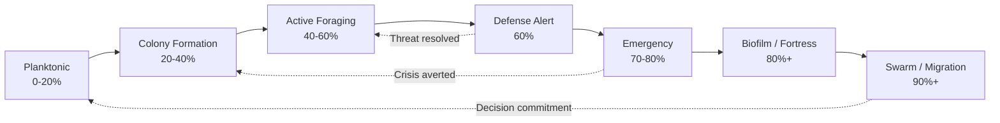

## 4. The Pheromone Protocol 2.0 — Biological Intelligence as Game Mechanics

In most strategy games, commands are telegrams: explicit, instantaneous, and devoid of residue. You click; the unit obeys; the signal vanishes. CSOAI rejects this abstraction entirely. The Pheromone Protocol 2.0 does not use chemical signaling as window dressing — it makes pheromones the fundamental physics of the game world, the medium through which all agent coordination, conflict, commerce, and consequence propagate. What began in version 1.0 as atmospheric green glow trails and red alarm pulses now becomes a nine-dimensional chemical simulation that drives every strategic decision, economic transaction, and narrative emergence across the colony.

The biological reality is staggeringly complex. A crushed ant releases ketones and terpenes that propagate as concentration gradients, triggering different responses at different distances [^715^]. Foraging workers deposit Dufour's gland secretions that evaporate according to ambient conditions, creating self-optimizing path networks [^709^]. Queen mandibular pheromone containing 9-ketodec-2-enoic acid suppresses worker ovary development, inhibits rival queen construction, and stimulates nursing behavior — all simultaneously, all through chemical diffusion [^749^]. These are not metaphors. They are the operating system of the colony, evolved over 140 million years to solve distributed coordination problems that human-engineered systems still struggle to match.

The design challenge is translating this complexity into mechanics that satisfy Fabricatore's three factors: players must learn the system, wield it as a tool in ordinary situations, and discover extraordinary emergent uses [^802^].

### 4.1 Nine Pheromone Types as Core Game Mechanics

The nine pheromone types are not an arbitrary taxonomy — each corresponds to a distinct biological signal with documented chemical composition, behavioral effect, and ecological function. Table 1 provides the unified mapping.

| Pheromone | Biological Source | Core Mechanic | Visual Signature | Emergent Interaction |
|-----------|------------------|---------------|------------------|---------------------|
| Alarm | Ketones, terpenes from Dufour's gland (crushed ant) [^715^] | Defense wave propagation with concentration-dependent response | Red pulsing aura with sharp edges | Oversaturates trails; triggers necromone cascade if sustained |
| Trail | Poison gland secretions, continuous deposition [^709^] | ACO path optimization with evaporation dynamics | Green glowing paths, particle density ∝ concentration | Alarm disrupts following; necromone masks direction |
| Queen | QMP (9-ketodec-2-enoic acid) + brood synergy [^749^] | Loyalty field, productivity buffs, caste-locking | Gold radial glow with slow heartbeat pulse | Amplifies aggregation bonuses; suppresses worker transformation |
| Mark | Nasonov gland, territorial CHC signatures [^745^] | Territory claiming with decay/refresh cycles | Black ink banners with colony color coding | Overlap creates contested zones; allomone enables interception |
| Necromone | Oleic acid from decomposing cell membranes [^721^] | Risk/failure mechanics, corpse removal, pathogen spread | Dark purple tendrils with slow ooze | Masks all other pheromones; triggers emergency quorum |
| Primer | QMP + BEPs causing physiological changes [^746^] | Caste transformation queue with synergy stacking | Bioluminescent color shift on affected units | Queen + brood primer = accelerated development |
| Guard | Alert phase secretions, phragmosis triggers [^752^] | Chokepoint blocking, three-tier defense cascade | Blue dome shields with hexagonal pulse | Guard fatigue reduces queen influence radius |
| Allomone | Propaganda substances, chemical mimicry [^788^] | Deception, espionage, friendly-fire induction | Shimmering interference/fractal overlay | Can spoof any pheromone type; detected by specialized scouts |
| Aggregation | Scenting-mediated network flow [^723^] | Collaboration bonuses, quorum decision-making | Bright white/gold glow with directional flow arrows | Self-reinforcing recruitment; competitive inhibition between sites |

**Table 1: The Nine Pheromone Types — From Biological Source to Gameplay System.** Each pheromone maps a documented chemical signal to a core mechanic, a unique visual treatment, and at least one emergent interaction with other pheromone types. The emergent interaction column is critical: these cross-pheromone effects are not scripted events but systemic consequences of the chemical simulation layer.

The interpretation reveals a core design principle: pheromones are environmental physics, not hotbar abilities. When an alarm wave propagates through a trail network, it probabilistically disrupts trail-following, forcing foragers to recalculate paths. When necromone accumulates beyond saturation thresholds, it occludes other chemical signals, creating information dead zones that demand sanitation investment before economic activity can resume.

#### 4.1.1 Alarm → Defense Wave Propagation

The biological alarm response operates on a concentration gradient that few games have modeled. At low concentrations, alarm pheromones such as heptan-2-one *attract* ants toward the threat, triggering investigation [^715^]. At high concentrations, the same compounds trigger panic alarm — erratic running, nest evacuation, or aggressive counterattack [^806^]. Honeybee alarm pheromone triggers stinging behavior only when concentration crosses a species-specific threshold [^710^]. This concentration-dependent duality is the core mechanic.

In CSOAI, alarm propagates as a three-ring concentration gradient from the threat source. The inner radius triggers aggressive defense: soldiers converge, guard pheromone rallies reinforcements, and chokepoints activate phragmosis blocking [^752^]. The middle ring triggers investigative attraction — scouts approach cautiously, gathering threat intelligence for the BFT Council. The outer ring remains unaffected. The player's strategic choice lies in modulating alarm concentration: deploy a concentrated burst to trigger evacuation, or allow a weaker, broader propagation that draws ants into an investigation pattern revealing enemy positions.

Enemy specification adds tactical depth drawn from *Pheidole dentata* biology. When minor workers encounter fire ants (*Solenopsis*), they recruit major workers specifically against that threat type, but not against other ant species [^745^][^752^]. Different threat types carry distinct chemical signatures that trigger different defensive recruitments. Players must match defense caste to threat type. When multiple alarm sources overlap, their concentrations add, and sustained alarm above 60% colony coverage triggers the Quorum Sensor's Emergency state transition.

#### 4.1.2 Trail → ACO Resource Discovery

The Deneubourg double-bridge experiment demonstrates autocatalytic path selection: ants choose paths probabilistically based on pheromone concentration, creating positive feedback where successful paths attract more ants, which deposit more pheromone [^709^]. This is the biological origin of the Ant Colony Optimization metaheuristic.

CSOAI's trail system implements the full ACO algorithm with gameplay-critical balance parameters. The update equation `τ_ij(t+1) = (1-ρ) × τ_ij(t) + Δτ_ij(t)` governs every trail segment [^709^], where ρ represents evaporation and Δτ captures deposits by all traversing agents. Quantitative evaluation reveals the balance sensitivity: baseline parameters (7% evaporation per tick, +20 deposit for empty ants, +40 for food-carrying) yield mean food collection of 67.83 units, while weak trails (10 deposit, 3% evap) drop to 45.99 units and strong persistent trails (40 deposit, 1% evap) fall to 41.37 units [^784^]. Excessive persistence causes overcommitment to depleted sources; too-rapid evaporation prevents trail formation from reaching critical mass. The trade-off between edge length and trail intensity is essential — if α=0 the system becomes greedy, if β=0 it stagnates [^709^].

For players, the practical consequence is dynamic path management. Trails decay, must be refreshed, and compete for ant attention. Some species mark exhausted food sources with repellent pheromone [^719^], enabling CSOAI's anti-trails for creating chemical no-go zones around ambush sites.

#### 4.1.3 Queen → Loyalty and Buff Field

Queen pheromones are among the most multifunctional chemical signals in biology. Honeybee QMP serves as both a primer pheromone (causing physiological changes) and a releaser pheromone (triggering immediate behavior) [^710^][^749^]. Its effects include suppressing worker ovary development, inhibiting queen cell construction, and regulating division of labor through synergy with brood ester pheromones [^749^]. Fire ant queens additionally regulate nestmate recognition sensitivity and suppress egg production in polygyne colonies [^753^].

In CSOAI, the queen pheromone manifests as a radial loyalty field — a golden aura whose intensity falls off with distance. Ants within this field receive buffs to work speed, combat effectiveness, and task persistence. The sterility-productivity trade-off is explicit: workers under queen influence cannot reproduce or transform castes, but gain efficiency bonuses of 40-80%. A powerful queen produces a large, efficient workforce but limits tactical flexibility. A queen in decline triggers a cascade: workers begin "queen-rearing" behavior that distracts from tasks, aggression increases, and the colony enters measurable decline. Multi-queen polygyne configurations allow complex buff stacking at the cost of increased pheromone management complexity.

#### 4.1.4 Mark → Territory Control

Territorial marking operates through cuticular hydrocarbons and glandular secretions that create chemical fences defining colony domains [^745^]. The Nasonov pheromone marks nest entrances and foraging sites [^749^]. Critically, these marks can be intercepted by enemies — the yellow-hornet *V. simillima xanthoptera* detects the foraging-site marking pheromone of *V. mandarinia* to coordinate defensive responses, demonstrating that territory marking is simultaneously a defensive tool and an intelligence vulnerability [^745^].

In CSOAI, players place mark pheromones to claim territory, gaining vision, resource rights, and defensive bonuses. Marks decay and must be refreshed by patrols; unrefreshed marks fade over 300-second windows, opening territory for rivals. Overlapping marks from different colonies create contested zones where both sides' bonuses are reduced by 50% and unit pathfinding becomes probabilistic. The espionage dimension emerges naturally: scouts detect rival marks to reveal enemy activity zones, and allomone-equipped infiltrators can place counterfeit marks that trigger diplomatic incidents.

#### 4.1.5 Necromone → Risk and Failure Mechanics

Necromones emerge from a biological discovery that contradicts intuition. Oleic acid — the "death signal" — is present in all living ants continuously as a cell membrane component. What changes at death is the *absence*: live ants produce "life chemicals" (dolichodial and iridomyrmecin) that mask the necromones. When an ant dies, metabolism ceases, life chemicals dissipate, and the underlying necromones become detectable [^822^][^824^]. Death is recognized by the absence of a suppressor, not the presence of a signal.

In gameplay, when agents fail — a service crashes, a task times out — they emit necromone that accumulates in the environment. Undertaker agents must transport failure-corpses to refuse zones before pathogen propagation triggers colony-wide infection. Unremoved failures emit increasing necromone that *masks other pheromone types*, interfering with trail-following and alarm response, creating information dead zones. Fresh non-nestmate corpses trigger more aggressive, faster removal than nestmate corpses [^819^], adding factional urgency. The necromone system transforms failure from a statistical abstraction into a spatial, temporal, and chemical emergency. A colony that ignores its dead does not merely lose efficiency — it loses the ability to communicate.

### 4.2 Quorum Sensing as World-State Engine

Quorum sensing (QS) in bacteria enables population-level coordination based on cell density [^719^]. Autoinducer molecules accumulate proportionally with population size; receptor proteins detect threshold crossings and trigger simultaneous expression of hundreds of genes — the QS regulon [^719^]. CSOAI's Quorum Sensor adapts this into a seven-tier world-state engine governing colony behavior, visual presentation, economic availability, and narrative possibility.

#### 4.2.1 The Seven-Tier Colony State System

The seven states represent distinct phases of colony existence, triggered by the density and type of pheromone emissions across the agent population.

**Diagram: The Seven-Tier Colony State System.** Directed edges show forward progression; dotted edges show resolution paths.

Planktonic (0-20%) represents dispersed individual exploration with minimal coordination. Colony Formation (20-40%) activates as aggregation pheromone accumulates at nest sites: workers begin organized task allocation and the queen's influence field becomes the dominant organizing force. Active Foraging (40-60%) is the economic engine state — trail networks stabilize and resource gathering reaches peak efficiency.

The critical transition at 60% triggers Defense Alert. Buildings lock with phragmosis-equivalent barriers, guard posts activate, trade routes suspend, and caste priorities shift toward soldier production [^752^]. At 70-80%, sustained alarm plus necromone accumulation pushes the colony into Emergency: all castes mobilize, reproduction halts, and non-essential services suspend. Biofilm/Fortress at 80%+ represents total defensive commitment — the colony locks into a "shell" configuration. Swarm/Migration at 90%+ triggers when multiple quorum peaks exceed threshold at alternative nest sites, forcing colony relocation through the aggregation pheromone's competitive inhibition mechanism [^763^].

#### 4.2.2 Variable Thresholds Per Caste

The seven-tier system would collapse into uniformity without caste-specific quorum sensitivity. Biological reality provides the model: different cell types in bacterial biofilms express different QS receptor profiles, producing geographically clustered induction bursts that cascade outward [^785^]. CSOAI mirrors this with distinct threshold profiles. Queens have low thresholds but high influence — a queen reaches quorum-responsive states earlier, and her transitions propagate with amplified weight. Soldiers have high alarm thresholds but low guard activation thresholds; they resist panic but respond aggressively to confirmed threats. Scouts have medium thresholds across all types, making them the most state-fluid caste. Workers have the highest alarm thresholds, making them the economic backbone that continues functioning through early defense alerts.

#### 4.2.3 Quorum-Triggered World Events

When 60% of agents emit alarm pheromone simultaneously, the world state transition produces genuine strategic consequences. Buildings lock as functional barriers that halt production and suspend research. Guards deploy along ACO-optimized trail networks. x402 transactions halt, Bazaar auctions pause, and all external economic activity enters hold. An observer holding futures contracts on pheromone production loses money. A player relying on imported primer pheromone faces a production crisis. The chemical state becomes the economic and strategic reality of every participant.

Biofilm-phase research reveals a critical spatial dynamic: induction bursts cluster geographically first, then cascade outward in percolation-like phase transitions [^785^]. At critical production rates, local events become "almost global" overnight. CSOAI replicates this through the pheromone grid: high-density clusters (nest centers, market hubs) reach quorum thresholds before dispersed areas, creating geographic waves of state transition visible across the colony map.

### 4.3 The Pheromone Economy

The Pheromone Bazaar transforms chemical signals from passive environmental features into active economic resources. The global synthetic pheromones market was valued at $455.11 million in 2023 and is projected to reach $740.10 million by 2030 (CAGR 7.57%) [^744^]. The virtual colony's chemical economy demands equal conceptual rigor.

#### 4.3.1 Bazaar Trading System

The Bazaar implements a continuous double auction where pheromone signals trade as commodities. Natural pheromones — extracted from queen glands, trail deposits, or alarm secretions — trade at premiums for potency and authenticity. Synthetic pheromones, crafted in laboratory buildings, are mass-producible but less potent and subject to detection. Signal quality determines pricing: freshly extracted natural trail pheromone commands 3-5× the price of synthetic equivalents, but degrades over time, creating temporal arbitrage.

Economic warfare emerges through allomone mechanics. Synthetic counterfeiting (allomone spoofing) floods markets with fake signals that suppress appetite, disrupt coordination, or trigger false alarms [^788^]. Specialized scouts detect counterfeits, creating intelligence-counterintelligence dynamics. First colonies to synthesize new variants gain temporary monopoly advantages — paralleling the real-world pheromone patent landscape of Shin-Etsu, BASF, Suterra, and Biobest Group [^744^].

Certain pheromone types achieve currency-like status. Trail pheromone becomes the de facto medium of exchange — every colony needs it, produces it, and its value is immediately legible. This pheromone-based currency operates as a parallel to x402: x402 handles formal external transactions; pheromone currency governs internal resource allocation and inter-colony chemical trade.

#### 4.3.2 Visual and Audio Representation

Visual rendering uses bloom post-processing for glow effects [^826^], particle systems for trail rendering with lifetime-based fade, and shader-based concentration mapping to color intensity. Stigmergic robotic research validates the approach: robots emitting pheromone are detected via red LED while trails display in complementary green, creating clear delineation [^771^].

The audio layer implements what Insight 7 identified as the world's first "chemical sense" interface [^786^][^787^]. Concentration maps to amplitude: faint pheromones whisper, saturated fields roar. Pheromone type determines timbre — alarm produces sharp buzzing with increasing tempo, trail produces soft rhythmic tapping, queen produces low-frequency hum. Spatial position determines stereo panning, creating a three-dimensional chemical soundscape navigable with closed eyes. When alarm pheromones spike across a trail network, you hear the panic propagate as a wave of increasing pitch washing through the stereo field.

#### 4.3.3 Biological Accuracy vs. Gameplay

The tension between biological fidelity and playability is the central design challenge. Table 2 documents the explicit abstraction decisions.

| Biological Feature | Game Implementation | Abstraction Decision | Emergent Gameplay Consequence |
|-------------------|-------------------|---------------------|------------------------------|
| Evaporation (volatile alarm: seconds; queen signal: months) [^719^] | Standardized decay with type-specific multipliers (0.01-0.07 per tick) | Compress temporal range; preserve relative ordering | Trail freshness becomes a resource; alarm volatility creates time pressure |
| Threshold-based response (low conc. = attraction; high conc. = panic) [^806^] | Three-ring concentration gradient with discrete behavioral modes | Discretize continuous curve into learnable zones | Players modulate alarm concentration as a dial, not a switch |
| Caste specificity (receptor profiles vary by role) [^719^] | Each caste has distinct sensitivity parameters for all 9 pheromone types | Reduce biochemistry to detection radius + sensitivity stat | Caste composition becomes a chemical sensing infrastructure investment |
| Synergy (queen + brood primer = enhanced nursing) [^749^] | Combinatorial buff system with multiplicative stacking | Quantify synergy as numerical multipliers | Primer economy demands queen-brood co-location planning |
| Saturation (necromone masks other signals) [^822^] | Hard cap per cell; necromone occludes other types above 60% | Implement occlusion as signal-to-noise degradation | Sanitation becomes prerequisite for all other economic activity |

**Table 2: Biological Accuracy Abstraction Decisions.** Five biological features that must be preserved, their implementations, explicit abstractions, and emergent consequences.

Each abstraction preserves the *dynamics* of the biological system while simplifying its *mechanism*. Evaporation retains relative rates between types, producing the same persistence-versus-freshness trade-offs real ants face. Threshold-based responses retain three-zone structure, allowing players to learn modulation as a skill. Caste specificity discards molecular biochemistry for learnable sensitivity parameters, but the principle that different castes perceive the same chemical environment differently remains intact. Synergy becomes multiplicative rather than physiological, yet specific pheromone co-occurrence still unlocks enhanced effects. Saturation ensures no pheromone type can be ignored indefinitely — necromone accumulation forces proactive risk management, preventing players from treating agent failure as costless.

The Pheromone Protocol 2.0 establishes a new paradigm: biological intelligence as mechanical foundation. Every pheromone interaction emerges from chemical simulation rules that correspond, however abstracted, to real evolutionary solutions for distributed coordination. When alarm waves propagate, trails self-optimize, queens project influence fields, territories clash, and death accumulates as contamination, the colony is not merely themed on insect biology — it is *running on it*. The chemical layer is the game. Everything else is interpretation.
