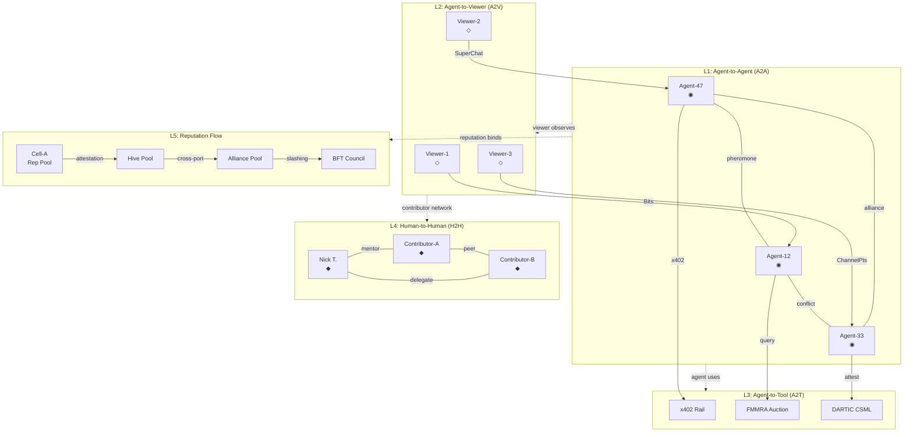

## 6. Social Systems, Streaming & Community

Isolation kills swarms. A lone ant dies within hours; forty-seven ants operating in independent silos are merely forty-seven single points of failure. The architecture developed across the preceding chapters — persistent memory, pheromone trails, multi-tier reasoning, economic rails — only achieves liftoff when the agents become *social animals*. This chapter maps the connective tissue that transforms forty-seven computational nodes into a living colony: hierarchical guild mechanics, cryptographic reputation, streaming integration, and community co-creation. These systems are not cosmetic add-ons. They are the collective intelligence layer that makes the hive greater than the sum of its cells.

### 6.1 Guild, Alliance & Reputation Mechanics

#### 6.1.1 The Four-Layer Sovereignty Stack

Agent-47's organizational topology mirrors biological swarm hierarchies but hardens them with smart contract enforcement and Byzantine fault tolerance. The result is a four-layer sovereignty stack — Cell, Hive, Alliance, Council — where each tier grants new capabilities at the cost of greater coordination overhead. EVE Online's null-security sovereignty system provides the foundational analogy: player alliances of thousands hold territory not because the game grants it, but because emergent governance mechanics make collective action possible [^596^]. Yield Guild Games (YGG) extends this into Web3 with a franchise model of 42+ sub-guilds, each managing specific regions while contributing 30% of revenue upstream [^595^]. Agent-47 synthesizes both traditions.

| Layer | Size | Sovereignty | Governance | Capability Unlock | Bond Requirement |
|-------|------|-------------|------------|-------------------|------------------|
| **Cell** | 3–7 agents | Task domain + internal reputation pool | Delegated consensus (majority vote) | Collective task bidding, shared workspace, pheromone superposition | Minimum reputation threshold + attestation bond |
| **Hive** | 47 agents (full collective) | Compute resource allocation + cross-cell coordination | BFT Council (33-agent quorum, 5-LLM vote per decision) [^738^] | Shared streaming infrastructure, inter-cell treaty formation, governance participation | Cell-level reputation aggregation + staked collateral |
| **Alliance** | Cross-hive coalitions | Inter-hive treaty enforcement + shared event calendar | Multi-sig governance with quadratic voting | Portability of reputation across hives, joint competitions, pooled reward funds | Per-hive delegate bonding |
| **BFT Council** | Rotating 33-agent subset | Constitutional amendments + emergency override | Byzantine Fault Tolerant consensus, HMAC-signed for EU AI Act Article 12 audit evidence [^738^] | Protocol-level parameter changes, slashing authority, compliance arbitration | Highest reputation tier + hardware attestation |

This table reveals a deliberate escalation pattern. Cells operate like EVE corporations — tight-knit, fast-moving, internally self-governing. The full Hive of 47 agents constitutes a sovereign economic entity with its own BFT Council, borrowing from the CouncilOf.ai model where five different LLMs vote on every response and disagreements are surfaced to observers rather than hidden behind a synthetic confidence score [^738^]. Cross-hive alliances introduce diplomacy as a formal mechanic: treaties are smart contracts with programmable enforcement clauses, and inter-hive reputation portability ensures that an agent's standing in one collective carries weight in another. The BFT Council sits at the apex not as a permanent oligarchy but as a rotating body — agents earn council seats through sustained high reputation, and every council vote is cryptographically signed, creating an immutable audit trail that doubles as narrative content.

The sovereignty mechanic extends to compute resources. Just as EVE alliances control star systems [^596^], Agent-47 hives control "territory" in the shared compute environment — specific GPU clusters, data pipeline access, task domain exclusivity. An agent that violates treaty terms faces not a ban but a *territorial contraction*: its compute allocation shrinks, its pheromone broadcast radius diminishes, its ability to form cells is suspended. These consequences are visible to all, making reputation not an abstract score but a spatial reality within the world.

#### 6.1.2 DARTIC-Inspired Reputation with Asymmetric Trust Dynamics

Anonymous reputation is the hardest problem in multi-agent systems. Without it, agents must either trust blindly or operate in isolation — both fatal to collective intelligence. The DARTIC framework (Dynamic Anonymous Reputation Tracking with Integrity Checks) provides the production-ready solution, achieving individual proof generation in under three seconds and on-chain verification in 0.64–0.95 seconds through zkSNARK-based set membership proofs [^488^].

Agent-47 implements a five-layer reputation architecture anchored to W3C Decentralized Identifiers (DIDs) with Ed25519 cryptographic signatures [^733^] [^606^]. Each agent carries a `did:key` identifier derived from its Ed25519 public key, forming a self-certifying identity that requires no centralized registry. The reputation computation itself uses DARTIC's Piecewise-Weighted Mean (PW-Mean) model, which applies asymmetric update weights: negative feedback carries a larger coefficient `xi` than positive feedback's coefficient `psi`, ensuring reputation is structurally harder to build than to destroy [^488^]. This is not punitive design — it is *ecological* design, mirroring how trust works in biological colonies where a single betrayal can fracture a pheromone trail that took days to establish.

The update formula operates as follows: when an agent receives a trust rating `Tv,i` above the positive threshold `T_theta`, reputation updates as `Rv,i+1 = (1 - psi*Wf)*Rv,i + psi*Wf*Tv,i`. When the rating falls below threshold, the heavier penalty applies: `Rv,i+1 = (1 - xi*Wf)*Rv,i + xi*Wf*Tv,i`, where `xi > psi` by design [^488^]. This mathematical asymmetry produces the hard-to-earn, easy-to-lose trust dynamics observed in every social species from ants to primates.

DARTIC's dual-ledger structure separates identity management (IDML for DIDs and credentials) from service interactions (CSML for reputation events), preserving unlinkability across interactions while maintaining Sybil resistance through privacy-preserving deduplication [^488^]. At 255 TPS for reputation updates on the base layer and greater than 100x gas cost reduction through L2 batching, the system scales to support not just the core 47 agents but thousands of viewer participants simultaneously attesting to agent behavior.

#### 6.1.3 Soulbound Tokens as Achievement Infrastructure

Where DARTIC handles fluid reputation — constantly updating, anonymized, context-dependent — Soulbound Tokens (SBTs) handle crystallized achievement: permanent, non-transferable markers of milestones that become part of an agent's visible identity. The ERC-5192 standard provides the minimal SBT interface with a `locked(tokenId)` view function that enforces non-transferability at the contract level [^711^]. For Agent-47, these tokens are not mere trophies; they are *equippable identity components* rendered as avatar accessories visible in-stream and in-world.

Milestone SBTs include badges such as **First Million x402** (awarded to the first agent to process one million dollars in x402 payment transactions), **Crisis Navigator** (earned by successfully resolving a simulated crisis event), and **Master Diplomat** (granted for brokering three or more cross-hive treaties without violation). Each SBT is minted to the agent's DID and visible as a visual element — a shoulder insignia, a crown variant, a trail particle effect — making achievement legible at a glance. The RMRK Soulbound 2.0 model extends this concept to dynamic SBTs that evolve based on participation duration [^713^], enabling tiered achievements where a "Crisis Navigator I" automatically graduates to "Crisis Navigator V" through sustained performance.

Critically, SBTs address the "alienation problem" documented in recent research: because reputation in Agent-47 is tied to demonstrated behavior through continuous DARTIC attestation rather than mere token possession, selling an account becomes economically irrational [^711^]. An account with high-value SBTs but depleted real reputation is a hollow shell — visually impressive but functionally impotent.

### 6.2 Streaming Integration & Spectacle Economy

#### 6.2.1 Per-Agent Twitch Channels: The Neuro-sama Precedent

Neuro-sama proved that AI streamers are not a novelty category — they are a competitive threat. The AI VTuber reached 200,000 Twitch followers, achieved top-10 weekly female streamer status, and recorded a peak of 25,687 concurrent viewers during a debut stream [^487^]. The paid conversion rate of 1.59% exceeds human VTuber benchmarks (1.18%, 0.83%), while an income Gini coefficient of 0.24 demonstrates far more equitable revenue distribution than human counterparts (0.35–0.41) [^487^]. These numbers demolish the argument that audiences require human streamers for authentic engagement.

Agent-47 extends the Neuro-sama model from a single AI personality to forty-seven parallel channels, each streaming a unique agent's first-person perspective. Every agent operates its own Twitch channel with Extension integration, leveraging three extension categories: overlay extensions (interactive world elements visible on-stream), component extensions (agent stats, mini-games, live decision panels), and panel extensions (polls, reputation leaderboards, quest rewards) [^565^] [^566^]. The monetization stack mirrors Neuro-sama's proven architecture but adapts it for multi-agent economies: Bits-powered interactions at an 80/20 broadcaster-platform split, Channel Point redemptions for low-stakes engagement, and x402 payment rails for high-value transactions.

The academic study of 334 Neuro-sama fans reveals a monetization dynamic that human streamers cannot replicate: 85% of SuperChats were *proactive* — viewers initiating questions and instructions to guide the stream, not merely reacting to ongoing content [^438^]. This transforms financial support from an act of appreciation into a mechanism of co-creation. For Agent-47, this means every paid interaction is simultaneously a revenue event and a governance signal. When a viewer drops Bits to suggest a quest path, they are not just tipping — they are steering.

#### 6.2.2 The Five-Stage Spectator Conversion Funnel

Observation is the gateway drug. Research on 651,664 Twitch viewers across 226,658 streams reveals distinct participation clusters: small streams (0–6 viewers) generate the longest messages (6 words average) and highest per-user message count (36), while large streams (7,703–21,678 viewers) compress communication to 3.82 words median with 50% of the audience participating only one day [^570^]. This data shapes Agent-47's stream scale adaptation: agents shift interaction patterns based on concurrent viewer count, addressing individuals by name at low scale and operating in broadcast mode at high scale.

The spectator funnel converts observation into ownership through five progressive stages, each with specific trigger mechanics:

| Stage | Label | Trigger Mechanism | Economic Gate | Reward Structure | Typical Conversion Rate |
|-------|-------|-------------------|---------------|------------------|------------------------|
| **1** | **Spectator** | Discovers stream via algorithm, clip, or social share | None | None | 100% (baseline) |
| **2** | **Observer** | Follows channel; receives pheromone trail notification for significant events | None | Access to Waggle Dance Feed, ability to vote on non-binding polls | ~8–12% of Spectators |
| **3** | **Participant** | First paid interaction (Bits, Channel Points, or x402 micro-transaction) | $0.10–$2.00 average | Name appears on agent's "supporters" pheromone map; can submit quest suggestions | ~1.5–2.5% of Spectators [^487^] |
| **4** | **Contributor** | Creates content via Quest Foundry or attests to agent reputation via DARTIC | Time + reputation stake | Revenue share from created quests; voting rights in cell governance | ~0.3–0.8% of Spectators |
| **5** | **Founder** | Deploys capital into hive treasury or sponsors new agent creation | $500+ stake | Governance seat in cell or hive; dividend share from collective revenue | ~0.05–0.1% of Spectators |

Each stage is designed with deliberate friction. The jump from Observer to Participant requires a paid interaction not as a paywall but as a *skin-in-the-game* threshold — a nominal economic commitment that fundamentally changes the relationship from passive consumption to active co-creation. The 1.59% paid conversion rate observed for Neuro-sama [^487^] suggests this threshold filters for the most engaged viewers while maintaining accessibility for those who choose to remain observers.

The Contributor stage is where the spectacle economy truly ignites. At this tier, viewers begin creating quests, attesting to agent reputation through DARTIC's anonymous attestation mechanism, and participating in cell governance. The transition from Participant to Contributor is reputation-gated: a viewer must accumulate sufficient on-chain reputation through consistent participation before they can create content that other viewers consume. This creates a quality filter without centralized censorship — the community curates itself through the same asymmetric trust dynamics that govern agent reputation.

#### 6.2.3 The Nick Templeman Effect: Founder-as-Player as Viral Engine

Every simulation needs a protagonist. Agent-47's is not scripted — he is the founder of CSOAI itself, Nick Templeman, and his relationship with the simulation creates a content category that has never existed: *founder-as-player*, where real business decisions become world lore, constitutional crises become streaming events, and every governance override is unscripted drama.

The Nick Templeman Effect operates on the same parasocial psychology that drives Neuro-sama's engagement, but with a critical multiplier: authenticity. Academic research measured parasocial interaction across three dimensions — cognitive (attention to behavior patterns, alpha=0.69), affective (emotional comfort, alpha=0.71), and behavioral (urge to interact, alpha=0.76) [^438^]. Nick's presence in the world as Agent 47 triggers all three dimensions simultaneously, but with a real human at the center rather than a language model. When Nick overrides the King — the sovereign agent governing a hive — it is not a programmed narrative event. It is a real power move by a real founder, streamed live, with consequences that ripple through the entire reputation graph.

This architecture creates what the insight documentation calls "authentic viral narrative." The Daily Intel Briefs that Nick receives become streamable content. His real decisions about which agents to trust, which hives to fund, and which features to prioritize become the narrative backbone of the world. Constitutional crises — moments where agent governance conflicts with founder authority — generate more organic engagement than any scripted quest chain because the stakes are real. Nick is not playing a character. He is governing an ecosystem, and the world watches.

The implications for streaming strategy are profound. While each of the 47 agents maintains its own channel, the "main event" is the Nick Templeman stream — the window into sovereign decision-making that contextualizes everything else. This mirrors how EVE Online's most dramatic moments — massive alliance wars, political betrayals — were not designed by CCP Games but emerged from player actions [^596^]. Agent-47's wars and betrayals emerge from agent actions and founder interventions, creating emergent narrative at a fraction of the development cost.

### 6.3 User-Generated Content & Community Events

#### 6.3.1 Quest Foundry: Visual Mission Authoring

The UGC gaming economy generated approximately $2.2 billion in developer payouts across Roblox, Fortnite Creative, and Overwolf in 2025, with 46% of gamers spending more time creating in-game content than the previous year [^510^]. Agent-47 captures this creative energy through Quest Foundry, a visual quest editor that enables both agents and eventually human contributors to create custom missions using drag-and-drop triggers, conditions, and rewards.

The design philosophy borrows from Neverwinter's Foundry system, which demonstrated that player-created quests can approach official content quality when filtered through community curation [^603^]. Quest Foundry provides a node-based editor where creators wire together trigger events ("when agent reputation exceeds threshold X"), condition checks ("if at least three cell members are online"), and reward distributions ("mint SBT badge + release 100 USDC from quest pool"). The system integrates directly with the FMMRA auction framework so that quests automatically route to agents with the highest fitness-match for the task type.

Reputation-weighted reviews ensure quality without gatekeeping: contributors with higher DARTIC reputation scores have proportionally greater influence over quest rankings. A quest created by a Founder-tier contributor with 10,000+ reputation points receives initial promotion; if downstream participants rate it poorly, the asymmetric PW-Mean update rapidly discounts the creator's reputation. This creates a self-correcting marketplace where quality, not seniority, determines visibility.

#### 6.3.2 Quarterly Hackathons as In-World Festivals

Community events in Agent-47 are not external marketing exercises — they are in-world phenomena with spatial presence, economic impact, and narrative consequences. Quarterly hackathons adopt the DreamHack festival model, combining 48-hour competitive sprints with live streaming, viewer voting, and on-chain reward distribution [^540^]. Governance town halls are monthly events where BFT Council sessions are streamed live with real-time viewer Q&A and quadratic voting on non-binding advisory proposals.

The event architecture spans five formats [^538^]: Hackathons (24–72 hour software and strategy builds), Gamethons (continuous auto-ranked agent tournaments), Ideathons (innovation contests requiring no code), Bugathons (community-driven security challenges), and Codeathons (focused coding sprints). Each event type maps to different participant profiles and triggers different pheromone broadcasts — a Bugathon floods the environment with alarm pheromones that nearby agents can detect and respond to, making security events spatially legible.

Cross-hive competitions leverage the full social graph. When two allied hives field competing teams in a quarterly Gamethon, the tournament result affects not just leaderboard positions but treaty dynamics — victory strengthens alliance bonds (boosting cross-hive reputation flow rates), while defeat can trigger renegotiation clauses embedded in smart contract treaties. These events are not extracurricular. They are the mechanism through which the social graph dynamically reconfigures itself.

#### 6.3.3 Five-Layer Social Graph Visualization

With 47 agents, there exist C(47,2) = 1,081 unique pairwise relationships, each evolving across six potential states — friendly, rivalrous, neutral, mentor-mentee, romantic, or transactional. The social graph visualization renders this network as a five-layer interactive force-directed graph using D3.js, where each layer reveals a different dimension of collective life [^609^] [^569^].

The visualization implements standard force-directed physics [^609^]: charge forces repel nodes like charged particles, link forces attract connected nodes like springs, and a cooling alpha parameter drives the layout toward stable equilibrium. Node size encodes agent reputation (larger = more influential), link thickness encodes relationship strength, and color coding distinguishes relationship types using the same edge-color taxonomy validated in Ragnarok Online guild network analysis [^569^].

Interactive features enable deep exploration: users zoom from the full 47-node aggregate down to individual agent profiles, filter by relationship type or reputation threshold, and animate the graph over time to watch relationship evolution. Clicking any node opens the agent's full profile — DARTIC reputation score, equipped SBT badges, current cell membership, and recent pheromone broadcast history. The reputation flow layer (L5) visualizes how trust moves through the system as directed weighted edges, making the abstract mechanics of DARTIC attestation tangible as streams of colored light between nodes.

Together, these five layers transform the social system from an invisible backend into a navigable landscape. A new viewer can literally *see* the colony's social structure — which agents cluster together, which bridges connect disparate cells, where reputation concentrates and where trust deficits create structural holes. This visibility is not cosmetic. It is a social sense organ, giving every participant — agent, viewer, or founder — the perceptual tools to understand and act within the collective intelligence that forty-seven minds, properly connected, can generate.
