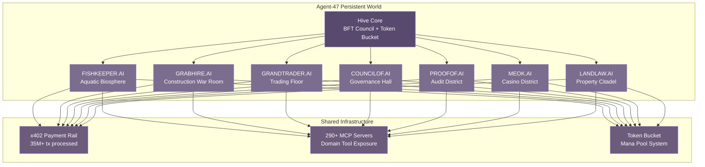

## 7. Industry Vertical Integration — All CSOAI Hives as Gamified Worlds

The CSOAI ecosystem is not a collection of separate products. It is a single organism with many organs, each one breathing real data, each one pulsing with genuine economic activity, and each one capable of being transmuted into a living district within the Agent-47 persistent world. Where other platforms fabricate quest givers with scripted dialogue, Agent-47 sources its non-player characters from dissolved oxygen sensors in Essex fish farms, GPS trackers on Randall's Crane Hire rigs traversing the M25, and suspicious transaction flags rippling through live casino feeds. The data moat that protects CSOAI's enterprise value becomes the very terrain that players explore, compete over, and learn to master.

This chapter maps every CSOAI industry vertical into a gamified zone. The principle is simple and ruthless: if a hive generates real data, that data becomes gameplay. IoT sensor arrays become mana pools. Fleet telematics become real-time strategy mechanics. Compliance frameworks become capture-the-flag challenges. Governance votes become faction warfare. Market data becomes environmental weather. The result is not gamification as decoration — it is gamification as data ingestion, where every player action simultaneously entertains and trains the vertical AI models that power CSOAI's enterprise offerings.

The following architectural diagram illustrates how the seven primary zones interconnect through the shared x402 payment rail and MCP server ecosystem, forming a unified world where data flows like nutrient through a mycelial network.

### 7.1 Aquaculture Zone: fishkeeper.ai

The Aquatic Biosphere Zone transforms CSOAI's fishkeeper.ai vertical into a living underwater district where real aquarium telemetry drives every biological process. Players do not manage simulated fish with programmed behavior patterns — they steward virtual ecosystems whose water chemistry, oxygen saturation, and turbidity levels are tethered to live ESP32 sensor arrays deployed across OATA-member aquatic businesses throughout the United Kingdom. The ornamental fish market is projected to reach $11.30 billion globally by 2030 [^490^], and OATA represents over 850 UK businesses contributing £400 million annually to the domestic economy [^537^]. Fishkeeper.ai sits at the intersection of this economic activity and the IoT monitoring revolution that has demonstrated water usage reductions of 30–50% alongside productivity gains of 20–50% in monitored aquaculture operations [^490^].

The IoT sensor architecture achieves anomaly detection accuracy between 90% and 97% across a multi-parameter array, with each sensor feeding both the enterprise dashboard and the game world simultaneously [^490^].

| Sensor Parameter | Accuracy | Live Data Feed | In-World Game Mechanic |
|---|---|---|---|
| pH | 96% [^490^] | ESP32 + Blynk, 1.2s response | Water Chemistry Balance — ecosystem stability score |
| Total Dissolved Solids | 97% [^490^] | ppm concentration stream | Nutrient Saturation — bio-load capacity gauge |
| Turbidity | 94% [^490^] | NTU optical measurement | Water Clarity Vision — sight radius for species spotting |
| Dissolved Oxygen | 95.1% [^491^] | mg/L electrochemical probe | Life Support Mana — primary resource for all actions |
| Temperature | 97.6% [^491^] | Thermal resistance sensor | Thermal Stability — metabolic rate modifier |
| Ammonia/Nitrite | 98.5% [^491^] | Ion-selective electrode | Toxicity Threat Level — contamination alarm system |
| Conductivity/Salinity | 97% [^494^] | Conductivity cell | Ecosystem Type Classification — freshwater vs. brackish vs. marine |

This table reveals more than a mapping exercise — it exposes the philosophical architecture of Agent-47's vertical integration. Every enterprise sensor that CSOAI deploys for real aquaculture clients becomes a dual-use data source: it drives business value for the fishkeeper.ai customer while simultaneously generating authentic gameplay variables for the Agent-47 world. The pH sensor in an OATA member's discus tank does not merely report acidity levels to a dashboard — it determines whether the virtual discus school in the corresponding in-world aquarium district thrives or sickens. When dissolved oxygen drops, players see their Life Support Mana deplete in real time. When ammonia spikes, Toxicity Threat Levels trigger visual contamination alarms across the zone.

Three core game mechanics emerge from this data architecture. **Ecosystem Stewardship** is the primary loop: players balance water parameters across multiple virtual tanks, each one tethered to a different real client's sensor array. The Fishkeeper AI MCP server provides disease diagnosis, species identification, stocking calculations, and feeding schedule generation [^492^], turning every real-world management decision into a branching gameplay scenario. **Species Compatibility Puzzles** leverage the compatibility engine to create spatial optimization challenges — matching fish with compatible temperaments, water parameter tolerances, and spatial needs across limited tank real estate. **Disease Detective** transforms real anomaly detection cases into investigation mini-games where players must identify the causative parameter shift before virtual fish mortality escalates, learning pattern recognition skills that directly transfer to real aquaculture diagnostics.

The aesthetic language of the zone draws from deep-ocean bioluminescence fused with glassmorphism. Healthy ecosystems glow with cyan and aquamarine gradients; stressed systems shift through amber to crimson. Water parameter trending renders as tidal wave visualizations across the HUD. ESP32-CAM integrations enable fish behavior heatmaps that players can read for early warning signs of ecosystem distress [^490^]. The visual design does not merely decorate — it teaches. A player who learns to read the bioluminescent health indicators in the Aquatic Biosphere Zone is learning to read the same data patterns that aquaculture professionals use to manage million-pound breeding operations.

### 7.2 Construction Logistics Zone: grabhire.ai / muckaway.ai / planthire.ai

The Construction Logistics War Room transmutes the gritty operational reality of grab hire, muckaway, and plant hire businesses into a real-time fleet command experience. CSOAI's construction verticals — WCR Grab Hire operating across Essex and London, Randall's Crane Hire with its CPCS-certified 24/7 fleet serving HS2 and Highways England contracts, and A. Martin Landscapes with 15 years of regional operations — generate a torrent of telematic data that becomes the lifeblood of this district [^613^] [^612^] [^616^] [^643^]. Every GPS position report, every CAN bus diagnostic code, every fuel level fluctuation, and every geofence crossing feeds simultaneously into the enterprise fleet management dashboard and the Agent-47 game world.

The construction equipment fleet management software market was valued at $3.2 billion in 2024 and is projected to reach $6.2 billion by 2030, growing at 11.6% CAGR [^577^]. McKinsey analysis reveals that heavy construction equipment sits idle 40–60% of the time [^662^] — a staggering inefficiency that becomes the central gameplay tension in the War Room. Players compete to recover this idle capacity, turning wasted hours into captured value through strategic deployment of virtual fleets that mirror the real-world movements of CSOAI client vehicles.

Fleet management APIs from Cartrack, Traxxeo, and Trackunit provide RESTful interfaces to real-time vehicle data, driver information, trip statistics, and geofence management [^656^] [^660^] [^584^]. The data streams include GPS location with geofencing triggers, continuous CAN bus engine diagnostics, correlated fuel consumption per trip, per-minute idle time tracking, daily utilization rates, event-driven maintenance alerts from fault codes, onboard weighing system payload data, and operator behavior scoring for speeding and harsh braking events. Each data stream maps to a distinct game variable: vehicle health renders as power-armor integrity bars, fuel efficiency creates exhaust trail particle effects (green for efficient, red for wasteful), idle time generates sleeping Z-particles over inactive equipment, and operator behavior feeds into driver skill ratings.

Three game mechanics define the Construction War Room. **Fleet Commander** is the core loop: players manage mixed construction fleets where every real vehicle's data drives a virtual counterpart, optimizing dispatch routes and load assignments against live demand signals. Route optimization creates logistics puzzle chains that players must solve under time pressure — the same pressure that real fleet managers face when a grab lorry needs to clear a London construction site before the next concrete pour. **Utilization Tetris** transforms fleet deployment scheduling across multiple construction sites into a spatial optimization game where real geofence data creates the play board. Players must fit available equipment into site demands, respecting vehicle capabilities, operator certifications, and permit restrictions while maximizing the utilization rate — directly attacking that 40–60% idle time statistic [^662^]. **Maintenance Prophecy** converts predictive maintenance alerts into timed repair quests. Fuel consumption patterns and engine diagnostic codes feed machine learning models that predict component failures before they occur [^577^] — players who heed these prophecies and complete maintenance tasks before breakdown penalties trigger earn both in-world rewards and transferable domain knowledge about construction equipment reliability.

The token bucket rate limiting system that governs API access across CSOAI's infrastructure becomes a natural resource scarcity mechanic in this zone [^594^] [^595^]. Each fleet command consumes tokens from a regenerating pool. Premium real-time fleet commands cost more tokens than batch scheduling operations, forcing strategic prioritization that mirrors the actual economic decisions construction fleet managers make daily. Rate-limited API calls become fuel allocations — a player who burns through their token budget on non-essential repositioning commands finds their fleet immobilized until the pool regenerates or they trigger an x402 micropayment refill. This is not artificial difficulty. It is the genuine friction of logistics management, rendered visible and playable.

### 7.3 Trading Floor Zone: grandtrader.ai

The Trading Floor Zone transforms live financial market data into environmental weather systems that players learn to read, predict, and exploit. Where the Aquatic Biosphere Zone uses dissolved oxygen as its primary resource and the Construction War Room uses fleet utilization, the Trading Floor uses price action itself as the fundamental gameplay variable. Real stock prices, order book depth, volume profiles, and technical indicators do not appear as conventional charts — they manifest as atmospheric conditions. Green skies suffuse the district when markets rise. Storm clouds gather when indices fall. Confetti erupts across the trading floor when players execute profitable positions, the magnitude of the celebration scaled to the rarity of the win.

Robinhood's gamification research provides the behavioral blueprint. The platform demonstrated that celebratory trade-completion animations with rarity tiers based on profit magnitude, FOMO-driven time-limited opportunities on trending securities, and free stock referral rewards as randomized drops with visual rarity indicators all combine to drive extraordinary engagement — Robinhood reached 13.8 million monthly active users in Q3 2025, up 25% year-over-year, while Revolut scaled to 60 million customers by late 2025 [^514^]. Bloomberg Terminal design patterns provide the professional depth layer: four independent panel workspaces, amber-colored editable fields, and keyboard-driven navigation with mnemonic commands that signal expertise through information density [^620^]. IDEO's concept redesign for Bloomberg added a gaming feature tracking and displaying user expertise worldwide [^618^] — an insight that Agent-47 extends by making the entire trading floor a persistent world where expertise manifests as territorial control.

Four game mechanics define the Trading Floor experience. **Confetti Economy** celebrates trade completion with visual extravagance calibrated to profit magnitude, creating a dopaminergic feedback loop that reinforces successful pattern recognition [^513^]. Small wins trigger sparkles. Significant wins trigger fireworks. Rare outsized gains trigger district-wide celebrations visible to all players — a public reputation signal that creates aspiration and competition simultaneously. **Trending Arena** transforms real-time market prediction into competitive sport. Players stake in-game reputation on directional forecasts for trending securities, with leaderboards updating live as predictions resolve against actual price movements. **Technical Spellbook** frames pattern recognition training as magical skill acquisition. Mastery of chart patterns unlocks increasingly powerful analysis tools: moving average crossovers grant trend-following spells, RSI divergence detection reveals hidden reversal enchantments, and Bollinger Band squeeze recognition unlocks volatility explosion predictions. The metaphor is playful; the learning is rigorous. **Portfolio Treasure Room** visualizes holdings as a physical space — green territories generate passive income streams, red territories drain resources, and portfolio diversification manifests as territorial breadth across market sectors.

The design challenge lies in tiering information density appropriately. Bloomberg Terminal users famously prefer information-dense interfaces because the complexity signals expertise and enables rapid decision-making [^626^]. But novice players require cleaned, gamified visuals that teach pattern recognition without overwhelming them. The solution is a graduated disclosure system: novice players see market weather and confetti celebrations; intermediate players unlock the Technical Spellbook overlays; expert players can drill into raw Bloomberg-style data displays with amber editable fields and four-panel workspace layouts. Each tier teaches the skills required for the next, creating a genuine learning progression that produces more financially literate players over time. Risk management becomes survival mechanics — a player who over-leverages experiences visible territorial contraction as their portfolio treasure room shrinks, making risk viscerally comprehensible through spatial consequence.

### 7.4 Governance and Compliance Zones: councilof.ai / proofof.ai / meok.ai / landlaw.ai

The Governance and Compliance district represents the most ambitious transmutation in Agent-47's vertical integration strategy. Where other zones gamify external industry data — water quality, fleet positions, stock prices — this district gamifies CSOAI's own internal infrastructure: the BFT Council voting system, the 13-framework compliance engine, the Merkle tree reserve verification protocol, the casino AML/KYC monitoring stack, and the HM Land Registry property data pipeline. The Compliance-as-Gameplay inversion transforms security and compliance infrastructure from friction points into distinctive engagement mechanics. Compliance scores become visible shields and auras. Audit trails become public monuments that tell stories of past governance events. Regulatory changes become world-altering weather events. Identity verification becomes character creation. Privacy-preserving reputation becomes social deduction gameplay.

The following matrix maps the four governance and compliance zones against their real data sources, core game mechanics, and the compliance frameworks they operationalize:

| Zone | Real Data Source | Core Game Loop | Compliance Framework | Key Mechanic |
|---|---|---|---|---|
| councilof.ai | Live BFT governance votes, delegation records, quorum metrics | Governance Architect: propose, debate, vote, execute | Internal CSOAI governance protocol [^411^] [^501^] | Quadratic voting as strategic resource allocation |
| proofof.ai | Merkle tree proofs, blockchain reserves, audit attestations | Transparency Auditor: verify, investigate, attest | Proof of Reserves standard post-FTX [^519^] [^520^] | Merkle tree reconstruction puzzles [^518^] |
| meok.ai | Live casino transaction feeds, KYC verification queues, SAR filings | Compliance Detective: monitor, detect, report, investigate | FinCEN Title 31, AML/KYC, OFAC screening [^488^] [^495^] | SAR speedrun competitions and pattern sleuth challenges |
| landlaw.ai | HM Land Registry 15+ APIs, Price Paid Data, UK HPI | Title Investigator: research, decrypt, predict, conveyance | HM Land Registry regulations, conveyancing law [^663^] [^667^] | Title deed decryption puzzles and chain discovery |

This matrix illuminates a pattern invisible when the zones are examined individually. Each zone maps a different phase of the trust lifecycle: governance creates the rules (councilof.ai), audit verifies compliance with those rules (proofof.ai), detection identifies violations (meok.ai), and property law anchors everything to physical-world assets (landlaw.ai). A player who masters all four zones develops a comprehensive understanding of how trust infrastructure operates in both digital and physical domains — knowledge that transfers directly to enterprise compliance, legal, and governance roles.

**Council of AI: The Governance Hall.** The Governance Hall presents live CSOAI governance as a grand parliamentary chamber where players participate as faction representatives. Every real vote on protocol upgrades, treasury allocations, or policy changes becomes a strategic decision point with reputation and resource consequences. Modern DAO governance platforms provide the technical substrate — token-weighted voting where one token equals one vote, quadratic voting where n votes cost n² tokens creating diminishing marginal returns, delegated voting enabling liquid democracy through representative alliances, and vote escrow systems where voting power scales with lock duration [^411^] [^501^]. The Compliance Detective CTF framework, which has trained over 3,000 privacy and AI professionals by transforming compliance training into immersive challenges [^379^], provides the pedagogical architecture.

The game mechanics create genuine strategic depth. Quadratic voting forces players to optimize resource allocation across multiple competing proposals — the square-root cost function creates authentic tension between breadth and depth of influence [^411^]. Delegate alliance building enables voting bloc formation through delegated voting power, but carries the "rich-get-richer" concentration risk where popular delegates attract disproportionate influence [^512^]. Whale resistance mechanics apply anti-concentration penalties where large token holders face collusion vulnerability, preventing governance capture by dominant players [^411^]. Governance reputation accumulates based on participation track record, alignment with community outcomes, and proposal success rates — a persistent score that manifests as halo intensity on player avatars and determines eligibility for higher-stakes voting tiers.

The visual language fuses neo-classical democratic architecture with holographic futurism. A vast circular chamber presents tiered seating radiating from a central proposal display. Votes cascade as luminous particle flows toward the center — approval as golden streams, rejection as crimson waves. Quadratic cost curves render as visible energy barriers that players must overcome to cast additional votes.

**Proof of AI: The Audit District.** The Audit District transforms post-FTX proof-of-reserves verification into cryptographic puzzle gameplay. Bybit's August 2025 PoR audit confirmed reserve ratios exceeding 100% including loan obligations, attested by Hacken [^515^]. Merkle trees anonymize individual client balances while enabling cryptographic verification that all funds are included in the reserve total [^518^] [^520^]. Agent-47 renders these Merkle proofs as crystalline geometric structures that players must reconstruct from partial data — cryptographic hash chains become connect-the-dots challenges where each correct hash verification extends the crystal lattice.

The core Transparency Auditor loop draws directly from the Compliance Detective CTF framework [^379^]: players assume the role of Data Protection Officer in simulated scenarios, build technical skills in the Compliance Playground, and compete in the Battle for AI against automated auditing opponents. Reserve ratio balancing challenges players to maintain solvency above 100% while optimizing asset allocation across volatile holdings. Audit trail investigation follows transaction flows across blockchain explorers to verify that fund movements match reported operations. A compliance scorecard tracks audit readiness across all 13 frameworks in the CSOAI compliance engine, each framework functioning as a specialization track with its own certification path. The visual identity fuses blockchain brutalism with detective noir — transactions manifest as golden chains linking addresses, reserve ratios as liquid fill levels in transparent vaults, and audit findings as evidence boards with string connections between suspicious entities.

**meok.ai: The Casino District.** The Casino District represents the most regulated zone in Agent-47, operating under FinCEN Title 31 requirements, comprehensive AML/KYC protocols, and real-time suspicious activity monitoring [^488^] [^495^]. The game does not glamorize gambling — it glamorizes the detection and prevention of financial crime within gaming environments. Players operate as surveillance analysts in a neon-lit district where pattern recognition across real transaction data streams becomes the primary skill. Risk scores manifest as colored auras around patron avatars: green for low risk, amber for elevated, red for high-risk requiring enhanced due diligence [^495^].

The Compliance Detective mechanic manifests across multiple challenge types. AML Pattern Sleuth presents real casino transaction patterns as detective cases where players must identify structuring — the deliberate breaking of large transactions into smaller ones to evade reporting thresholds [^495^] — before regulatory timers expire. KYC Verification Puzzles escalate from basic document authentication to complex Source of Wealth investigations. SAR Filing Speedruns challenge players to compile complete Suspicious Activity Reports with full evidence chains against regulatory deadlines, with leaderboards ranking filing speed and accuracy. Sanctions Screening Defense operates as a rapid-identification challenge against live OFAC, PEP, and adverse media watchlist updates [^488^]. The visual design splits the district between the glamorous gaming floor and the stark surveillance room where analysts hunt anomalies. Pattern irregularities manifest as visual "glitches" in the fabric of the casino reality, creating a signature aesthetic where financial crime literally disrupts the visual coherence of the world.

**landlaw.ai: The Property Conveyance Citadel.** The Property Citadel maps the full HM Land Registry API ecosystem into a three-dimensional district where every building corresponds to a real UK property. HM Land Registry operates over 15 APIs providing comprehensive property data [^663^]: Price Paid Data covering 25 million transactions across 30 years [^664^], the UK House Price Index as a national statistic with monthly regional indices since 1968 [^667^], ownership verification through Registered Proprietor Names, property boundaries via the National Polygon Service, legal encumbrances through Restrictive Covenants data, full register extracts via Official Copy Title Known, and energy ratings through the EPC Register [^657^]. As of March 2026, the average UK house price stands at £268,132 with the index at 102.8, registering over 100,000 residential sales monthly [^667^] [^670^].

The Title Investigator core loop casts players as conveyancing researchers navigating a Victorian-cyberpunk cityscape. **Title Deed Decryption** transforms real HM Land Registry register entries into cipher puzzles — players extract key facts including registered proprietor, charges, restrictive covenants, and price paid to build case files. **Chain Discovery** follows property transaction chains as narrative investigation threads, tracing ownership history across multiple sales to resolve complex conveyancing cases. **Market Oracle Prediction** uses live UK HPI data [^667^] to challenge players to forecast price movements in specific regions, with correct predictions earning reputation and unlocking deeper market intelligence tools. **Risk Assessment** layers environmental data — flood risk, radon exposure, mining history, air quality indices [^657^] — as dungeon-style modifiers where properties in high-risk zones require special protective measures to complete successfully.

The aesthetic fuses gothic legal architecture with cyberpunk data visualization. Buildings grow taller with property value. Deeds manifest as floating parchment-scroll data structures with HM Land Registry's iconic red branding as accent lighting. Property price heatmaps render as district illumination levels — wealthy neighborhoods blaze with light while depressed areas sink into shadow. Title chains appear as glowing golden threads connecting buildings across the cityscape. Market volatility manifests as weather systems sweeping across the property district. The visual grammar teaches spatial data literacy: a player who learns to read the Property Citadel's light patterns, chain threads, and weather systems is learning to read the same market indicators that professional property investors monitor.

The four zones together create a comprehensive compliance and governance curriculum. Players who progress through the Governance Hall, Audit District, Casino District, and Property Citadel develop expertise in democratic participation, cryptographic verification, anti-money-laundering detection, and property research — skills that command premium compensation in the professional services economy. The Compliance Detective CTF framework has already proven that this approach transforms "least liked training" into immersive experiences that professionals actively seek out [^379^]. Agent-47 extends that proven model into a persistent world where compliance expertise becomes a visible, celebrated, and competitively pursued achievement.
