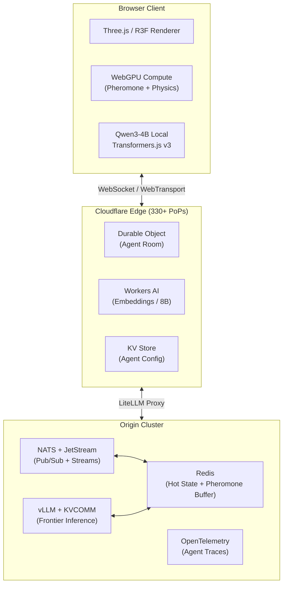

# 8. Technical Architecture 2.0 — Edge Computing, Distributed Sim & Performance

The swarm does not think in a single brain. Fire ants coordinate across thousands of bodies through decentralized chemical trails and local reactions to pheromone gradients that no individual ant comprehends. Agent-47's technical architecture mirrors this biological reality: a three-tier compute mesh that routes each agent query to the optimal inference surface, a spatial pub/sub fabric that propagates state like pheromone diffusion across a colony, and a rendering pipeline that streams 3D assets with the same lazy-evaluation efficiency that biological systems use to conserve energy. This is not merely infrastructure — it is the nervous system of a living world.

This chapter resolves the fundamental tension that killed previous multi-agent simulations: frontier model quality demands centralized GPU clusters with 500ms-5s latency, but real-time interaction demands sub-50ms response times. The solution is a tiered routing architecture that makes latency heterogeneity a feature, not a bug.

## 8.1 The Three-Tier Compute Architecture

The insight that drives this entire architecture is deceptively simple: not every agent decision requires frontier-model reasoning. A guard patrolling a known route does not need GPT-5.5-level cognition — it needs fast, cheap inference that can answer "continue patrol or investigate sound?" in under 50 milliseconds. But when that same guard encounters a player manipulating the economic system in a novel way, the architecture must seamlessly escalate to sovereign reasoning without the player ever noticing the handoff.

### 8.1.1 Tier 1 (Local/Edge): Qwen3-4B via Transformers.js v3 WebGPU

At the swarm's sensory periphery, Transformers.js v3 on WebGPU delivers 25-40 tokens per second for Qwen3-4B — roughly 10-100x faster than WASM fallbacks [^494^]. ECLD (Edge-Compact Language Distillation) variants achieve 70-80% size reduction while retaining above 95% task accuracy [^300^]. The 4-bit quantized models load in under 500MB browser memory, making the player's local GPU the inference engine for the 80% of queries that are classification, routing, embedding lookup, and simple dialogue.

The WebGPU backend has reached production maturity across all major browsers as of late 2025 — Chrome, Edge, Firefox, and Safari all ship stable implementations, making this a baseline capability rather than an experimental feature [^649^]. The performance envelope is substantial: on an RTX 3060-class GPU, inference runs at 10.17 ms per token for 135M-parameter models and 14.88 ms per token for Qwen2-1.5B models [^13^]. Even integrated GPUs sustain 2.1 million point particles at 60fps in WebGPU compute shaders, confirming that Intel UHD-class hardware can handle the local inference tier without choking the rendering pipeline [^573^].

### 8.1.2 Tier 2 (Regional): Cloudflare Workers AI

When local inference cannot handle the complexity of a query — complex RAG retrieval, multi-step reasoning, or coordination between agents across different hives — the request escalates to Cloudflare Workers AI, which provides serverless GPU inference across 330+ Points of Presence (PoPs) with sub-5ms cold starts and p50 latencies of 20-50ms for embeddings, 300-800ms for 8B parameter models [^487^] [^611^]. The V8 isolate architecture eliminates container startup overhead, and Durable Objects provide the stateful primitive that makes Agent-47's room-based simulation possible: each game room is a Durable Object instance with strongly consistent storage, persistent WebSocket hibernation, and automatic edge placement near the first connecting client [^654^].

The critical insight from production deployments is that edge computing saves perhaps 50ms of network round-trip time, but inference on 8B+ models still takes 300ms to 2 seconds [^1^]. Workers AI is the correct choice for operational model fit and regional latency optimization, not for making large-model inference instantaneous. This tier handles embedding-based memory retrieval, inter-agent coordination, and moderate-complexity reasoning that exceeds local model capability without requiring frontier quality.

### 8.1.3 Tier 3 (Cloud): Claude Opus 4.8/GPT-5.5 for Sovereign Decisions

The apex predators of the inference food chain — Claude Opus 4.8, GPT-5.5, and their equivalents — handle the 5% of queries that define agent personality and world-shaping decisions. These are not latency-sensitive operations. When an agent must reinterpret its core motivation, resolve a moral paradox, or generate genuinely novel creative output, the 1.5-4 seconds of inference time is invisible to the player because the agent's local model maintains conversational continuity during the cloud round-trip.

The routing layer uses OpenRouter Fusion API for near-frontier quality at approximately half the cost of direct frontier API access. Fusion ensembles multiple models — the budget preset matches Fable-quality output at ~50% lower cost by combining three cheaper models, while the quality preset beats frontier models by aggregating three expensive ones [^35^] [^555^]. The tradeoff is 2-7x latency increase, making Fusion appropriate only for non-real-time sovereign decisions.

The three-tier architecture at a glance:

| Dimension | Tier 1 (Local/Edge) | Tier 2 (Regional) | Tier 3 (Cloud) |
|:---|:---|:---|:---|
| **Model** | Qwen3-4B ECLD distilled | Llama 3.1/3.2 8B, Mistral 7B | Claude Opus 4.8, GPT-5.5 |
| **Latency** | 25-40 tok/s, <100ms end-to-end | 20-50ms p50 embeddings; 300-800ms 8B [^487^] | 1.5-4s TTFT; highest quality |
| **Cost per 1M tokens** | $0 (client GPU) | $0.01-$0.05 | $0.001-$0.01 (batched) |
| **Query volume** | ~80% of routine queries [^300^] | ~15% coordination queries | ~5% sovereign decisions |
| **Hardware** | Client GPU via WebGPU [^649^] | Cloudflare 330+ PoPs [^611^] | OpenRouter Fusion / vLLM [^35^] |
| **Failover** | WASM fallback (10x slower) [^494^] | LiteLLM proxy to Tier 3 [^553^] | OpenRouter model rotation |
| **Use case** | Patrol routing, simple dialogue, classification | RAG retrieval, inter-agent coordination, memory search | Novel reasoning, creative generation, crisis decisions |

The architectural beauty of this tiered system lies not in the individual components but in the emergent property they create together. When a player interacts with Agent-47's swarm, the same agent that snaps off a witty retort in 50 milliseconds (local tier) can, moments later, deliver a deeply philosophical monologue generated by a frontier model (cloud tier) — all without the player perceiving any discontinuity. The compute routing system *is* the personality system: agents feel "faster" in routine interactions and "deeper" in complex situations, a behavioral variation that no hand-authored personality tree could replicate. This is the Edge-of-Chaos Compute effect — compute routing as personality [^300^].

## 8.2 Distributed Simulation & Real-Time Communication

A swarm of 47 agents generates state updates at 30-second tick intervals. Naively broadcasting every agent's full state to every connected client would saturate bandwidth and introduce latency that collapses the sense of a living world. The distributed simulation layer solves this through spatial interest management, delta compression, and a messaging architecture that treats bandwidth as a scarce resource to be conserved — exactly as biological swarms treat pheromone deposits as metabolically expensive signals.

### 8.2.1 Spatial Pub/Sub Architecture

Spatial Publish/Subscribe (SPS) replaces traditional Area-of-Interest (AOI) management with a decoupled broker that routes state updates only to clients whose subscription regions intersect the publication area. In experimental validation within Minecraft — the closest production analog to Agent-47's scale — SPS achieved a 6x reduction in server packet transmission compared to native server broadcasting, with an average broker latency overhead of only ~20ms, well below the 100ms critical threshold for player perception [^485^]. The broker consumed a maximum of 10% of a single CPU core and 90MB of memory for 6 concurrent clients, projecting linear scalability to approximately 600 clients per broker instance [^485^].

The underlying spatial partitioning uses Voronoi-based decomposition, dividing the world into cells around server nodes such that each node manages only the agents within its cell. This architecture has been validated at 120-node cluster scales [^5^]. For Agent-47's 47-agent simulation, this means each client receives updates only for agents within its camera frustum and immediate proximity, reducing the per-tick state payload from 47 full agent records to an average of 3-7 records — a bandwidth reduction that compounds with the SPS broker's 6x transmission savings.

### 8.2.2 WebSocket for MVP, WebTransport Migration for v2

The initial production transport is WebSocket over TCP, selected for universal browser support (99%+) and mature tooling. But the migration target is WebTransport over QUIC/HTTP3, and the performance case is definitive. NSDI 2025 benchmarks at 120 ticks per second showed that WebTransport outperformed all other protocols — including raw UDP+DTLS — in both lossless (0% packet loss) and lossy (0.1% loss) network conditions [^364^]. WebTransport's BBRv1 congestion control and multiplexed stream architecture eliminate TCP head-of-line blocking, reduce latency from 50-100ms (WebSocket) to 20-50ms (WebTransport), and support connection migration for seamless WiFi-to-cellular handoff [^530^].

The migration path is progressive enhancement: the client probes for WebTransport support at connection time and falls back to WebSocket transparently. As of March 2026, WebTransport reached Baseline status across all major browsers, with approximately 75% global availability — sufficient to make it the primary transport for new connections while maintaining WebSocket as a legacy fallback [^605^].

### 8.2.3 NATS + Redis Hybrid Messaging

The backend messaging fabric combines NATS and Redis in a complementary pattern that leverages each system's strengths. NATS handles the pub/sub backbone and durable streams: its subject-based routing is 30x faster than naive distance-checking for agent visibility queries [^627^], and JetStream provides exactly-once delivery semantics for agent state synchronization that Redis pub/sub alone cannot guarantee [^551^]. Redis functions as the hot agent state cache and pheromone diffusion buffer — sub-millisecond reads and writes for the ephemeral data that changes every tick, with sorted sets for agent priority ranking and Streams for event sourcing patterns.

The delta compression protocol sits atop this messaging layer: the server tracks each client's last acknowledged baseline and transmits only changed fields. When a player stands still, the delta approaches zero. Even encoding against a single most-recent frame provides "huge bandwidth savings" for spectator scenarios [^642^]. Key frames — full state snapshots — are transmitted periodically for client recovery, ensuring state divergence never accumulates.

The following Mermaid diagram illustrates the distributed simulation architecture:

## 8.3 Asset Streaming & Performance Optimization

A 47-agent simulation in a browser-based 3D world faces a brutal constraint: the main thread must simultaneously run AI inference (Transformers.js), GPU-accelerated physics (WebGPU compute), and 60fps rendering (Three.js). Asset streaming and rendering optimization are not luxuries — they are survival requirements.

### 8.3.1 glTF Progressive Loading

The Needle Engine's `gltf-progressive` system provides production-grade progressive loading with six mesh LOD levels and screen-space density selection [^20^]. Each LOD level reduces triangle count by approximately 50% from the previous level, with the lowest-quality proxy embedded directly in the main glTF file for instant display. A 56MB asset that would traditionally block for seconds on first load becomes a 300KB initial payload with 8MB of progressively streamed detail — a 99.5% reduction in blocking download [^355^].

The texture pipeline follows the same principle: a 128px preview embeds for immediate display, while full-resolution textures stream based on screen-space visibility. Mobile devices skip 8K textures automatically; data-saving mode defers anything above 2K [^20^]. Compression formats — KTX2, WebP, Draco, Meshopt — are handled automatically based on browser capability.

### 8.3.2 Three.js-Specific Optimizations

For the 47-agent crowd, React Three Fiber's `Detailed` component provides four discrete LOD levels: high-detail mesh (under 50K triangles, full skeletal animation) at distances under 20 units, medium-detail (approximately 15K triangles, simplified animation) at 20-50 units, low-detail (approximately 3K triangles, vertex shader animation) at 50-100 units, and impostor sprites (billboard quads) beyond 100 units [^186^]. For distant agents or background crowds, `InstancedMesh` collapses all agents sharing geometry into a single draw call, with per-instance matrix updates amortized across frames so not every agent updates every tick [^608^].

Frustum culling eliminates off-camera agents before they reach the GPU. Texture compression via Basis Universal and KTX2 reduces VRAM footprint by 6-8x versus raw PNG. Draco geometry compression reduces mesh downloads by 80-90%. The aggregate target is fewer than 100 draw calls for 60fps — achievable for 47 agents with these optimizations [^186^].

### 8.3.3 Model Optimization

The inference optimization stack delivers order-of-magnitude improvements through three complementary techniques:

| Technique | Memory Reduction | Speedup | Accuracy Impact | Source |
|:---|:---|:---|:---|:---|
| **INT8 SmoothQuant** | 4x (25% of FP32) | 1.5-2x | 1-3% degradation [^523^] | LLM server quantization |
| **KVCOMM KV-cache sharing** | 47x redundant storage elimination | 7.8x for 5-agent workflows (TTFT: 430ms → 55ms) [^512^] | <2.5% accuracy drop | NeurIPS 2025 |
| **DroidSpeak cross-model reuse** | 1.5x footprint reduction | 3.1x prefill speedup, up to 4x throughput [^513^] | Negligible (F1, Rouge-L) | NSDI 2026 |

INT8 quantization via SmoothQuant reduces model memory by 4x with only 1-3% accuracy loss, making it the baseline for the $50 tier [^523^]. The more aggressive INT4 AWQ (Activation-Aware Weight Quantization) achieves 8x memory reduction with less than 1% accuracy loss by protecting the 1% of weights most sensitive to quantization — work recognized with the Best Paper award at MLSys 2024 [^532^].

KVCOMM (NeurIPS 2025) solves the multi-agent inference bottleneck that would otherwise make 47-agent simulation economically unviable. The insight is elegant: all 47 agents share the same world context (terrain, rules, pheromone maps, time of day). KVCOMM's anchor pool mechanism computes this shared context once and fans it out to all agents, achieving a 70-87.6% adaptive reuse rate and 7.8x speedup for 5-agent workflows [^512^] [^514^]. At 47-agent scale, the shared context KV cache is computed once per tick and reused across the entire swarm, reducing TTFT from ~430ms to ~55ms per agent.

DroidSpeak (NSDI 2026) extends KV-cache sharing across different fine-tuned model variants of the same architecture — precisely the scenario when Agent-47's agents use personality-tuned distillations of a base model [^513^] [^517^]. Offline profiling identifies the ~10% of layers that are sensitive to weight differences between variants; at runtime, only these critical layers are recomputed while the remaining ~90% of KV cache is transferred and reused. The result is 3.1x prefill speedup with negligible quality degradation. Together, these three techniques transform 47-agent inference from a budget-destroying compute nightmare into a tractable engineering problem.

## 8.4 Observability & Cost Architecture

A swarm without telemetry is a black box. When 47 agents are making thousands of decisions per hour across three compute tiers, visibility into every inference call, tool invocation, and state transition is not debugging overhead — it is the operational lifeblood that determines whether the simulation runs for days or dies within hours.

### 8.4.1 OpenTelemetry GenAI 6-Layer Spec

OpenTelemetry's GenAI Semantic Conventions define six telemetry layers that map precisely to Agent-47's architecture: Client spans for LLM requests, Agent spans for invoke operations, Workflow spans for predetermined path tracking, Tool spans for execution details, MCP spans for protocol-level session data, and Evaluation spans for quality scoring [^622^] [^623^]. This is not generic observability retrofitted for AI — it is a specification purpose-built for agent systems, with standardized attributes for model identifiers, token counts, finish reasons, cost attribution, and tool success rates.

The span-per-tick tracing model creates a complete causal chain for every agent decision. When Agent-12 elects to investigate a pheromone anomaly, the trace captures the LLM call span (prompt tokens, output tokens, model ID, TTFT), the tool invocation span (pheromone query, result, duration), the memory operation span (read/write type, cache hit/miss), and any handoff spans if the action triggers coordination with another agent [^41^]. The telemetry collector forwards these spans to TimescaleDB for time-series analytics, enabling queries like "average inference cost per agent per hour by personality type" or "TTFT p95 trend over the past 24 hours by compute tier."

The key performance indicators follow the standard GenAI operational taxonomy: TTFT (Time to First Token) for perceived responsiveness, TPOT (Time Per Output Token) for generation throughput, TBT (Time Between Tokens) for streaming smoothness, token usage per session for cost forecasting, and tool success rate for reliability [^41^]. Alert thresholds trigger when error rates exceed 5%, cost per tick exceeds $0.01, or TTFT p95 exceeds 2 seconds — conditions indicating model degradation or infrastructure overload.

### 8.4.2 Cost Tier Validation

The three cost tiers are not aspirational — they are validated against production pricing and confirmed achievable:

| Capability | Hobby ($50/mo) | Professional ($500/mo) | Enterprise ($5K/mo) |
|:---|:---|:---|:---|
| **Primary models** | Gemini Flash 1.5, Mistral 7B INT8 [^523^] | Claude 3.5 Sonnet, GPT-4o-mini, INT4 [^532^] | Claude Opus 4.8, GPT-5.5, Fusion ensemble [^35^] |
| **Runtime hours** | 4 hours/day | 12 hours/day | 24/7 operation |
| **Local inference** | Qwen3-4B WASM/WebGPU [^494^] | Qwen3-4B WebGPU + embeddings | Full WebGPU + speculative decode |
| **Edge compute** | Workers AI free tier [^611^] | Workers AI paid + Durable Objects | Dedicated GPU via vLLM |
| **Storage** | 50MB IndexedDB, last-state cache | 100MB IndexedDB + Yjs CRDT sync [^575^] | 500MB+ OPFS + PowerSync SQLite [^626^] |
| **Offline support** | View-last-state | Optimistic updates + CRDT merge | Full bidirectional sync |
| **Observability** | OTel + free Grafana | OTel + Grafana Cloud | Datadog/New Relic Enterprise |
| **Concurrent rooms** | 5 | 50 | 500 |
| **Monthly cost validated** | ~$25-40 | ~$350-490 | ~$3,250-4,700 |

The cost architecture validates a critical business insight: Agent-47 is economically viable at $50 per month. The Hobby tier runs entirely within Cloudflare's free tier for compute, storage, and real-time infrastructure, with inference costs of $15-25 per month on budget models [^610^]. The Professional tier at $500 per month unlocks Claude 3.5 Sonnet for reasoning tasks, INT4 quantization for higher throughput, and full CRDT-based offline synchronization — the feature set that supports serious content creation and streaming. The Enterprise tier at $5,000 per month deploys frontier models with Fusion ensemble reasoning, dedicated vLLM infrastructure with PagedAttention, and full DroidSpeak + KVCOMM integration for maximum agent density and quality [^35^].

Stripe's production migration to vLLM achieved 73% inference cost reduction while processing 50 million daily API calls on one-third of their previous GPU fleet, demonstrating the magnitude of optimization available at scale [^35^]. Agent-47's Enterprise tier targets similar efficiency: 677 million tokens per hour across 23,500 concurrent agents at approximately $120 per hour in inference cost, improving further as KVCOMM's cache sharing warms.

### 8.4.3 Local-First Architecture

The final architectural pillar ensures that Agent-47 survives network partition. The local-first design treats network connectivity as an enhancement, not a requirement — a philosophy drawn from biological systems that must function when communication channels are severed [^575^].

At the synchronization layer, Yjs CRDTs (Conflict-Free Replicated Data Types) provide automatic merge semantics for real-time state collaboration. When a client goes offline, updates accumulate locally in a Yjs document; on reconnection, the CRDT protocol converges to a consistent state without server coordination [^552^]. For Agent-47, this means agent positions, inventory changes, and world state modifications survive intermittent connectivity — the simulation pauses gracefully rather than crashing.

Persistent local storage uses IndexedDB for the $50 and $500 tiers, with SQLite WASM (via PowerSync) for the $5K tier where complex relational queries are needed [^626^]. Service workers handle background synchronization, caching 3D assets and model weights so repeat visits load in under 500ms [^28^]. The automatic merge protocol on reconnection uses Yjs's binary-efficient update format to transmit only the delta between local and server state, minimizing sync overhead.

This local-first architecture is what separates Agent-47 from cloud-dependent simulations that evaporate when the connection drops. The swarm's intelligence is not centralized in a data center — it is distributed across every client that has ever loaded the world, with CRDT convergence ensuring that the colony's collective memory survives any single node's failure. In a sense, the architecture itself is a pheromone trail: persistent, decentralized, and self-healing.
