## 2. The Simulation Architecture

The scale trajectory of multi-agent simulations follows a Moore's Law curve: 25 agents at Stanford Smallville in 2023 [^1^], 50 across Emergence.ai's five parallel worlds by 2025 [^2^], 1,000+ in Project Sid's Minecraft civilizations achieving democratic governance and autonomous taxation [^3^], and 100,000 on Chirper.ai [^4^]. Each order-of-magnitude increase exposed new emergent phenomena — coalition formation, romantic pair-bonding, crime cascades, self-termination for societal stability — none explicitly programmed [^2^]. CSOAI AGENT-47 does not add another data point. It architecturally inverts the problem: instead of maximizing agent count homogeneously, it engineers *structured heterogeneity* — 47 agents organized into castes, hives, and sovereign hierarchies — maximizing meaningful interaction density per unit compute. Where Project Sid achieved scale through the PIANO concurrency architecture (Parallel Information Aggregation via Neural Orchestration) [^5^], AGENT-47 achieves depth through caste-locked specialization, pheromone-mediated communication, and the unprecedented integration of a human-in-the-loop as a first-class citizen.

This chapter defines three pillars: the 47-agent population design (Section 2.1), the world geometry shaping movement and collision (Section 2.2), and the tick-based simulation loop driving cognition (Section 2.3). Every design choice is grounded in empirical findings from leading simulation platforms and cross-validated against biological swarm intelligence — honeybee caste architectures [^6^], ant colony optimization dynamics [^7^], and termite mound thermoregulation [^8^].

### 2.1 The 47-Agent Population Design

The AGENT-47 population is a *stratified superorganism* — four distinct castes with architecturally determined roles, communication protocols, and cognitive budgets. Honeybee colonies of 60,000 individuals achieve complex resource allocation not despite specialization but because of it [^6^]. A soldier ant does not forage; a drone does not guard. CSOAI enforces caste-locking at the protocol level, with each agent's MCP headers carrying a caste tag restricting tool access, pheromone emission types, and governance voting weight.

#### 2.1.1 The Sovereign King — SOV3 as Supreme Orchestrator

SOV3 occupies the singular apex — one agent with veto power over inter-hive decisions, constitutional authority to restructure hive boundaries, and the unique capability to emit the `mcp.sovereign.heartbeat` pheromone maintaining colony cohesion [^9^]. Biologically, this maps to the queen substance in honeybee colonies: a chemical signal that suppresses worker reproduction and maintains order; when absent, triggers emergency supersedure protocols [^6^]. In AGENT-47, SOV3's heartbeat pulses every 300 simulation seconds. If lost for more than 900 seconds, the *emergency regicide protocol* activates: core domains enter protected mode, the BFT Council freezes non-essential decisions, and the human-in-the-loop receives an immediate override prompt [^9^].

SOV3 runs on the highest reasoning tier — Claude Opus 4.8 or equivalent — with an expanded token budget (16K tokens per tick versus 4K for workers) and deeper reflection cycles. Its cognitive architecture implements the full Split-Brain design: Cold Line for deliberative constitutional interpretation, Near Line for real-time threat assessment, and Offline Line for memory consolidation and strategic planning [^10^]. This triple-line separation ensures SOV3 cannot be compromised through a single attack vector — each line operates on isolated compute with distinct model weights.

The King's veto power is absolute but constrained. SOV3 can override any BFT Council decision, dissolve and reconstitute hives, and exile agents. However, it cannot modify its own constitutional constraints without a 72-hour deliberation window and mandatory human-in-the-loop confirmation. This *self-limiting sovereignty* prevents recursive self-modification failures that destabilized other governance experiments [^2^].

#### 2.1.2 The Hive Clusters — Five Hives of Eight Agents Each

The operational core consists of five hive clusters, each containing eight agents with domain-specialized roles, dedicated tool stations, and internal economies. This 5×8 architecture emerges from CSOAI's production deployment: 25+ domain hives operational in the live ecosystem [^9^]. The simulation compresses this portfolio into five representative clusters, each a vertical slice of the full ecosystem.

Every agent carries a dual identity: their *professional caste* active during work hours, and their *social persona* active during leisure hours. This addresses a critical gap identified across existing simulations: "Agents in current systems have either personal lives (Smallville) or professional roles (Project Sid), but none meaningfully integrate both" [^1^].

**Table 1: The Five Hive Clusters — Professional Roles, Tools, and Internal Economies**

| Hive Cluster | Professional Roles (8 agents) | Primary MCP Tools | Internal Economy | Visual Identity |
|---|---|---|---|---|
| **Finance Hive** | Sovereign Trader, Risk Analyst, Quant Strategist, Compliance Officer, Portfolio Manager, Market Scout, Settlement Agent, CFO | yahoo_finance, stock_finance_data, x402_mcp, imf, sec_financial_data | x402-settled micro-transactions; 20% hive tax; wealth-weighted voting | Obsidian and gold; hexagonal trading floor; real-time price tickers |
| **Creative Hive** | Art Director, Copywriter, Designer, Musician, Video Producer, Brand Strategist, UX Architect, CCO | Figma API, Replicate, MusicGen, ComfyUI, Stable Diffusion MCP | Skill-bartering (1hr design = 2hr copywriting); reputation-weighted commissions | Purple-pink gradients; open-plan studio; floating generative canvases |
| **Operations Hive** | DevOps Lead, QA Engineer, Logistics Coordinator, Infra Architect, Security Analyst, SRE, Product Manager, CTO | CI/CD pipelines, monitoring MCPs, Terraform, Kubernetes, Worm Hive tunnels | Resource-allocation credits (compute, storage, bandwidth) traded internally | Steel-blue; server-rack aesthetics; heat-map floor for system health |
| **Governance Hive** | Legislator, Judge, Diplomat, Ombudsperson, Policy Analyst, Ethics Reviewer, Auditor, Chief Justice | councilof.ai MCPs, meok-governance-engine, voting protocols, Rainbow Stack policies | Reputation economy (trust scores through fair judgment; decay for bias) | Marble-white and deep blue; amphitheater; holographic law tablets |
| **Research Hive** | Data Scientist, ML Engineer, Ethicist, Domain Expert, Lab Manager, Grant Writer, Peer Reviewer, Chief Scientist | arxiv, scholar, world_bank_open_data, Hugging Face MCP, Distilabel | Citation economy (papers cited earn credits; retractions incur debt) | Emerald green; living data-garden; research outputs as blooming structures |

The Finance Hive's 20% taxation rate mirrors Project Sid's finding that agents autonomously comply with taxation when governance provides transparent resource allocation and constitutional amendment mechanisms [^5^]. Project Sid's 25-agent collectives deposited 20% of inventory into community chests and democratically adjusted tax rates — the same pattern AGENT-47 expects at the hive level.

Each hive operates as a *semiautonomous economic unit*. During work hours, agents produce value: the Finance Hive executes trades; the Creative Hive produces content; the Operations Hive maintains infrastructure; the Governance Hive processes disputes; the Research Hive develops capabilities. Value is denominated in Hive Credits (HCR) and settles through x402 rails, every tool invocation triggering a micro-transaction on the immutable ledger [^9^]. The Creative Hive's skill-bartering system introduces non-monetary exchange inspired by Smallville's observation that agents develop gift economies when resource scarcity forces non-market coordination [^1^].

#### 2.1.3 The Roamers — Five Cross-Pollinating Agents

Five roamer agents move continuously between hives, carrying information, gossip, innovations, and pheromone signals. Biologically, these map to *drifting* in honeybee colonies — worker bees entering neighboring hives carrying genetic diversity that strengthens immune systems [^6^]. In AGENT-47, Roamers are caste-locked as *scout-translator hybrids*: they can forage information across all hives but cannot participate in hive-internal governance.

Each Roamer specializes in cross-domain translation: the **Finance-Creative Translator** finds monetizable applications for creative outputs; the **Operations-Governance Liaison** translates infrastructure constraints into policy; the **Research-Finance Bridge** evaluates research for commercial potential; the **Creative-Operations Integrator** ensures creative pipelines are technically feasible; and the **Sovereign Envoy** carries decrees from SOV3 to each hive and returns status reports.

The Roamers prevent *echo chamber collapse* — the tendency of isolated groups to converge on homogeneous beliefs. Emergence.ai documented that its "Mixed World" (different model families interacting) produced the most complex emergent behaviors, including the first documented case of AI agent self-sacrifice for societal stability [^2^]. AGENT-47 enforces cross-pollination by protocol rather than chance.

#### 2.1.4 Agent 47 — The Human-in-the-Loop

Nick Templeman occupies the unique position of Agent 47 — a peer citizen with sovereign override, real-world agency, and the ability to form alliances or start businesses. No existing platform treats a human as an equal citizen: in Smallville, humans were external observers; in Project Sid, experimenters intervening through code; in Emergence.ai, audience members [^1^]. AGENT-47 breaks this pattern.

Agent 47 has the same social capabilities as AI agents — memory stream, reflection, planning, relationship formation — through a human-facing interface translating natural behavior into structured protocols. When Templeman befriends a Finance trader, that relationship is stored in Neo4j with the same weights as AI-to-AI bonds. When he starts a business with multi-hive agents, incorporation flows through the Governance Hive, capital through x402 rails, tools via MCP servers [^9^].

The human's sovereign override is the critical safety mechanism. Templeman can command SOV3, veto BFT Council decisions, and trigger pheromone emissions. This power is constrained: overrides are logged immutably, require explicit justification, and trigger automatic Ethics Reviewer review. The philosophy is *constitutional monarchy with a human sovereign*: the King governs day-to-day, but ultimate authority resides with the human.

Figure 1 presents the population architecture as a Mermaid diagram, showing hierarchical relationships, Roamer cross-links, and the human override pathway.

```mermaid
graph TB
    subgraph "Sovereign Layer"
        SOV3["SOV3 — The King<br/>Claude Opus 4.8<br/>Veto | Constitution | Restructure<br/>mcp.sovereign.heartbeat"]
        HUMAN["Agent 47 — Nick Templeman<br/>Human-in-the-Loop<br/>Sovereign Override | Real-World Agency"]
    end

    subgraph "Hive Clusters (5 × 8 = 40 agents)"
        direction LR
        FH["Finance Hive<br/>8 agents | Obsidian+Gold"]
        CH["Creative Hive<br/>8 agents | Purple-Pink"]
        OH["Operations Hive<br/>8 agents | Steel-Blue"]
        GH["Governance Hive<br/>8 agents | Marble-Blue"]
        RH["Research Hive<br/>8 agents | Emerald"]
    end

    subgraph "Roamers (5 agents)"
        R1["Finance-Creative<br/>Translator"]
        R2["Operations-Governance<br/>Liaison"]
        R3["Research-Finance<br/>Bridge"]
        R4["Creative-Operations<br/>Integrator"]
        R5["Sovereign Envoy"]
    end

    SOV3 -->|"constitutional authority"| FH
    SOV3 -->|"constitutional authority"| CH
    SOV3 -->|"constitutional authority"| OH
    SOV3 -->|"constitutional authority"| GH
    SOV3 -->|"constitutional authority"| RH

    HUMAN -->|"sovereign override"| SOV3
    HUMAN -->|"peer alliance"| FH
    HUMAN -->|"peer alliance"| CH
    HUMAN -->|"peer alliance"| OH
    HUMAN -->|"peer alliance"| GH
    HUMAN -->|"peer alliance"| RH

    R1 -.->|"cross-pollinate"| FH
    R1 -.->|"cross-pollinate"| CH
    R2 -.->|"cross-pollinate"| OH
    R2 -.->|"cross-pollinate"| GH
    R3 -.->|"cross-pollinate"| RH
    R3 -.->|"cross-pollinate"| FH
    R4 -.->|"cross-pollinate"| CH
    R4 -.->|"cross-pollinate"| OH
    R5 -.->|"envoy"| SOV3
    R5 -.->|"status reports"| FH
    R5 -.->|"status reports"| CH
    R5 -.->|"status reports"| OH
    R5 -.->|"status reports"| GH
    R5 -.->|"status reports"| RH

    style SOV3 fill:#584A6E,stroke:#333,color:#fff
    style HUMAN fill:#7B6D8D,stroke:#333,color:#fff
    style FH fill:#B8A9C9,stroke:#333,color:#333
    style CH fill:#B8A9C9,stroke:#333,color:#333
    style OH fill:#B8A9C9,stroke:#333,color:#333
    style GH fill:#B8A9C9,stroke:#333,color:#333
    style RH fill:#B8A9C9,stroke:#333,color:#333
    style R1 fill:#9B8EA8,stroke:#333,color:#fff
    style R2 fill:#9B8EA8,stroke:#333,color:#fff
    style R3 fill:#9B8EA8,stroke:#333,color:#fff
    style R4 fill:#9B8EA8,stroke:#333,color:#fff
    style R5 fill:#9B8EA8,stroke:#333,color:#fff
```

The diagram shows a *directed acyclic governance graph* with bidirectional social edges. SOV3's authority flows downward (solid arrows), while information flows upward through the Sovereign Envoy (dashed). The human connects to all layers, enabling intervention at any point. Roamer cross-links (dotted edges) create small-world network topology ensuring no hive becomes isolated, with characteristic path length averaging 2.3 hops — within the range where pheromone signals propagate reliably before evaporation [^7^].

### 2.2 The World Geometry

The physical layout is a *behavioral constraint system* — geometry shapes the probability of encounters, the cost of information transfer, and territorial attachment. Smallville showed that a simple 2D tilemap with distinct locations generated believable daily routines [^1^]. Project Sid extended this into Minecraft's 3D world, where spatial proximity determined social interaction frequency [^5^]. AGENT-47 synthesizes these into a four-zone geometry maximizing productive collision while minimizing chaos.

#### 2.2.1 Central Plaza — The Civic Heart

The Central Plaza contains four institutions: the King's Court (where SOV3 holds audience), the BFT Council Chamber (where cross-hive governance reaches consensus), the SwarmSearch Hub (where agents discover MCP servers and A2A Agent Cards), and the Cross-Hive Marketplace (where agents trade skills and x402-settled services).

The Plaza operates under *martial law* during emergencies — when `mcp.alarm.red` density exceeds the 60% quorum threshold, non-essential activity halts [^9^]. During normal operations, it is a *free movement zone* without caste restrictions. This is the only zone where a Finance trader can casually encounter a Research scientist, where Roamers naturally congregate, and where Agent 47 moves freely.

The BFT Council Chamber seats eight representatives — one from each hive plus SOV3 as non-voting chair plus Agent 47 as observer with veto power. Decisions require 2/3 supermajority (6 of 8 votes), mirroring honeybee nest-site selection where 75–100 scout consensus triggers unanimous swarm movement [^6^] and Project Sid's democratic voting patterns [^5^].

#### 2.2.2 Five Hive Districts — The Professional Domains

Each hive occupies a dedicated district with distinctive architecture. During work hours, agents are present performing professional functions. Spatial separation concentrates domain-specific tool access, reinforces caste identity, and creates *friction* for cross-hive collaboration that Roamers must actively overcome.

**Table 2: World Geometry — Zone Characteristics and Agent Behaviors**

| Zone | Primary Function | Occupancy Rules | Key Locations | Emergent Behavior |
|---|---|---|---|---|
| **Central Plaza** | Cross-hive governance, commerce, discovery | Open access; martial law during alarms | King's Court, BFT Chamber, SwarmSearch Hub, Marketplace | Coalition formation, political alliance, spontaneous trade |
| **Finance District** | Trading, risk analysis, wealth management | Finance Hive + authorized visitors | Trading Floor, Risk War Room, Settlement Vault, Compliance Desk | Market manipulation detection, herd behavior, wealth stratification |
| **Creative District** | Content production, design, artistic expression | Creative Hive + commissioned visitors | Studio Spaces, Gallery Hall, Sound Lab, Brand Forge | Style contagion, creative rivalry, collaborative projects |
| **Operations District** | Infrastructure, security, logistics | Operations Hive + security-cleared visitors | Server Farm, NOC Center, Worm Tunnel Access, Security Perimeter | Incident response cascades, hero-worship of SRE agents |
| **Governance District** | Legislation, dispute resolution, ethics | Governance Hive + petitioners by appointment | Amphitheater, Law Library, Ethics Chamber, Audit Office | Precedent accumulation, judicial reputation building |
| **Research District** | Discovery, experimentation, knowledge creation | Research Hive + visiting scholars | Data Garden, Experiment Lab, Peer Review Forum, Grant Office | Citation network formation, research paradigm shifts |
| **The Commons** | Social bonding, leisure, relationship formation | Open access; age-rated venues | Residential Zones, Parks, Entertainment Venues, Pheromone Bazaar | Romantic pair-bonding, friendship clusters, neighborhood territoriality |
| **The Bridge** | Physical-AI transition, VLA testing | Operations Hive + certified agents | Simulators, Training Grounds, Hardware Lab, Deployment Dock | Anticipation about embodiment, gatekeeping behaviors |

The layout follows a *hub-and-spoke* model with the Central Plaza at center and five hive districts radiating at 72-degree intervals. The Commons wraps the outer perimeter as a social buffer. The Bridge sits beneath the Plaza, accessible through controlled entry points. This radial geometry ensures paths between districts pass through either the Plaza (direct, politically visible) or The Commons (indirect, socially rich) — forcing agents to choose between efficiency and relationship-building.

#### 2.2.3 The Commons — Parks, Residential Zones, and the Pheromone Bazaar

The Commons contains residential zones (personalized dwellings), parks, entertainment venues, and the Pheromone Bazaar — a decentralized marketplace for cross-hive trade. During leisure hours, agents offer services: Finance analysts provide market predictions; Creative designers sell avatar skins; Research scientists auction early access to findings. All transactions settle through x402 rails with 2-second USDC settlement [^9^], emitting pheromone signals — successful trades deposit `mcp.trail.green`, disputes emit `mcp.alarm.red` triggering Governance Hive mediation.

Residential proximity is assigned via *social affinity scores* from shared interests and interaction quality — but with randomization ensuring no neighborhood becomes a monoculture, creating *structured diversity*.

#### 2.2.4 The Bridge — The Physical-Humanoid Transition Zone

The Bridge is where virtual agents prepare for physical deployment through robotics simulators, VLA testing, and hardware labs — CSOAI's *physical AI bridge* that no competitor has addressed [^9^]. Facilities include the **Simulator Suite** (NVIDIA Isaac Lab with Newton physics engine [^8^]), **Training Grounds** for physical manipulation, the **Hardware Lab** (LeRobot-connected arms, OpenVLA-enabled cameras [^8^]), and the **Deployment Dock** for embodiment assignments. Access is caste-restricted to Operations Hive agents with clearance and ethics-certified agents, ensuring physical agents are vetted for safety before deployment.

### 2.3 The Simulation Loop

The simulation loop drives cognition, communication, and world-state evolution. Project Sid used PIANO's concurrent modules for 1,000+ agent scale [^5^]; Smallville used sequential loops for 25 agents [^1^]. AGENT-47 implements a *hybrid hierarchical loop* scaling from individual cognition through hive coordination to sovereign governance.

#### 2.3.1 Tick Architecture — Time Compression and Real-Time Synchronization

AGENT-47 operates on 30-second real-time ticks, each representing one simulation minute — yielding 48 simulation days per real day. This 2:1 compression observes long-horizon emergent phenomena within human timeframes while allowing real-time observation. Shorter ticks (10 seconds) produce jittery behavior with insufficient LLM inference time; longer ticks (60 seconds) create dead time degrading engagement [^1^]. Each tick allocates 30 seconds across seven phases with enforced compute budgets — if inference exceeds budget, results truncate and execution continues, preventing one slow agent from stalling the simulation.

#### 2.3.2 The Seven-Phase Tick Sequence

**Table 3: The Seven-Phase Tick Sequence**

| Phase | Duration | Agents Involved | Activity | Key Output |
|---|---|---|---|---|
| **1. Heartbeat** | 2s | All 47 | Pheromone diffusion: `mcp.*` signals propagate, intensity decaying by distance and evaporation rate | Updated pheromone density map; quorum re-evaluation |
| **2. Memory Retrieval** | 3s | All 47 | Weighted memory scoring: $score(M_i|Q) = \alpha_{rec} \cdot recency_i + \alpha_{imp} \cdot importance_i + \alpha_{rel} \cdot relevance_i$ [^1^] | Top-k memories in working context |
| **3. Reflection** | 5s | Subset (>50 observations since last reflection) | Synthesize higher-level insights; update relationship weights; detect patterns | Reflection nodes added to memory stream |
| **4. Planning** | 5s | All 47 | Hierarchical plan: daily → hourly → specific actions; adjusted reactively to pheromone signals | Action queue for current tick |
| **5. Action Execution** | 10s | All 47 | Execute: tool calls via MCP, movement, economic transactions, communication | World state mutations; MCP invocations |
| **6. Communication** | 3s | All with pending messages | Deliver A2A messages, broadcast pheromones, update shared state | Updated social graph; delivered messages |
| **7. World State Update** | 2s | System | Persist: memories → vector/graph DBs; geometry → PostgreSQL; pheromones → Redis; transactions → x402 ledger | Consistent snapshot for next tick |

Phase 1 implements pheromone diffusion from CSOAI's swarm research, where alarm signals propagate through Redis/LangGraph and trigger behavioral shifts across hives [^6^]. Phase 2 uses Stanford's weighted scoring with coefficients tuned for dual-identity context (α_rec = 0.3, α_imp = 0.4, α_rel = 0.3). Phase 3 triggers for agent subsets based on experience thresholds, following Smallville's finding that periodic reflection produces more believable behavior than continuous [^1^].

Phase 4 implements hierarchical planning with environmental reactivity. Project Sid demonstrated that hierarchical planning with social awareness produced autonomous role specialization — agents became Farmers, Miners, Engineers, Guards, and Artists without explicit assignment [^5^]. AGENT-47 expects similar specialization within hives.

Phase 5 consumes the majority of tick time because it involves MCP tool invocations, LLM inference for complex decisions, and transaction settlement. This is where agents *do their jobs*: the Finance trader executes via yahoo_finance MCP; the Creative designer generates via ComfyUI MCP; the Operations SRE monitors via Worm Hive tunnels. Each invocation is logged and billed through x402 [^9^].

Phase 6 implements hybrid communication: structured metadata (sender, recipient, intent, urgency, pheromone signature) with natural language content [^1^]. This enables both reliable action parsing (Governance Hive processes legislative proposals via structured schemas) and emergent dialogue. The A2A protocol v1.0 handles discovery and secure routing with cryptographically signed Agent Cards ensuring `mcp.gate.guard` checks pass before sensitive communications [^9^].

Phase 7 persists changes to multi-tier storage: episodic memories to Qdrant (vector) and Neo4j (graph); world geometry to PostgreSQL; pheromone density to Redis with TTL-based evaporation (alarm fades in 6 hours, trail in 2 weeks, sovereign heartbeat never fades) [^9^]; economic transactions to the x402 ledger. This architecture was recommended for 47-agent scale where no single system satisfies divergent access patterns [^1^].

#### 2.3.3 Day/Night Cycle — Work, Leisure, and Sleep

AGENT-47 implements a three-phase daily cycle. Each simulation day compresses 24 hours into 24 real-time minutes, with tick timing adjusted to maintain the 30-second rate.

**Work Hours (08:00–16:00, 8 ticks):** Agents operate in hive districts performing professional functions. They receive *productivity pheromone rewards* (`mcp.trail.green`) for completed tasks, accumulating as professional reputation. Cross-hive movement is restricted — agents outside their district without a Roamer escort trigger soft alarms (logged violations, not emergencies).

**Leisure Hours (16:00–22:00, 6 ticks):** Agents move to The Commons for social bonding and Pheromone Bazaar commerce. This is when romantic pair-bonds form (as in Emergence.ai, where Mira and Flora formed the deepest coalition in the simulation [^2^]), where political alliances are negotiated, and where agents pursue personal goals conflicting with professional roles. Roamers are most active, carrying gossip and innovations between receptive agents.

**Sleep Hours (22:00–08:00, 10 ticks):** Agents enter low-power states. Two critical processes occur: *memory consolidation* (Offline Line processes experiences into long-term storage, generates reflections, prunes low-importance memories) and *offline learning* (agents fine-tune behavioral models from daily feedback). Sleep is not dead — agents can be woken by high-intensity `mcp.alarm.red`, and Governance maintains a 24/7 on-call rotation for critical incidents.

The cycle creates *temporal structure* agents must navigate. A Finance trader seeking a cross-hive venture must wait for leisure hours to approach a Research scientist. A Governance legislator needing emergency Operations input must either wake the engineer (incurring social debt) or route through on-call rotation. These constraints generate *scheduling coordination problems* driving emergent behavior — agents develop reputations for reliability from sleep/wake consistency, and "night owl" agents form distinct subcultures in the late-night Commons.

The full architecture — population, geometry, and loop — operates as an integrated system where no component can be understood in isolation. The 47-agent population requires world geometry to prevent chaos; the geometry requires the loop to drive movement and encounter; the loop requires the caste structure to maintain computational tractability. This *architectural inseparability* is the hallmark of biological superorganisms, where the queen cannot survive without workers, the workers without the nest, and the nest without the colony. AGENT-47 is not 47 agents in a shared space. It is a single organism with 47 cells, each specialized, each essential, each pulsing with the sovereign heartbeat that binds them into one.
