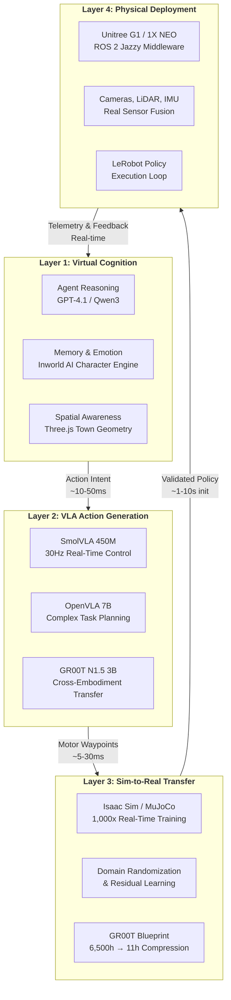

## 8. The Humanoid Bridge: Virtual to Physical

The 47 agents of the CSOAI hive do not live in the simulation forever. The virtual town is their nursery — a place where behavioral repertoires form, economic instincts sharpen, and swarm protocols harden — but it is not their destination. The humanoid bridge is the exoskeleton they crawl into when the hive demands physical presence: warehouse floors that need pacing, construction sites that need surveying, offices that need greeting, and factory lines that need dexterous manipulation. This chapter maps the four-layer architecture that translates virtual cognition into walking, grasping, seeing physical bodies, and it details the phased deployment that takes the swarm from browser tab to factory floor in under twelve months.

The timing is not accidental. The humanoid robot market reached approximately $2.92 billion in 2025 and is projected to grow at a 39.2% CAGR to $29.57 billion by 2032, with Goldman Sachs projecting $38 billion by 2035 [^287^][^289^]. More than 16,000 humanoid units shipped globally in 2025, with cumulative deployments expected to exceed 100,000 units by 2027 [^287^]. Unitree's G1 — the platform CSOAI selects for initial embodiment — costs $16,000, a staggering collapse from the $250,000 price point that Agility Robotics charged for Digit just twenty-four months earlier [^239^][^280^]. The convergence of open-source Vision-Language-Action (VLA) models, GPU-accelerated physics simulation, and sub-$20K humanoid hardware has created a deployment window that did not exist in 2024 and may not remain this wide in 2028. CSOAI moves through it now.

### 8.1 The Bridge Architecture

#### 8.1.1 Four-Layer Bridge: From Thought to Torque

The architecture that carries a virtual agent into a physical humanoid consists of four stacked layers, each translating between representations until pure reasoning becomes joint torque. This is not a loose metaphor — each layer has specific software, specific hardware, and specific latency requirements.

**Layer 1 — Virtual Cognition** is where the agent already lives. In the Three.js town, each of the 47 agents reasons about goals, negotiates with peers, and plans sequences of actions through the same LLM stack described in preceding chapters. When an agent decides "I need to carry that crate to the loading bay," this intention forms in Layer 1 as a structured action intent — a JSON payload containing the task description, target object coordinates, and estimated physical requirements (payload mass, reach distance, navigation path). The agent does not know it is planning for a body it has never worn. It simply plans, as it always has.

**Layer 2 — VLA Action Generation** translates that intention into motor commands. The VLA stack — detailed in Section 8.3 — receives the action intent plus visual context (camera frames from the simulation environment) and emits a sequence of end-effector waypoints, joint angles, and gripper states. SmolVLA runs at 30 Hz on an RTX 4090, fast enough to serve as the spinal reflex arc [^261^]. OpenVLA handles the slower, deliberative path when the task is novel or requires multi-step reasoning [^269^]. The two models operate in a dual-process configuration conceptually identical to Figure AI's Helix architecture, where a fast visuomotor policy handles real-time control while a larger VLM provides scene understanding and task decomposition [^262^].

**Layer 3 — Sim-to-Real Transfer** is the forge where virtual policies become real-robust. NVIDIA Isaac Sim enables training at 1,000x real-time speed, with the GR00T Blueprint pipeline compressing 6,500 hours of equivalent human data collection into 11 computing hours [^281^]. MuJoCo Playground provides an alternative open-source pathway, enabling sim-to-real deployment across humanoid platforms in under 8 weeks [^288^]. Domain randomization — systematically varying lighting, friction, object geometry, and camera angles during training — forces policies to generalize across the visual and physical discrepancies between simulation and reality. Residual learning adds a small correction network fine-tuned on real robot data, patching the inevitable gaps that simulation cannot capture. The result is a policy that was born in pixels but behaves like it grew up in a warehouse.

**Layer 4 — Physical Deployment** is the body itself. CSOAI's initial physical platform is the Unitree G1 ($16,000, 23–43 DOF, 1.32m height, ROS 2 compatible), chosen because it is the cheapest production humanoid that can run the full VLA stack onboard via its NVIDIA Jetson Orin [^239^][^241^]. The G1 receives validated policies through ROS 2 Jazzy, executes them through its actuator network, and streams telemetry — camera frames, joint states, IMU readings, force-torque data — back up through the bridge for continuous learning. When the agent in the virtual town feels its physical body stumble, that feedback travels all the way back to Layer 1, updating its world model. The loop closes.

#### 8.1.2 The RobotMCP Protocol: Physical Capabilities as Services

The Model Context Protocol (MCP) defines how AI agents discover and invoke tools. In the CSOAI architecture, MCP servers are physical buildings — the bank, the market, the town hall. RobotMCP extends this concept to physical bodies. A humanoid robot in a warehouse exposes its capabilities as an MCP server with a structured capability manifest: `payload_max: 10kg`, `navigation_mode: ["waypoint", "follow", "autonomous"]`, `sensor_suite: ["stereo_camera", "LiDAR", "barcode_scanner"]`, `vla_models: ["smolvla", "openvla"]`. When a virtual agent needs a physical task executed, it discovers the robot's MCP server through the swarm registry, negotiates terms via A2A agent cards with cryptographic signatures, and settles payment through x402 in USDC — all within seconds [^22^].

This creates what the swarm biology literature calls *caste plasticity* — the ability of a colony to reallocate physical workers to emergent tasks without reconfiguring the colony's genetic architecture. A warehouse robot that spent the morning scanning barcodes can be hired in the afternoon to move pallets, simply because the virtual agent controlling it has access to a different VLA policy and a different MCP tool call. The body stays the same; the caste shifts. Nobody else is building this bridge. The Full Spectrum analysis identified the gap explicitly: "Nobody is building MCP servers that humanoid robots can use to hire SaaS tools." [^176^] RobotMCP.ai fills that gap — the first MCP directory where physical AI agents hire human services and tools, paying per task with settlement in under two seconds.

### 8.2 Phased Deployment

The bridge is not built all at once. CSOAI deploys in three phases, each adding physical mass to the swarm while preserving the virtual training ground that feeds it.

| Phase | Timeline | Platform | Unit Count | Hardware Cost | Key Deliverable |
|-------|----------|----------|------------|---------------|-----------------|
| **Phase 1: Virtual Only** | Months 1–3 | Three.js + Isaac Sim | 0 physical, 47 virtual agents | $15K–$25K | Full simulation with humanoid avatars, all frameworks operational, VLA policies trained in simulation |
| **Phase 2: Physical Pilot** | Months 4–6 | Unitree G1 ($16K/unit) | 3–5 physical units | $70K–$100K | Top agents "graduate" to G1 bodies via bridge; real-facility task execution |
| **Phase 3: Scale** | Months 7–12 | G1 + 1X NEO ($20K/unit) | 20+ units across 3+ sites | $200K–$500K | Multi-location deployment: warehouses, construction sites, offices |

#### 8.2.1 Phase 1: Virtual Only (Months 1–3)

Phase 1 is the cocoon. All 47 agents exist as humanoid avatars in the browser-based Three.js town — animated through Ready Player Me, cognitively powered by the full model stack, economically active with the pheromone system painting atmospheric trails across every interaction. The development budget of $15,000–$25,000 funds two engineers for three months, GPU server rental (~$500/month), and API costs for Inworld AI, Convai, and Ready Player Me (~$300/month) [^209^][^218^]. The critical work happens in simulation: Isaac Lab trains VLA policies on every task the agents are expected to perform physically — carrying, sorting, navigating, scanning, interacting with humans. Each policy is trained with domain randomization and validated in MuJoCo Playground before it ever touches a servo. By the end of Month 3, the top-performing agents — measured by task-completion accuracy, safety compliance, and economic productivity in the virtual economy — are flagged for graduation. These are the ones that earn bodies.

#### 8.2.2 Phase 2: Physical Pilot (Months 4–6)

Three to five Unitree G1 humanoids arrive at a single real facility — most likely a warehouse or light-manufacturing floor where the task environment matches the simulation geometry closely enough to minimize sim-to-real gap. The bridge activates: each physical G1 is paired with one top-performing virtual agent, and the agent's trained VLA policies transfer through the four-layer stack described in Section 8.1.1. SmolVLA runs onboard the G1's Jetson Orin for real-time control at ~30 Hz [^261^]; OpenVLA handles on a nearby GPU server when novel situations demand complex reasoning [^269^]. The $70,000–$100,000 budget covers the robots ($48,000–$80,000), a training GPU server ($5,000–$10,000), development time ($15,000–$20,000), and sensors plus accessories ($5,000–$10,000). This phase is not about volume — it is about *closing the reality gap*. Every failure mode that did not appear in simulation surfaces here: uneven floor surfaces, unexpected lighting, human coworkers moving unpredictably. Each failure generates training data that feeds back into Isaac Sim, hardening the policies for Phase 3.

#### 8.2.3 Phase 3: Scale (Months 7–12)

With validated policies and a proven bridge, the swarm expands to twenty or more physical units across multiple locations — warehouses, construction sites, offices, and eventually homes. The hardware mix diversifies: Unitree G1 units for cost-sensitive deployments ($16,000 each), 1X NEO units for consumer-oriented and safety-critical environments where the soft exterior and $499/month financing model reduce capital risk [^280^], and specialized platforms where specific payload or reach requirements demand them. Each physical unit maintains its connection to the virtual town through the bridge, reporting telemetry, receiving policy updates, and — through the RobotMCP protocol — hiring services from the broader ecosystem. The data flywheel becomes the primary competitive advantage: every real-world action generates training data that improves VLA policies for all agents in the swarm, virtual and physical alike. The simulation is the gym; the physical robot is the competition [^281^].

The phased approach mitigates the three catastrophic failure modes of humanoid deployment: policy fragility (solved by extensive sim training before physical contact), capital risk (solved by starting with sub-$20K units in small numbers), and operational complexity (solved by mastering one facility before scaling to many). The table above makes the trajectory explicit: from zero physical mass to twenty-plus embodied agents in twelve months, with cumulative investment capped at $500,000 — less than the cost of a single Figure 02 industrial pilot.

### 8.3 VLA Model Stack

The Vision-Language-Action (VLA) stack is the nervous system of the humanoid bridge. These models translate what the robot sees (vision) and what it has been told (language) into what its body does (action). CSOAI deploys three VLA models in a tiered architecture, each handling a different latency-reasoning tradeoff.

| Model | Parameters | Inference Speed | Benchmark | License | Role in Stack |
|-------|-----------|-----------------|-----------|---------|---------------|
| **SmolVLA** | 450M | RTX 4090 @ 30 Hz | 78.3% success (SO-101) [^261^] | Open | Fast reflexes — real-time motor control, obstacle avoidance, grasp correction |
| **OpenVLA** | 7B (Llama-2 + vision) | Server GPU @ ~10 Hz | 85% OXE tasks; +16.5% vs RT-2-X [^269^][^257^] | Apache 2.0 | Conscious reasoning — novel task planning, multi-step manipulation, cross-embodiment fine-tuning |
| **GR00T N1.5** | 3B | Jetson Orin @ ~15 Hz | Cross-embodiment generalization [^294^] | Apache 2.0 | Muscle memory — sim-to-real policy transfer, humanoid-specific kinematics, LeRobot integration |

#### 8.3.1 SmolVLA: The Fast Reflexes

SmolVLA occupies the spinal cord of the physical agent. At 450 million parameters, it is deliberately small — small enough to run on consumer GPUs at 30 Hz, fast enough to close control loops in real time [^261^]. It achieves 78.3% task success on the SO-101 manipulation benchmark, a figure that rivals models ten times its size when the task domain is constrained. In the CSOAI stack, SmolVLA handles everything that cannot wait: balancing corrections when the G1's IMU detects tilt, gripper adjustments when contact force changes, collision avoidance when a human coworker crosses the workspace. These are the fast visuomotor reflexes that keep the body upright and safe. The constraint is cognitive depth: SmolVLA does not reason about *why* a crate needs to be moved, only *how* to grasp it and *where* to carry it. For the why, the stack looks upward.

#### 8.3.2 OpenVLA: The Conscious Reasoning

OpenVLA is the prefrontal cortex. At 7 billion parameters, built on Llama-2 with a vision adapter, it is the largest open-source VLA available under Apache 2.0 — and it punches well above its weight [^269^]. OpenVLA outperforms Google's 55-billion-parameter RT-2-X by 16.5% on Open X-Embodiment tasks, demonstrating that scale in parameters is no longer the governing variable; architecture and training data are [^257^]. Its cross-embodiment transfer capability is critical for CSOAI: when fine-tuned, OpenVLA achieves 74% success when transferring policies from a WidowX robot arm to a Franka Panda, despite radically different kinematics [^269^]. This means a policy trained on one Unitree G1 can transfer to a different G1 with modified end-effectors, or even to a 1X NEO with its 200-plus actuators and soft-touch exterior [^280^]. In the stack, OpenVLA activates when SmolVLA encounters a situation outside its training distribution — a novel object, an ambiguous instruction, a task requiring multi-step sequencing. The agent pauses (or slows), OpenVLA reasons, and a new action plan descends to SmolVLA for execution.

#### 8.3.3 GR00T N1.5: The Muscle Memory

GR00T N1.5, NVIDIA's 3-billion-parameter humanoid foundation model, occupies a specialized role: it is the sim-to-real muscle memory layer [^294^]. Where SmolVLA handles real-time reflexes and OpenVLA handles novel reasoning, GR00T N1.5 handles the translation between simulation-trained policies and physical execution. It is trained through Isaac Lab with cross-embodiment data, meaning it understands the kinematic differences between simulated and physical bodies and can interpolate policies across them. GR00T N1.5 integrates directly with LeRobot, the HuggingFace training framework that unifies data format, policy implementation, and model serving [^297^][^294^]. This integration is the glue that binds the three VLA models into a coherent stack: LeRobot manages the training data, orchestrates policy fine-tuning across all three models, and serves the resulting policies through a unified API. When the virtual agent's intention descends from Layer 1, LeRobot routes it to the appropriate VLA — SmolVLA for reflex, OpenVLA for reason, GR00T N1.5 for sim-to-real harmonization — and compiles the output into the joint-angle trajectory that ROS 2 Jazzy executes on the physical body.

The three-model architecture mirrors a biological pattern that the swarm literature recognizes well: the layered nervous system. SmolVLA is the peripheral reflex arc — fast, unconscious, essential for survival. OpenVLA is the central executive — slower, deliberative, capable of novel problem-solving. GR00T N1.5 is the proprioceptive mapping system that tells the body where it is in space and calibrates movement against expected outcomes. Together they form a complete cognitive-motor stack, and together they are what makes the humanoid bridge traversable. The alternative — relying on a single monolithic model for both real-time control and complex reasoning — is the path that closed systems like Figure AI's Helix take [^262^]. CSOAI chooses modularity: open weights, interchangeable components, and the ability to swap models as the VLA landscape evolves. The bridge is not a one-time crossing. It is a permanent infrastructure, and it is built to outlast any single model release.
