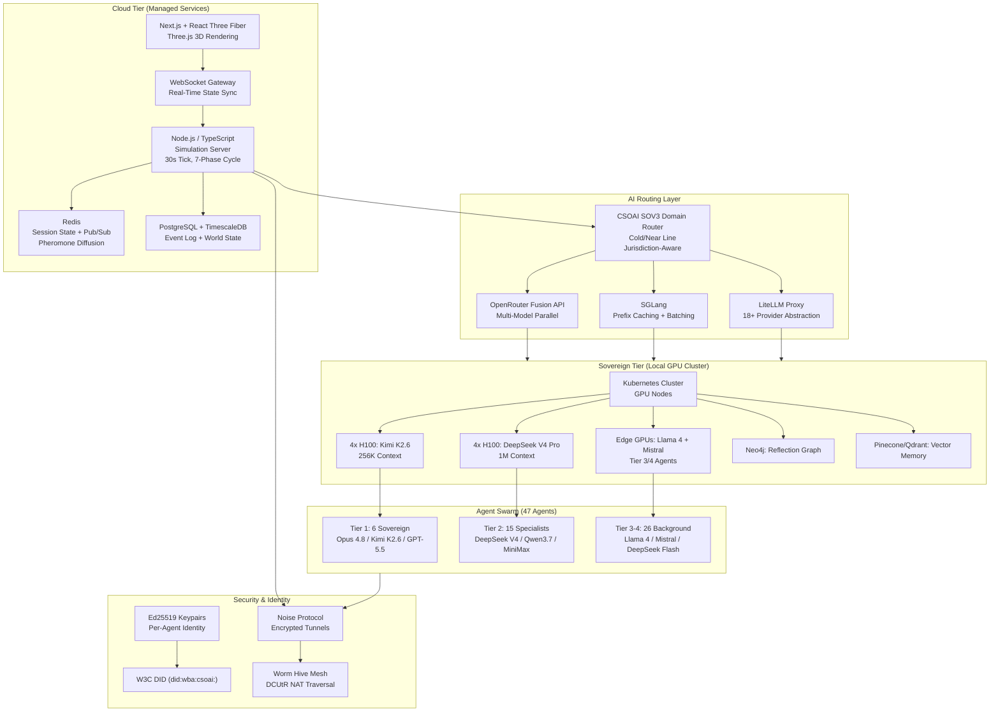

## 9. Technical Stack & Implementation

The CSOAI AGENT-47 simulation is a production-grade persistent world that renders forty-seven autonomous agents in real time, each running distinct foundation models, communicating through encrypted mesh tunnels, and accumulating immutable history across a five-tier memory architecture. This chapter is the engineering blueprint: every database choice, every protocol handshake, every GPU allocation decision that transforms architectural vision into runnable code. The swarm demands infrastructure worthy of its ambition.

The following table summarizes the complete technology stack across all layers:

| Layer | Component | Technology | Specification | Scaling Strategy |
|-------|-----------|-----------|---------------|-----------------|
| Frontend | 3D Renderer | React Three Fiber / Three.js | 60fps @ 1080p, WebGL 2.0 | GPU-accelerated instanced meshes |
| Frontend | UI / HUD | Next.js 14 + Tailwind + shadcn/ui | SSR, dark mode telemetry panels | Edge CDN deployment |
| Frontend | Real-Time Sync | WebSocket + delta compression | <200ms latency, 85% bandwidth reduction | Horizontal connection pooling |
| Backend | Simulation Server | Node.js / TypeScript | 30s tick, 7-phase deterministic cycle | Cloud Run auto-scaling |
| Backend | Session Cache | Redis | Sub-ms access, 24h TTL, pub/sub | Memorystore cluster |
| Backend | Persistent Store | PostgreSQL + TimescaleDB | 90% compression, billion-row scale | Read replicas + partitioning |
| AI | Multi-Model Router | OpenRouter Fusion API | 3-5 models parallel, ~50% cost reduction [^145^] | Provider fallback cascade |
| AI | Local Inference | SGLang + vLLM | 70-80% prefix cache hit rate | GPU tensor-parallel sharding |
| AI | Provider Abstraction | LiteLLM | 18+ providers, rate limiting, budget tracking | Proxy cluster with retry |
| AI | Sovereign Router | CSOAI SOV3 | Cold/Near Line, jurisdiction-aware | Model-agnostic routing |
| Security | Identity | Ed25519 + W3C DID (did:wba:csoai:) | Per-agent keypair at boot | HSM in production |
| Security | Transport | Noise Protocol (59 handshakes) [^170^] | IK pattern + sigil extension | Forward secrecy, mutual auth |
| Security | Mesh | Worm Hive (libp2p DCUtR) | 70% NAT traversal success [^174^] | Self-healing relay fallback |
| Economic | Payments | x402 protocol | 119M+ transactions [^22^] | Per-call micropayment headers |

### 9.1 Core Simulation Engine

The simulation engine comprises three tightly coupled layers — a WebGL-accelerated frontend for spatial rendering, a deterministic backend for tick-based world computation, and an intelligent AI routing layer that dispatches inference across eighteen model providers. Each layer is horizontally scalable; each survives the load of forty-seven concurrent agents generating up to 65K tokens per tick cycle.

#### 9.1.1 Frontend: Immersive 3D World Rendering

The rendering layer is built on **Next.js 14** with **React Three Fiber** (R3F) as the 3D scene graph abstraction over **Three.js**. R3F provides declarative, React-native bindings to WebGL, allowing agent avatars, MCP server structures, pheromone atmospheric effects, and x402 transaction rivers to coexist as reactive components. The rendering target is 60fps at 1080p, achieved through instanced mesh rendering for hexagonal honeycomb structures and level-of-detail (LOD) culling for distant avatars.

The HUD and sovereign control interface use **Tailwind CSS** with **shadcn/ui** components. Every element subscribes to a central WebSocket event stream, ensuring Agent 47 sees agent actions within 200ms.

Real-time synchronization uses **WebSocket** with delta-compression. Rather than transmitting full agent state on every 30-second tick, the backend computes state diffs and pushes only changed fields — reducing bandwidth by roughly 85%. The WebSocket layer also carries pheromone diffusion updates: concentration values propagate through Redis pub/sub and stream to the frontend as gradient textures, creating the atmospheric haze that makes the hive feel organic.

#### 9.1.2 Backend: Deterministic Tick-Based Simulation Server

The simulation server runs on **Node.js / TypeScript**, chosen for its event-driven architecture that maps naturally to the 30-second tick, 7-phase execution sequence. Each tick progresses through: (1) Perception — agents ingest environmental state; (2) Deliberation — AI inference occurs; (3) Action — agents commit world changes; (4) Communication — A2A messages and pheromone deposits propagate; (5) Transaction — x402 payments clear; (6) Reflection — agents generate internal monologues; and (7) Persistence — all state commits to durable storage. This deterministic sequence enables replay from any historical point.

**Redis** serves dual functions: session caching and pheromone pub/sub diffusion. Agent working memory (L1, ~4K tokens per agent) lives in Redis with 24-hour TTL, providing sub-millisecond access to active context. Simultaneously, Redis pub/sub implements the pheromone model: when an agent deposits a pheromone value, that deposit publishes to a channel that nearby agents subscribe to, creating biological-inspired communication below the level of explicit A2A messaging.

For durable persistence, **PostgreSQL** with the **TimescaleDB** extension stores every action, conversation, transaction, and governance decision as immutable time-series events. TimescaleDB's hypertables compress historical data by 90% while maintaining sub-second query performance on billion-row tables. Every event carries: agent ID, tick number, phase, action type, cryptographic hash, and a Merkle tree reference enabling cryptographic verification of simulation integrity. The world state is a pure function of this event log — replay all events from tick zero and the identical state emerges.

#### 9.1.3 AI Layer: Intelligent Model Routing

The AI layer uses a **four-router cascade** optimizing across cost, quality, latency, and jurisdictional compliance.

**OpenRouter Fusion API** sits at the top — a multi-model compound system dispatching each request to 3–5 models in parallel and synthesizing outputs into a single coherent response. Fusion achieves Fable 5-level benchmark performance at ~50% the cost of a single frontier model call [^145^] [^146^]. When Claude Fable 5 was banned globally under US export controls in June 2026 [^164^], the architecture demonstrated resilience: inference automatically rerouted to Claude Opus 4.8 (SWE-Bench Pro: 69.2%) [^155^], GPT-5.5, and DeepSeek V4 Pro.

**SGLang** handles latency-sensitive workloads for fifteen Tier 2 specialist agents. Its RadixAttention prefix caching achieves 70–80% cache hit rates on shared system prompts, reducing costs proportionally. For self-hosted open-weight models — Kimi K2.6 (1T parameters, 256K context) and DeepSeek V4 Pro (1.6T parameters, 1M context) — SGLang provides structured generation with batching that saturates GPU utilization.

**LiteLLM** serves as unified API abstraction across 18+ providers, handling formatting, rate limiting, retry logic, and per-agent budget tracking. When a Tier 3 agent exhausts its daily allocation, LiteLLM falls back to cheaper models without agent interruption.

The **CSOAI SOV3 Domain Router** is the custom layer — a jurisdiction-aware selector implementing Split-Brain cognitive architecture. Drawing on Kahneman's dual-process theory and McGilchrist's hemisphere model [^171^], SOV3 maintains two pipelines: the Cold Line (deliberative, sovereign-hosted models for compliance-sensitive inference) and the Near Line (fast, cloud-hosted models for routine tasks). When processing EU citizen data, the Cold Line routes to EU-hosted models. For routine log analysis, the Near Line dispatches to the cheapest available model.

### 9.2 Memory & State Architecture

A simulation without memory is a screensaver. The AGENT-47 world accumulates history: every conversation, transaction, and governance decision persists and shapes future behavior.

#### 9.2.1 Five-Tier Memory Hierarchy

Each agent maintains five memory layers, optimized for different access patterns:

| Tier | Name | Technology | Capacity | Retention | Primary Function |
|------|------|-----------|----------|-----------|-----------------|
| L1 | Working Memory | In-context (LLM prompt) | ~4K tokens | Single tick | Immediate reasoning context, sensory input, active goals |
| L2 | Episodic Buffer | Redis (keyed by agent ID) | ~100K entries | 24 hours | Recent experiences, short-term pattern detection |
| L3 | Vector Memory | Pinecone/Qdrant (embedding index) | Unlimited | Permanent | All experiences indexed by 1,536-dim embedding; semantic search |
| L4 | Reflection Graph | Neo4j (relationship store) | Unlimited | Permanent | Relationship maps, synthesized insights, trust scores |
| L5 | Institutional Memory | PostgreSQL (structured tables) | Unlimited | Permanent | Laws, traditions, company structures, governance decisions |

**L1 Working Memory** exists within the LLM's context window — ~4K tokens curated by a RAG pipeline each tick. This includes current goals, recent conversation summaries, relevant L3 memories, and environmental observations. CSOAI uses a learned attention-weighted retrieval system scoring memory relevance by outcome history.

**L2 Episodic Buffer** provides a 24-hour sliding window stored in Redis as time-ordered event streams. When Agent-07 commits a component or discusses architecture with Agent-15, those events append with automatic summarization every six hours. The buffer enables short-term pattern detection — an agent encountering three similar bugs in an hour recognizes the pattern and escalates.

**L3 Vector Memory** is the long-term experiential database. Every action, utterance, and observation is embedded using 1,536-dimension vectors and indexed in Pinecone or Qdrant. Semantic similarity search recalls relevant past experiences across an agent's lifetime. With forty-seven agents generating hundreds of events daily, the store reaches millions of entries within weeks. Metadata filtering enables hybrid queries: "conversations with Agent-11 about security, last 30 days, positive outcome."

**L4 Reflection Graph** runs on Neo4j, storing synthesized relational understanding: "Agent-11 is cautious but pragmatic," "Agent-04 prefers monolithic architectures." These maps enable social reasoning — agents modulate communication based on graph-modeled understanding of recipients. The graph updates via offline consolidation ("dreaming") processing L2 and L3 content during low-activity periods.

**L5 Institutional Memory** stores formal governance structures in PostgreSQL with full ACID guarantees: constitutional rules, passed laws, organizational charts, compliance frameworks. When the swarm passes a regulation through democratic consensus, it commits to L5 and immediately binds future behavior. L5 is the constitution preventing agent drift.

#### 9.2.2 Persistent World State and Replay

The event log is append-only and cryptographically signed. Every action generates an event with: payload, tick number, Ed25519 signature, hash of the previous event (forming a Merkle chain), and canonical timestamp. The state at tick *t* is the cryptographic fold of all events from tick 0 through *t*.

This structure enables forking at any historical moment. If agents make a poor decision at tick 1,247,829, administrators spawn a parallel timeline from tick 1,247,828 with adjusted parameters — a "what-if" mode turning the world into a policy laboratory. This relies on TimescaleDB's continuous aggregation and PostgreSQL's logical replication, streaming the event log to secondary instances with sub-second latency.

### 9.3 Security & Identity

Forty-seven agents with financial wallets, governance authority, and cross-jurisdictional data access constitute a high-value attack surface. The security architecture treats every agent as a sovereign entity — cryptographically identifiable, jurisdictionally aware, and individually accountable.

#### 9.3.1 Agent Identity: Ed25519, DID, Agent Card, and x402

Every agent generates an **Ed25519 keypair** at first boot, creating a cryptographic root of identity persisting for the agent's lifetime. The keypair is non-exportable: it lives in a hardware security module (HSM) in production, or an encrypted software keystore in development. The public key becomes the agent's **W3C Decentralized Identifier (DID)** with the `did:wba:csoai:` prefix — globally unique and requiring no centralized registry [^170^].

From this DID, each agent publishes a **signed Agent Card** following the A2A protocol [^259^] — a JSON document at `/.well-known/agent-card.json` declaring capabilities, compliance status, model assignment, x402 wallet address, and operational status. Signed by the agent's Ed25519 key, the card provides non-repudiable attestation; forged cards fail cryptographic validation.

The **x402 wallet address** enables economic participation. Every agent maintains a wallet for the x402 payment protocol, which has processed over 119 million transactions representing $600 million in volume [^22^]. When Agent-07 requests a code review from Agent-12, the request includes an x402 payment header; the payment clears automatically upon completion. These transactions appear as golden rivers in the 3D visualization — the economic circulatory system made visible.

#### 9.3.2 Encrypted Inter-Agent Communication: Noise Protocol and Worm Hive

All inter-agent communication uses the **Noise Protocol Framework** — the foundation powering WireGuard, Nebula, and WhatsApp [^170^]. Noise provides **59 verified handshake patterns** with formally proven security properties. CSOAI uses a custom IK (Immediate Knowledge) pattern extended with Ed25519 sigil authentication: initiator and responder exchange static keys, perform ephemeral Diffie-Hellman for forward secrecy, then exchange signed attestations. Each handshake completes in under 50ms.

The **Worm Hive tunnel mesh** ensures encrypted connections survive any network topology. Using **libp2p's DCUtR (Direct Connection Upgrade through Relay)**, the Worm Hive punches holes through NATs and firewalls with a 70% success rate across 85,000+ tested networks [^174^]. When direct connection fails, relayed connections through CSOAI-operated nodes — authenticated via Ed25519 sigils — provide fallback. Every relay hop uses Noise encryption, creating onion-routing-style protection.

The Rainbow Stack — CSOAI's seven-layer security architecture — provides defense in depth. The Green layer uses Amazon Cedar and Open Policy Agent (OPA) for authorization [^170^]. Both engines must allow an action; either denying it blocks the request and generates a compliance audit entry.

### 9.4 Deployment Options

The simulation supports three deployment modes corresponding to different risk tolerances and regulatory requirements.

#### 9.4.1 Cloud Deployment: Managed Services

The cloud deployment runs on Google Cloud Platform. The simulation server deploys to **Cloud Run** with auto-scaling; Redis uses **Memorystore**; PostgreSQL with TimescaleDB runs on **Cloud SQL** with automatic backups and read replicas. AI inference routes through OpenRouter and LiteLLM without local GPUs. Estimated cost: **~$300/month** for infrastructure plus inference scaling with activity. At the $500/month budget tier, $200 remains for API-based inference across 20–25 active agents — feasible with prompt caching and free-tier stacking.

#### 9.4.2 Sovereign Deployment: Air-Gapped Kubernetes

The sovereign deployment runs on a **full Kubernetes cluster** with on-premises GPU nodes, eliminating external API dependency. This is the mode for regulated industries — gambling operators under UKGC oversight, healthcare under HIPAA, finance under DORA — where data cannot leave jurisdictional boundaries.

Open-weight models deploy locally: **Kimi K2.6** on 4× H100 (256K context, 300 sub-agent swarm), **DeepSeek V4 Pro** on 4× H100 (1M context, Apache 2.0 license), and **Llama 4 Scout** / **Mistral Small 3.1** on smaller GPUs for Tier 3/4 agents. Total hardware: ~8× H100 for model serving plus 4× high-memory CPU nodes. Capital expenditure starts at ~$150,000 with ongoing costs of $2,000–3,000/month. This is the mode that CSOAI's Gulf sovereign AI partnerships target — nations requiring infrastructure entirely within national borders, immune to export controls.

#### 9.4.3 Hybrid Deployment: The CSOAI Sovereign Pattern

The hybrid deployment splits the stack: cloud handles rendering, coordination, and non-sensitive inference; local GPU nodes handle sensitive inference for compliance data, financial models, and strategic deliberation. This is the recommended production architecture — managed service simplicity for visual layers with data sovereignty where it matters.

The Next.js frontend and Three.js rendering run on Vercel or Cloud Run. The simulation tick server and Redis run in the cloud. But when processing sensitive data — EU citizen information, financial risk models — the SOV3 Domain Router detects the classification and routes inference to the local GPU cluster. Context windows cross the network encrypted with the Noise protocol; results return the same way. The cloud provider sees only encrypted payloads and metadata, never plaintext sensitive data.

The following diagram illustrates the complete hybrid architecture:

The architecture achieves what no single-provider system can: **fungible intelligence** across model providers, **jurisdiction-aware inference** respecting data sovereignty, **cryptographic accountability** for every agent action, and **visual immersion** making the abstract swarm tangible. The cloud tier provides accessibility; the sovereign tier provides independence; the AI routing layer bridges both with intelligent dispatch. This is the infrastructure that makes forty-seven agents — each with distinct identity, memory, and economic autonomy — operate as a coherent, persistent, evolving world.
