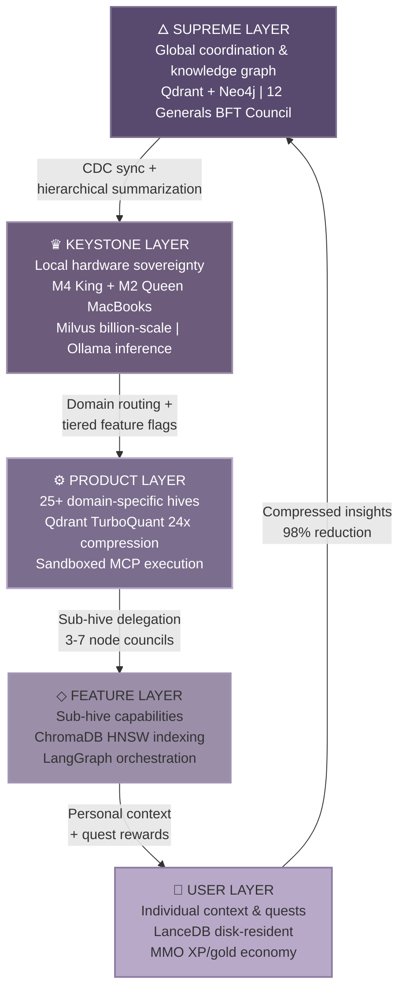

# 1. Executive Summary & Sovereign Vision

Every enterprise AI deployment is a trust negotiation the vendor is designed to win. The user hands over proprietary data, business logic, and decision authority to a system they cannot inspect, running on hardware they do not control, governed by terms they cannot change. When that system fails — through model hallucination, supply-chain poisoning, or a silent policy update — the user bears the cost while the vendor captures the value. This asymmetry is not a bug in the current AI market. It is the business model.

MEOK (Many Eyes, One King) inverts that model. It is a sovereign AI operating system — a complete stack from local keystone hardware through a Byzantine Fault Tolerance (BFT) governance council to 25+ specialized product domains — designed so that the user, not the vendor, retains cryptographic control over every inference, every tool call, and every byte of training data. Nick Templeman, a marketing-technology builder with fifteen years of cross-industry data lineage spanning construction, aquaculture, logistics, and twenty-two additional verticals, anchors MEOK's trust model in a track record no foundation-model API key can replicate.

This chapter frames the sovereign AI imperative, introduces MEOK's fractal architecture and four strategic pillars, and presents the Trust Triangle — a three-signal compliance framework that no competing AI infrastructure platform has assembled.

---

## 1.1 The Sovereign AI Imperative

### 1.1.1 The Privacy and Security Crisis in Production AI

The multi-agent systems (MAS) deployed across enterprises in 2025–2026 are failing in ways that single LLMs do not. An LLM hallucinates; an autonomous agent with tool access *executes*. Research at AAAI 2026 shows tool-poisoning attacks achieving 60–72% Attack Success Rate against state-of-the-art agents including o1-mini [^62^]. Thirty-six point seven percent of public MCP servers expose SSRF vulnerabilities tunneling from isolated agents to internal networks [^399^]. Nine of eleven MCP registries accepted malicious packages without verification [^296^]. The MCP ecosystem exceeds 22,775 public servers and 97 million monthly SDK downloads — growth that has outpaced its security infrastructure [^251^][^255^]. Ten CVEs were disclosed in 2025–2026, including critical remote-code-execution vectors [^251^]. These vulnerabilities map to a governance vacuum: ninety-four percent of enterprise AI deployments lack cryptographic consensus among agent decision-makers, meaning a single compromised agent can redirect an entire workflow without quorum, audit trail, or detection.

### 1.1.2 The EU AI Act as Catalyst

The EU AI Act (Regulation EU 2024/1689) transforms that governance vacuum from a security risk into a legal liability. Its three-tier penalty structure reaches EUR 35 million or 7% of global turnover for prohibited practices, EUR 15 million or 3% for high-risk failures, and EUR 7.5 million or 1% for procedural violations [^378^][^372^]. For a EUR 1 billion enterprise, a Tier-1 violation costs EUR 70 million — enough to restructure a compliance budget into a compliance emergency.

The enforcement timeline creates a narrowing first-mover window. Article 50 transparency obligations take effect August 2, 2026 [^228^]. Annex III high-risk obligations, deferred by the May 2026 Digital Omnibus, land December 2, 2027 [^227^]. Zero of twelve prominent LLMs tested against the COMPL-AI benchmark fully comply with EU AI Act requirements [^43^]. Open-source licensing provides no exemption: high-risk systems must comply regardless of license [^396^][^399^]. The gap is structural — and it is the market opening MEOK is built to occupy.

### 1.1.3 The Builder as Trust Anchor

Technical architecture alone does not create trust. Nick Templeman's fifteen-year marketing-technology lineage — spanning 25 domains with real-world operational data from construction sites, aquaculture facilities, logistics networks, and consumer platforms — provides the behavioral substrate that MEOK's sovereign world model learns from. This dataset is not downloadable, not scrapable, and represents fifteen years of proprietary decision patterns that no foundation model trained on public text can replicate [^171^]. In a market where every vendor claims "AI for X," the differentiation is the data the model learns from, and the governance that protects it. Nick's cross-domain lineage makes MEOK's OOWM the only model that understands these verticals at depth — a knowledge flywheel that compounds with every new SME user [^501^].

---

## 1.2 MEOK at a Glance

### 1.2.1 Five-Layer Fractal Architecture

MEOK organizes itself as a self-similar fractal: the same governance, memory, and execution pattern repeats at every scale across five nested layers.

The **Supreme Layer** hosts the 12 Generals BFT Council — twelve specialized AI agents voting on every major decision via weighted Byzantine consensus with BLS12-381 threshold signatures, aggregating seven shares in ~7.7 ms at 0.81 ms per signer [^301^]. The **Keystone Layer** anchors sovereignty to physical hardware: an M4 "King" and M2 "Queen" MacBook running Ollama with local inference, providing automatic A/B failover without cloud dependency [^292^][^301^]. The **Product Layer** distributes across 25+ domain-specific hives — grabhire.ai, fishkeeper.ai, and others — each with sub-hives for UX, tool, content, and feature governance [^470^]. The **Feature Layer** manages sub-hive capabilities via LangGraph subgraphs with independent checkpointing [^490^][^507^]. The **User Layer** embeds individual context in LanceDB and wraps the experience in an MMO shell where every action is a quest and every premium capability costs credits [^21^][^528^].

### 1.2.2 Four Strategic Pillars

| Pillar | What It Is | The Gap It Fills | Key Metric |
|--------|-----------|------------------|------------|
| **MMO UX** | Gamified OS shell with RPG quest cards, XP/gold rewards, Framer Motion animations | AI tools suffer sub-5% DAU retention because UX is an afterthought [^4^] | Dopamine loop tied to credit consumption |
| **BFT Council** | 12 Generals weighted HotStuff consensus with slashing, sub-second finality | 94% of enterprise MAS lack cryptographic multi-agent governance [^357^][^356^] | Tolerates f=3 faults at N=12, quorum=7 |
| **MCP Router** | Firecracker-microVM sandboxing + Sigil attestation + BFT notarization | 9/11 MCP registries accepted malicious packages; 36.7% SSRF-vulnerable [^296^][^399^] | 313+ curated MCPs vs. 22,775+ unvetted |
| **Data Moat** | OOWM fine-tuned on 15yr proprietary SME data + Common Corpus CC0 base | Foundation models have zero proprietary domain depth [^483^][^171^] | 25-domain flywheel; 98% compression [^219^] |

The MMO shell is isomorphic to a freemium funnel: easy quests = free onboarding, legendary quests = premium features consuming credits, XP fills toward tier unlocks [^21^]. The BFT Council adapts each General's voting weight by response quality and trustworthiness following CP-WBFT [^357^]. The MCP Router executes every tool call in Firecracker microVMs with ~125 ms cold boot and hardware-enforced isolation [^217^][^271^]. The Data Moat's fractal memory compresses 24–32x per level via Qdrant TurboQuant and Milvus RaBitQ at 94%+ recall [^263^][^279^] — as MEOK scales, storage cost per insight *decreases*, widening the cost gap against competitors.

### 1.2.3 The Numbers at a Glance

MEOK's development surface: **201 requirements** across **25 domains**, governed by **12 BFT Generals**, delivered in **5 phases**, running on **2 MacBooks** as physical keystones, routing through **313+ sandboxed MCPs**. This is not a prototype. It is a declaration that sovereign AI infrastructure can be built with consumer hardware, open-source software, and blockchain-derived governance — applied, for the first time, to keeping AI accountable to the people who use it.

---

## 1.3 The Trust Triangle

MEOK's positioning rests on three trust signals that compound: B Corp certification, EU AI Act compliance, and open-source transparency with CC0 data. Any competitor can pursue one or two; all three require architectural decisions made years in advance.

### 1.3.1 B Corp Certification as Ethics Signal

Less than 1% of B Corps are AI companies [^587^]. B Corp certification is a legally binding commitment to stakeholder governance — not merely shareholders — and public transparency through the B Impact Assessment [^588^]. The BFT Council's compliance engine generates the OSCAL artifacts, HMAC audit chains, and carbon-emission telemetry required for certification audits [^253^][^254^]. In a market where every vendor claims ethics, B Corp status demonstrates the commitment is structurally embedded.

### 1.3.2 EU AI Act Compliance as Regulatory Moat

The BFT Council is a pre-built answer to Article 14's human-oversight requirements. Article 14 mandates that high-risk AI systems enable overseers to monitor operation, override output, and interrupt execution via a kill switch [^428^][^429^]. The 12 Generals' weighted consensus, automatic slashing, and view-change protocol map directly to these requirements. Competitors will retrofit multi-agent oversight onto single-agent architectures; MEOK has it by design.

| Enforcement Date | Obligation | MEOK Readiness | Status |
|-----------------|-----------|----------------|--------|
| August 2, 2026 | Article 50 transparency; Article 4 AI literacy | MMO shell embeds disclosure metadata; quests gamify literacy | On track |
| December 2, 2027 | Annex III high-risk (HR, credit, operations) | BFT Council + AIR Blackbox 51+ checks + MS Toolkit <0.1ms [^90^] | Architecture complete |
| August 2, 2028 | Annex I embedded high-risk | ISO 42001 38 controls mapped; OSCAL pipeline active [^420^][^253^] | Pipeline in build |

The AI agent market is projected to reach $105.6 billion by 2034 at 39.5% CAGR [^504^]. Gartner predicts 67% of enterprise AI will use usage-based pricing by 2027 [^532^]. When the December 2027 cliff arrives, enterprises will need pre-certified systems. MEOK's compliance stack — Venturalitica for OSCAL evidence, Giskard for 40+ red-team probes [^260^], AIR Blackbox for HMAC-SHA256 audit chains [^251^], and the Microsoft Agent Governance Toolkit for sub-millisecond policy enforcement [^90^] — is designed to pass conformity assessment before competitors begin building.

### 1.3.3 Open Source + CC0 Data as Transparency Guarantee

MEOK's training pipeline uses the Common Corpus — over 2 trillion CC0 tokens providing legal immunity from copyright claims [^483^]. The OOWM base, Cosmos 3 Nano (16B), is under OpenMDW-1.1 permitting commercial fine-tuning [^321^]. Every dataset carries Croissant 1.1 metadata for machine-actionable provenance with W3C PROV-O chain-of-custody [^450^][^451^]. MEOK publishes its full training lineage without exposing proprietary business data — transparency where it builds trust, opacity where it protects advantage.

The Trust Triangle answers the question every enterprise AI buyer will ask by 2027: "How do I know this system is ethical, legal, and inspectable?" MEOK's answer is architectural, not aspirational.

---

## 1.4 Reading Guide

This specification spans fifteen chapters. The paths below optimize reading by role.

| Stakeholder | Primary Chapters | Why These |
|-------------|-----------------|-----------|
| **CEO / Board** | 1 (this chapter), 3 (Keystone), 7 (Economics), 14 (Risk) | Sovereign vision, hardware anchor, revenue model, liability exposure |
| **CTO / Architect** | 1, 2 (Fractal Architecture), 4 (Memory), 5 (BFT Council), 6 (MCP Router) | Full technical stack from consensus to sandboxing |
| **Compliance Officer** | 1, 5, 8 (Sigil Security), 9 (Product), 11 (EU AI Act) | Governance, audit trails, evidence pipeline, enforcement timeline |
| **Product Manager** | 1, 10 (MMO UX), 12 (Horus), 13 (Data Moat) | User experience, intelligence layer, proprietary data strategy |
| **Developer** | 1, 6 (MCP), 9 (Product), 15 (API Reference) | Tool integration, hive structure, implementation details |
| **Investor** | 1, 7 (Economics), 12 (Horus), 14 (Risk), 15 (Roadmap) | $105.6B market, moat durability, regulatory tailwinds |

Chapter dependencies flow as follows. Chapter 2 (Fractal Architecture) is the technical foundation — every subsequent technical chapter references its layer definitions. Chapter 5 (BFT Council) depends on Chapter 2's consensus-layer specification but is readable standalone by governance specialists. Chapters 7 (Economics) and 14 (Risk) draw from all preceding chapters and should be read last. Chapters 3 (Keystone Hardware) and 4 (Fractal Memory) are independent and may be read in either order.

The sovereign AI imperative is simple: the organizations that own their AI infrastructure will outperform those that rent it, not because the models are better, but because the governance is theirs. MEOK is the operating system for that transition. The remaining fourteen chapters explain, in specific technical detail, exactly how it works.
