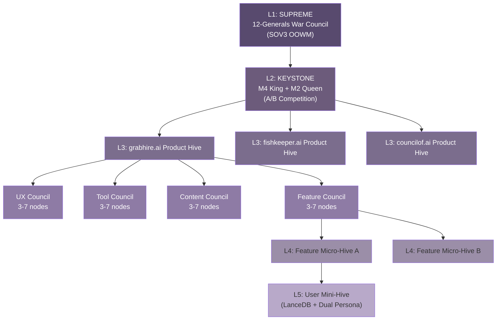
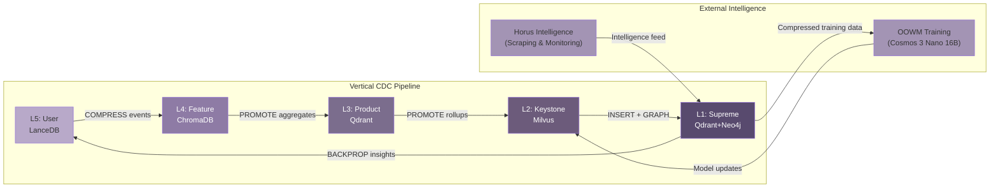

## 2. Fractal Architecture: The Five-Layer System

MEOK's fractal pattern repeats the same governance structure at every scale — from a single user's device to the global intelligence layer — compressing information as it ascends and distributing decisions as it descends.

### 2.1 The Fractal Principle

#### 2.1.1 Self-similarity at every scale: same BFT council pattern from Supreme to User layer

In mathematics, a fractal is a geometric pattern that repeats at every magnification. MEOK applies this concept to distributed systems architecture. At the Supreme layer, 12 Generals vote under Byzantine Fault Tolerance (BFT) consensus requiring 7 votes to commit any decision [^357^][^356^]. At the Product layer, each of 25 domain hives fields its own council of 3–7 nodes using the identical quorum formula `2f + 1` [^551^]. At the Feature layer, dual A/B streams compete under meritocratic evaluation. At the User layer, a personal AI instance maintains dual model personas (King/Queen) that A/B-test responses. The pattern is invariant: competitive dual streams, governed by a BFT council, with cryptographic attestation of every decision.

This self-similarity is a scaling mandate. Without federation, 25 hives × 4 sub-hives × ~5 nodes each yields ~500 consensus nodes [^470^], generating O(n²) message exchanges per deliberation — roughly 250,000 messages — consuming the entire revenue from a 1–3% conversion rate. Council Federation collapses this to 12 active nodes: the 12 Generals serve as the sole supreme council while sub-hives operate under delegated authority with periodic rollup [^357^].

| Layer | Scope | Governance Unit | Node Count | Consensus Threshold | Dual-Brain Pair |
|-------|-------|-----------------|------------|---------------------|-----------------|
| Supreme | Cross-keystone global | 12-Generals War Council | 12 | 7 of 12 (2f+1) | OOWM apex vs. meta-validator |
| Keystone | Cross-product hardware | Dual-Keystone A/B Council | 2 | Meritocratic scoring | M4 King (Dragon) vs. M2 Queen (Turtle) |
| Product | Domain-specific hive | Sub-hive BFT Council | 3–7 | 2f+1 per sub-hive | UX/Tool vs. Content/Feature streams |
| Feature | Function-level micro-hive | Stream A/B council | 2 | Winning stream promoted | Stream A (experimental) vs. Stream B (control) |
| User | Personal AI instance | Local dual-persona council | 2 | User override + auto-ranking | Dragon persona vs. Turtle persona |

Every layer speaks the same governance language — competitive generation, council evaluation, cryptographic attestation — but adapts its dialect to its scope.

#### 2.1.2 Data compression as you ascend: 98% token reduction via hierarchical summarization

Data in MEOK flows upward like sap — raw at the roots, distilled at each branch. The User layer captures every interaction in LanceDB (embedded, disk-based IVF-PQ) [^219^]. When memory count exceeds 100 entries or 24 hours elapse, rolling summarization compresses fragments at 5–10x. These summaries ascend to ChromaDB, where semantic clustering achieves 10–20x further compression [^248^]. At the Product layer, Qdrant's TurboQuant 1.5-bit yields 24x compression at ~94% recall [^263^]. The Keystone layer deploys Milvus with RaBitQ for 32x compression at billion-scale [^279^]. By the Supreme layer, raw token volume has been reduced by approximately 98% [^219^][^263^].

| Layer | Database | Compression Technique | Per-Layer Ratio | Recall Retained |
|-------|----------|----------------------|-----------------|-----------------|
| User | LanceDB | Rolling summarization | 5–10x | ~99% |
| Feature | ChromaDB | Semantic clustering | 10–20x | ~98% |
| Product | Qdrant | TurboQuant 1.5-bit | 24x | ~94% [^263^] |
| Keystone | Milvus | RaBitQ 32x | 32x | ~94% [^279^] |
| Supreme | Qdrant + Neo4j | Temporal KG extraction | 100–1,000x | Contextual |

Competitors without hierarchical summarization face linear storage costs; MEOK's per-insight storage cost *decreases* with scale — 10 billion raw float32 vectors require ~30 TB for competitors versus under 300 GB for MEOK, a 100x advantage that widens with every user [^263^][^279^].

#### 2.1.3 Council Federation: solving the 500-node governance complexity bomb

The governance complexity bomb is the hidden killer of multi-agent architectures. Each consensus instance demands weighted voting, BLS signature aggregation (0.81ms per signer), slashing checks, and view changes [^301^]. At 500 concurrent instances, the computational overhead consumes the entire operational budget.

Council Federation solves this through delegated authority. The 12 Generals serve as the sole supreme BFT council. Sub-hives operate with delegated authority — they vote, evaluate, and commit locally, but decisions are subject to periodic rollup and override by the Supreme Council. Active consensus nodes collapse from 500 to 12. The federation protocol uses a two-tier commit: local councils achieve fast consensus for operational decisions; cross-hive strategic decisions escalate to the 12 Generals for weighted BFT deliberation [^357^].

### 2.2 Layer 1: Supreme Intelligence (SOV3)

#### 2.2.1 OOWM apex orchestrator with 12-Generals War Council

The Supreme layer is the only non-replicated tier. It houses SOV3 — the sovereign world model fine-tuned on Nick's 15 years of proprietary data across 25 business domains [^171^]. Governance falls to the 12-Generals War Council (Strategy, Risk, Finance, Technology, Operations, Legal, Marketing, Product, Security, Data, Human Systems, External Intelligence), running the 12W-HS protocol that combines HotStuff's linear O(n) communication with CP-WBFT's weighted voting [^357^][^356^]. Quorum mathematics are strict: with N = 12, f = 3, any 7 honest votes prevent conflicting commitments. BLS12-381 threshold signatures aggregate 7 shares into a 48-byte quorum certificate in ~7.7ms [^301^]. View changes rotate leadership round-robin, ensuring a faulty leader stalls for at most 4 views [^330^].

#### 2.2.2 Meta-orchestration and cross-domain synthesis responsibilities

The Supreme layer's unique responsibility is cross-domain synthesis. While Product councils optimize within domains, only the Supreme layer detects patterns *across* domains — when Horus flags a regulatory shift affecting both logistics and aquaculture, the 12 Generals synthesize a unified response for both hives. This synthesis requires the full 16B-parameter OOWM (~32GB VRAM) [^171^][^309^] — an irreplaceable function no single hive can perform.

### 2.3 Layer 2: Keystone Hardware

#### 2.3.1 M4 King (Dragon) + M2 Queen (Turtle) dual-keystone rivalry

The Keystone layer is MEOK's physical anchor — two Apple Silicon machines ensuring Nick retains cryptographic control. The M4 King ("Dragon") runs primary inference with 12GB unified memory, fitting 8B parameter models at Q4_K_M quantization. The M2 Queen ("Turtle") provides redundancy with 8GB, fitting 3–4B models [^292^][^301^]. Both run locally — no cloud dependency.

The dual-keystone architecture is not mere failover. King and Queen run *different* model configurations and compete — every query routes to both, and a local BFT mini-council scores outputs on accuracy, latency, and consistency. The winner is delivered upstream; the loser enters the OOWM training corpus [^292^].

#### 2.3.2 A/B competition mechanism producing meritocratic output selection

The competition follows a strict three-axis scoring protocol:

| Scoring Axis | King (Dragon) Weighting | Queen (Turtle) Weighting | Evaluation Method |
|--------------|------------------------|-------------------------|-------------------|
| Factual correctness | 35% | 40% | Verified against fractal memory hierarchy |
| Response coherence | 35% | 35% | Perplexity score on reasoning trace |
| Domain alignment | 30% | 25% | Cosine similarity vs. requesting hive expertise vector |

The higher-scoring response wins and is returned upstream; the loser enters a "shadow corpus" feeding the weekly OOWM fine-tuning cycle [^171^]. This meritocratic selection applies evolutionary pressure — an algorithmic tournament cast in silicon.

### 2.4 Layer 3: Product Hives

#### 2.4.1 25 domain-specific AI products with 4 sub-hives each (UX/Tool/Content/Feature)

The Product layer is where MEOK touches the market. Twenty-five domain-specific hives — grabhire.ai for logistics, fishkeeper.ai for aquaculture, councilof.ai for governance services — each operate as autonomous business units within the shared fractal architecture [^470^]. Every hive decomposes into four sub-hives: UX (user experience governance), Tool (API and integration management), Content (knowledge base and generation), and Feature (product capability roadmap). Each sub-hive maintains its own BFT council of 3–7 nodes with delegated authority from the 12 Generals [^551^].



Each sub-hive council fields domain-specialized AI personas — the grabhire.ai UX Council, for example, includes an Accessibility Expert, Mobile-First Designer, Conversion Optimizer, Brand Guardian, and User Researcher, each an autonomous agent with voting rights [^470^].

#### 2.4.2 Independent lifecycle management and blue/green deployments

Each product hive deploys independently via Docker Compose with Traefik subdomain routing (`grabhire.councilof.ai`, `fishkeeper.councilof.ai`) [^470^]. Blue/green deployments are managed at the sub-hive level, with BFT consensus governing cutover based on real-time metrics. The cell-based architecture — independent infrastructure units per tenant — ensures fault isolation: a failure in grabhire.ai's Tool Council cannot propagate to fishkeeper.ai [^470^]. The hive.yaml declares the fractal inheritance pattern:

```yaml
_inherits: "../../hive.yaml"

hive:
  name: "grabhire"
  domain: "grabhire.ai"
  brand:
    primary_color: "#FF6B35"
  consensus:
    default_nodes: 7
  sub_hives:
    ux:
      node_personas:
        - "Accessibility Expert"
        - "Mobile-First Designer"
        - "Conversion Optimizer"
        - "Brand Guardian"
        - "User Researcher"
    tool:
      node_personas:
        - "API Architect"
        - "Integration Specialist"
        - "DevOps Engineer"
    content:
      node_personas:
        - "SEO Strategist"
        - "Technical Writer"
        - "Brand Voice Guardian"
    feature:
      node_personas:
        - "Product Manager"
        - "Engineering Lead"
        - "QA Specialist"
        - "Security Auditor"
  ai_models:
    default: "gpt-4o"
```

This inheritance means the platform team updates defaults in one root file, and all 25 hives inherit automatically unless they have explicitly overridden the value [^476^].

### 2.5 Layer 4: Feature Micro-Hives

#### 2.5.1 Fine-grained decomposition with dual A/B streams per feature

The Feature layer decomposes sub-hive responsibilities into atomic capabilities. A grabhire.ai "job matching" feature runs as a Feature Micro-Hive with two competing streams: Stream A tests a new embedding-based matching algorithm while Stream B runs the proven heuristic. Both receive a fraction of production traffic; outputs are evaluated by the Feature Council's BFT nodes on accuracy, latency, and user satisfaction.

#### 2.5.2 Evolutionary feature selection: winning stream promoted, losing archived

Selection is merciless. After a statistically significant evaluation period (minimum 1,000 decisions or 7 days), the Feature Council votes under BFT consensus to either promote the winner to production or archive both and trigger a new cycle. The losing stream's logic is compressed into a summary node in ChromaDB, contributing to the Feature layer's semantic memory [^248^]. Every failed experiment feeds the memory system that informs future experiments — a closed improvement loop at the granularity of individual features.

### 2.6 Layer 5: User Mini-Hives

#### 2.6.1 Personal AI instance per user with offline-first architecture

Every MEOK user receives a Mini-Hive — a local AI instance running LanceDB (embedded, zero-config, disk-based IVF-PQ) that maintains their complete interaction history, preferences, and insights on-device [^219^]. It is offline-first: core functions operate without network, with CDC sync queuing updates for when the connection resumes [^326^]. Each Mini-Hive runs dual personas — Dragon (aggressive, fast) and Turtle (cautious, thorough) — with the user able to override automatic selection at any time.

#### 2.6.2 State persistence and cross-device synchronization

When a Mini-Hive generates a new memory, it emits a CDC event propagating upward through all five layers [^326^]. Simultaneously, the user's encrypted state syncs across devices via Sigil's content-addressable registry with cryptographic attestation [^339^] — no cloud dependency required.

### 2.7 Cross-Layer Communication

#### 2.7.1 Vertical CDC sync pipeline: User → Feature → Product → Keystone → Supreme

The five layers connect through a vertical Change Data Capture (CDC) pipeline that synchronizes intelligence upward, each layer compressing as it passes data onward. The pipeline uses gRPC streaming with protobuf-defined CDC events carrying full provenance chains [^326^].

| Direction | Trigger | Event Type | Payload | Latency Target |
|-----------|---------|-----------|---------|----------------|
| User → Feature | Memory count > 100 or age > 24h | COMPRESS | Hierarchical summary | <5s |
| Feature → Product | Hourly or count > 1,000 | PROMOTE | Feature aggregate | <30s |
| Product → Keystone | Daily or count > 10,000 | PROMOTE | Product rollup | <5min |
| Keystone → Supreme | Continuous streaming | INSERT + GRAPH | Vector + temporal edges | <1s |
| Supreme → All | New global insight | BACKPROP | Routed insights | <10s |

Each CDC event carries an `EmbeddingMeta` block specifying model name, version, dimensions, and quantization — enabling graceful model upgrades without pipeline breakage [^326^].

#### 2.7.2 Horizontal Sigil-encrypted mesh protocol

Horizontal communication travels over Sigil, MEOK's cryptographic identity layer using BIP32-Ed25519 hierarchical key derivation [^239^][^306^]. The BFT Council's BLS12-381 signatures and Sigil's Ed25519 hierarchy converge into a unified stack: each General's BLS key share derives from their Sigil key path, giving every vote automatic identity attestation and eliminating an entire key management subsystem [^301^][^239^].

#### 2.7.3 The Five-Dimensional Flywheel



The diagram reveals the architecture's deepest property: it is not merely a hierarchy but a *flywheel*. Horus gathers external intelligence into the Supreme layer's temporal knowledge graph [^450^]. Hierarchical summarization compresses this into training data for the OOWM, which fine-tunes weekly. Better models improve every product hive, attracting more users who generate more memories, feeding back into the CDC pipeline, producing more training data, improving Horus. This loop — Horus → Memory → OOWM → Products → Users → Memory — is what makes MEOK a self-improving sovereign organism [^450^][^501^].

The fractal architecture makes this flywheel possible: every layer speaks the same governance language, so intelligence flows seamlessly from edge to apex and back. Every layer applies the same compression pattern, so the flywheel does not grind to a halt under its own data weight. And every decision is cryptographically attested, so the system maintains the audit trail EU AI Act Article 14 demands — not as bolt-on compliance, but as an architectural invariant [^227^][^231^].
