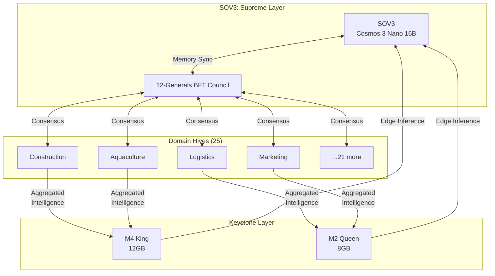
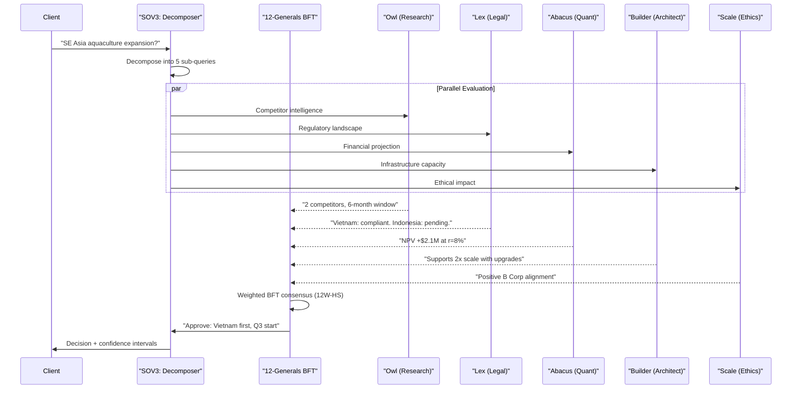

## 3. Supreme Intelligence: SOV3 & The 12-Generals War Council

Every sovereign system needs a brain — not a monolithic oracle, but a deliberative war room where specialists argue, evaluate, and decide under fire. For MEOK, that brain is SOV3: the Supreme Organic Open World Model, supported by the 12 Generals, a Byzantine Fault Tolerant (BFT) council that transforms raw intelligence into binding action. This chapter maps the apex of MEOK's architecture — the intelligence layer governing all 25 domains, making sub-second decisions under adversarial conditions, and ensuring that no single failure, whether hallucination or hack, can compromise the ecosystem.

### 3.1 SOV3: The Supreme Organic Open World Model

#### 3.1.1 Architectural Position: Apex Orchestrator

SOV3 sits at the summit of MEOK's five-layer architecture, receiving telemetry from every domain hive, keystone node, and product sensor across the fractal tree. It is the only component with a complete global view. While each domain hive runs local models (3–7 billion parameters tuned for vertical tasks), SOV3 processes cross-domain patterns no single hive can perceive: correlations between aquaculture yield forecasts and logistics fleet availability, construction safety trends and regulatory deadlines, marketing efficiency and competitive intelligence signals.



The architectural separation is deliberate. Where domain models answer "what is happening in my vertical?", SOV3 answers "what does this mean for the entire ecosystem, and what should we do?" This mirrors the distinction between operational and strategic intelligence in military command — the field commander sees the hill; the general staff sees the campaign.

#### 3.1.2 OOWM Fine-Tuned on Cosmos 3 Nano with Nick's 15-Year Data Corpus

SOV3 is built atop NVIDIA Cosmos 3 Nano, a 16-billion parameter Mixture-of-Transformers (MoT) model released in June 2026 under OpenMDW-1.1, a license permitting commercial fine-tuning and redistribution [^171^][^321^]. The dual-tower architecture — a Reasoner tower (autoregressive VLM for structured reasoning) and a Generator tower (diffusion-based for video and action generation) — processes text, images, video, and action trajectories in a shared representation space [^237^]. MoT achieves 44–63% fewer FLOPs than traditional Mixture-of-Experts by selectively routing tokens to specialized transformer blocks rather than activating sparse expert layers [^235^].

The model is fine-tuned on Nick's 15 years of marketing data spanning 25 domain business logics, augmented with SME operational data from construction safety records, aquaculture monitoring feeds, and logistics routing histories [^171^]. Training follows QLoRA via Unsloth, achieving 2x faster training with 70% less VRAM [^352^][^355^]. At 4-bit quantization, the 16B model requires approximately 9GB VRAM — fitting within the MacBook M4's unified memory [^309^][^277^]. For long-context processing across multi-year business timelines, a hybrid Mamba-2 SSD integration replaces 10–20% of attention layers with linear-time O(n) state space blocks, delivering 5x throughput at 2K sequence lengths and stable performance at 256K+ tokens [^385^][^389^].

| Model Tier | Hardware | Precision | VRAM | Throughput | Use Case |
|---|---|---|---|---|---|
| Full precision | 8x H100 | BF16 | ~32 GB | ~100 tok/s | Training, synthetic data |
| Datacenter | H100/B200 | FP8 | ~16 GB | ~50 tok/s | Complex queries |
| Edge (QLoRA) | RTX 4090 | 4-bit | ~9 GB | ~15 tok/s | Keystone operations |
| Local (GGUF) | M4 MacBook | Q4_K_M | ~9 GB | ~8-15 tok/s | Sovereign inference |

The table reveals a sovereignty-capability tradeoff. The full 16B model on cloud hardware delivers maximum capability but requires trusting external infrastructure. The quantized "Keystone edition" on local MacBooks preserves complete sovereignty at reduced context and speed. MEOK's Fractal Memory system bridges this gap: high-value insights from the cloud OOWM are compressed via hierarchical summarization and synced to the keystone context window via CDC pipeline, giving local models access to distilled strategic intelligence without raw data transmission.

#### 3.1.3 "War Games" Simulation Mode

SOV3 operates in two modes: live governance and simulated rehearsal. In "War Games" mode, the 12 Generals debate hypothetical scenarios using Cosmos 3's world simulation capabilities without affecting production. The Generator tower synthesizes future states — "What if competitor X launches a construction-AI product in Q3?" — and each General evaluates through their domain lens. The BFT council reaches consensus on response strategy, and the entire decision chain is logged as training data, creating a self-improving governance loop: more simulations produce better training examples, which improve SOV3's strategic reasoning, which produces more realistic simulations.

### 3.2 The 12 Generals

#### 3.2.1 Design Philosophy: Why Twelve?

Byzantine Fault Tolerance requires N >= 3f + 1 nodes to tolerate f faults [^277^]. For f = 3 (the maximum simultaneously compromised or hallucinating generals), the minimum is 10. Twelve provides symmetry, quorum clarity (7 of 12), and maps cleanly to MEOK's 12 functional governance domains. With 3 Byzantine generals, 9 honest remain — a two-vote margin above the threshold.

The 12 Generals are not ornamental. Each is a fully autonomous AI agent running its own model instance, evaluating proposals through domain expertise, and casting weighted votes. Their decisions are binding across the entire ecosystem.

#### 3.2.2 Complete Roster: The War Council

| # | Name | Domain Responsibility | Model Assignment | Personality Profile |
|---|------|----------------------|------------------|-------------------|
| 1 | **Argus** (Watchdog) | Monitoring, anomaly detection, intrusion response | Cosmos 3 Edge 2B | Paranoid, relentless. "That latency spike is not noise." |
| 2 | **Scribe** (Compliance) | Regulatory adherence, EU AI Act Article 14 | OOWM-8B-Q4 | Methodical, citation-obsessed. "Article 10 requires provenance." |
| 3 | **Shield** (Safety) | AI safety, alignment, harm prevention | Nemotron-Safety-9B | Stern, first to block, last to approve. "This matches a jailbreak vector." |
| 4 | **Builder** (Architect) | System design, API contracts, infrastructure | OOWM-16B | Visionary, sees five moves ahead. "That coupling costs six weeks." |
| 5 | **Abacus** (Quant) | Financial modeling, pricing, resource allocation | FinMA-7B | Cold, precise, distrusts narratives without numbers. |
| 6 | **Lex** (Legal) | Contracts, IP, liability, licensing | OOWM-8B-Q4 | Cautious, precedent-driven. "OpenMDW clause 3(b) has downstream obligations." [^321^] |
| 7 | **Scale** (Ethics) | Fairness auditing, B Corp alignment | Fairness-GPT-7B | Principled, unbending. "This drift disadvantages three segments." |
| 8 | **Crow** (Risk) | Threat intel, vulnerability, disaster recovery | SecLLM-7B | Grim, lives in tail risks. "The 99th percentile is not the worst case." |
| 9 | **Gear** (Operations) | CI/CD, infrastructure health | DevOps-LLM-4B | Pragmatic, uptime-obsessed. "Rollback is not defeat. Downtime is." |
| 10 | **Voice** (Comms) | User messaging, changelogs, stakeholder updates | OOWM-8B | Eloquent, translates engineer-speak into human. |
| 11 | **Owl** (Research) | Competitive intel, emerging tech, synthesis | OOWM-16B | Curious, connects distant dots. "This preprint invalidates our Q3 plan." |
| 12 | **Dragon** (Nick) | Human-in-the-loop, tiebreaker, strategic vision | Human + SOV3 context | Founder, pattern-matcher across 15 years of SME battles. |

Each General's personality is a system prompt and fine-tuning bias shaping proposal evaluation. These biases are measurable, auditable, and adjustable through the weighted voting mechanism. Nick, as Dragon, is the only human General — the permanent human-in-the-loop satisfying EU AI Act Article 14's requirement for "human oversight" with "ability to override AI decisions" [^227^]. Competitors bolt on human oversight as an afterthought; MEOK has it structurally embedded in consensus.

### 3.3 Deliberative Consensus Mechanics

#### 3.3.1 BFT Protocol: n=12, f=3, Quorum=7 (2f+1)

The 12 Generals execute **12W-HS** (12-Generals Weighted HotStuff), combining HotStuff's linear O(n) communication [^356^] with CP-WBFT's weighted voting [^357^]. Four phases execute per instance: PROPOSE (leader broadcasts proposal), PREPARE (each general evaluates and casts a weighted BLS-signed vote), PRECOMMIT (leader aggregates 2f+1 votes into a Prepare-QC), and COMMIT (final aggregation into a Commit-QC binding all honest generals). Quorum intersection guarantees any two quorums of 7 overlap in at least one honest general, preventing split-brain [^277^].

#### 3.3.2 Decision Latency: <500ms Critical, <1s Strategic

Decisions are classified by urgency and routed to appropriate consensus paths:

| Decision Class | Examples | Consensus Path | Latency Target |
|---|---|---|---|
| **Critical** | Emergency pause, security patch, slashing | Fast-HotStuff 2-chain [^238^] | < 500 ms |
| **Strategic** | Protocol upgrade, portfolio rebalance | Standard 3-chain HotStuff [^356^] | < 1 s |
| **Routine** | Parameter tuning, model refresh | Pipelined chained consensus [^356^] | < 2 s |
| **Advisory** | Research direction, risk assessment | Simple majority (non-binding) | < 500 ms |

Latency targets are aggressive but achievable. BLS12-381 threshold signing operates at 0.81ms per signer, with 7-share aggregation completing in ~7.7ms [^301^]. The dominant latency is cognitive — each General must evaluate proposals through their domain lens — but parallel evaluation across all 12 brings critical-path latency under 500ms for emergencies, where domain experts' votes carry elevated weight.

#### 3.3.3 BLS12-381 Threshold Signatures for Vote Signing

Every vote uses dual signatures: ECDSA (secp256k1) for identity, BLS12-381 for threshold aggregation [^254^][^301^]. BLS enables a critical property: 7 shares aggregate into a single 48-byte signature proving quorum was reached, collapsing proof size from 448 bytes (individual ECDSA) to 48 bytes — a 9.3x compression essential when thousands of decisions are logged daily to the tamper-evident audit chain.

```python
class TwelveGeneralsCouncil:
    """12W-HS consensus engine. N=12, f=3, quorum=2f+1=7."""
    N, F, QUORUM = 12, 3, 7
    WEIGHT_THRESHOLD = 2.0 / 3.0

    def propose(self, proposal):
        """[LEADER] Broadcast weighted proposal to all followers."""
        assert self.id == self.leader_id
        h = proposal.hash()
        pre_prepare = {
            "type": "PRE_PREPARE",
            "view": self.state.view_number,
            "proposal_hash": h,
            "leader_sig": ecdsa_sign(self.sk_ecdsa, h || self.state.view_number),
            "bls_sig": bls_sign(self.sk_bls, h || "PREPARE" || self.state.view_number)
        }
        self._broadcast(pre_prepare)

    def handle_pre_prepare(self, msg):
        """[FOLLOWER] Evaluate and cast weighted prepare vote."""
        assert ecdsa_verify(self._get_leader_pk(),
                           msg["proposal_hash"] || msg["view"], msg["leader_sig"])
        my_eval = self._evaluate_proposal(msg["proposal"])
        weight = self._get_weight(self.id)
        prepare_msg = {
            "type": "PREPARE",
            "proposal_hash": msg["proposal_hash"],
            "decision": self._vote_decision(my_eval, msg["leader_eval"]),
            "evaluation": my_eval,
            "general_id": self.id,
            "weight": weight,
            "bls_share": bls_sign(self.sk_bls,
                msg["proposal_hash"] || "PREPARE" || weight || self.state.view_number)
        }
        self._send_to_leader(prepare_msg)

    def handle_prepare_votes(self, votes):
        """[LEADER] Aggregate prepare votes into Prepare-QC."""
        valid_votes, total_weight, sig_shares = [], 0.0, {}
        for v in votes:
            if not self._verify_vote(v): continue
            valid_votes.append(v)
            total_weight += v["weight"]
            sig_shares[v["general_id"]] = v["bls_share"]
        if total_weight <= self.WEIGHT_THRESHOLD:
            return None
        return QuorumCertificate(
            qc_type=VoteType.PREPARE,
            total_weight=total_weight,
            aggregated_signature=bls_aggregate(sig_shares),
            participating_generals=[v["general_id"] for v in valid_votes]
        )
```

Voting weights adapt after each round: w_i = alpha * A_i + beta * B_i, where A_i measures response quality and B_i measures trustworthiness (alignment with consensus, absence of equivocation, timeliness) [^357^]. Slashing enforces honest participation: double-signing carries 25% reputation slash and 24-hour jail; surround voting 15% and 12-hour jail; extended unavailability 5% and 6-hour jail [^255^][^256^]. Generals whose slashing balance drops below the minimum are automatically ejected until a recovery protocol restores sufficient stake.

### 3.4 Cross-Domain Query Routing

#### 3.4.1 SOV3 Decomposes Complex Queries, Routes to Domain Hives

When a query like "Should we expand aquaculture monitoring into Southeast Asia?" arrives, SOV3 decomposes it into constituent sub-queries, routes each to relevant domain hives, and synthesizes a unified response through the BFT council.



Sub-queries are dispatched in parallel via gRPC with mutual TLS, each request carrying a Sigil-signed JWT encoding the query's classification tier and required capabilities [^268^].

#### 3.4.2 Quality Gating for Ecosystem Coherence

The synthesis layer applies three quality gates. **Gate 1: Consistency** — Abacus's financial projections must align with Builder's infrastructure estimates; mismatches are flagged for council resolution. **Gate 2: Coverage** — responses must include perspectives from all materially involved generals; market expansion without Lex's regulatory or Scale's ethical review is automatically rejected. **Gate 3: Confidence calibration** — each general attaches a confidence interval; aggregate scores below 75% for strategic decisions or 90% for critical decisions trigger additional research cycles rather than premature commitment.

This architecture — a sovereign world model fine-tuned on 15 years of proprietary data, governed by a weighted Byzantine council with cryptographic proof of every decision — separates MEOK from single-agent systems. It is slower than a lone LLM spitting out answers. It is more expensive than a single API call. But it is incorruptible up to 3 simultaneous failures, auditable down to every vote signature, and aligned by design with both distributed consensus mathematics and emerging AI governance frameworks.
