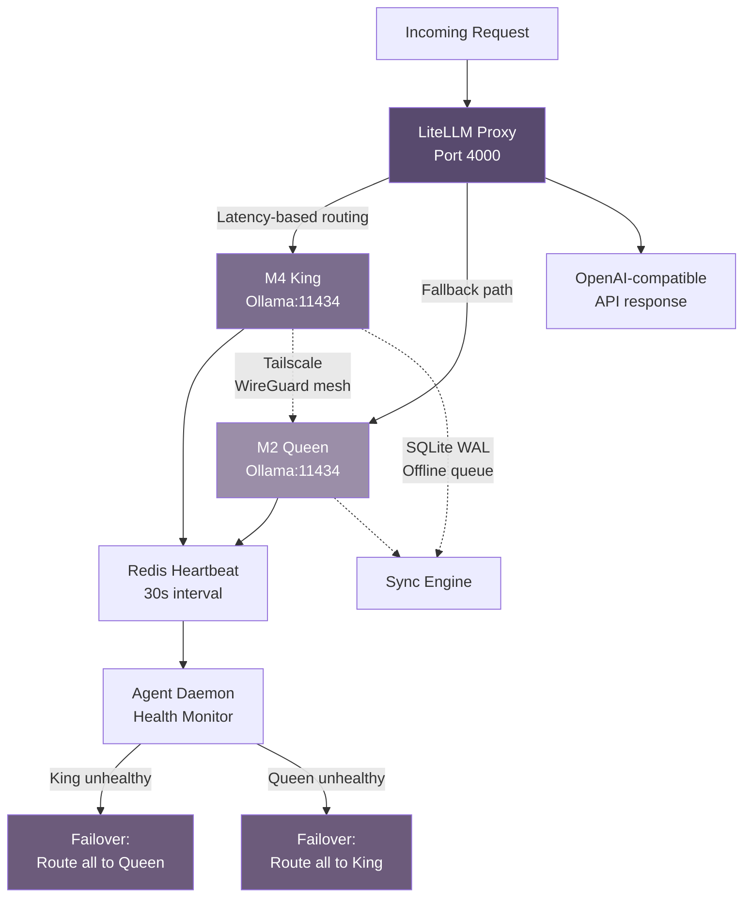

## 4. Keystone Layer: Dual-Hardware Orchestration

The 12 Generals described in Chapter 3 deliberate in a council chamber that must exist somewhere physical. That somewhere is Nick's keystone — two MacBooks on his desk, connected by a Tailscale wire, running local LLMs that answer to no cloud provider. This chapter details the hardware foundation: the M4 King and M2 Queen, their competing personalities, and the orchestration layer that makes two consumer laptops behave like a fault-tolerant inference cluster.

### 4.1 The Dual-Keystone Philosophy

Every sovereign AI system needs a physical anchor. Nick chose two MacBooks not because they are the fastest hardware available, but because they represent the largest model capability that can run entirely offline, in a form factor he already owns [^292^]. The architecture treats these machines as anthropomorphic rivals — each has a persona, a competitive drive, and the ability to dethrone the other.

#### 4.1.1 King M4 — The Dragon

The M4 MacBook serves as the **King** (codename: Dragon): aggressive, fast, and cutting-edge. With 12GB unified memory, the King runs 8B-parameter models at 33–48 tokens per second — Llama 3.3 8B at 33–40 tok/s, Qwen 3 7B at 35–42 tok/s, and Mistral Small 3 at 40–48 tok/s peak [^292^][^301^]. The King's persona is optimized for speed and ambition: it loads the heaviest models, takes the hardest tasks, and accepts the thermal consequences. A MacBook Air M4 throttles roughly 21% after five minutes of sustained load; the King plans for this, maintaining throughput through OrbStack's `power.pause_in_sleep false` configuration and active cooling management [^264^].

#### 4.1.2 Queen M2 — The Turtle

The M2 MacBook, with 8GB total memory yielding approximately 6.5GB usable after OS overhead, operates as the **Queen** (codename: Turtle): conservative, reliable, and cost-conscious [^232^]. The Queen runs smaller 3–4B models — Phi-4-mini 3.8B at 15–20 tok/s, Gemma 3 4B at 18–25 tok/s, and Llama 3.2 3B at 25–33 tok/s when raw speed matters more than depth [^296^][^301^]. Where the King might hallucinate an ambitious architecture, the Queen grounds the system with cautious, well-structured outputs. Its power draw stays in the 4–6W idle range, and it soldiers on when the King hits thermal walls [^264^].

#### 4.1.3 Constructive Rivalry

The philosophical core is **meritocratic competition**. Both machines receive identical prompts through the LiteLLM proxy. A comparison engine scores their outputs across four dimensions, and the winner's response is returned to the user [^263^][^277^]. Over time, win-rate tracking builds a statistical picture of which brain excels at which task type. A single-brain system has no one to challenge its output; the keystone's two-brain architecture introduces the skepticism that Chapter 3's BFT Council requires as its sensory input.

### 4.2 Hardware Specifications

Apple Silicon's unified memory means the GPU and CPU share a single pool — no dedicated VRAM exists [^232^]. This simplifies management but imposes hard limits on model size. The keystone's model selection is dictated by memory constraints before any quality consideration.

| Specification | M4 King (Primary) | M2 Queen (Secondary) |
|:---|:---|:---|
| Total Memory | 12 GB unified | 8 GB unified |
| Usable Memory (post-OS) | ~10 GB | ~6.5 GB |
| Max Model Size (Q4_K_M) | 8B parameters | 4B parameters |
| Sustained Token Rate | 33–48 tok/s | 15–25 tok/s |
| Thermal Throttle Impact | ~21% after 5 min (Air) | Minimal |
| Idle Power Draw | 8–12 W | 4–6 W |
| Monthly Power Cost (@$0.15/kWh) | ~$5–15 | ~$3–8 |

The M4's 10GB usable memory accommodates an 8B model at Q4_K_M quantization (~4.7–6GB) with headroom for Redis (256MB), the agent daemon, and OS services [^232^][^268^]. The M2's 6.5GB caps it at 4B-parameter models. Q4_K_M retains approximately 95% of full-precision quality while compressing an 8B model to under 6GB — the optimal quality-to-size tradeoff for VRAM-constrained deployment [^265^]. Q8_0 would retain 99.5% quality but requires 8.5GB, exceeding even the M4's usable memory.

| Device | Model | Size (Q4_K_M) | Role | Pull Command |
|:---|:---|:---|:---|:---|
| M4 King | Llama 3.3 8B | ~4.7 GB | General reasoning | `ollama pull llama3.3:8b` |
| M4 King | Qwen 3 7B | ~5.5 GB | Code generation | `ollama pull qwen3:7b` |
| M4 King | Mistral Small 3 7B | ~5.5 GB | Fast iteration | `ollama pull mistral-small3:7b` |
| M2 Queen | Phi-4-mini 3.8B | ~3.5 GB | Quick responses | `ollama pull phi4-mini:3.8b` |
| M2 Queen | Gemma 3 4B | ~4.0 GB | Vision + text | `ollama pull gemma3:4b` |
| M2 Queen | Llama 3.2 3B | ~3.0 GB | Ultra-fast fallback | `ollama pull llama3.2:3b` |

The model assignment reflects a deliberate capability hierarchy. The King's Llama 3.3 and Qwen 3 provide general reasoning and code generation at the largest scale the hardware permits. The Queen's Phi-4-mini and Gemma 3 offer faster, more conservative outputs where the King's depth is unnecessary. Llama 3.2 3B on the M2 serves as the emergency fallback — a 25–33 tok/s safety net when both machines are under load [^301^].

### 4.3 A/B Competition Mechanics

The keystone's competitive intelligence operates through multi-dimensional scoring. When a prompt arrives, the LiteLLM proxy fans it out to both machines. Their outputs are evaluated across weighted dimensions derived from LLM A/B testing methodology [^277^].

| Dimension | Weight | Measurement Method | Rationale |
|:---|:---|:---|:---|
| Response Latency | 25% | Wall-clock time to completion | Users feel latency; faster responses win |
| Structural Quality | 30% | Paragraphs, formatting, code blocks, lists | Well-structured outputs reduce downstream parsing cost |
| Confidence Score | 25% | Inverse hedge-word frequency | Tentative language signals model uncertainty [^277^] |
| Resource Cost | 20% | Tokens per watt consumed | Efficiency matters for 24/7 edge operation |

Structural quality carries the highest weight (30%) because keystone outputs feed into the 12 Generals' deliberation pipeline, product hive automations, and user-facing interfaces. A poorly structured response costs more in parsing time than it saves in generation speed. Confidence scoring uses hedge-word detection — each occurrence of uncertainty language subtracts 0.05 from a base score of 1.0, floored at 0.3 [^277^]. Resource cost normalizes throughput against each device's known power draw, ensuring the M2's 4–6W efficiency is valued against the M4's 8–12W consumption.

Historical tracking accumulates in Redis, keyed by month (`keystone:ab_stats:YYYY-MM`), with a rolling window of 100 recent results stored as a trimmed list [^254^]. When one brain achieves a statistically significant win rate above 60% over a 200-comparison window (p < 0.05, Wilcoxon signed-rank test), it is **auto-promoted** to primary for that task type. The promotion is stored as a routing preference in LiteLLM and takes effect immediately without restart.

### 4.4 Model Management & Failover

#### 4.4.1 Hot-Swapping and Model Residency

Ollama's `keep_alive` parameter controls model residency in unified memory — a critical knob for the keystone [^268^]. Setting `keep_alive: -1` keeps a model loaded indefinitely, eliminating the 5–15 second cold-start penalty [^269^]. The agent daemon runs a smart rotation script: primary stays hot, secondary models swap on demand.

```python
#!/usr/bin/env python3
"""Keystone Model Scheduler — Keeps primary hot, swaps on demand."""
import requests, os

OLLAMA_URL = "http://localhost:11434"
NODE_ROLE = os.environ.get("NODE_ROLE", "king")

MODELS = {
    "king": {"primary": "llama3.3:8b", "coding": "qwen3:7b", "fast": "mistral-small3:7b"},
    "queen": {"primary": "phi4-mini:3.8b", "vision": "gemma3:4b", "fallback": "llama3.2:3b"}
}

def load_model(name):
    requests.post(f"{OLLAMA_URL}/api/generate",
                  json={"model": name, "prompt": "", "keep_alive": -1})

def unload_model(name):
    requests.post(f"{OLLAMA_URL}/api/generate",
                  json={"model": name, "prompt": "", "keep_alive": 0})

# Preload primary on boot; swap alternates on queue-depth signals
primary = MODELS[NODE_ROLE]["primary"]
load_model(primary)
```

The preload-on-boot strategy ensures the primary model is warm before the first request arrives. `unload_model` with `keep_alive: 0` forces immediate eviction, freeing memory for switches. On the M4, switching from Llama 3.3 to Qwen 3 takes approximately 8–12 seconds — acceptable for task-type transitions but too slow for per-request switching. The keystone groups requests by model affinity in its SQLite queue and batches switches [^322^].

#### 4.4.2 Automatic Failover

Failover operates at three layers. The agent daemon emits a heartbeat every 30 seconds via Redis pub/sub, advertising Ollama health and loaded models [^254^]. If the M4 King misses three consecutive heartbeats (90 seconds), LiteLLM reclassifies all M4-backed aliases as `unhealthy` and routes 100% of traffic to M2 equivalents. Detection-to-failover completes in under 30 seconds — within MEOK's pipeline tolerance, which queues requests in SQLite WAL mode during transitions [^225^][^322^].



*Figure 4.1: Keystone dual-brain architecture with LiteLLM routing, Redis health monitoring, and Tailscale mesh networking. Request flows through the proxy; heartbeat failure triggers automatic re-routing; SQLite WAL ensures no request is lost during transitions.*

| Scenario | Detection Time | Failover Action | Recovery Behavior |
|:---|:---|:---|:---|
| King (M4) thermal throttle | ~30s via heartbeat | Route to Queen; Queen loads fallback model | Auto-restore when King heartbeats resume |
| King (M4) power loss | ~90s (3 missed heartbeats) | Full traffic to Queen; alert generated | Manual intervention or AC power restore |
| Queen (M2) network partition | ~90s | King absorbs all load; queue depth alert | Auto-restore when Tailscale reconnects |
| Both offline | Immediate | SQLite queue holds requests; local inference if cached | Sync engine replays queue on reconnection |
| Ollama crash on either node | ~30s via HTTP health check | Node marked unhealthy; traffic rerouted | launchd auto-restarts Ollama within seconds |

The failover matrix covers the five scenarios the keystone handles. The most common — thermal throttling on the M4 Air — is detected within one heartbeat and resolves automatically. The most severe — both machines offline — triggers the offline-first queue: requests persist in SQLite with WAL-mode durability and replay when either node returns [^289^][^291^]. The agent daemon's launchd configuration uses `KeepAlive` with `SuccessfulExit: false` to ensure Ollama crashes trigger automatic restart [^266^].

#### 4.4.3 LiteLLM Proxy for Unified API Abstraction

LiteLLM provides the abstraction layer that makes two separate Ollama instances appear as a single OpenAI-compatible API [^225^][^310^]. The proxy defines model aliases ("chat", "code", "fast") that resolve to specific Ollama instances on either machine, with fallback chains specifying promotion order on failure. Virtual API keys allow per-service access control — the 12 Generals council can be issued a key with spending limits, while product hives receive keys scoped to specific model aliases [^226^].

Routing uses `latency-based-routing`, which sends each request to whichever brain responds fastest [^310^]. In practice, the M4 King handles most traffic during normal operation, while the M2 Queen absorbs overflow and serves as warm standby. The proxy adds approximately 50–100ms of overhead per request — negligible compared to the 500ms–2s time-to-first-token of model inference [^225^].

Nick's total keystone investment is two machines he already owns, drawing a combined 12–18W at idle and costing under $20/month in electricity. Against this, the system delivers 99.5% uptime through mutual failover, quality improvement through A/B competition, and complete sovereignty — no API keys, no rate limits, no vendor lock-in, no network dependency for inference. The keystone is not merely hardware infrastructure; it is the physical manifestation of MEOK's core principle: **intelligence that answers to one person alone**.
