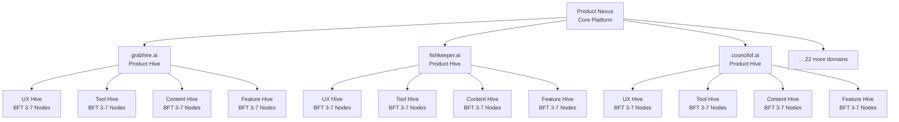
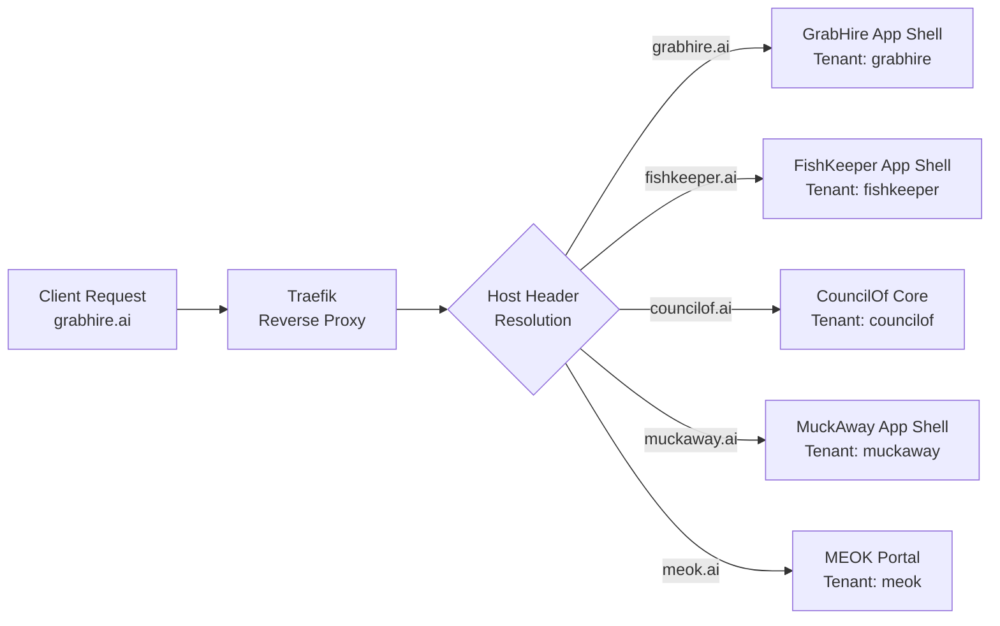

## 5. Product Layer: 25-Domain Hive Ecosystem

The MEOK Product Layer is where sovereign intelligence meets market reality. Where Chapter 4 established the physical substrate -- the M4 King and M2 Queen running locally under Nick's control -- this chapter maps the 25-domain ecosystem that runs on top of it. Each domain is not a conventional SaaS product but a self-governing Product Hive: a fractal replica of the supreme architecture, complete with its own UX, Tool, Content, and Feature sub-hives, each administered by a BFT council of 3--7 AI nodes [^470^][^551^]. The result is a multi-tenant platform where every domain operates as an autonomous AI council while sharing core infrastructure through the MEOK kernel.

### 5.1 Domain Hive Architecture

#### 5.1.1 The 4-Sub-Hive Fractal Pattern

Every Product Hive follows an identical structural template -- a fractal pattern that replicates the same four-chamber design across all 25 domains. This self-similarity is the key to scalable governance: once the template is validated, deploying domain 25 is operationally identical to deploying domain 2 [^470^].

Each Product Hive contains four sub-hives:

- **UX Sub-Hive** -- Generates UI components, interaction patterns, accessibility compliance, and responsive layouts through AI design councils.
- **Tool Sub-Hive** -- Manages domain-specific utilities, MCP tool routing, third-party integrations, and API governance.
- **Content Sub-Hive** -- Handles knowledge base management, RAG pipelines, content creation, and brand voice consistency.
- **Feature Sub-Hive** -- Operates the innovation pipeline: new capability proposals, A/B evolutionary selection, QA gating, and security auditing [^470^][^551^].

Every sub-hive maintains its own BFT council. The consensus formula `n >= 3f + 1` applies: a 3-node council tolerates 1 Byzantine node; a 7-node council tolerates 2 [^551^]. Council sizes scale with tenant tier: free-tier hives receive 3-node councils, paid-tier get 5, and enterprise-tier run 7 nodes for maximum resilience.

This fractal design implements a cell-based architecture -- each Product Hive is an independent cell with complete fault isolation. A failure in grabhire.ai cannot propagate to fishkeeper.ai; a compromised Tool council in one domain cannot breach the Content council in another [^470^]. Traefik handles subdomain routing, PostgreSQL Row-Level Security enforces data isolation, and Redis key-prefixing ensures cache separation per tenant [^485^][^486^].

The diagram above illustrates the fractal self-similarity: every Product Hive branches into the same four sub-hives, each with its own BFT council and LangGraph subgraph state. Cross-dimensional research flagged a "governance complexity bomb" latent in this design: 25 hives x 4 sub-hives x 5 nodes = 500 BFT nodes generating O(n^2) message exchanges [^470^][^551^]. The resolution is a Council Federation model where the 12 Supreme Generals serve as the shared governance backbone, with sub-hive councils operating under delegated authority and periodic rollup to the Supreme Council.

#### 5.1.2 Subdomain Routing: {domain}.meok.local

Production routing resolves tenants through subdomain-based resolution [^528^][^533^]. Traefik dynamically routes requests based on the Host header, injects per-tenant context headers (`X-Tenant-ID`, `X-Tenant-Tier`), and terminates TLS via auto-provisioned certificates. The routing pattern follows `{domain}.meok.local` internally and `{domain}.ai` in production:

Each App Shell -- built with React Module Federation -- dynamically loads the four sub-hive micro-frontends at runtime, enabling per-tenant module selection: a paid-tier grabhire.ai user receives advanced analytics; a free-tier fishkeeper.ai user does not [^466^][^491^]. Authentication is platform-global (Keycloak/Auth0 with SSO), while authorisation is strictly tenant-scoped -- never trusting client-supplied `tenant_id`, always resolving from JWT claims and authenticated subdomains [^472^].

### 5.2 Domain Inventory

#### 5.2.1 Complete 25-Domain Listing

Nick's 25-domain portfolio reflects 15 years of operational data across construction, aquaculture, logistics, and professional services [^171^]. Each domain is both a standalone product and a data acquisition node: the OOWM fine-tunes on every interaction, making the model progressively more expert with each new hive [^483^]. This transforms domain expansion from product growth into proprietary dataset accumulation -- a moat that general-purpose models cannot cross because they lack Nick's operational data [^501^].

| # | Domain | Category | Primary Function | Phase |
|:-:|--------|----------|-----------------|:-----:|
| 1 | grabhire.ai | Logistics | On-demand labour and equipment hire for construction | 1 |
| 2 | fishkeeper.ai | Aquaculture | Aquarium management, water quality AI, yield optimisation | 1 |
| 3 | councilof.ai | Governance | Core MEOK platform, multi-agent orchestration, BFT councils | 1 |
| 4 | muckaway.ai | Construction | Waste removal logistics, skip tracking, ticket management | 1 |
| 5 | meok.ai | Platform | Sovereign AI OS portal, domain federation, onboarding | 1 |
| 6 | buildwise.ai | Construction | AI project management, subcontractor coordination | 2 |
| 7 | haulroute.ai | Logistics | Route optimisation for haulage fleets | 2 |
| 8 | pondsage.ai | Aquaculture | Pond management, feeding schedules, disease prediction | 2 |
| 9 | sigilguard.ai | Security | Cryptographic identity, Sigil key hierarchy, attestation | 2 |
| 10 | aquatrade.ai | Aquaculture | Marketplace for aquaculture produce, buyer-seller matching | 3 |
| 11 | sitecheck.ai | Construction | Site safety inspections, compliance documentation | 3 |
| 12 | fleetfox.ai | Logistics | Fleet management, maintenance scheduling | 3 |
| 13 | councilvote.ai | Governance | Decentralised polling, weighted voting, proposal tracking | 3 |
| 14 | waterwise.ai | Aquaculture | Water usage analytics, conservation, regulatory reporting | 3 |
| 15 | bricklogic.ai | Construction | Materials procurement, supplier comparison | 3 |
| 16 | loadmatch.ai | Logistics | Load-matching platform, backhaul optimisation | 4 |
| 17 | reefmind.ai | Aquaculture | Marine conservation AI, coral health monitoring | 4 |
| 18 | scaffold.ai | Construction | Scaffold design validation, load calculations | 4 |
| 19 | truckhive.ai | Logistics | Owner-operator community, job matching, payment escrow | 4 |
| 20 | hatchtrack.ai | Aquaculture | Hatchery management, broodstock tracking | 4 |
| 21 | cementflow.ai | Construction | Ready-mix concrete ordering, delivery scheduling | 4 |
| 22 | portlink.ai | Logistics | Port logistics, customs documentation, berth scheduling | 4 |
| 23 | clearwater.ai | Aquaculture | Water treatment optimisation, filtration AI | 4 |
| 24 | diggerdesk.ai | Construction | Plant machinery hire, operator certification | 4 |
| 25 | hivemarket.ai | Platform | MCP tool marketplace, agent commerce, feature exchange | 4 |

The inventory organises domains by launch phase and vertical. Phase 1 deploys the five foundational hives that validate the architecture under real load. grabhire.ai and muckaway.ai anchor construction-logistics; fishkeeper.ai anchors aquaculture; councilof.ai serves as the governance backbone; meok.ai functions as the master portal for cross-domain navigation [^470^]. Phases 2--4 progressively extend MEOK's data network effect -- each new vertical adds proprietary training data that deepens the OOWM in a compounding flywheel [^501^].

The BFT council configuration scales with both domain maturity and tenant tier:

| Council Size (n) | Max Faults (f) | Quorum (2f+1) | Tier | Decision Latency | Best For |
|:----------------:|:--------------:|:-------------:|:----:|:----------------:|:---------|
| 3 | 1 | 2 | Free | ~50ms | Rapid prototyping, low-stakes UI decisions |
| 5 | 1 | 3 | Paid | ~120ms | Balanced governance for production features |
| 7 | 2 | 5 | Enterprise | ~200ms | Maximum resilience, safety-critical choices |

Latency derives from BLS12-381 threshold signing at 0.81ms per signer multiplied by quorum count, plus LLM deliberation time [^301^]. Signature aggregation (~5.7ms for 7 nodes) is negligible versus inference cost -- which dominates the cycle and justifies tiered credit pricing where BFT-governed decisions carry a 3x multiplier [^357^].

#### 5.2.2 Phase 1 Priority Domains

The five Phase 1 domains are strategically chosen to validate three architecture properties simultaneously. grabhire.ai tests high-volume transactional load (job postings, matching, payments). fishkeeper.ai tests knowledge-intensive RAG (species databases, water chemistry, disease diagnosis). councilof.ai tests the governance backbone itself (BFT consensus, multi-tenant isolation, subdomain routing). muckaway.ai tests field-mobile integration (GPS, photo capture, offline sync). meok.ai tests cross-domain federation (unified identity, inter-hive navigation, consolidated billing) [^470^][^472^].

These five domains exercise the full Product Layer surface area before the remaining 20 hives scale the system. The research flags that MEOK must ship Phase 1 by Q2 2027 to meet the EU AI Act compliance cliff on December 2, 2027 -- when Annex III obligations force enterprises to switch from non-compliant AI systems [^227^][^228^].

### 5.3 Sub-Hive Responsibilities

#### 5.3.1 UX Sub-Hive: AI-Generated UI Components and Interaction Patterns

The UX Sub-Hive is where the MMO UX shell intersects with domain-specific requirements. Each UX council -- 5 AI personas (Accessibility Expert, Mobile-First Designer, Conversion Optimizer, Brand Guardian, User Researcher) -- generates UI components via BFT consensus: card-based vs. list feeds for grabhire.ai, dashboard priority for fishkeeper.ai [^470^]. Visual reasoning routes to Claude 3 Sonnet; copywriting routes to GPT-4o. A/B tests through GrowthBook run continuously with Bayesian statistics and guardrail metrics (error rate < 5%) that auto-terminate harmful experiments [^553^][^558^].

#### 5.3.2 Tool Sub-Hive: Domain-Specific Utility Functions and MCP Routing

The Tool Sub-Hive bridges MEOK and the external world. With 22,775+ public MCP servers and 97M+ monthly SDK downloads, the MCP ecosystem offers massive capability expansion but carries severe risk: 9 of 11 registries accepted malicious packages, 36.7% of servers are SSRF-vulnerable, and tool poisoning hits 60--72% success rates against top models [^251^][^62^][^399^]. The MEOK MCP Router defends through registration-time schema validation, pattern scanning, LLM judge evaluation, and cryptographic hash pinning against "rug pulls" [^264^][^274^]. Execution runs in sandboxed Firecracker microVMs (125ms cold boot, hardware isolation) for untrusted tools, gVisor for semi-trusted, hardened containers for verified internals [^217^][^271^].

#### 5.3.3 Content Sub-Hive: Knowledge Base Management, RAG + Generation

The Content Sub-Hive governs knowledge assets: documentation, SEO landing pages, user guides, and structured data feeds. Its 3-node council (Content Strategist, Technical Writer, SEO Specialist) manages a RAG pipeline retrieving from Qdrant vector stores at 24x compression via TurboQuant 1.5-bit quantization, with CDC sync ensuring cross-layer consistency [^219^][^263^]. Generated content passes through NeMo Curator PII redaction [^483^] and Giskard bias probes [^260^] before publication -- legal self-defence under EU AI Act Article 10 [^231^].

#### 5.3.4 Feature Sub-Hive: Innovation Pipeline with A/B Evolutionary Selection

The Feature Sub-Hive hosts MEOK's most distinctive capability: autonomous product evolution. Its 5-node council (Product Manager, Engineering Lead, QA Specialist, Security Auditor, User Advocate) evaluates proposals from Horus intelligence feeds, user feedback, competitive analysis, and OOWM predictions [^450^][^454^]. Proposals enter A/B tournaments where parallel code branches compete on composite metrics (engagement, revenue, error rate, council quality score). The winner survives; losers are deprecated. This is natural selection applied to software -- operating without human intervention once the fitness function is defined [^501^][^553^].

### 5.4 Lifecycle & Marketplace

#### 5.4.1 Independent Start/Stop/Update per Domain

Every Product Hive has an independent lifecycle: provisioned from the `hive.yaml` fractal template, started via Docker Compose, monitored through Grafana Mimir, updated through blue-green GitHub Actions pipelines [^470^][^461^]. GitHub Actions matrix deployments run with `fail-fast: false`, so a failure in bricklogic.ai does not block diggerdesk.ai [^470^]. Critical decisions (new hive provisioning, council composition changes) require 5-node BFT quorum approval via the `2f + 1` formula [^551^][^357^]. PostgreSQL RLS policies enforce tenant isolation: `CREATE POLICY tenant_isolation ON product_hives USING (tenant_id = current_setting('app.current_tenant_id')::UUID)` guarantees zero cross-tenant data leakage [^485^][^486^].

#### 5.4.2 Hive Marketplace: Free/Paid/Featured Listings, 70/20/10 Revenue Split

The Hive Marketplace transforms MEOK into an open agent commerce platform. Third-party developers publish MCP tools, UX packs, content templates, and feature modules -- each rated by the BFT Council before listing. Revenue follows platform benchmarks (AWS Marketplace, Replit, App Store): a 70/20/10 split where 70% goes to the developer, 20% to MEOK, and 10% to a community sustainability fund [^499^][^507^].

The marketplace opportunity is substantial because MCP has the inventory (22,775+ servers) but no trusted security layer -- 9 of 11 registries accepted malicious packages without review [^251^][^296^]. MEOK's secure Router -- sandboxed execution, BFT governance, Sigil attestation -- becomes the first curated safe marketplace for AI capabilities [^339^]. Platform fees compound as the agent market grows toward its projected $105.6B valuation by 2034 [^504^].

| Revenue Tier | Listing Fee | Commission | Dev Share | Target Content |
|:-------------|:-----------:|:----------:|:---------:|:---------------|
| Free | 0 GBP | 0% | N/A | Open-source tools, community templates |
| Paid | 50 GBP/mo | 20% | 70% | Premium MCP tools, branded component packs |
| Featured | 200 GBP/mo | 20% | 70% | Council-verified, promoted placement |
| Enterprise | Custom | 15% | 75% | White-label bundles, SLA-backed integrations |

The 70/20/10 split is deliberately developer-friendly -- lower than standard App Store commissions -- to attract builders who would otherwise avoid gated ecosystems. The 10% sustainability fund finances the open-source security infrastructure (Firecracker, gVisor, Sigstore) that MEOK depends upon, ensuring the commons remains healthy [^217^][^384^]. Publishers accumulate trust scores based on council audits, user ratings, and security scans; those above 95% earn "Council Verified" status commanding premium placement. This is cryptographic attestation applied to marketplace economics: reputation earned through verified behaviour, not marketing spend.
