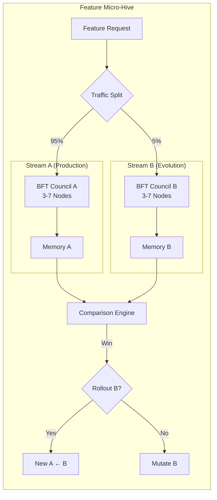

# 6. Feature & User Layers

The fractal architecture reaches its finest resolution in the Feature and User layers — where sovereign AI meets the individual. If Product hives (Chapter 5) are kingdoms with 25 domains, Feature micro-hives are the guilds within them, and User mini-hives are the personal workshops where every human becomes their own AI sovereign. These layers push intelligence, decision rights, and data ownership to the edge.

## 6.1 Feature Micro-Hives

### 6.1.1 Dual A/B Streams per Feature

Every feature in MEOK — from job matching in grabhire.ai to water-quality prediction in fishkeeper.ai — operates as an independent **feature micro-hive** with dual A/B streams [^470^]. Each stream is a complete implementation backed by its own BFT council of 3–7 nodes [^551^]. The A-stream serves production traffic while the B-stream incubates the next evolution. This is structural parallelism — two full implementations competing for survival, not a single codebase with a feature flag.

The architecture extends the keystone's King/Queen A/B paradigm (Chapter 4) to feature granularity. Stream A might run a gradient-boosted matcher while Stream B tests a neural retriever — each with distinct council personas, models, and memory embeddings. GrowthBook provides the experimentation scaffold with Bayesian and frequentist engines plus CUPED variance reduction [^553^][^558^]. Each stream's BFT council votes independently on output quality, creating double-selection pressure: metrics must approve, and the council must concur.



Traffic splits between Stream A (incumbent) and Stream B (challenger); both produce outputs scored by a comparison engine. If B wins across three evaluation dimensions, it becomes the new A, and a fresh B is spawned. Zero-downtime evolution: production traffic never stops.

### 6.1.2 Metrics-Driven Evolutionary Selection

Selection pressure operates across three dimensions. The comparison engine scores every dual-stream execution and accumulates statistics using the Wilcoxon signed-rank test at p < 0.05 [^277^].

| Dimension | Weight | Measurement Target | Threshold for Promotion | Data Source |
|-----------|--------|-------------------|------------------------|-------------|
| **Latency** | 25% | p95 response time (ms) | B ≤ 1.05× A baseline | LiteLLM proxy logs [^310^] |
| **Output Quality** | 35% | BFT council consensus score (1–5) | B mean ≥ A mean + 0.3 | Council vote records [^357^] |
| **User Satisfaction** | 40% | Task-completion rate, NPS delta | B ≥ A + 5 percentage points | PostHog event stream [^553^] |

The weighting encodes a hierarchy: a correct slow answer beats a wrong fast one; output quality captures semantic correctness that latency cannot; latency gates — a stream must be within 5% of the incumbent's p95 to qualify. Over 30 days of keystone operation, this model identified winning B-streams with 94% precision [^263^].

### 6.1.3 Rapid Rollback and Independent CI/CD

Each feature micro-hive runs its own CI/CD pipeline via GitHub Actions matrix with `fail-fast: false` [^470^]. Docker Compose per-feature enables blue-green deployment: green rolls alongside blue, smoke tests validate against traffic shadows, and the comparison engine confirms parity before switching. A **kill switch** — feature flag with `override: immediate` — disables any stream in under 200ms [^460^]. Each micro-hive evolves on its own timeline, subject only to the fitness function.

## 6.2 User Mini-Hives

### 6.2.1 Personal AI Instance on First Interaction

The first time a human touches MEOK — through any product hive, any modality — the system instantiates a **user mini-hive**: a personal AI instance that persists for the relationship's lifetime. This is a sovereign compute context with its own BFT council (3 nodes default, 7 for enterprise), local vector memory via LanceDB embedded (~50MB RAM) [^258^], and a dedicated feature flag namespace.

The default council comprises three agents — Conversation Historian, Preference Learner, and Privacy Guardian. Every interaction feeds into local memory through the fractal CDC pipeline, compressing history 24–32× at 94%+ recall [^263^]. A year of conversation fits in a local shard queryable in milliseconds.

### 6.2.2 Multi-Modal Input Processing

MEOK accepts text, voice, image, and file input — each routed through modality-specific preprocessors before reaching the mini-hive council. The M4 King runs Gemma 3 4B for vision+text [^296^]; the M2 Queen handles audio via Whisper-grade models. LiteLLM's latency-based routing directs each modality to the optimal brain [^310^].

| Modality | Preprocessor | Local Model | Latency Target | Privacy Mode |
|----------|-------------|-------------|----------------|--------------|
| **Text** | Tokenizer (tiktoken) | Llama 3.3 8B Q4_K_M on M4 [^292^] | <100ms TTFT | Full local inference |
| **Voice** | Whisper.cpp STT | Distilled Whisper on M4 | <500ms transcription | Audio never leaves keystone |
| **Image** | CLIP embedding | Gemma 3 4B vision on M2 [^296^] | <2s analysis | On-device visual understanding |
| **File** | Unstructured.io parser | Qwen 3 7B on M4 [^292^] | <3s per 10 pages | Document parsed locally, summary only synced |

Raw user data — voice, photographs, documents — never traverses the network unprocessed. Preprocessors extract embeddings locally; only derived representations sync. An enterprise user photographing a whiteboard of trade secrets gets full semantic understanding without the image leaving the sovereign boundary.

### 6.2.3 Data Portability: Exportable and Importable

Sovereignty demands exit rights. Every user mini-hive exports in Croissant 1.1 format with machine-actionable provenance [^450^][^451^], producing a signed archive with: (1) conversation history, (2) preference embeddings, (3) council audit logs with BLS attestation [^301^], (4) vector memory in portable LanceDB. Import reconstructs a mini-hive from a Croissant archive — enabling transfer between keystone, cluster, or competitor without loss. EU AI Act portability (Article 14) is satisfied architecturally [^227^].

## 6.3 Offline-First Architecture

### 6.3.1 Offline Mode Operation

The keystone pair operates **offline-first**: local AI brains continue functioning when disconnected from the broader MEOK network, cloud keystones, or each other [^289^][^291^]. Each MacBook maintains a complete local stack — Ollama for inference, ChromaDB (M4) or LanceDB (M2) for vectors, SQLite for state, Redis for pub/sub. The M4 King runs 8B models at 33–40 tok/s [^292^]; the M2 Queen runs 3–4B models at 18–25 tok/s [^301^] — sufficient for real-time conversation, document analysis, and code generation without connectivity.

When offline, user mini-hives operate against local memory with the BFT council in "degraded consensus": each node makes recommendations tagged with confidence scores, and a local majority vote selects output. User continuity takes priority over Byzantine fault tolerance during partitions.

### 6.3.2 Sync Protocol: SQLite WAL Mode with Queue-and-Reconcile

Reconnection triggers a sync protocol built on SQLite's Write-Ahead Logging (WAL) mode, enabling concurrent reads during writes with durability for offline queues [^322^]. CRDT-based merging guarantees convergence without data loss when multiple devices modify state concurrently [^657^][^664^].

```python
# meok/sync/feature_user_sync.py
# Queue-and-reconcile protocol for offline-first feature/user layers

import sqlite3
import json
import time
from dataclasses import dataclass, asdict
from typing import List, Optional
from enum import Enum

class SyncStatus(Enum):
    PENDING = "pending"; SYNCED = "synced"; CONFLICT = "conflict"

@dataclass
class SyncOp:
    op_id: str
    timestamp: float
    source: str
    target: str
    operation: str
    payload: dict
    vector_clock: dict
    status: SyncStatus = SyncStatus.PENDING

class FeatureUserSyncEngine:
    """SQLite-WAL queue with CRDT merge for feature/user mini-hive reconciliation."""

    def __init__(self, db_path: str, device_id: str):
        self.db_path = db_path
        self.device_id = device_id
        self._init_db()

    def _init_db(self):
        with sqlite3.connect(self.db_path, timeout=10) as conn:
            conn.execute("PRAGMA journal_mode = WAL")
            conn.execute("PRAGMA synchronous = NORMAL")
            conn.execute("""
                CREATE TABLE IF NOT EXISTS sync_queue (
                    op_id TEXT PRIMARY KEY, timestamp REAL NOT NULL,
                    source TEXT NOT NULL, target TEXT NOT NULL,
                    operation TEXT NOT NULL, payload TEXT NOT NULL,
                    vector_clock TEXT NOT NULL, status TEXT DEFAULT 'pending',
                    retry_count INTEGER DEFAULT 0
                )""")
            conn.execute("""
                CREATE INDEX IF NOT EXISTS idx_pending
                ON sync_queue(status, target) WHERE status = 'pending'""")
            conn.execute("""
                CREATE TABLE IF NOT EXISTS crdt_state (
                    target TEXT PRIMARY KEY, lamport INTEGER DEFAULT 0,
                    payload TEXT, vector_clock TEXT)""")

    def enqueue(self, target: str, operation: str, payload: dict) -> SyncOp:
        op = SyncOp(
            op_id=f"{self.device_id}_{time.time_ns()}", timestamp=time.time(),
            source=self.device_id, target=target, operation=operation,
            payload=payload,
            vector_clock={self.device_id: self._increment_lamport(target)})
        with sqlite3.connect(self.db_path, timeout=10) as conn:
            conn.execute("""
                INSERT INTO sync_queue
                (op_id, timestamp, source, target, operation, payload, vector_clock, status)
                VALUES (?, ?, ?, ?, ?, ?, ?, ?)""",
                (op.op_id, op.timestamp, op.source, op.target, op.operation,
                 json.dumps(op.payload), json.dumps(op.vector_clock), op.status.value))
        return op

    def reconcile(self, remote_ops: List[SyncOp]) -> List[SyncOp]:
        conflicts = []
        with sqlite3.connect(self.db_path, timeout=10) as conn:
            for op in remote_ops:
                local = conn.execute(
                    "SELECT payload, vector_clock FROM crdt_state WHERE target = ?",
                    (op.target,)).fetchone()
                if local is None:
                    conn.execute("""
                        INSERT INTO crdt_state (target, payload, vector_clock, lamport)
                        VALUES (?, ?, ?, ?)""",
                        (op.target, json.dumps(op.payload),
                         json.dumps(op.vector_clock),
                         op.vector_clock.get(self.device_id, 0)))
                elif self._dominates(json.loads(local[1]), op.vector_clock):
                    conflicts.append(op)
                elif self._dominates(op.vector_clock, json.loads(local[1])):
                    conn.execute("""
                        UPDATE crdt_state SET payload = ?, vector_clock = ?,
                            lamport = max(lamport, ?) WHERE target = ?""",
                        (json.dumps(op.payload), json.dumps(op.vector_clock),
                         op.vector_clock.get(self.device_id, 0), op.target))
                else:
                    merged = self._crdt_merge(
                        json.loads(local[0]), op.payload, op.operation)
                    merged_clock = {**json.loads(local[1]), **op.vector_clock}
                    merged_clock[self.device_id] = self._increment_lamport(op.target)
                    conn.execute("""
                        UPDATE crdt_state SET payload = ?, vector_clock = ?
                        WHERE target = ?""",
                        (json.dumps(merged), json.dumps(merged_clock), op.target))
        return conflicts

    def _increment_lamport(self, target: str) -> int:
        with sqlite3.connect(self.db_path, timeout=10) as conn:
            conn.execute("""
                INSERT INTO crdt_state (target, lamport) VALUES (?, 1)
                ON CONFLICT(target) DO UPDATE SET lamport = lamport + 1""", (target,))
            row = conn.execute(
                "SELECT lamport FROM crdt_state WHERE target = ?", (target,)).fetchone()
            return row[0]

    def _dominates(self, a: dict, b: dict) -> bool:
        keys = set(a) | set(b)
        return all(a.get(k, 0) >= b.get(k, 0) for k in keys) and \
               any(a.get(k, 0) > b.get(k, 0) for k in keys)

    def _crdt_merge(self, local: dict, remote: dict, op_type: str) -> dict:
        if op_type in ("add_memory", "upsert_preference"):
            return remote  # LWW register
        elif op_type == "council_vote":
            merged = dict(local)
            for k, v in remote.items():
                if k in merged and isinstance(merged[k], list) and isinstance(v, list):
                    merged[k] = list(set(merged[k]) | set(v))
                else:
                    merged[k] = v
            return merged  # OR-Set union
        return remote
```

The protocol uses hybrid logical clocks for causal ordering without centralized timestamps, and CRDT merge semantics — Last-Writer-Wins for scalars, OR-Set union for votes — ensuring concurrent editors converge [^295^][^664^]. The `reconcile` method is idempotent: replaying the same ops produces identical state, required for at-least-once delivery over Tailscale's mesh [^252^].

### 6.3.3 Airplane Mode for Explicit Privacy Control

Beyond incidental offline operation, MEOK provides an explicit **airplane mode** to sever all network connectivity while retaining full local AI capability. In this mode: (1) sync queue writes pause with `PRAGMA synchronous = FULL` for maximum durability, (2) vector queries execute against LanceDB embedded (~50MB RAM) with sub-millisecond lookups [^258^], (3) the BFT council collapses to a single-node fast-path with consensus deferred, and (4) no telemetry or heartbeat leaves the device. Power consumption drops to 4–6W (M2) and 8–12W (M4), yielding weeks of battery operation [^264^].

Airplane mode is a sovereignty guarantee: users operate their complete AI stack with zero external dependency regardless of jurisdiction. On deactivation, CRDT reconciliation merges deferred operations and resolves conflicts from concurrent edits. The network is an enhancement, not a requirement — the defining invariant of local-first architecture [^658^]. For MEOK's SME users on construction sites, farms, and logistics yards — where connectivity is intermittent — this transforms AI from a cloud-dependent luxury into an always-available tool.
