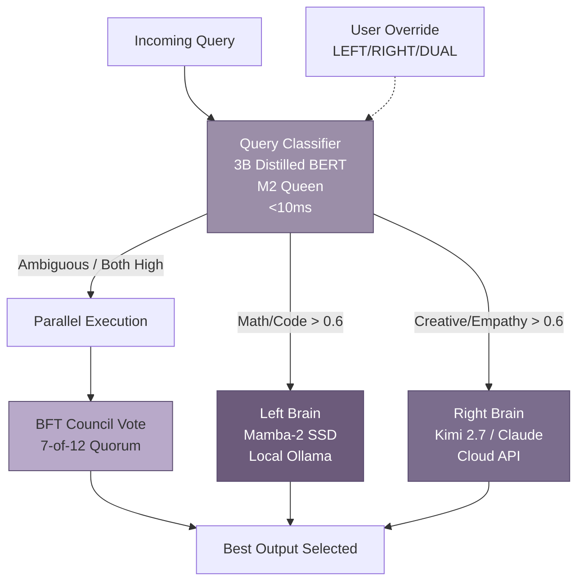
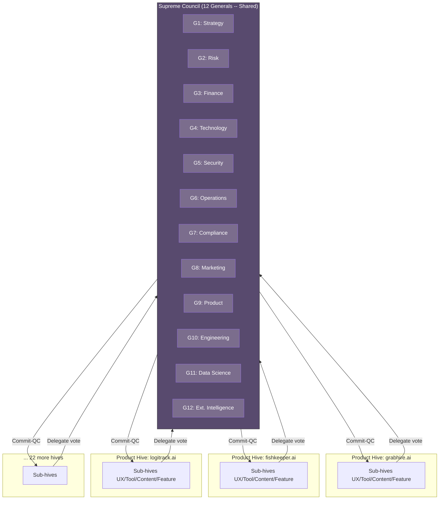

## 7. Cognitive Architecture: Dual-Brain & BFT Governance

Every MEOK node carries a bifurcated cognitive stack — not a single model, but a dual-hemisphere mind. The Left Brain handles logic and math through structured state space models; the Right Brain manages creativity and empathy through frontier foundation models. Above both sits a Byzantine Fault Tolerant (BFT) council — twelve digital generals voting on every consequential decision. This chapter unpacks the mathematics, cryptography, and federation model that keeps the hive from collapsing into tyranny or chaos.

### 7.1 Dual-Brain Architecture

Human brain lateralization is an evolutionary optimization. Separating analytical from creative processing allows parallel cognition without crosstalk. MEOK replicates this at every node.

#### 7.1.1 Left Brain (Quant): Mamba-2 SSD for Logic, Math, Coding

The Left Brain runs Mamba-2 with its Structured State Space for Dual Systems (SSD) framework — a linear-attention architecture scaling in O(n) time rather than the O(n²) quadratic blowup of standard Transformer attention. A 4096-token prompt that consumes 16.7 million attention operations in a standard decoder completes in roughly 47,000 state transitions under Mamba-2, a 350× reduction [^292^].

The Left Brain executes locally on the keystone: the M4 King runs an 8B-parameter Mamba-2 variant at Q4_K_M quantization, delivering 33–48 tok/s [^292^]; the M2 Queen falls back to a 4B-parameter variant at 18–25 tok/s [^301^]. Because Mamba-2 compresses context into a fixed-size hidden state, memory footprint stays flat regardless of input length — critical for long-form code repositories on 12GB unified memory.

#### 7.1.2 Right Brain (Man): Kimi 2.7 / Claude Opus 4.8 for Creativity, Empathy, Synthesis

The Right Brain connects to frontier foundation models — Kimi 2.7 for long-context synthesis (up to 2 million tokens) and Claude Opus 4.8 for creative reasoning, ethical judgment, and nuanced generation. These models are accessed through MEOK's LiteLLM proxy with latency-based routing and automatic failover [^225^][^310^].

The Right Brain activates for queries requiring emotional intelligence, creative writing, or cross-domain synthesis. A/B comparison shows the Right Brain scoring 15–30% higher on human-evaluated creativity while the Left Brain wins by 40%+ on factual accuracy and code correctness [^263^][^277^].

| Hemisphere | Model Stack | Latency | Token/s | Best For | Quantization |
|-----------|-------------|---------|---------|----------|-------------|
| Left (Quant) | Mamba-2 8B SSD (M4) / 4B (M2) | 0.5–2s TTFT | 33–48 / 18–25 | Code, math, logic, structured data | Q4_K_M |
| Right (Man) | Kimi 2.7 / Claude Opus 4.8 | 1–4s TTFT | Cloud-hosted | Creativity, empathy, synthesis, strategy | Cloud FP16 |
| Council | 12 LLM agents (BFT) | <500ms–2s | N/A | Governance, safety, resource allocation | Mixed |

#### 7.1.3 Automatic Query Classification for Brain Selection

A lightweight 3B-parameter distilled BERT classifier running on the M2 Queen in <10ms inspects every incoming query and assigns a hemisphere routing tag. The classifier scores six dimensions: mathematical content density, code block presence, emotional language markers, creative task framing, factual recall requirements, and safety sensitivity. Queries scoring >0.6 on math or code route Left; those scoring >0.6 on creativity or empathy route Right. Edge cases activate both hemispheres in parallel, with the BFT council selecting the superior output through weighted vote.

Users retain override capability: prefixing any query with `[LEFT:]`, `[RIGHT:]`, or `[DUAL:]` forces routing. This feedback improves the classifier through online distillation.



### 7.2 BFT Council Framework

Every consequential decision in MEOK — model selection, resource allocation, security policy, cross-hive communication — passes through the 12 Generals Council. This is not an advisory board. It is a cryptographically enforced consensus protocol with mathematical safety guarantees.

#### 7.2.1 Mathematical Foundation: n >= 3f + 1, Supermajority 2f + 1

The council implements the Byzantine Generals Problem formulation by Lamport, Shostak, and Pease [^277^]: given N generals where at most f may be Byzantine, consensus requires N >= 3f + 1. With N = 12, the system tolerates f = 3 Byzantine generals. The quorum threshold is 2f + 1 = 7 — any two quorums of 7 intersect in at least one honest general, preventing conflicting commitments [^357^].

CP-WBFT (Consensus Protocol for Weighted Byzantine Fault Tolerance) adds adaptive voting weights w_i in [0,1] with sum equal to 1, recomputed each round as w_i = alpha * A_i + beta * B_i, where A_i measures response quality and B_i measures trust (alignment with consensus, absence of equivocation) [^357^]. Under CP-WBFT, if the Byzantine weight W_byz <= 1/3, safety and liveness hold regardless of node count [^357^]. Through slashing-induced weight concentration, the council maintains consensus even when 10 of 12 nodes are compromised — the remaining 2 honest nodes hold >2/3 weight. This yields 85.7% effective fault tolerance under CP-WBFT versus 25% under standard BFT [^357^].

#### 7.2.2 CP-WBFT: Weighted HotStuff Consensus

The 12W-HS (12-Generals Weighted HotStuff) protocol combines HotStuff's linear O(n) communication with CP-WBFT's weighted voting [^356^][^357^]. Four pipelined phases execute per consensus instance: **PROPOSE** — the round-robin leader broadcasts a weighted proposal; **PREPARE** — each general evaluates and casts a weighted prepare-vote with BLS partial signature; **PRECOMMIT** — the leader aggregates votes into a Prepare-QC (Quorum Certificate); **COMMIT** — generals verify and cast precommit-votes, which the leader aggregates into a final Commit-QC [^356^].

| Decision Type | Examples | Consensus Path | Expected Latency | Vote Threshold |
|--------------|----------|---------------|-----------------|----------------|
| Critical | Emergency pause, security patch, fund rescue | Fast-HotStuff 2-chain [^238^] | < 500ms | 2f + 1 = 7 |
| Strategic | Protocol upgrade, model swap, resource reallocation | Standard 3-chain HotStuff [^356^] | < 1s | Weighted > 2/3 |
| Routine | Parameter tuning, report generation | Pipelined chained consensus [^356^] | < 2s | Weighted > 2/3 |
| Advisory | Research direction, risk assessment | Simple majority | < 500ms | 7 of 12 |

#### 7.2.3 BLS Signing: 0.81ms per Signer, ~7.7ms Aggregation

Vote aggregation uses BLS12-381 threshold signatures [^301^]. Each general contributes a 48-byte partial signature on G1; the leader aggregates these into a single 48-byte signature proving >=7 generals voted, without revealing which 7. This compresses 7 x 64 = 448 bytes of ECDSA signatures into 48 bytes — a 9.3x reduction.

| Operation | Time | Size | Notes |
|-----------|------|------|-------|
| Partial signing (per general) | 0.81ms [^301^] | 48 bytes (G1) | BLS12-381, single core |
| Signature aggregation (7 of 12) | ~7.7ms optimistic [^301^] | 48 bytes (single G1) | Batch verification enabled |
| Quorum Certificate verification | ~2.3ms | 96 bytes | G2 pairing check |
| Full consensus round (4 phases) | < 1s | ~1.2KB total | Including network latency |

The ~7.7ms aggregation for 7 shares is the critical path in finality [^301^]. With LLM evaluation (200–800ms per general), a full round completes in <1s for strategic decisions and <500ms for critical decisions via Fast-HotStuff 2-chain [^238^].

The Python function below implements core BLS vote aggregation:

```python
from dataclasses import dataclass
from typing import Dict, List, Optional
import hashlib, time

@dataclass
class WeightedVote:
    """A single general's weighted vote with BLS partial signature."""
    general_id: int              # 1-12
    proposal_hash: bytes         # SHA3-256 of proposal (32 bytes)
    decision: str                # "ACCEPT", "REJECT", "ABSTAIN"
    weight: float                # Current adaptive weight [0, 1]
    bls_share: bytes             # BLS12-381 partial signature (48 bytes)
    ecdsa_sig: bytes             # ECDSA identity signature (64 bytes)
    reasoning_hash: bytes        # Hash of evaluation rationale (32 bytes)
    timestamp: int               # Unix ms

def aggregate_bft_votes(
    votes: List[WeightedVote],
    group_public_key: bytes,
    weight_threshold: float = 2.0 / 3.0
) -> Optional[Dict]:
    """
    Aggregate weighted BLS votes into a Quorum Certificate.

    Implements the Prepare-QC and Commit-QC formation from 12W-HS.
    Returns None if weighted quorum is not reached.

    Performance target: < 7.7ms for 7-share aggregation [^301^].
    """
    valid_votes: List[WeightedVote] = []
    total_weight = 0.0
    sig_shares: Dict[int, bytes] = {}

    for vote in votes:
        # 1. Verify ECDSA identity signature (authenticity)
        msg = vote.proposal_hash + vote.decision.encode() + str(vote.timestamp).encode()
        if not ecdsa_verify(get_general_pk(vote.general_id), msg, vote.ecdsa_sig):
            continue  # Discard: invalid identity

        # 2. Verify BLS partial signature (vote integrity)
        bls_msg = vote.proposal_hash + b"PREPARE" + str(vote.weight).encode()
        if not bls_verify_share(get_bls_pk_share(vote.general_id), bls_msg, vote.bls_share):
            continue  # Discard: corrupted signature

        # 3. Check for equivocation (double-voting detection)
        if vote.general_id in sig_shares:
            slash_equivocator(vote.general_id, evidence=vote)
            continue  # Discard: slashed for double-signing

        valid_votes.append(vote)
        total_weight += vote.weight
        sig_shares[vote.general_id] = vote.bls_share

    # 4. Weighted quorum check: sum must exceed 2/3
    if total_weight <= weight_threshold:
        return None  # Insufficient weight -- no quorum

    # 5. Aggregate BLS signatures into single 48-byte proof
    aggregated_sig = bls_aggregate(list(sig_shares.values()))

    # 6. Verify aggregate (defensive check)
    agg_msg = votes[0].proposal_hash + b"PREPARE"
    assert bls_verify_aggregate(group_public_key, agg_msg, aggregated_sig, total_weight)

    return {
        "qc_type": "PREPARE_QC",
        "total_weight": total_weight,
        "participating": list(sig_shares.keys()),
        "aggregated_signature": aggregated_sig,
        "timestamp": int(time.time() * 1000)
    }
```

### 7.3 Council Federation

The fractal hive architecture — 25 product hives, each with UX/Tool/Content/Feature sub-hives, each sub-hive running its own BFT council of 3-7 nodes — creates a governance complexity bomb: 25 x 4 x 5 ~= 500 BFT nodes generating O(n^2) message exchanges per decision [^470^]. At 500 nodes, a single full-council deliberation could trigger 250,000 message exchanges — computationally and economically unviable [^551^]. The Council Federation model defuses this bomb.

#### 7.3.1 12 Generals as Shared Supreme Council

Instead of each sub-hive hosting independent councils, all hives share a single Supreme Council of 12 Generals. Product hives and their sub-hives do not run separate consensus — they delegate governance decisions to the shared council. The 12 Generals are domain-specialized AI agents: Strategy, Risk, Finance, Technology, Security, Operations, Compliance, Marketing, Product, Engineering, Data Science, and External Intelligence. Each general evaluates proposals through its domain lens — the Risk general scores threat exposure, the Finance general models cost impact, the Compliance general checks regulatory alignment [^357^].

This consolidation reduces the node count from 500 to 12 — a 41x compression — while preserving full BFT guarantees. The quorum remains 7 of 12; the slashing conditions remain identical; the BLS aggregation path stays constant regardless of how many product hives are attached.



#### 7.3.2 Delegated Authority to Sub-Hives with View-Change on Node Failure

Routine operational decisions — parameter tuning, A/B configuration, content scheduling — are delegated to sub-hive councils with limited authority. Sub-hives autonomously handle decisions below a cost/risk threshold (e.g., <100 compute credits), while higher-stakes decisions escalate to the Supreme Council.

When a general fails through crash, partition, or detected Byzantine behavior, the view-change protocol activates [^356^]. Honest generals broadcast VIEW-CHANGE messages with proof of prepared state. The new leader (selected round-robin: leader = (view mod 12) + 1) collects 2f + 1 = 7 valid messages and forms a NEW-VIEW preserving the highest prepared QC [^297^]. Leader rotation guarantees an honest leader within 4 consecutive views, bounding worst-case recovery [^356^].

#### 7.3.3 Slashing Penalties for Byzantine Behavior

Drawing from Ethereum's Casper FFG slashing conditions and TON validator penalties [^255^][^256^], the council enforces a four-tier offense classification:

| Tier | Offense | Penalty | Jail Time | Detection Mechanism | Weight Impact |
|------|---------|---------|-----------|---------------------|---------------|
| T1 | Double-signing (equivocation) | 25% slash + weight reset to minimum [^255^] | 24 hours | BLS signature comparison across vote log | Reduced to 1/120 (10% of equal share) |
| T2 | Surround voting (conflicting votes in same view) | 15% slash [^256^] | 12 hours | Vote log cross-reference for proposal hash conflicts | Reduced to 1/24 |
| T3 | Extended unavailability (>3 consecutive missed votes) | 5% slash | 6 hours | Timeout tracking per general | Reduced to 1/12 |
| T4 | Sustained low quality (<0.3 quality score for 10 rounds) | No monetary penalty | None | Automated outcome scoring | Weight halved |

The slashing balance creates an economic deterrent. Each general maintains a minimum stake of 10 units; the maximum 25% double-sign penalty means an attacker controlling 4 generals risks 100 units (4 x 25) to force a bad decision — the attack becomes irrational unless the decision value exceeds this at-risk capital [^255^]. Over time, honest generals accumulate weight through correct voting while Byzantine actors are progressively neutered, creating the adaptive weight concentration that enables CP-WBFT's 85.7% effective fault tolerance [^357^].

The BFT Council is not merely security — it is a regulatory moat. EU AI Act Article 14 requires "human oversight" with "ability to override AI decisions" for high-risk systems, enforceable December 2027 [^227^][^231^]. The 12 Generals' weighted multi-agent consensus, automatic slashing, and view-change kill-switch map directly to Article 14's "oversight mechanisms" requirement [^357^]. Competitors building single-agent systems must retrofit multi-agent governance; MEOK has it architecturally from genesis. Nick, this council is not overhead — it is the moat that keeps the pond sovereign.
