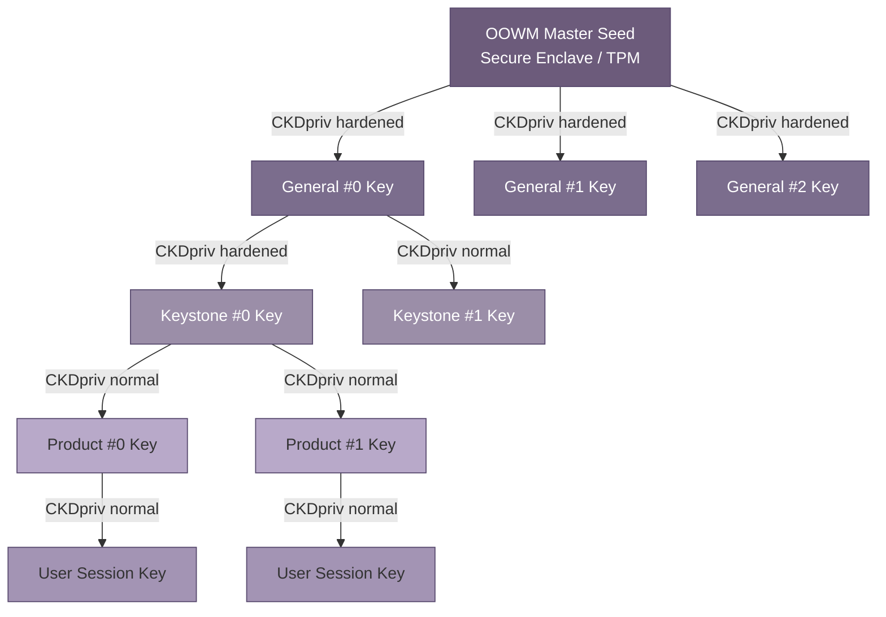
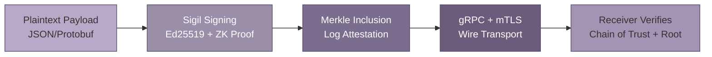

## 8. Security Infrastructure: Sigil Protocol

Every sovereign system faces a paradox: the more intelligent it becomes, the larger its attack surface grows. MEOK's fractal hive architecture — dozens of agents communicating across tiers, executing tools, and synchronizing memory — multiplies this exposure geometrically. The Model Context Protocol (MCP) ecosystem, which MEOK leverages for tool interoperability, has accumulated 10 CVEs in 2025–2026 alone, including critical remote-code-execution vectors [^251^]. Tool poisoning attacks achieve a 60–72% success rate against state-of-the-art LLM agents [^62^], and 36.7% of public MCP servers remain vulnerable to server-side request forgery [^399^]. Against this threat landscape, perimeter defense is insufficient. MEOK requires cryptographic assurance at every layer — a protocol that binds identity, encryption, and audit into a single unbroken chain. That protocol is Sigil.

### 8.1 Sigil Identity System

#### 8.1.1 Hierarchical Key Derivation

Sigil's identity architecture adapts the BIP32-Ed25519 specification [^306^] to create a deterministic, hierarchical key tree that mirrors MEOK's fractal structure. A single 256-bit master seed, generated inside the Apple Secure Enclave and never exported in plaintext, derives the entire key hierarchy through HMAC-SHA512 operations [^239^]. Each derivation level corresponds to an architectural tier, enabling any node to verify the provenance of any other node by traversing the key path upward to the trust anchor.

The derivation path follows SLIP-44 registration with purpose `44'` and coin type `1729'` (Tezos namespace, repurposed for Sigil identities) [^245^]:

```text
m/44'/1729'/0'/0/0   → OOWM Master Sigil (purpose'/coin_type'/account'/change/index)
         │
         ├── m/.../0'/0/0  → General #0
         │       │
         │       ├── m/.../0/0/0  → Keystone #0 (Domain)
         │       │       │
         │       │       └── m/.../0/0/0  → Product #0
         │       │       └── m/.../0/0/1  → Product #1
         │       │
         │       └── m/.../0/0/1  → Keystone #1
         │
         └── m/.../0'/0/1  → General #1
```

Hardened derivations (index ≥ 2^31, denoted by the `'` suffix) require the parent private key, preventing an attacker who compromises a child key from deriving its siblings or ancestors [^251^]. Normal derivations allow "watch-only" agents to derive descendant public keys without holding any private material — a critical property for audit and monitoring nodes that must verify signatures without the ability to sign.

The following table summarizes the security guarantees provided at each derivation level:

| Property | Guarantee | Mechanism |
|---|---|---|
| **Deterministic Derivation** | Same seed always produces identical key tree | HMAC-SHA512 with fixed derivation path [^239^] |
| **Hardened Isolation** | Child key compromise cannot reveal parent | Private-key-dependent derivation at hardened levels [^251^] |
| **Public Derivation** | Watch-only agents derive descendant pubkeys | Non-hardened derivation from extended public key [^306^] |
| **Forward Secrecy** | Leaked sibling key does not affect others | Independent per-index scalar derivation |
| **Post-Quantum Preparation** | Migration path to lattice-based HD wallets | Lattice HD wallet construction compatible [^250^] |

Each Ed25519 signature produced by a derived key occupies 64 bytes — half the size of ECDSA signatures at equivalent security — and supports batch verification for high-throughput agent communication [^240^]. The deterministic signing algorithm eliminates nonce-reuse attacks because no randomness source is required during signature generation. This property is essential in MEOK's multi-agent environment, where entropy failures in one agent could cascade across the hive.

#### 8.1.2 Hardware-Backed Storage

Private keys never leave the device. On Apple platforms, the Secure Enclave Processor (SEP) generates and stores all Sigil key material; signing operations execute inside the isolated SEP hardware boundary with no access from the main CPU or operating system. On other platforms, Sigil integrates with Trusted Platform Module (TPM) 2.0 or ARM TrustZone equivalents. This design ensures that even complete host compromise — root access, kernel exploits, or supply-chain attacks — cannot extract the master seed or any derived private key.



### 8.2 End-to-End Encryption

#### 8.2.1 Ephemeral Session Keys with AES-256-GCM

Every Sigil-secured message traverses a four-stage pipeline: plaintext payload → signed envelope → transparency receipt → encrypted tunnel. The payload is encrypted with AES-256-GCM using an ephemeral session key derived via X25519 elliptic-curve Diffie-Hellman (ECDH). Each session key is rotated every 24 hours or upon explicit revocation, ensuring that long-lived key compromise cannot decrypt historical traffic. The 96-bit nonce is unique per message and derived from a monotonic counter to prevent nonce reuse, which would catastrophicly compromise GCM's confidentiality guarantee.

The encrypted envelope is transmitted over gRPC with mutual TLS 1.3, configured to require `TLS_AES_256_GCM_SHA384` or `TLS_CHACHA20_POLY1305_SHA256` cipher suites [^244^]. Both transport endpoints present X.509 certificates whose subject alternative names encode Sigil derivation paths, enabling identity verification at both the TLS and application layers.

#### 8.2.2 Message Authentication with Merkle Trees

Beyond encryption, Sigil guarantees integrity through HMAC-SHA256 message authentication codes on every envelope. The HMAC key is derived from the session key via HKDF-SHA256 with domain-separated contexts for encryption and authentication. This separation ensures that a compromise of the encryption subkey does not automatically compromise message integrity.

For tamper evidence across the entire system, Sigil maintains a Merkle-tree-backed transparency log inspired by Certificate Transparency (RFC 9162) [^277^][^308^]. Every signed message is appended as a leaf; the Merkle root is recomputed and periodically anchored to a public blockchain via Bitcoin OP_RETURN, creating an immutable timestamped commitment [^276^][^278^]. Any retroactive modification of a logged message would change the Merkle root, breaking the blockchain anchor and immediately alerting all monitoring nodes. Inclusion proofs allow any agent to verify that a specific message was logged at a specific position with O(log n) hash operations.



The Sigil envelope format specifies the complete wire representation:

```protobuf
message SigilEnvelope {
  // Header
  bytes sender_public_key = 1;       // 32-byte Ed25519 public key
  bytes sigil_path = 2;              // BIP32 derivation path
  bytes zkp_credential = 3;          // ZK proof of identity (optional)
  uint64 timestamp = 4;              // Unix nanoseconds
  bytes nonce = 5;                   // 24-byte random nonce

  // Body
  bytes payload = 10;                // AES-256-GCM encrypted payload
  bytes payload_type = 11;           // MIME-type of inner payload

  // Authentication
  bytes hmac_sha256 = 15;            // HMAC over header + body
  bytes ed25519_signature = 20;      // 64-byte signature over all fields

  // Transparency
  bytes merkle_inclusion_proof = 30; // Inclusion proof in tamper-evident log
  bytes block_anchor_txid = 31;      // Blockchain anchor transaction ID
}
```

### 8.3 Access Control & Model Security

#### 8.3.1 Role-Based Access Control

Sigil enforces a four-tier Role-Based Access Control (RBAC) model aligned with MEOK's architectural layers. Each role is bound to a BIP32 derivation depth, and capability inheritance flows downward — an Admin token can access Domain Owner resources, but a Feature Dev token cannot access Admin endpoints. Zero-Knowledge proofs using Groth16 circuits (192-byte proofs, ~1.5ms verification) enable agents to prove tier membership without revealing their full derivation path or public key [^361^].

| Role | Derivation Depth | Capabilities | Scope |
|---|---|---|---|
| **Admin** | Depth 2 (General) | Full system access, key revocation, blockchain anchoring, user provisioning | Cross-domain, all hives |
| **Domain Owner** | Depth 3 (Keystone) | Tool registration, model deployment, RBAC assignment within domain | Single domain, all products |
| **Feature Dev** | Depth 4 (Product) | Tool development, feature flag toggling, limited model fine-tuning | Single product, all sub-hives |
| **End User** | Depth 5 (Session) | Query execution, data retrieval, conversation history | Single product, personal data only |

This model maps cleanly to the BFT Council's consensus hierarchy. The 12 Generals function as collective Admins, each General's vote weighted by stake and signed with its BIP32-derived key. Keystone agents act as Domain Owners, and Product agents as Feature Devs. The ZK capability proof field in the Sigil envelope allows a Product agent to prove it belongs to a specific domain without revealing its full identity — enabling authenticated cross-domain queries while preserving operational security.

#### 8.3.2 Prompt Injection Detection & Sandboxed Execution

MEOK's model security stack addresses the three dominant attack vectors against LLM agents: prompt injection, PII leakage, and malicious tool execution.

**Prompt injection defense** operates at three checkpoints. At registration time, all tool descriptions pass through a validation pipeline — JSON schema validation, pattern matching for known attack signatures, entropy analysis to detect steganography, and similarity comparison against a known-good corpus [^264^]. Only descriptions that survive these deterministic stages reach the LLM judge, an expensive but thorough evaluation against MCPTox-style attack paradigms [^62^]. At runtime, pre-tool and post-tool guardrail hooks scan inputs and outputs for override directives, jailbreaks, and policy violations. At the model layer, input sanitization strips potential injection sequences before they reach the OOWM's context window.

**PII leakage scanning** applies NeMo Curator's PiiModifier at both training and inference stages. All data entering the Fractal Memory pipeline is scanned for personally identifiable information; detected PII is either redacted or encrypted with per-field AES-GCM keys. The same scanning runs on all model outputs before they are returned to users or logged to the audit trail.

**Sandboxed execution** follows a three-tier isolation strategy, summarized in the following table:

| Tier | Runtime | Isolation Level | Boot Time | Max Exec | Security Profile |
|---|---|---|---|---|---|
| **Tier 1: Critical / Untrusted** | Firecracker microVM | Hardware (dedicated kernel) [^217^] | ~125ms | 30s | Fresh VM per session, no host filesystem access [^271^] |
| **Tier 2: Standard** | gVisor | Syscall interception | ~300ms | 60s | ~70 syscalls intercepted, 10–30% CPU overhead [^273^] |
| **Tier 3: Verified Internal** | Hardened container | Process + seccomp | ~100ms | 300s | seccomp + AppArmor + read-only rootfs + dropped capabilities [^270^] |

Critical and untrusted tools execute inside Firecracker microVMs — each running its own Linux kernel with ~125ms cold boot time and hardware-enforced isolation that prevents kernel-based lateral movement even under full compromise [^217^][^271^]. Standard tools run in gVisor, which intercepts ~70 syscalls versus 300+ in standard Linux, reducing attack surface at the cost of 10–30% CPU overhead [^273^]. Verified internal tools execute in hardened containers with seccomp profiles, AppArmor enforcement, read-only root filesystems, and dropped capabilities [^270^].

### 8.4 Sovereignty Guarantees

#### 8.4.1 Zero Data Exfiltration by Default

Sigil's default posture is zero data exfiltration. All inference requests are routed to the local OOWM instance first; only if the keystone's hardware constraints (M4 King: 12GB unified memory; M2 Queen: 8GB) cannot accommodate the requested model size does the system consider a cloud fallback — and this fallback is opt-in per-domain, not global. Every outbound network request from any MEOK agent must pass through the MCP Router's egress filter, which blocks private IP ranges, cloud metadata endpoints (169.254.169.254), and all protocols except HTTPS on port 443 [^247^].

Data residency is enforced cryptographically. Vector embeddings stored in Qdrant, Milvus, or ChromaDB are encrypted client-side before transmission using per-vector AES-GCM keys derived from the Keystone's Sigil key via HKDF-SHA256. None of the major vector database providers offer native per-vector encryption [^336^][^338^]; Sigil compensates at the application layer, ensuring that even database compromise exposes only ciphertext.

#### 8.4.2 Air-Gapped Operation & Complete Traffic Auditability

MEOK supports fully air-gapped deployment. In this mode, all Sigil signatures, Merkle roots, and transparency log operations continue uninterrupted — the protocol does not depend on internet connectivity or external certificate authorities. Blockchain anchoring is deferred: Merkle roots are queued locally and submitted in batch when connectivity resumes. The HMAC-SHA256 audit chain remains intact across the air-gap period, and any tampering during disconnection is detected the moment the blockchain anchor is re-established.

Every packet, signature, and decision is logged to the Sigil Transparency Log with the six essential audit elements: input payload hash, output payload hash, data accessed, model identity, user identity, and nanosecond-precision timestamp [^240^]. These logs feed the AIR Blackbox system (Chapter 7), generating HMAC-SHA256 audit chains that satisfy EU AI Act Article 12 evidence requirements [^251^]. The combination of tamper-evident logging, hierarchical key derivation, and hardware-backed storage creates an unbroken chain of custody from the OOWM master seed down to every individual user query — a cryptographic guarantee that no data leaves MEOK unless its owner explicitly authorizes the exit.
