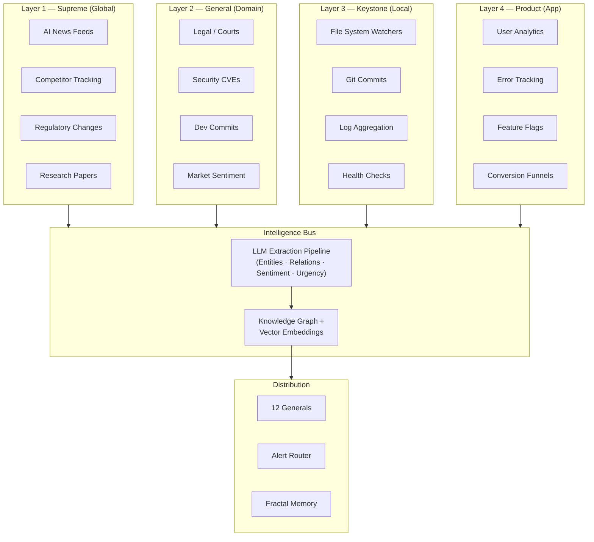

## 9. Horus: The All-Seeing Observation System

Sovereignty without situational awareness is blindness wearing a crown. Horus is MEOK's answer to a brutal truth: in a world where AI capabilities, regulatory frameworks, and attack surfaces evolve on weekly cadences, the builder who sees farthest builds fastest. Named for the Egyptian deity whose eyes surveyed everything, Horus is a four-layer observation architecture that converts the noise of global AI news, domain telemetry, local system events, and application metrics into structured intelligence that feeds every General in the MEOK hierarchy.

### 9.1 Horus Architecture

#### 9.1.1 The 4-Layer Observation Stack

Horus implements a tiered observation model where each layer captures signals at a different scope and granularity. Raw observations from every layer are processed through an LLM-based extraction pipeline — entities, relationships, sentiment, urgency — before distribution via the central Intelligence Bus.

**Layer 1 — Supreme** ingests global AI intelligence: Techmeme headlines via Apify scraper [^549^], Hacker News front-page stories through the Firebase real-time API [^572^], HuggingFace model releases, GitHub trending repositories, and regulatory feeds from EUR-Lex and CISA [^474^]. Crawlee handles production scraping with anti-bot fingerprint randomization [^461^], while Crawl4AI converts JavaScript-heavy pages into LLM-ready markdown [^645^]. changedetection.io monitors competitor pages with visual comparison across 85 notification channels [^452^], and SearXNG provides private meta-search across 70+ engines [^644^].

**Layer 2 — General** focuses on domain-specific signals. The Legal General receives feeds from CourtListener and EU OEIL with LLM-extracted obligation changes. The Risk General tracks sentiment through VADER (-1 to +1 scoring) and HuggingFace Transformers pipelines. The Dev General monitors GitHub events through 73+ webhook types including security advisories and Dependabot alerts [^487^], alongside OpenCVE's database of 350,000+ CVEs with AI-generated impact assessments [^474^].

**Layer 3 — Keystone** watches local infrastructure. Python watchdog monitors file-system events through native OS hooks (inotify, FSEvents, ReadDirectoryChangesW) with minimal overhead [^526^]. Grafana Loki aggregates logs using label-based indexing at 10x lower storage than full-text systems, queried through LogQL [^540^]. Gatus performs health checks across HTTP, TCP, DNS, ICMP, and WebSocket endpoints in 10-30MB RAM [^633^].

**Layer 4 — Product** captures application behavior through PostHog (product analytics, feature flags, session recording), Sentry (error tracking with regression detection), and Prometheus + Grafana for time-series metrics [^541^].

| Layer | Scope | Primary Sources | Key Technologies | Update Frequency |
|-------|-------|----------------|------------------|-----------------|
| L1 Supreme | Global AI industry | Techmeme, HN, HuggingFace, ArXiv, EUR-Lex [^549^][^572^] | Crawlee, Crawl4AI, SearXNG [^461^][^645^][^644^] | Real-time to daily |
| L2 General | Domain-specific | CourtListener, OpenCVE, GitHub webhooks [^474^][^487^] | VADER, n8n workflows [^478^] | Hourly to daily |
| L3 Keystone | Local system | File system, logs, health endpoints [^526^][^540^] | watchdog, Loki, Gatus [^633^] | Real-time (seconds) |
| L4 Product | Application | User events, errors, traces, conversions | PostHog, Sentry, Prometheus | Real-time (seconds) |

The technology choices reflect temporal requirements. Crawlee's browser fingerprinting is acceptable at Layer 1 where seconds do not matter; Gatus's 30-second intervals and watchdog's native OS hooks are essential at Layer 3 where detection latency translates directly to downtime. Daily AI digests generated through n8n aggregate RSS feeds, score importance 1-10 via Gemini, and route to the appropriate General [^456^].

#### 9.1.2 Intelligence Bus for Context Distribution

The Intelligence Bus is Horus's central nervous system. Observations enter a processing pipeline built on Unstructured.io for document parsing across 30+ source connectors [^601^], spaCy for named entity recognition, and LLM-based relationship extraction. Entities populate a Neo4j knowledge graph with temporal annotations [^276^], while vector embeddings store in Qdrant with TurboQuant 1.5-bit quantization achieving 24x compression at ~94% recall [^263^]. Every General subscribes to relevant channels — the Legal General receives regulatory alerts, the Security General receives CVE correlations, the Intelligence General receives competitive analysis. This event-driven design ensures that Layer 1 regulatory changes (e.g., EU AI Act enforcement milestones [^471^]) flow directly to Layer 4 product compliance without manual routing.

### 9.2 Telemetry & Alerting

#### 9.2.1 Real-Time Health Dashboards and Anomaly Detection

Horus integrates Prometheus for time-series metrics with Alertmanager for deduplication, grouping, and label-based routing to Slack, PagerDuty, or email [^545^]. Grafana dashboards visualize log-derived error rates from Loki, endpoint response times from Gatus, and application traces from Jaeger/Tempo. Alertmanager's inhibition feature suppresses low-priority warnings when critical alerts are firing [^541^]. Anomaly detection runs on two tracks: statistical thresholds (p95 latency > 300ms, error rate > 1%) trigger immediate alerts through GoAlert [^515^], while n8n workflows apply Claude AI to score threat severity based on exploitability and blast radius [^478^].

#### 9.2.2 CVE Aggregation: MCP Security Crisis

The MCP ecosystem has emerged as a critical attack surface. With 22,775+ public servers and 97M+ monthly SDK downloads, explosive growth has outpaced security infrastructure, leaving an estimated 200,000+ vulnerable instances [^511^]. Horus tracks MCP-specific CVEs through daily ingestion from NVD, CISA KEV, and GitHub Security Advisories, normalized against MEOK's software inventory with AI-generated threat scoring.

| CVE | Component | CVSS | Attack Vector | Horus Priority |
|-----|-----------|------|---------------|----------------|
| CVE-2025-65720 | MCP SDK (all languages) | 10.0 | STDIO transport RCE (design flaw) [^511^] | Critical — permanent vulnerability |
| CVE-2025-6514 | mcp-remote | 9.6 | Arbitrary OS command execution [^514^] | Critical — remote exploitation |
| CVE-2025-49596 | MCP Inspector | 9.4 | Unauthenticated RCE [^513^] | Critical — admin tooling |
| CVE-2025-54135 | Cursor IDE | 9.0 | MCP config command injection [^52^] | High — IDE surface |
| CVE-2025-54136 | Cursor IDE | 8.8 | MCPoison rugpull via commits [^52^] | High — supply chain |
| CVE-2025-68144 | mcp-server-git | 8.0 | Command injection in git_diff [^512^] | High — file system ops |
| CVE-2025-68143 | mcp-server-git | 7.5 | Path traversal in git_init [^512^] | Medium |
| CVE-2025-68145 | mcp-server-git | 7.5 | Path validation bypass [^512^] | Medium |

The most severe, CVE-2025-65720 with CVSS 10.0, is an architectural design choice: the STDIO transport accepts arbitrary commands passed directly to process execution without validation [^511^]. Anthropic has declined to modify this behavior. Horus addresses it through multi-layer defense: Firecracker microVM sandboxing, registration-time schema validation, LLM-judge scanning for tool description poisoning, and cryptographic tool pinning to detect rug-pulls [^52^]. Broader statistics confirm the scope: 82% of MCP implementations expose path traversal, 67% enable code injection APIs, and 34% allow command injection — across 150M+ package downloads [^512^]. Beyond MCP-specific tracking, OpenCVE maintains a 60-day rolling window aggregating NVD, MITRE, CISA KEV, and Red Hat feeds with AI-powered enrichment [^474^], while TheHive + Cortex provides SOAR integration with 300+ threat analyzers [^595^].

### 9.3 The Intelligence Flywheel

#### 9.3.1 From Observation to Action

Horus does not merely observe — it feeds. Layer 1 scrapes global AI news and competitor releases; this unstructured intelligence passes through the LLM extraction pipeline into the Fractal Memory system, where it is embedded, compressed, and stored in the Supreme layer's Neo4j knowledge graph and Qdrant vector store. Hierarchical summarization folds observations into compressed insight nodes that propagate downward — from Supreme to User layers — achieving 98%+ effective compression through TurboQuant 1.5-bit quantization (24x compression) [^263^] and RaBitQ binary projection (32x at >94% recall) [^279^].

These compressed insights become training data for the OOWM (Organic Open World Model). Nick's 15 years of domain data — construction decisions, aquaculture optimizations, logistics routing — combine with Horus-derived market intelligence to produce a world model that understands both Nick's expertise and the competitive landscape. Fine-tuning on this composite dataset produces better products: more accurate predictions, more relevant recommendations, more timely alerts. Better products attract more users, and more users generate more operational data that Horus captures, compresses, and feeds back into the cycle.

#### 9.3.2 Self-Improving Loop: Compression Enables Exponential Moat Growth

The critical economic insight is the compression ratio. Raw data volume is not a moat — anyone can scrape Techmeme or download Common Corpus. But the Fractal Memory architecture compresses data 24-32x at each level while maintaining 94%+ recall [^263^][^279^]. As MEOK adds users and Horus ingests more signals, the storage cost per insight decreases. Competitors without hierarchical summarization face linearly growing costs; MEOK's curve bends downward. Over time, MEOK can afford to retain intelligence that competitors must discard — creating an ever-widening observational gap [^501^].

This is the AI Knowledge Flywheel in its purest form: "model intelligence, performance, and efficiency increase with industry application and usage" [^501^]. Horus provides the sensory input. Fractal Memory provides the compression substrate. OOWM provides the learning engine. The product layer provides distribution. Each iteration generates more data, trains a better model, creates a better product, and attracts more users. Nick, this is where the pond gets deep — and only the dragon who sees the entire surface can claim the water.
