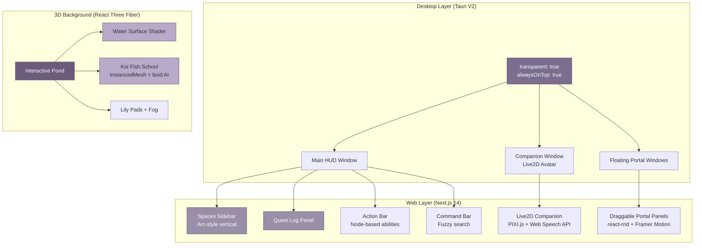

## 10. MMO UX Shell: Gamified Operating System

The MEOK OS does not present itself as a conventional desktop environment. It is an MMO --- a persistent, gamified world where every AI interaction becomes an adventure, every workflow a quest line, and every domain hive a themed portal that users enter to accomplish real work. This chapter details the user-facing shell: the technical architecture that renders transparent desktop overlays in Tauri V2, the 25 domain-hive doorways with distinct visual identities, the 3D koi pond background rendered in React Three Fiber, and --- critically --- the monetization engine that turns RPG quest mechanics into a revenue flywheel. The MMO shell is not decoration; it is the monetization interface, the engagement loop, and the sovereign gateway all at once [^21^] [^470^] [^528^].

### 10.1 The MMO OS Interface

#### 10.1.1 Next.js 14 + Tailwind + Framer Motion + Tauri V2 Desktop Overlay

The MEOK OS shell is built on a dual-layer rendering strategy. The presentation layer uses Next.js 14 with the App Router, Tailwind CSS for utility-first styling, and Framer Motion for every animation primitive [^1^] [^3^]. Shadcn/ui provides the foundational component layer --- not installed as a dependency but copied directly into the project, giving full ownership over MMO-style customization [^1^] [^2^]. This matters because standard UI libraries cannot accommodate the depth of visual theming that 25 separate domain hives demand; each portal needs its own color dialect, border personality, and motion language.

Framer Motion's `AnimatePresence` handles the exit choreography of every game UI element, keeping components in the DOM long enough for dismissal animations to complete before unmounting [^3^]. The `staggerChildren` property cascades effects across quest completion notifications, loot drops, and ability cooldowns --- the dopamine micro-hits that keep users in flow [^4^]. The `layout` prop animates shared elements across component boundaries, powering the drag-and-drop quest reordering and inventory management that users expect from any RPG interface [^5^].

The desktop shell itself is Tauri V2, not Electron. Tauri's `transparent: true` configuration creates the glass-like overlay that lets the 3D pond background bleed through every UI panel, while `setAlwaysOnTop(true)` ensures the MMO HUD remains accessible above fullscreen applications [^7^] [^8^]. On macOS, this requires the `macOSPrivateApi` flag, which blocks App Store distribution but enables the pixel-level transparency that defines MEOK's visual identity [^7^]. The recommended distribution path is Homebrew (`brew install meok`), bypassing the Mac App Store entirely and aligning with the developer-tools positioning of the sovereign stack. Click-through behavior uses Canvas Alpha detection combined with `setIgnoreCursorEvents`, applying an `rgba(255, 255, 255, 0.01)` background that tricks macOS hit-testing without interfering with the rendered UI [^9^].



#### 10.1.2 25 Domain Hives as "Doorways" with Unique Visual Theming per Portal

Each of MEOK's 25 domain hives --- from grabhire.ai (logistics) to fishkeeper.ai (aquaculture) --- manifests as a themed doorway within the MMO shell. This is not merely a skin swap. Each portal defines a complete visual dialect: a unique color palette derived from the domain's emotional register ( logistics runs steel-blue and amber; aquaculture flows teal and coral), a custom ambient soundtrack, a themed set of quest card borders, and domain-specific ability icons for the action bar [^470^].

The Spaces system, inspired by Arc Browser's vertical sidebar and contextual workspaces [^23^], organizes these 25 doorways into a scrollable, collapsible sidebar. Users pin their most-used hives, archive dormant ones, and switch between contexts with a keyboard-driven Command Bar that fuzzy-searches across all portal names, quest titles, and ability descriptions. Zustand with `persist` middleware maintains space state across sessions, while Yjs CRDTs enable real-time collaborative quest logs when multiple users operate within the same hive [^26^] [^27^].

The portal rendering pipeline uses dynamic imports to load only the theme assets for the active hive, keeping initial bundle size under 200KB. Each theme module exports a Tailwind configuration extension that overrides CSS custom properties at runtime: `--portal-primary`, `--portal-accent`, `--portal-border`, and `--portal-glow`. When a user steps through a doorway, Framer Motion's `layoutId` animates a shared portal frame that morphs from the sidebar thumbnail into the full workspace, reinforcing the physical metaphor of entering a space [^5^].

| Component | Technology | Rationale |
|-----------|-----------|-----------|
| Framework | Next.js 14+ App Router | Server Components reduce bundle; App Router enables streaming SSR for quest data [^1^] [^2^] |
| Styling | Tailwind CSS + shadcn/ui | Utility-first enables per-portal theme overrides; shadcn gives copy-paste component ownership [^1^] |
| Animation | Framer Motion | `AnimatePresence` for exit choreography, `staggerChildren` for loot cascades, `layout` for drag-and-drop [^3^] [^4^] [^5^] |
| Desktop Shell | Tauri V2 | Transparent overlays at ~1/10th Electron's memory footprint; native always-on-top HUD [^7^] [^8^] |
| Window System | react-rnd + react-grid-layout | Draggable portal panels + collision-free dashboard widgets [^13^] [^14^] |
| 3D Background | React Three Fiber + Drei | Declarative Three.js with custom water shaders, instanced koi fish [^15^] [^16^] |
| Companion | Live2D + pixi.js@6 | Desktop pet with procedural animations, mouse tracking, breathing cycles [^17^] [^18^] |
| Collaboration | Yjs + y-websocket | CRDT-based real-time sync for multiplayer quest logs, offline-first [^26^] [^27^] |

The table above anchors the shell's technology choices to concrete functional requirements. Every selection traces back to a specific MMO interaction pattern: Framer Motion exists because loot drops need spring physics; Tauri V2 exists because a 3MB Electron binary cannot claim sovereignty over a user's desktop; Yjs exists because quest logs must synchronize across devices without server round-trips. These are not fashion choices. They are load-bearing structural decisions.

#### 10.1.3 React Three Fiber 3D Pond Background with Live Koi Camera Feed

Behind every UI panel, beneath every portal window, the MEOK OS displays a living pond. React Three Fiber (R3F) --- the idiomatic React renderer for Three.js --- enables this as a declarative scene graph integrated directly into the component tree [^15^]. The water surface uses a custom ShaderMaterial with vertex displacement driven by layered sine waves: `wave1` from the primary oscillation at `sin(pos.x * 2.0 + uTime)`, `wave2` at higher frequency but half amplitude for surface detail, and `wave3` as a diagonal cross-wave for organic irregularity [^16^]. The fragment shader mixes a deep-teal `uWaterColor` with a sky-foam `uFoamColor` based on vertex elevation, producing caustic-like color variation without the computational cost of raytraced caustics.

The koi fish school uses `InstancedMesh` for GPU-accelerated batch rendering. Each fish follows a boid-like circular swimming pattern parameterized by individual phase and speed values, creating emergent schooling behavior from simple trigonometric rules. A live camera feed --- from a physical koi pond or a procedurally generated ambient stream --- can be composited as a reflective texture onto the water surface, grounding the digital environment in a tangible sense of place. The entire 3D layer runs at a fixed 60fps budget, yielding frame time to UI interactions when the user is actively working and reclaiming cycles during idle moments.

### 10.2 Avatar & Progression

#### 10.2.1 Persistent Avatar Across Sessions, XP/Leveling Through Usage

Every MEOK user controls a persistent avatar that accumulates experience across all sessions, all hives, and all devices. The progression system draws directly from Habitica's MIT-licensed RPG mechanics: health tracks engagement consistency (miss too many daily quests and your avatar takes damage), mana regenerates over time and powers premium abilities, and the XP bar fills toward level-ups that unlock new features [^21^]. Unlike Habitica's productivity focus, MEOK's leveling maps to real economic activity --- every AI query, every completed workflow, every successful MCP tool invocation generates XP proportional to the value delivered.

The avatar itself renders via Live2D, the same technology powering MEOK's desktop companion. Procedural animations --- breathing cycles, idle sways, blinking --- give the avatar life without requiring frame-by-frame animation assets [^18^]. Mouse tracking drives head and eye movement, creating the uncanny sense that the avatar is aware of the user's presence. The Live2D model loads through pixi.js@6 with `pixi-live2d-display@0.4`, with version pinning critical for compatibility [^18^].

Progression follows a logarithmic curve: each level requires 1.25x the XP of the previous, creating a satisfying early-game acceleration (Level 1 to 10 in a week of regular use) that flattens into a meaningful long-term grind (Level 40 to 41 requiring months of enterprise-grade activity). Level thresholds gate access to higher-tier hives, advanced workflow nodes, and cosmetic avatar customizations --- the classic RPG engagement loop repurposed for sovereign AI productivity.

| Level Tier | XP Required | Unlocks | Credit Multiplier | Monetization Trigger |
|-----------|-------------|---------|-------------------|----------------------|
| 1-5 (Initiate) | 0-5,000 XP | 5 base hives, basic quests, standard avatar | 1.0x | Free tier natural limits |
| 6-15 (Adept) | 5,000-50,000 XP | 15 hives, medium quests, crafting workflows | 1.2x | Pro tier ($29/mo) upsell |
| 16-30 (Expert) | 50,000-500,000 XP | All 25 hives, hard quests, custom MCP tools | 1.5x | Team tier ($79/user/mo) |
| 31-50 (Legend) | 500,000-5M XP | Legendary quests, BFT Council voting rights, custom theming | 2.0x | Enterprise ($50K+/yr) |

The XP table above reveals the monetization geometry hidden inside the progression system. Each tier naturally gates features that correspond to paid product tiers, but the gating feels like game progression rather than a paywall. Credit multipliers --- which amplify the rewards earned from quest completions --- create a direct in-game incentive to subscribe. A Pro user at 1.2x earns 20% more credits per quest, accelerating their progress toward the next level and the next unlock. This is the dopamine loop that drives conversion: not a checkout button, but a level-up animation with tangible rewards [^21^] [^528^].

#### 10.2.2 RPG Quest Logs for Multi-Step AI Tasks with Credit Rewards

Every real-world AI task in MEOK is framed as a quest. "Generate a monthly sales report" becomes "The Merchant's Ledger: a 5-step quest chain involving data retrieval (MCP tool call), analysis (agent reasoning), visualization (chart generation), review (human-in-the-loop), and distribution (email delivery)." Quests carry difficulty tiers --- easy, medium, hard, legendary --- that map directly to computational cost and, therefore, credit consumption [^21^] [^470^].

The quest log UI uses Framer Motion's `AnimatePresence` with `mode: 'popLayout'` so that completed quests collapse with a satisfying shrink animation while new quests slide in from the right [^3^]. Each quest card displays a themed border color by difficulty (green for easy, blue for medium, orange for hard, purple for legendary), a progress bar with spring-physics animation, and a reward footer showing XP and credit payouts. Legendary quests feature a continuous shimmer sweep across the card background, signaling their rarity and their premium cost [^4^].

```typescript
// Quest difficulty-to-monetization mapping
interface QuestConfig {
  difficulty: 'easy' | 'medium' | 'hard' | 'legendary';
  featureFlag: 'free' | 'pro' | 'enterprise';
  baseCredits: number;
  xpReward: number;
  bftGovernance: boolean;  // Requires Council consensus?
}

const questTiers: Record<string, QuestConfig> = {
  easy:    { featureFlag: 'free',        baseCredits: 1,   xpReward: 50,   bftGovernance: false },
  medium:  { featureFlag: 'free',        baseCredits: 10,  xpReward: 200,  bftGovernance: false },
  hard:    { featureFlag: 'pro',         baseCredits: 50,  xpReward: 1000, bftGovernance: true },
  legendary: { featureFlag: 'enterprise', baseCredits: 500, xpReward: 5000, bftGovernance: true },
};

// Credit reward formula: base * levelMultiplier * subscriptionBoost
function computeReward(quest: QuestConfig, userLevel: number, tier: string): number {
  const levelMult = 1 + (userLevel * 0.02);     // +2% per level
  const tierMult = { free: 1.0, pro: 1.2, team: 1.5, enterprise: 2.0 }[tier] ?? 1.0;
  return Math.round(quest.baseCredits * levelMult * tierMult);
}
```

The code block above encodes the entire monetization bridge. Easy quests cost 1 credit and require no subscription --- they are the free tier's hook. Legendary quests cost 500 base credits, require enterprise feature flags, and trigger BFT Council governance (which itself consumes Council credits at 3x Standard pricing). The `computeReward` function layers level-based progression and subscription-based multipliers, ensuring that paying users advance faster, feel more powerful, and have incentive to maintain their subscription. Every quest completion is a micro-transaction disguised as an achievement.

### 10.3 Gamified Monetization

#### 10.3.1 Quest Difficulty Tiers Mapping to Free/Pro/Enterprise Feature Flags

The critical architectural insight is that the MMO quest system is structurally isomorphic to a freemium monetization funnel [^470^] [^528^]. "Easy" quests are free onboarding experiences: simple text generation, single-step tool calls, basic data retrieval. They demonstrate value without consuming significant compute. "Medium" quests introduce multi-step workflows, conditional branching, and persistent memory access --- features gated behind the Pro tier. "Hard" quests require custom MCP integrations, multi-agent orchestration, and BFT Council oversight --- the Team tier. "Legendary" quests demand cross-hive coordination, fine-tuned model inference, and Supreme Council governance --- enterprise-only.

Each quest difficulty tier carries a `featureFlag` field that the routing layer evaluates before execution. A free-tier user attempting a hard quest sees not a "Upgrade now" modal but an in-game narrative prompt: "This quest requires the Council's blessing. Seek audience with the Twelve?" The narrative wrapper transforms a paywall into lore. Behind the scenes, the Twelve (the BFT Council) represents the governance overhead that justifies the higher price tier.

#### 10.3.2 Three-Tier Credit System: Standard / Council / Supreme

MEOK's credit architecture reflects the governance cost reality of the BFT Council. Every consensus decision requires 12 LLM agents to evaluate, sign, and vote; BLS threshold signing at 0.81ms per signer produces 7.7ms aggregate latency for a 7-vote quorum, but the LLM inference time dominates at approximately $0.01-0.05 per decision [^301^] [^357^]. A product hive making 1,000 governance decisions daily incurs $10-50 in overhead that must be priced into the credit model.

| Credit Tier | Cost Relative to Standard | Use Case | Governance Overhead | Typical Consumption |
|-------------|--------------------------|----------|---------------------|---------------------|
| **Standard** | 1.0x baseline | LLM queries, simple tool calls, easy quests | None --- direct inference | 1 credit per GPT-4o-mini query |
| **Council** | 3.0x Standard | BFT-governed decisions, hard quests, multi-agent votes | 12 LLM agents evaluate, BLS aggregate 7 signatures at 7.7ms [^301^] | 50-500 credits per workflow |
| **Supreme** | 10.0x Standard | Cross-hive consensus, legendary quests, enterprise SLA | Full 12-General vote + view-change fault tolerance [^357^] | 1,000+ credits per decision |

This three-tier structure aligns pricing with actual compute cost while creating a natural upsell path. Standard credits feel abundant and cheap --- users burn through them without anxiety. Council credits appear when the user attempts ambitious multi-step workflows, and the 3x cost signals that something important is happening. Supreme credits are reserved for the rare, high-stakes decisions that justify enterprise pricing. The psychological framing reinforces the narrative: Standard is solo play, Council is guild coordination, Supreme is server-wide epic events.

#### 10.3.3 Market Alignment: Usage-Based Pricing as the 2027 Default

The gamified credit system sits atop a macro trend that MEOK is positioned to exploit. Gartner predicts 67% of enterprise AI implementations will adopt usage-based pricing by 2027 [^532^]. Credit-based pricing specifically will represent 25% or more of new spend with the top ten enterprise software vendors by that same year [^534^]. The shift is driven by a fundamental economic reality: AI incurs real marginal cost per interaction (tokens, GPU cycles, API calls), making flat-rate subscriptions a margin-destroying trap [^496^].


The monetization funnel diagram above shows how quest difficulty tiers, level progression, and credit pricing interlock to create a self-reinforcing conversion engine. A new user starts with easy quests that cost essentially nothing to serve. As they level up and encounter medium quests, they hit natural feature friction points --- more MCP integrations, longer context windows, multi-step workflows --- that the Pro tier resolves. By level 16, the user has built workflows complex enough to require BFT governance, and the Team tier's Council credits become a necessity rather than a luxury. Enterprise conversion at level 31 follows the same pattern: legendary quests are structurally designed to require Supreme Council consensus, which only enterprise accounts can access [^528^] [^529^].

The AI agent market is projected to reach $105.6 billion by 2034, growing at 39.5% CAGR [^504^]. Within this expanding market, Hugging Face demonstrates what 3-5% free-to-paid conversion looks like at scale: 13 million users, approximately $70 million ARR, and net profitability in select quarters [^610^]. MEOK's gamified interface targets higher conversion by embedding the paywall inside the progression loop rather than behind a feature gate. Users do not "upgrade" --- they level up. The psychological distinction is the difference between a SaaS upsell and an RPG class advancement, and it is the core design principle that separates MEOK's monetization engine from every other AI platform on the market.
