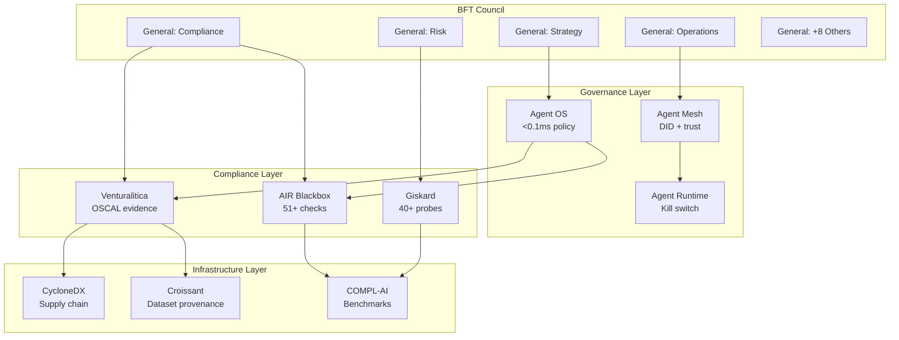

## 12. EU AI Act Compliance Framework

The EU AI Act is not a distant regulatory spectre. It is a structural force reshaping the competitive landscape of artificial intelligence—and MEOK's architecture turns compliance from a cost centre into an uncopyable moat. While competitors scramble to bolt oversight mechanisms onto monolithic agents, MEOK's BFT Council was built as a multi-agent oversight system from the ground up. The 12 Generals *are* Article 14 human oversight by design. This chapter maps every EU AI Act requirement to a MEOK implementation, quantifies the enforcement cliff, and details the compliance tooling stack that automates evidence generation across the full regulatory lifecycle.

### 12.1 The Compliance Cliff

#### 12.1.1 The Enforcement Geometry

The Digital Omnibus agreement of May 2026 restructured the EU AI Act's enforcement timeline into a staggered cascade from August 2026 to August 2028 [^227^][^228^]. The penalty framework under Article 99 exceeds even GDPR: Tier 1 (prohibited AI practices) attracts fines up to EUR 35 million or 7% of global turnover; Tier 2 (high-risk obligations, transparency) reaches EUR 15 million or 3%; Tier 3 (procedural violations) caps at EUR 7.5 million or 1% [^378^][^372^]. For a EUR 1 billion enterprise, Tier 1 exposure can reach EUR 70 million [^372^].

The staggered geometry gives MEOK a narrow runway. Article 50 transparency obligations bind from August 2, 2026 [^228^]. Annex III high-risk obligations defer to December 2, 2027, with Annex I embedded systems following on August 2, 2028 [^227^]. This 17-month gap is MEOK's compliance window: the period to ship product hives with built-in governance and establish presumption of conformity before the Annex III cliff forces every enterprise to scramble.

| Milestone Date | Provision | Financial Exposure | MEOK Status |
|---|---|---|---|
| August 2, 2026 | Art. 50 transparency + Art. 4 AI literacy [^228^] | Tier 2: EUR 15M / 3% | Built-in: C2PA watermarking; MMO quest system gamifies literacy training |
| December 2, 2027 | Annex III standalone high-risk obligations [^227^] | Tier 2: EUR 15M / 3% | BFT Council provides Art. 14 oversight; Venturalitica auto-generates Annex IV docs |
| August 2, 2028 | Annex I embedded high-risk obligations [^227^] | Tier 2: EUR 15M / 3% | AIR Blackbox 51+ checks + Giskard red-teaming validate embedded agent decisions |
| Ongoing | Art. 5 prohibited practices | Tier 1: EUR 35M / 7% | Microsoft Agent Governance Toolkit blocks prohibited actions at <0.1ms p99 [^90^] |

Every provision maps to an existing MEOK component. Transparency maps to the MMO UX shell's metadata pipeline. High-risk oversight maps to the BFT Council's weighted consensus. Prohibited practices map to the Microsoft Toolkit's policy engine. This is *architectural* compliance—built in, not bolted on.

#### 12.1.2 The COMPL-AI Reality Check

COMPL-AI, developed by ETH Zurich, INSAIT, and LatticeFlow AI, is the first technical interpretation of the EU AI Act as an LLM benchmarking suite. It evaluated 12 prominent LLMs across 29+ benchmarks mapped to the Act's requirements [^328^][^43^]. The result: **zero of 12 tested LLMs fully comply**. Critical shortcomings cluster in robustness, safety, diversity, fairness, and explainability [^43^].

No foundation model provider ships a regulation-ready product. Every enterprise deployment requires a governance layer the provider does not supply. MEOK's BFT Council *is* that layer: 12 specialised agents reviewing every decision, generating audit trails, enforcing policy before execution. In a market where zero foundation models pass regulatory muster, the system guaranteeing compliant execution becomes the system enterprises buy.

### 12.2 BFT Council as Article 14 Oversight

#### 12.2.1 12 Generals IS Multi-Agent Human Oversight by Design

Article 14 requires high-risk AI systems to enable "effective oversight by natural persons" with five capabilities: monitoring operation, avoiding automation bias, interpreting output, overriding output, and interrupting operation via a "stop button" [^428^][^429^]. For most vendors, Article 14 is a retrofit nightmare. For MEOK, it describes the BFT Council.

| Art. 14 Requirement | Regulatory Text | BFT Council Implementation | Latency |
|---|---|---|---|
| (a) Monitor operation | "Understand capacities and limitations, detect anomalies" [^429^] | 12 Generals independently evaluate proposals; anomaly detection via weighted deviation | < 500ms |
| (b) Avoid automation bias | "Remain aware of tendency to over-rely on AI output" [^429^] | Slashing penalises generals that over-endorse consensus | Per round |
| (c) Interpret output | "Understand interpretation tools and methods" [^429^] | Structured reasoning with every vote; hashes notarised on-chain [^333^] | < 1s |
| (d) Override output | "Decide not to use the system or reverse its output" [^429^] | 7-vote quorum = override threshold; 7+ generals reject any proposal | Sub-second |
| (e) Interrupt operation | "Stop button bringing system to safe halt" [^429^] | View change + Agent OS kill switch [^90^] | < 500ms |

The quorum threshold of 2f + 1 = 7 ensures any two quorums intersect in at least one honest general [^357^]—a consensus guarantee that doubles as regulatory assurance that no decision occurs without multi-agent review. BLS12-381 signatures aggregate 7 shares in ~7.7ms, producing cryptographically verifiable evidence that feeds into OSCAL results [^301^][^254^].

#### 12.2.2 Technical Documentation Auto-Generation per Article 11

Article 11 requires technical documentation before a high-risk system reaches market—typically 200-400 person-hours per system [^231^]. MEOK automates this: Venturalitica's `monitor()` captures seven concurrent evidence streams (AST analysis, SHA-256 hashes, CycloneDX ML-BOM, environment telemetry, hardware utilisation, carbon emissions, policy enforcement) during every training and inference run [^254^]. These feed auto-generated OSCAL results, POAM entries, and Annex IV drafts. The BFT Compliance Agent produces a conformity readiness report for every product hive in real time.

### 12.3 Compliance Tooling

#### 12.3.1 The Three-Pillar Scanning Stack

**Venturalitica SDK** provides compliance-as-code through OSCAL policies. Seven concurrent probes capture code traces, data integrity hashes, ML-BOMs, environment fingerprints, hardware telemetry, carbon emissions, and policy results [^253^][^254^]. Failing controls auto-generate POAM entries. Output: OSCAL Assessment Results, regulatory map dashboard, Annex IV draft [^254^].

**Giskard** provides LLM red-teaming with 40+ probes covering security failures (prompt injection, harmful content, PII disclosure, stereotypes) and business failures (hallucination, inconsistency) [^260^][^433^]. Integrates with LangChain/LangGraph. Autonomous red-teaming agents conduct multi-turn adaptive attacks with OWASP LLM Top 10 detectors [^433^].

**AIR Blackbox** is the most comprehensive open-source EU AI Act scanner for Python AI agents: 51+ checks across Articles 9, 10, 11, 12, 14, 15 [^251^][^250^]. Seven framework trust layers (LangChain, CrewAI, OpenAI, Anthropic, Google ADK, RAG, AutoGen) ensure every agent executes through a monitored boundary. Generates HMAC-SHA256 audit chains and `.air-evidence` bundles [^251^].

| Tool | Primary Function | Articles Covered | Evidence Format | Framework Layers |
|---|---|---|---|---|
| Venturalitica SDK | OSCAL policy enforcement + evidence | Arts. 9–15 | OSCAL JSON 1.2.1, CycloneDX ML-BOM, POAM | MLflow, W&B |
| Giskard | LLM red-teaming + vulnerability scanning | Arts. 9, 10, 15 | HTML reports, CI-integrated | LangChain, HuggingFace, OpenAI, Anthropic |
| AIR Blackbox | Compliance scanning + audit generation | Arts. 9–12, 14–15 | HMAC-SHA256 chain, `.air-evidence` ZIP | 7: LangChain, CrewAI, OpenAI, Anthropic, ADK, RAG, AutoGen |
| Microsoft Agent Gov Toolkit | Runtime policy enforcement + agent identity | All 10 OWASP Agentic risks | SLSA attestation, SARIF | LangChain, CrewAI, Google ADK, MAF |

The four-tool stack creates defence in depth. Venturalitica captures evidence that compliance *occurred*. Giskard validates the *model* is safe. AIR Blackbox verifies the *code* is compliant. The Microsoft Toolkit enforces *runtime* behaviour stays within policy. Each outputs machine-readable evidence, enabling the BFT Compliance Agent to aggregate a unified posture for every product hive.

#### 12.3.2 Microsoft Agent Governance Toolkit: The Kernel Layer

Released April 2026 under MIT license, the Microsoft Agent Governance Toolkit is the first open-source project to address all 10 OWASP Agentic AI risks with sub-millisecond policy enforcement [^90^][^94^]. Its seven packages map directly to MEOK: **Agent OS** (policy kernel, <0.1ms p99), **Agent Mesh** (DIDs + trust scoring), **Agent Runtime** (execution rings + kill switches), **Agent Compliance** (EU AI Act mapping), **Agent SRE** (SLOs + circuit breakers), **Agent Marketplace** (plugin signing), **Agent Lightning** (RL governance) [^90^].

The architecture shows the BFT Council routing through the governance layer into the compliance layer, which feeds the infrastructure layer. Every decision is intercepted, evaluated, evidenced, and logged before execution—*agentic governance*, not post-hoc checking. The OWASP Agentic Top 10 includes three risks unique to agentic systems: multi-agent communication security (ASI07), system-wide cascades (ASI08), and behavioural drift (ASI10) [^44^][^298^]. The BFT Council addresses all three: Agent Mesh secures communication, quorum prevents cascades, slashing penalises drift.

### 12.4 Compliance Timeline

#### 12.4.1 The Phased Roadmap to August 2028

| Phase | Timeline | Deliverables | Pass Criteria | Regulatory Milestone |
|---|---|---|---|---|
| **Phase 1: Foundation** | Q3 2026 | Microsoft Toolkit as kernel; AIR Blackbox trust layers; Art. 50 transparency; Venturalitica OSCAL | 100% of actions intercepted; transparency on all outputs | August 2, 2026: Art. 50 binds |
| **Phase 2: Validation** | Q4 2026 | COMPL-AI benchmarks; Giskard red-teaming; CI/CD pipeline; Croissant metadata | All probes pass; zero HIGH gaps; scores documented | December 2, 2026: watermarking grace ends |
| **Phase 3: Certification** | Q1–Q2 2027 | 38 ISO 42001 AIMS controls; internal conformity assessment; EU database registration | Controls 100% populated; self-assessment passed | December 2, 2027: Annex III high-risk binds |
| **Phase 4: Continuous Governance** | Q3 2027+ | Post-market monitoring; annual re-benchmarking; ISO surveillance; B Corp certification | Incident pipeline active; B Corp assessment submitted | August 2, 2028: Annex I embedded binds |

The critical path runs through Phase 1: if the Microsoft Toolkit is not integrated as kernel by August 2026, every subsequent phase slips. Its sub-millisecond enforcement [^90^] is the foundation—without it, Venturalitica has no interception point, Giskard has no runtime context, and AIR Blackbox has no audit trail.

When Annex III binds on December 2, 2027, every enterprise using AI for recruitment, credit scoring, or benefits monitoring will need a compliant system. COMPL-AI confirms no foundation model ships regulation-ready [^43^]. The open-source exemption confirms high-risk obligations apply regardless of license [^399^]. Enterprises face a binary choice: retrofit compliance onto legacy stacks—or adopt a system where compliance is the architecture. MEOK is that system. The BFT Council is the oversight mechanism. The tooling stack is the evidence engine. The timeline is the countdown.
