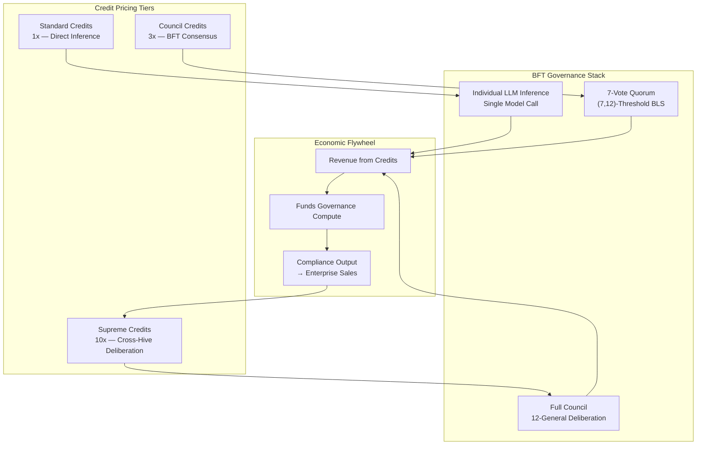
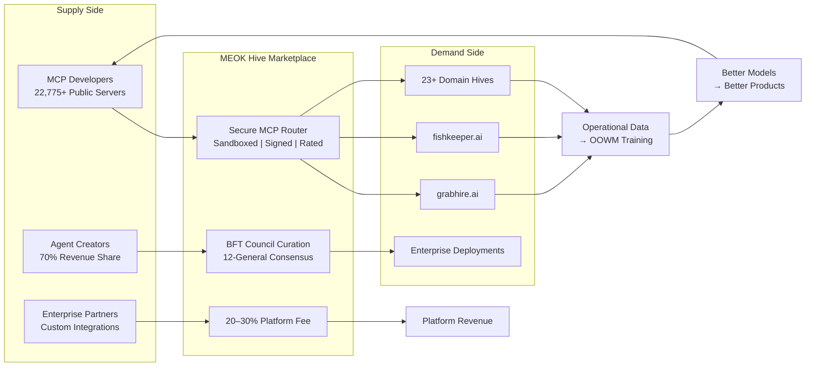

## 13. Business Model, Monetization & Competitive Moat

Every sovereign system needs an economic engine. Architecture without revenue is a hobby; revenue without architecture is a hustle. MEOK's business model is the *native expression* of its five-dimensional flywheel: the Trust Triangle converts compliance burden into commercial advantage, the BFT Council transforms governance overhead into enterprise SLAs, and the 25-domain OOWM turns Nick's 15 years of operational data into an uncopyable asset. This chapter maps how those architectural decisions aggregate into a $72 million ARR engine over five years.

### 13.1 Revenue Architecture

#### 13.1.1 Five Tiers: From Free to Sovereign Enterprise

MEOK adopts an open-core architecture modeled on Red Hat ($3.4B revenue, $34B IBM acquisition) [^590^], Hugging Face (3–5% free-to-paid conversion, $70M ARR) [^610^], and the emerging AI-native credit-based pricing paradigm. Five tiers capture value at distinct user journey stages:

The Free tier serves as the acquisition engine: unlimited public agents, five active MCP integrations, 100 daily inference requests, and 1 GB storage. At roughly $5–10 subsidy cost per user monthly, it functions as customer acquisition spend by another name — open-source communities converting at 3–5% to paid [^610^] prove this model at scale. The Pro tier ($29/month) adds private agents, 25 MCP integrations, 5,000 daily requests, and $10 in compute credits at 60–70% target margin. The Team tier ($79/user/month, minimum three users) contributes shared agent libraries, collaboration features, and a $100 monthly credit pool at 65–75% margin. The Business tier ($149/user/month, minimum ten users) introduces custom MCP development tools, a private marketplace, SSO/SAML, and a $500 credit allocation at 70–80% margin. The Enterprise tier commands $50,000 to $1M-plus annually for self-hosted or VPC deployment, 99.9% uptime SLAs, SOC 2 and ISO 27001 compliance, dedicated customer success, and white-label marketplace distribution at 75–85% margin [^531^].

The following table summarizes the complete tier architecture:

| Tier | Price | Users | Private Agents | MCP Slots | Daily Requests | Credits/Month | Target Margin |
|------|-------|-------|---------------|-----------|---------------|---------------|---------------|
| Free | $0 | 1 | 0 | 5 | 100 | 0 | N/A (subsidized) |
| Pro | $29/mo | 1 | 20 | 25 | 5,000 | $10 | 60–70% |
| Team | $79/user/mo | 3+ min | Unlimited | 100 | 50,000 | $100 | 65–75% |
| Business | $149/user/mo | 10+ min | Unlimited | 250 | 200,000 | $500 | 70–80% |
| Enterprise | $50K–1M+/yr | Unlimited | Unlimited | Unlimited | Unlimited | Custom | 75–85% |

The pricing architecture uses deliberate sequencing. The Free tier's natural limits — five MCP integrations, 100 daily requests — create organic upgrade pressure without artificial paywalls. Per-seat billing captures the collaborative network effect, driving net revenue retention above 120% in open-core SaaS [^533^]. The Enterprise tier's self-hosted and VPC options address sovereignty directly: enterprises retain full data residency control while MEOK captures high-margin revenue through support and compliance certification — the exact model that powered Red Hat to $3.4 billion [^590^].

#### 13.1.2 Credit-Based Monetization: The Three-Credit System

Gartner projects 67% of enterprise AI implementations will adopt usage-based pricing by 2027, with credit-based pricing representing 25% or more of new spend among top ten enterprise software vendors [^532^] [^534^]. MEOK's credit system is a governance cost recovery mechanism, not merely a billing convenience. Every BFT consensus decision requires twelve LLM agents to evaluate, sign, and vote; BLS threshold signing runs at 0.81 ms per signer, with seven-share aggregation in ~7.7 ms [^301^] [^357^]. A single consensus decision consumes an estimated $0.01–0.05 in compute. For a hive executing 1,000 decisions daily, governance overhead reaches $10–50. Without differentiated pricing, these costs erode margins at scale. MEOK addresses this with three credit tiers:

| Credit Type | Use Case | Price Multiplier | Governance Overhead |
|-------------|----------|------------------|---------------------|
| Standard | Simple LLM queries, document retrieval, image generation | 1x (base) | None; direct inference |
| Council | BFT-governed decisions, multi-agent workflows, policy enforcement | 3x | 12 agents evaluate, 7-vote quorum |
| Supreme | Cross-hive consensus, enterprise-grade SLAs, regulatory attestations | 10x | Full 12-General deliberation, cryptographic audit chain |

Standard credits handle day-to-day inference at approximately $0.001 per credit, with volume discounts to $0.0006 at 10-million-credit tiers. Council credits (3x) fund the multi-agent oversight that EU AI Act Article 14 compliance requires. Supreme credits (10x) unlock cross-hive consensus with full 12-General deliberation. This pricing ladder creates a natural upgrade path: as operational complexity grows, users automatically consume higher-margin credit types. The MMO UX shell reinforces this through its RPG quest system, where "Legendary" quests consume MEOK tokens while "Easy" quests require only Standard credits — Framer Motion's staggerChildren animations for loot drops create the dopamine feedback loop that drives spending [^4^] [^21^].

The following diagram illustrates how the credit system connects pricing to the underlying governance architecture:

### 13.2 Marketplace Economics

#### 13.2.1 The Agent Market: A 13.7x Expansion in Nine Years

The AI agent market stands at $7.7 billion in 2025 and is projected to reach $105.6 billion by 2034 at 39.5% CAGR [^504^]. Incumbents — OpenAI, Amazon, Google, Meta, and Microsoft — command over 51% combined market share through closed platforms and API lock-in [^504^], leaving a structural gap for a sovereign, open-source alternative.

| Year | Market Size | Growth Driver | MEOK Revenue Stage |
|------|------------|---------------|-------------------|
| 2025 | $7.7B | MCP ecosystem reaches 22,775 servers, 97M monthly SDK downloads [^251^] [^255^] | Foundation: free tier launch |
| 2026 | $11.6B | EU AI Act transparency obligations activate (August 2026) [^227^] | Pro + Team tiers live |
| 2027 | $17.1B | High-risk system compliance cliff (December 2027) [^231^] | Enterprise sales acceleration |
| 2030 | $48.2B | 67% enterprise AI using usage-based pricing [^532^] | Marketplace network effects |
| 2034 | $105.6B | Sovereign AI infrastructure mainstream [^500^] | $72M ARR target achieved |

The MCP ecosystem has reached 97 million monthly SDK downloads [^255^], yet this explosive growth occurred without security infrastructure: 9 of 11 MCP registries accepted malicious packages without review, 36.7% of public servers are SSRF-vulnerable, and tool poisoning achieves 60–72% success rates [^296^] [^399^] [^62^]. MEOK's secure MCP Router — Firecracker microVM sandboxing, BFT governance, Sigil cryptographic attestation — converts this security crisis into a first-mover marketplace advantage.

#### 13.2.2 The Hive Marketplace: First Curated, Secure MCP Marketplace

MEOK's product hives — grabhire.ai, fishkeeper.ai, and 23 additional domain-specific deployments — each require a curated MCP tool library [^470^]. By combining the secure MCP Router with the hive architecture, MEOK becomes the first marketplace where every tool is sandboxed, signed, and rated by the BFT Council before production. This is category creation, not incremental improvement.

Marketplace fees follow established benchmarks: AWS Marketplace takes 20–30%, Replit takes 30%, mobile app stores standardize at 30% [^499^] [^507^]. MEOK adopts a 70/20/10 split: creators retain 70%, MEOK takes 20% platform fee, 10% funds community infrastructure. For MCP server hosting, the creator share rises to 80%; enterprise licensing shifts to 60/40 reflecting higher compliance support costs.

The marketplace creates a compounding network effect. Each MCP server expands the capability surface of every hive that adopts it; each hive increases the addressable market for MCP developers. This is McKinsey's AI Knowledge Flywheel: more users generate more use cases, more data, better models, and more applications [^501^]. The critical difference: MEOK's flywheel runs on proprietary domain data — construction decisions, aquaculture yields, logistics routing — that GPT-5 will never possess, because it was never trained on Nick's 15 years of operational records [^171^].

The marketplace ecosystem operates as follows:

### 13.3 The Uncopyable Moats

#### 13.3.1 The Trust Triangle: Three Signals No Competitor Can Replicate

MEOK's most defensible commercial asset is the Trust Triangle — the intersection of B Corp certification, EU AI Act compliance, and open-source transparency. Any competitor can pursue one or two of these signals. Achieving all three requires architectural decisions made years in advance of the compliance deadlines now bearing down on the industry.

| Trust Signal | What It Proves | Hard Evidence | Window to Replicate |
|--------------|---------------|---------------|---------------------|
| B Corp Certification | Ethical governance is legally binding, not marketing | Less than 1% of B Corps are AI companies [^587^]; Benefit Corp status shields mission-over-profit decisions [^588^] | 6–12 months assessment; must be operational before sales |
| EU AI Act Compliance | System meets legal safety requirements for enterprise deployment | 0 of 12 tested LLMs fully comply [^43^]; penalties reach EUR 35M or 7% turnover [^378^]; Article 14 mandates human oversight by Dec 2027 [^231^] | Requires multi-agent governance architecture from ground up |
| Open Source + CC0 Data | Training pipeline is transparent and copyright-immune | Common Corpus provides 2T+ CC0 tokens [^483^]; Croissant 1.1 provenance chain [^450^]; AIR Blackbox audit trails [^251^] | Cannot retroactively cleanse proprietary training data |

Each vertex operates on a different timescale: B Corp certification is a process barrier (6–12 months), EU AI Act compliance is an architecture barrier (ground-up rewrite), and open-source provenance is a data barrier (training data cannot be retroactively cleansed). Achieving all three requires the architectural decisions already encoded in MEOK's five-dimensional flywheel.

Less than 1% of B Corps are AI companies [^587^]. Benefit Corporation status shields management from shareholder primacy, enabling mission-over-profit decisions [^588^]. For enterprises evaluating AI vendors in 2027, this is a liability shield: when an AI system produces biased output, the deploying enterprise bears legal exposure under EU AI Act Article 14, enforceable December 2027 [^227^] [^231^].

Zero of twelve tested LLMs fully comply with the EU AI Act [^43^]; penalties reach EUR 35 million or 7% of global turnover [^378^]. MEOK's BFT Council — 12 specialized agents reviewing every decision with weighted consensus, automatic slashing, sub-second finality — maps directly to Article 14's oversight and kill-switch requirements [^357^] [^356^]. Competitors with single-agent systems must retrofit multi-agent governance; MEOK has it architecturally.

The third vertex: open-source code plus CC0 training data. The OOWM rests on the Common Corpus (2 trillion-plus CC0 tokens) as its legal foundation [^483^], with Croissant 1.1 provenance metadata [^450^] [^451^] and AIR Blackbox HMAC-SHA256 audit chains for every training run [^251^]. This creates a "regulation-ready model card" for every release. The EU AI Act exempts free open-source models, with obligations activating only when systems are "made available on the market in return for payment" [^398^]. MEOK's separation between free open-source core and paid commercial offerings preserves this exemption while monetizing the enterprise wrapper.

The window is narrowing: EU AI Act transparency obligations activate August 2026, Annex III high-risk requirements hit December 2027 [^227^] [^228^]. B Corp certification requires 6–12 months; retrofitting BFT governance into single-agent systems is a ground-up rewrite. By the time competitors recognize this positioning's value, the deadline will have passed.

#### 13.3.2 Community, Domain Breadth, and Founder Reputation

The second uncopyable moat combines MEOK's 200,000-plus download community, 25-domain ecosystem, and Nick's 15-year reputation. Communities cannot be manufactured on demand. In the open-core model, each contributor who builds an MCP integration simultaneously expands MEOK's capability surface and deepens their own investment [^501^].

The 25-domain ecosystem is a data acquisition strategy. Each domain — construction, aquaculture, logistics, and beyond — contributes a proprietary training dataset that makes the OOWM more valuable in that vertical. As SMEs adopt MEOK, their operational data (with consent) feeds a knowledge flywheel that GPT-5 can never enter: it will be trained on public internet data, not Nick's construction decisions, aquaculture yields, or logistics routing [^501^].

In sovereign AI, trust is the product. Nick's commitment to open-source governance, B Corp principles, and transparent development creates founder-market fit that no venture-backed competitor can replicate with capital alone.

#### 13.3.3 The OOWM Domain Moat: What GPT-5 Cannot Cross

The final uncopyable moat is the OOWM itself — fine-tuned on Nick's 15 years of marketing data, 25 domain business logics, and real-world SME data [^171^]. This is not a data volume moat; raw volume is not defensible. It is a *domain specificity* moat.

The fractal memory architecture amplifies this through compounding compression. Qdrant's TurboQuant achieves 24x compression and Milvus's RaBitQ achieves 32x compression at 94%-plus recall [^263^] [^279^]. As users generate more data, storage cost per insight *decreases* because higher-level summaries replace lower-level detail. Competitors face linearly increasing storage costs; MEOK's costs grow sub-linearly. Over time, MEOK retains and learns from data that competitors must discard — an ever-widening gap.

The economic positioning is stark: competitors spend roughly $1 million storing and processing what MEOK handles for approximately $30,000, and MEOK retrieves it faster through the multi-layer vector hierarchy (LanceDB → ChromaDB → Qdrant → Milvus → Qdrant+Neo4j) [^219^] [^263^]. The 98% compression rate means the moat grows exponentially while costs grow linearly — the inverse of every competitor's cost curve.

The path to $72 million ARR rests on the compounding interaction of these three moats. The Trust Triangle unlocks enterprise doors. Community and domain breadth create switching costs. The OOWM's domain specificity ensures every user makes the product better for every other user — a data network effect no foundation model can ever replicate. The revenue architecture is simply the instrument that captures value from a system designed to become more sovereign, more capable, and more irreplaceable with every decision it makes.
