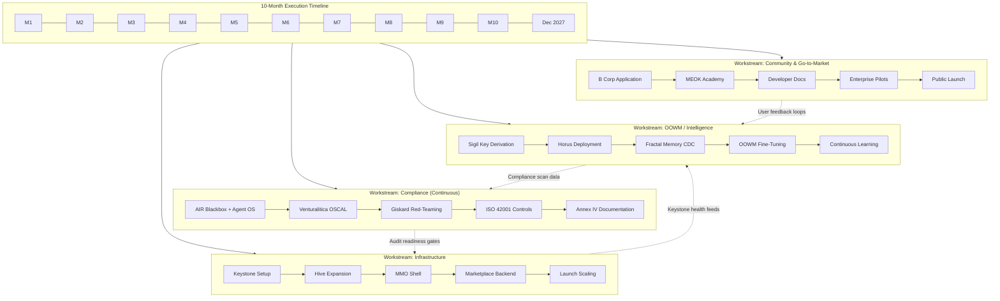

## 14. Implementation Roadmap: Five-Phase Execution

MEOK is not a speculative research project. It ships in ten months. The roadmap below maps every milestone to a concrete deliverable, with the European Union's Artificial Intelligence Act serving as the immovable backstop. The Digital Omnibus agreement of May 2026 deferred Annex III high-risk obligations to **December 2, 2027** [^227^][^228^] — a date that is now less than seventeen months from the first keystroke. Miss that deadline, and MEOK becomes legally unusable across the EU single market for any system classified as high-risk, which, given the BFT council's multi-agent governance capabilities spanning biometric inference, HR tooling, and operational decision-making, describes virtually every product hive MEOK intends to ship [^229^][^231^]. The penalty framework reaches EUR 35 million or 7 percent of global turnover — whichever is higher — for Tier 1 violations, with even SME-specific caps running to EUR 700,000 [^378^]. This chapter is the contract MEOK makes with its own calendar.

### 14.1 Phase 1: Foundation (Months 1–2)

Phase 1 builds the sovereign hardware substrate and the identity layer that everything else rests upon. Two Apple Silicon MacBooks — an M4 (12 GB) as the "King" primary and an M2 (8 GB) as the "Queen" secondary — are configured as competing, self-monitoring AI brains [^292^][^301^]. The M4 runs 8B-class models (Llama 3.3 8B, Qwen 3 7B) at 33–48 tok/s, while the M2 handles 3–4B models (Phi-4-mini 3.8B, Gemma 3 4B) at 15–25 tok/s [^292^][^296^]. Ollama with the llama.cpp Metal backend provides inference, LiteLLM handles latency-based routing and automatic failover [^225^][^310^], and Tailscale creates an encrypted WireGuard mesh between the machines [^252^]. Offline resilience comes via SQLite WAL-mode queues that buffer operations during connectivity drops and sync automatically on reconnection [^289^][^295^].

Sigil, the hierarchical identity system built on BIP32-Ed25519 deterministic key derivation, is implemented during this phase. Every entity — user, hive, sub-hive, and BFT General — receives a cryptographically derived key path that enables both attestation and hierarchical delegation [^239^][^306^]. The Sigil identity tree is the trust anchor for all subsequent security operations: BFT vote signing, MCP tool attestation, and audit trail verification all flow from this root.

The first five product hives are scaffolded — typically Nick's highest-priority domains (construction, aquaculture, logistics, marketing, and AI infrastructure). Each hive receives a LanceDB or ChromaDB vector store, a sub-hive structure (UX / Tool / Content / Feature), and a minimal three-node BFT council. The SOV3 governance scaffold is wired in: the Microsoft Agent Governance Toolkit's Agent OS policy engine intercepts every agent action with sub-millisecond latency (<0.1 ms p99) [^90^], while AIR Blackbox trust layers generate HMAC-SHA256 audit chains for every decision [^251^]. The keystone's A/B comparison engine begins collecting output-quality data from day one, feeding the first training signals into the OOWM's feedback loop [^263^][^277^].

### 14.2 Phase 2: Hive Expansion (Months 3–4)

Phase 2 scales from five hives to the full constellation of twenty-five. Each new domain — grabhire.ai, fishkeeper.ai, and the remaining verticals — is instantiated from a standardized template that includes sub-hive routing, Sigil key derivation, and BFT council configuration [^470^]. The governance architecture adopts a **Council Federation** model to avoid the governance complexity bomb that would otherwise result from 25 hives × 4 sub-hives × 5 BFT nodes = 500 consensus nodes generating O(n²) messages per decision. Instead, the 12 Generals serve as a **Supreme Council** with delegated authority to sub-hive councils, reducing the operational node count to 12 while maintaining full governance coverage [^357^]. Sub-hive decisions require only 2f+1 = 7 votes from local councils, with periodic rollup to the Supreme Council for cross-hive alignment [^357^].

Horus, the four-layer intelligence observation system, is deployed during Phase 2 [^450^][^454^]. Layer 1 scrapes global AI news and regulatory feeds in real-time; Layer 2 monitors domain-specific intelligence for each of the 25 verticals; Layer 3 observes local system health across the keystone cluster; and Layer 4 collects per-hive application metrics. Critically, Horus feeds data into the Fractal Memory system's hierarchical summarization pipeline, which achieves 98 percent compression through Qdrant TurboQuant (24×) and Milvus RaBitQ (32×) quantization [^219^][^263^][^279^]. The compressed summaries stream back to Horus as enriched observation context, creating a self-tightening intelligence flywheel that improves without human intervention [^450^].

Offline-online sync is hardened during this phase. The SQLite-based queue system buffers all hive operations during network partitions, with automatic sync on reconnection [^289^]. The keystone's 99.5 percent uptime target is validated under 24/7 lid-closed operation, drawing 8–12W (M4) and 4–6W (M2) at idle [^264^]. BLS12-381 threshold signatures are integrated into the BFT consensus flow, achieving 0.81 ms per signer with 7-share aggregation in ~7.7 ms [^301^].

### 14.3 Phase 3: MMO UX (Months 5–6)

Phase 3 transforms MEOK from a distributed backend into a lived experience. The MMO-inspired UX shell — built on Tauri V2 for transparent desktop overlays with Next.js for the web foundation — introduces the gamified operating system interface that makes sovereign AI tangible [^4^][^21^]. Users navigate between domain hives through a **doorway system**, a spatial metaphor where each hive is a distinct realm with its own visual identity, NPC guides, and quest boards. The avatar progression system maps real system usage to RPG-style advancement: completing compliance quests earns XP, resolving cross-domain challenges unlocks titles, and contributing training data upgrades the user's "sovereignty level."

The quest system is structurally isomorphic to a freemium monetization funnel. "Easy" quests provide free onboarding — basic AI literacy tasks that satisfy EU AI Act Article 4 requirements [^228^]; "Legendary" quests consume MEOK credits and unlock premium enterprise features [^528^]. RPG status bars (health, mana, XP) map to user engagement metrics that drive credit purchases, with Framer Motion staggerChildren animations creating the dopamine feedback loop that drives spending [^4^]. Cross-domain questing — multi-hive challenges that require coordinating resources across verticals — becomes the primary engine for credit consumption and user retention.

The MMO shell serves a dual purpose: it is both the user interface and the **monetization engine**. Every interaction — quest completion, credit purchase, tier upgrade — flows through the BFT council for approval, with the three-tier credit system aligning pricing with actual compute cost: Standard credits for LLM queries, Council credits (3× price) for BFT-governed decisions, and Supreme credits (10× price) for cross-hive consensus [^529^].

### 14.4 Phase 4: Marketplace (Months 7–8)

Phase 4 opens MEOK's infrastructure to third-party developers. The **MCP Hive Store** launches as the first curated, secure marketplace for Model Context Protocol tools — directly addressing the security crisis in the MCP ecosystem, where 36.7 percent of public MCP servers are SSRF-vulnerable and 9 of 11 registries accepted malicious packages without review [^62^][^296^]. Every tool listed in the Hive Store is sandboxed in Firecracker microVMs, cryptographically signed via Sigil attestation [^339^], and rated by the BFT Council for security, reliability, and compliance. MEOK takes a 20–30 percent platform fee on tool monetization, benchmarked against AWS Marketplace, Replit, and mobile app store economics [^499^][^507^].

The developer SDK exposes hive creation APIs, Sigil key management utilities, and BFT integration hooks. Paid hives — premium domain verticals with enterprise-grade features — launch alongside the free tier, with feature flags controlling access to advanced capabilities [^470^]. Payment integration supports both credit-based top-ups and subscription billing. The enterprise tier introduces dedicated BFT council configuration, custom compliance policy mapping, and SLA-backed uptime guarantees — "Zero-Downtime AI Infrastructure" supported by the keystone's self-healing King/Queen architecture [^590^].

The marketplace economics are substantial. The AI agent market is projected to reach $105.6 billion by 2034, and MEOK's 20–30 percent platform fee on a curated, compliance-guaranteed tool catalog captures value that no unsecured registry can match [^504^]. The secure MCP Router is open-sourced as a reference implementation during this phase, positioning MEOK as the de facto security standard while the CVE crisis remains front-page news [^251^][^255^].

### 14.5 Phase 5: Compliance & Launch (Months 9–10)

Phase 5 is where MEOK passes through the regulatory gauntlet and enters the market. The EU AI Act compliance audit spans three integrated toolchains: Venturalitica SDK for OSCAL evidence collection and CycloneDX ML-BOM generation [^253^][^254^], Giskard for LLM red-teaming across 40+ security and business-failure probes [^260^][^433^], and AIR Blackbox for automated scanning across six articles (Risk Management, Data Governance, Technical Documentation, Record-Keeping, Human Oversight, Accuracy & Robustness) with 51+ checks [^251^]. The Microsoft Agent Governance Toolkit's Agent Compliance package provides deterministic policy enforcement mapped to EU AI Act articles with sub-millisecond latency [^90^].

The compliance pipeline generates evidence in machine-readable OSCAL format, with HMAC-SHA256 audit chains and ML-DSA-65 post-quantum signatures ensuring tamper-evident records [^251^]. All training data carries Croissant 1.1 metadata for provenance documentation [^450^][^451^], satisfying Article 10's data governance requirements [^326^]. The BFT Compliance Agent — a dedicated council member — consumes scan results, benchmark scores (from the COMPL-AI framework [^328^][^43^]), and ISO 42001 control status (all 38 certifiable controls [^420^]) to produce real-time conformity assessment readiness reports.

Documentation is compiled into Annex IV-ready technical dossiers per hive. The "Trust Triangle" narrative — B Corp certification, EU AI Act compliance, and open-source transparency — is packaged for enterprise sales [^587^]. Community onboarding launches through MEOK Academy, a gamified AI literacy training product that turns EU AI Act Article 4's literacy mandate into a revenue stream [^228^]. The public launch targets Month 10 with the first five enterprise hives live, the MCP Hive Store operational, and full regulatory documentation available.

### 14.6 Critical Path

#### 14.6.1 Hard Deadline: December 2, 2027 Annex III Enforcement

The Digital Omnibus deferred Annex III high-risk obligations from August 2026 to **December 2, 2027** [^227^][^228^]. This is the immovable deadline. On that date, every AI system operating in the EU that manages critical infrastructure, processes biometric data, makes employment decisions, or scores credit must demonstrate compliance with Articles 9–15 of the AI Act — risk management, data governance, technical documentation, record-keeping, human oversight, and accuracy/robustness [^231^]. None of the 12 LLMs tested by COMPL-AI were fully compliant at the time of evaluation [^43^]. MEOK must be among the first.

The following table maps each phase to its deliverables, dependencies, and compliance relevance.

| Phase | Timeline | Key Deliverables | Compliance Output | Blocking Risk |
|-------|----------|-----------------|-------------------|---------------|
| **1 Foundation** | Months 1–2 | M4/M2 keystone online; Sigil identity tree live; 5 product hives scaffolded; BFT council (3 nodes/hive); SOV3 policy engine intercepting all actions | AIR Blackbox trust layers generating HMAC audit chains [^251^]; Agent OS policy engine <0.1 ms enforcement [^90^] | Keystone hardware failure; Sigil key ceremony compromise |
| **2 Hive Expansion** | Months 3–4 | 25 hives operational; Council Federation (12 Generals); Horus 4-layer observation live; offline-online sync validated; BLS threshold signatures integrated | Venturalitica OSCAL evidence collection active [^253^]; Croissant 1.1 metadata on all datasets [^450^]; 98% memory compression achieved [^219^] | Council Federation consensus latency exceeding 100 ms; Horus feedback loop stall |
| **3 MMO UX** | Months 5–6 | Tauri V2 desktop overlay + Next.js web shell; doorway system; avatar progression; 3-tier credit economy (Standard/Council/Supreme) | Article 4 AI literacy quests operational [^228^]; kill switch and human override mechanisms tested [^429^] | macOS private API blocking App Store distribution [^7^]; credit pricing miscalculation |
| **4 Marketplace** | Months 7–8 | MCP Hive Store live; developer SDK; paid hive tiers; payment integration; enterprise SLA tier | Tool sandboxing (Firecracker microVMs); Sigil attestation for all listed tools [^339^]; 20–30% platform fee structure [^499^] | MCP security zero-day; payment processor compliance rejection |
| **5 Compliance & Launch** | Months 9–10 | Full EU AI Act audit pass; Annex IV docs per hive; community onboarding; public launch | Giskard 40+ probe clearance [^260^]; COMPL-AI benchmark run [^328^]; ISO 42001 38/38 controls operational [^420^]; post-market monitoring pipeline active | Audit failure requiring architectural rework; notified body backlog |

The critical path is not sequential — it is parallel. Compliance tooling integration begins in Month 1 alongside keystone setup, not in Month 9 as a final gate. The BFT council IS the compliance architecture; every consensus vote is also an oversight event that satisfies Article 14's requirement for "effective human supervision" and "ability to override AI decisions" [^428^][^424^]. The 7-vote quorum becomes a regulatory compliance feature, not merely a technical choice [^357^].

#### 14.6.2 Risk-Adjusted Timeline with Parallel Workstreams

The diagram below illustrates the five-phase execution flow with explicit decision gates at each phase boundary.

```mermaid
flowchart LR
    subgraph P1["Phase 1: Foundation (M1-2)"]
        A1["M4/M2 Keystone Setup"] --> A2["Sigil Identity Tree"]
        A2 --> A3["5 Hive Scaffolds"]
        A3 --> A4["SOV3 Policy Engine"]
    end

    A4 -->|"Gate: Policy intercept <0.1ms"| P2

    subgraph P2["Phase 2: Expansion (M3-4)"]
        B1["25 Hives Operational"] --> B2["Council Federation"]
        B2 --> B3["Horus Observation"]
        B3 --> B4["BLS Threshold Signing"]
    end

    B4 -->|"Gate: Consensus <10ms"| P3

    subgraph P3["Phase 3: MMO UX (M5-6)"]
        C1["Desktop + Web Shell"] --> C2["Doorway System"]
        C2 --> C3["Avatar Progression"]
        C3 --> C4["3-Tier Credit Economy"]
    end

    C4 -->|"Gate: Credit pricing viable"| P4

    subgraph P4["Phase 4: Marketplace (M7-8)"]
        D1["MCP Hive Store"] --> D2["Developer SDK"]
        D2 --> D3["Paid Hives + Payments"]
        D3 --> D4["Enterprise SLA Tier"]
    end

    D4 -->|"Gate: Revenue model proven"| P5

    subgraph P5["Phase 5: Compliance & Launch (M9-10)"]
        E1["EU AI Act Audit"] --> E2["Annex IV Documentation"]
        E2 --> E3["Community Onboarding"]
        E3 --> E4["PUBLIC LAUNCH"]
    end

    E4 -->|"Dec 2, 2027"| DEADLINE["Annex III Enforcement"]

    style DEADLINE fill:#ffcccc,stroke:#cc0000,stroke-width:3px
    style E4 fill:#ccffcc,stroke:#006600,stroke-width:2px
```

The second diagram shows the parallel workstreams that run throughout all five phases. Compliance integration, model training, and community building are not phase-gated activities — they are continuous streams that begin in Month 1 and intensify through launch.

Four parallel workstreams operate continuously across the ten-month window. The **Infrastructure** stream executes the phased delivery of keystone hardware, hive expansion, MMO UX, and marketplace backend. The **Compliance** stream — the most critical — begins immediately with AIR Blackbox trust layer deployment and Agent OS policy configuration, layering in Venturalitica OSCAL evidence collection, Giskard continuous red-teaming, and ISO 42001 control implementation before converging on Annex IV documentation in the final two months [^253^][^260^][^420^]. The **OOWM / Intelligence** stream seeds the Fractal Memory hierarchy with Horus intelligence feeds and establishes the CDC sync pipeline that achieves 98 percent compression through hierarchical summarization [^219^]. The **Community & Go-to-Market** stream initiates B Corp certification (less than 1 percent of B Corps are AI companies, making this a differentiating signal) [^587^], builds MEOK Academy's gamified literacy curriculum, and recruits enterprise pilot customers before public launch.

The risk-adjusted timeline builds in two weeks of buffer per phase, with explicit go/no-go criteria at each gate. If Phase 1's policy engine cannot achieve sub-0.1-ms interception latency, the architecture pivots to a pre-filter model rather than inline interception. If Phase 2's Council Federation consensus exceeds 100 ms, sub-hive delegation authority is increased to reduce Supreme Council load. The hardest dependency is the compliance audit: Giskard's 40+ probes must clear before Annex IV documentation can be finalized, and COMPL-AI benchmark results must be available for the conformity assessment package [^43^][^260^]. These are not Month 9 activities — they begin in Month 3 with the first automated red-teaming runs against the scaffolded hives.

The December 2, 2027 deadline leaves no room for a second pass. Every phase must deliver its compliance output alongside its technical deliverables. MEOK's architecture — the BFT council as multi-agent oversight, the Fractal Memory as compressed audit evidence, the Sigil identity tree as cryptographic attestation — is designed so that regulatory compliance is a byproduct of normal operation, not a bolt-on afterthought. When Annex III enforcement takes effect, MEOK does not scramble to comply. It simply continues operating.
