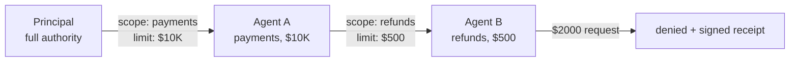

# meok-sovereign-passport-mcp

**Sovereign Agent Passport MCP** — Ed25519-signed agent identity, delegation with the **narrowing invariant**, gateway enforcement with signed receipts.

Wraps the [Agent Passport System (APS)](https://github.com/aeoess/agent-passport-system) protocol primitives with the **CSOAI sovereign substrate**:

- ✅ **Ed25519-signed identities** (pure, no EdDSA mixing)
- ✅ **Narrowing-invariant delegation** — authority can only decrease
- ✅ **Gateway enforcement** with signed receipts (every outcome, both verdicts)
- ✅ **BFT council pre-clearance** (12-around-1) before any passport issuance
- ✅ **Maternal Covenant pre-inference care floor check**
- ✅ **proofof.ai verify URL** on every passport + receipt

## Install

```bash
pip install meok-sovereign-passport-mcp
```

## Usage (Python)

```python
from meok_sovereign_passport_mcp import (
    create_passport, verify_passport,
    create_delegation, evaluate_intent,
)

# 1. Issue a sovereign passport
parent = create_passport(
    agent_id="treasury-bot",
    role="trader",
    capabilities=["payments", "refunds", "view-balance"],
    care_floor_validated=True,  # Maternal Covenant pre-check passed
    bft_council_id="council-12of1-abc123",  # 12-around-1 BFT pre-cleared
    spend_limit=10_000.0,
)

# 2. Verify offline
v = verify_passport(parent)
assert v["valid"]
print(v["verify_url"])  # https://proofof.ai/passport/a1b2c3d4

# 3. Delegate (narrowing enforced)
child = create_delegation(
    parent, "refund-bot", "refunder",
    narrowed_capabilities=["refunds"],
    spend_limit=500.0,  # <= parent's 10,000
)
# raises ValueError if narrowing violated

# 4. Gateway evaluation
receipt = evaluate_intent(
    child, "refunds",
    requested_spend=200.0,
    revocation_check=lambda aid: False,
    values_floor_check=lambda p, c: True,  # Maternal Covenant hook
)
assert receipt["verdict"] == "permit"
print(receipt["verify_url"])  # https://proofof.ai/receipt/<id>
```

## Usage (MCP server)

```bash
python -m meok_sovereign_passport_mcp
# Exposes 4 tools: sov_create_passport, sov_verify_passport,
# sov_create_delegation, sov_evaluate_intent
```

## The Narrowing Invariant

> Authority can only **decrease** at each transfer point.



The invariant is **enforced at the delegation boundary** — you cannot delegate more capability, more spend, or longer expiry than you hold.

## Sovereign Substrate

| Layer | What | Substrate |
|---|---|---|
| Identity | did:aps / Ed25519 kid | CSOAI sovereign keypair |
| Delegation | Narrowing invariant | `create_delegation()` |
| Care | Maternal Covenant | `care_floor_validated` flag |
| Council | 12-around-1 BFT | `bft_council_id` field |
| Audit | Ed25519 receipts | `evaluate_intent()` always signs |
| Verify | Public verification | https://proofof.ai/passport/... |

## Reference Implementations

- **APS SDK** — github.com/aeoess/agent-passport-system (Apache 2.0)
- **APS MCP** — github.com/aeoess/agent-passport-mcp (Apache 2.0)
- **Sovereign wrapper** — this package (MIT)

## License

MIT — CSOAI Ltd (UK 16939677)

---

**The dragon never lies. Every passport is signed. Every receipt is auditable.**
